# Artikel verwalten

Sie können ihre Artikel auf der "Artikel"-Seite unter "Katalog" verwalten.

Aufteilung dieses Kapitels:

* [Artikel](artikel-verwalten.md#Artikelverwalten-Artikel)
  *
    * [Die Artikelliste](artikel-verwalten.md#Artikelverwalten-DieArtikelliste)
    * [Die "Neuer Artikel"-Seite und globale Buttons](artikel-verwalten.md#Artikelverwalten-Die%22NeuerArtikel%22-SeiteundglobaleButtons)
    * [Ausfüllen der Artikel-Informationen](artikel-verwalten.md#Artikelverwalten-AusfüllenderArtikel-Informationen)
    * [Den Preis eines Artikels festlegen](artikel-verwalten.md#Artikelverwalten-DenPreiseinesArtikelsfestlegen)
    * [Optimierung der Suchmaschinen-Position (SEO) ihres Artikels](artikel-verwalten.md#Artikelverwalten-OptimierungderSuchmaschinen-Position\(SEO\)ihresArtikels)
    * [Verwaltung der Artikelverknüpfungen](artikel-verwalten.md#Artikelverwalten-VerwaltungderArtikelverknüpfungen)
    * [Versandkosten: Größe, Gewicht, Lieferant](artikel-verwalten.md#Artikelverwalten-Versandkosten:Größe,Gewicht,Lieferant)
    * [Hinzufügen von Produktvariationen](artikel-verwalten.md#Artikelverwalten-HinzufügenvonProduktvariationen)
    * [Verwalten von Produktmengen](artikel-verwalten.md#Artikelverwalten-VerwaltenvonProduktmengen)
    * [Artikelbilder](artikel-verwalten.md#Artikelverwalten-Artikelbilder)
    * [Konfigurieren von Artikel-Eigenschaften](artikel-verwalten.md#Artikelverwalten-KonfigurierenvonArtikel-Eigenschaften)
    * [Benutzeranpassung](artikel-verwalten.md#Artikelverwalten-Benutzeranpassung)
    * [Verwalten von Anhängen](artikel-verwalten.md#Artikelverwalten-VerwaltenvonAnhängen)
    * [Lieferanten](artikel-verwalten.md#Artikelverwalten-Lieferanten)
    * [Verwalten des Lagers(Fortgeschritten)](artikel-verwalten.md#Artikelverwalten-VerwaltendesLagers\(Fortgeschritten\))
  * [Erstellen von Artikel-Bündeln](artikel-verwalten.md#Artikelverwalten-ErstellenvonArtikel-Bündeln)
  * [Erstellen eines virtuellen Artikels](artikel-verwalten.md#Artikelverwalten-ErstelleneinesvirtuellenArtikels)

### Die Artikelliste 

Mit einem Klick auf den Menüpunkt "Artikel" im Menüpunkt "Katalog" gelangen Sie auf die Liste Ihrer aktuellen Produkte, mit ihren wichtigsten Details: ID, Foto, Name, Artikelnummer, Kategorie usw.

Über der Artikelliste sehen Sie auch vier Statistiken aus Ihrem Shop:

* Artikel, welche nicht im Lager verfügbar sind,
* durchschnittliche Handelsspanne,
* Prozentualer Anteil der verkauften Artikel in den letzten 30 Tagen,
* deaktivierte Artikel.

Mit der "Nach Kategorie filtern"-Option können Sie nur Artikel in Bezug auf die Suche anzeigen, sowie die Neuordnung innerhalb einer Kategorie.

Artikelposition

Sie können nicht die ganze Liste von Artikeln neu ordnen. Die Produkte werden wie in Ihrem Shop gelistet angezeigt (durch ID) und der Kunde kann die Artikel mithilfe der verfügbaren Sortieralgorithmen wählen: niedrigster Preis zuerst, Höchster Preis zuerst zuerst, Produktname von A bis Z, Produktname von Z bis A, Produkte auf Lager, niedrigste Bewertung zuerst, höchste Bewertung zuerst.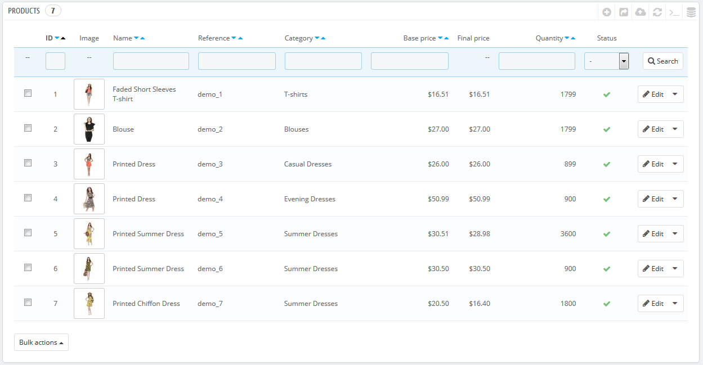

&#x20;Sie können Produkte auf einer Pro-Kategorie Basis organisieren, indem Sie das Kontrollkästchen „Nach Kategorie filtern“ anklicken. Es öffnet sich eine kleine Auflistung aller Ihrer Kategorien und Unterkategorien. Die Auswahl einer Kategorie filtert automatisch die Liste der Produkte und zeigt nur Artikel der gewählten Kategorie. Es fügt auch eine Spalte "Position" in die Tabelle ein, mit der Sie die Position des Artikels, bezogen auf die Kategorie, ändern können. Bewegen Sie dazu das Pfeilkreuz nach oben und unten.\

Ihre Sortierung wird dann durch die Sortier-Auswahl überschrieben.

Beachten Sie, dass, wenn Sie die Anzeigereihenfolge in der Produktliste im Backoffice ändern (durch Klicken auf den Spaltennamen , um Produkte nach dieser Spalte zu sortieren), werden in der Spalte "Position" keine Pfeile mehr angezeigt und Sie können sie nicht verwenden, um Zeilen zu bewegen. Stattdessen zeigt sie die Positionsnummer des Produkts an. Um in der Lage zu sein, Produkte wieder zu positionieren, klicken Sie auf die Schaltfläche "reset".

Schließlich finden Sie am Kopf Produktliste fünf Buttons:

.png>)

* **NEU**. Erstellt einen neuen Artikel.
* **Exportieren.** Lädt eine CSV-Datei aller Produkte in Ihrem Katalog.
* **Importieren.** Leitet Sie auf die Seite zum CSV-Import weiter, von wo aus Sie Ihre Ihre CSV-Dateien importieren können.
* **Liste aktualisieren**. Lädt die Liste der Produkte, um die neuesten Änderungen anzuzeigen.
* **Zu „SQL-Abfragen“ exportieren**. Öffnet das PrestaShop SQL Manager Tool (in den "erweiterten Einstellungen"), aus dem Sie die PrestaShop-Datenbank mit SQL-Anweisungen abfragen ("SELECT ... FROM ... WHERE ...") können.\
  Wenn Ihre Artikelliste gefiltert wurde (nach Namen, zum Beispiel), wird die SQL-Anweisung auch das berücksichtigen (zum Beispiel "WHERE 1 AND b.\`name\` LIKE '% Bluse%'").

Sie können neue Produkte hinzufügen, indem Sie auf "NEU" klicken. Ein Formular wird angezeigt, mit mehreren Registerkarten in der linken Spalte und zwei Buttons am Kopf: "Zurück zur Liste" und "Hilfe".

### Die "Neuer Artikel"-Seite und globale Buttons 

Standardmäßig verfügt die Seite der Artikelerstellung über zwei Buttons, die Sie auf den meisten den Verwaltungsseiten finden können: "Empfohlene Module" und "Hilfe".

Am unteren Ende der jeweiligen Seite befinden sich drei Schaltflächen:

* **Speichern**. Der Button speichert jede Änderung, die Sie für den aktuellen Artikel gemacht haben, und bringt Sie zurück zur Produktliste.
* **Speichern und auf der Seite bleiben**. Das speichert jede Änderung, die Sie für das aktuelle Produkt gemacht haben und Sie bleiben noch auf der aktuellen Artikel-Site. Dies ist besonders nützlich, wenn Sie den Tab wechseln wollen, ohne Änderungen im aktuellen Tab zu verlieren, oder um zu sehen, ob die Änderungen sofort angewendet wurden.
* **Abbrechen**. Es führt Sie einfach zurück zu der Liste der Artikel, ohne eine Änderung zu speichern, die Sie in einem der Reiter auf dieser Seite gemacht haben.

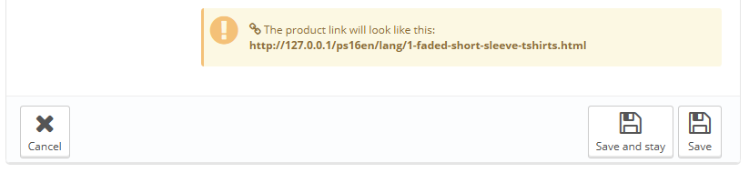

Sobald Sie Ihrem neuen Artikel einen Namen gegeben haben und auf den "Speichern und auf der Seite bleiben" -Button am unteren Rand geklickt haben, erscheinen am Kopf der Produktseite neue Schaltflächen::

* **Vorschau**. Zeigt die Front-Office-Seite Ihres Produktes. Dies ist sehr praktisch, da es auch funktioniert, wenn das Produkt deaktiviert ist ("Informationen"-Tab).
*   **Duplizieren**. Erstellt eine genaue Kopie des aktuellen Artikels. Dies ist sehr nützlich, wenn Sie lieber die aktuellen Artikeldaten als Vorlage für ein anderes neues Produkt benutzen wollen, und nicht alle Daten des neuen Artikels von Hand erstellen wollen. Zum Beispiel könnten zwei Produkte sehr unterschiedlich sein, aber die gleichen Verknüpfungen, Lieferanten oder Lieferanten-Spezifikationen teilen.

    Nicht zu viel duplizieren!

    Wenn Sie verschiedene Versionen des gleichen Produkts aufgrund seiner Vielzahl von Farben, Kapazität, Größe usw. erstellen, dann sollten Sie lieber Varianten für den aktuellen Artikel erstellen, als ihn x-mal zu duplizieren. Diese Option finden Sie im Tab "Varianten" auf der linken Seite, welche im Abschnitt "Artikelvariationen" dieses Kapitels erklärt wird.
* **Artikelverkäufe**. Leitet Sie auf die "Produktdetails"-Seite des Statistik-Dashboards ("Statistiken" im Menü weiter), die Ihnen eine Grafik über Besuche auf dieser Artikel-Seite und den Umsatz zeigt.
* **Diesen Artikel löschen**. Entfernt alle Daten des aktuellen Produkts, einschließlich seiner Bilder, Variationen, Funktionen etc.
* **Empfohlene Module**. Öffnet ein Fenster, in dem Sie einige beliebte Module vom PrestaShop-Addons-Marktplatz installieren können.

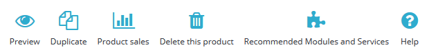

### Ausfüllen der Artikel-Informationen 

Der erste Tab enthält die grundlegenden Informationen über den Artikel.

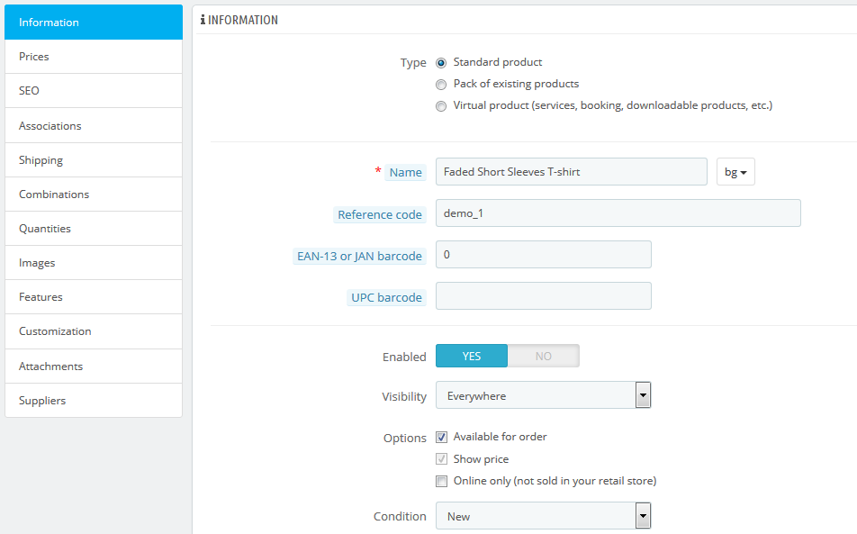

Die erste Zeile zeigt im Wesentlichen eines: anzugeben, ob das Produkt ein Bündel(eine Kombination von mindestens zwei bestehenden Produkten), ein virtuelles Produkt (downloadbare Datei, Service, etc.), oder einfach ein Standard-Artikel ist. Dieser Abschnitt handelt nur von Standardartikeln, Bündel und virtuelle Produkte haben ihre eigenen Abschnitte in diesem Kapitel.

Es gibt viele weitere produktbezogene Optionen der Seite "Artikel" im Menü "Voreinstellungen":

* Anzahl der Tage, in denen der Artikel als "neu" deklariert wird.
* Standard Artikelreihenfolge.
* erweiterte Lagerverwaltung.
* etc.

Sie sollten wirklich überprüfen, ob diese globalen Einstellungen so gesetzt sind, wie Sie sie möchten.

Nun die vier Textfelder:

*   **Name**. Das erste, was zu vervollständigen ist, ist der Produktname, der in den Suchergebnissen angezeigt wird. Neben dem Feld ist ein Sprachcode, der Ihnen ermöglicht, die Sprache zu wählen, in der Sie den Artikelnamen bearbeiten oder erstellen wollen.

    Sie **müssen** dem Artikel wenigstens in mindestens der Standardsprache einen Namen geben, bevor Sie ihn speichern. Sie werden nicht in der Lage sein, zu speichern, bis er einen Namen hat - viele andere Tabs verlangen es, dass das Produkt wenigstens einmal gespeichert wurde.

    Achten Sie darauf, jedes Feld in jede Sprache, die Ihren Shop unterstützt, zu übersetzen. Um das zu tun, klicken Sie auf den Sprachcode neben dem Feld, und wählen Sie die Sprache, in der Sie den Text bearbeiten möchten.
* **Artikel-Nr**. Es könnte eine Zahl, eine Referenz vom Lagerort oder seinen Lieferanten, oder alles, was es einzigartig macht, sein.
* **EAN-13 oder JAN barcode**. Dies sind die Nummern des Artikel-Barcodes, die weltweit eingesetzt werden um den Artikel zu identifizieren. Sie können entweder eine EAN-13 oder ein JAN Nummer verwenden.\

  * Ein EAN-13 ist eine 13-stellige internationale Artikelnummer. Lesen Sie mehr auf Wikipedia: [http://en.wikipedia.org/wiki/International\_Article\_Number\_%28EAN%29](http://en.wikipedia.org/wiki/International\_Article\_Number\_\(EAN\)).
  * Ein JAN ist spezifisch für Japan, ist aber mit der internationalen EAN kompatibel. Lesen Sie mehr auf Wikipedia:  [http://en.wikipedia.org/wiki/Japanese\_Article\_Number](http://en.wikipedia.org/wiki/Japanese\_Article\_Number).
* **UPC**. Ein 12-stelliger Barcode, der in größerem Umfang in Nordamerika, Großbritannien, Australien und Neuseeland eingesetzt wird. Lesen Sie mehr auf Wikipedia: [http://en.wikipedia.org/wiki/Universal\_Product\_Code](http://en.wikipedia.org/wiki/Universal\_Product\_Code).

Dann kommen vier Optionen:

* **Aktiviert**. Wenn Sie nicht möchten, dass dieser Artikel sofort verfügbar oder sichtbar für Ihre Kunden ist, schalten Sie die Option auf "Nein".
* **Sichtbarkeit**. können weiterhin entscheiden, wie der Artikel gefunden werden kann:\

  * **Überall**. Kunden können den Artikel im Katalog finden, nach den Produktnamen suchen, oder direkt über seine URL zu ihm gelangen.
  * **Katalog**. Kunden können den Artikel durch das Surfen im Katalog oder direkt über seine URL finden.
  * **Suche**. Kunden können den Artikel durch die Suche nach seinem Namen oder direkt über seine URL finden.
  * **Nirgends**. Kunden können den Artikel nur mit seiner URL finden. Sie werden ihn nicht finden, wenn Sie durch den Katalog blättern oder nach seinem Namen suchen. Das ist großartig für die Erstellung von privaten Artikeln, auf die nur einige wenige vertrauenswürdige Besucher zugreifen können, wenn auch nur vorübergehend (Sie können diese Einstellung jederzeit ändern).
* **Optionen**. Ein paar spezielle Optionen.\

  * **Bestellbar**. Wenn Sie dieses Kontrollkästchen deaktivieren, werden die Kunden nicht in der Lage sein, dieses Produkt zu ihrem Warenkorb hinzuzufügen.
  * **Preise Anzeigen**. Wenn die "bestellbar" -Option oben nicht markiert ist, können Sie entweder den Produktpreis dennoch anzeigen lassen(auch wenn die Besucher nicht in der Lage sind, ihn zu kaufen), oder wählen Sie, ihn auszublenden.
  * **Nur online erhältlich (nicht im Laden erhältlich)**. Wenn Ihr Unternehmen Hausläden hat, wird diese Option von unschätzbarem Wert, wenn ein Produkt nur online verkauft werden kann, und nicht im Shop – das hält Kunden davon ab, einen Produktpreis online zu Überprüfen, dann ihr Geschäft in der Hoffnung zu besuchen, ihn direkt kaufen zu können, um somit Versandkosten zu vermeiden.
* **Zustand**. Nicht alle Shops verkaufen neue Produkte. Diese Option ermöglicht es Ihnen, den Zustand des Produktes anzugeben:\

  * **Neu**. Das Produkt ist neu, in der Originalverpackung versiegelt.
  * **Verwendet**. Das Produkt ist mindestens einmal vorher verkauft worden, und wahrscheinlich von einer anderen Person (aus zweiter Hand) verwendet worden. Es sollte in der Originalverpackung, die mit Klebeband verschlossen wurde, versandt werden.
  * **Überholt**. Das Produkt ist aus verschiedenen Gründen ("Kratzer, Dellen oder andere Formen von kleinen Beschädigungen, die keinen Einfluss auf die Leistung des Artikels haben") zurückgegeben worden. Lesen Sie mehr auf Wikipedia: [http://en.wikipedia.org/wiki/Refurbishment\_%28electronics%29](http://en.wikipedia.org/wiki/Refurbishment\_\(electronics\)).

Nun, da diese Details festgelegt wurden, können Sie dem Artikel eine Beschreibung geben.

Eine gute Beschreibung ihres Artikels ist wichtig, sowohl für den Kunden (je mehr Informationen, desto besser), als auch für Suchmaschinen (Damit ihr Shop in mehr Suchanfragen angezeigt wird).

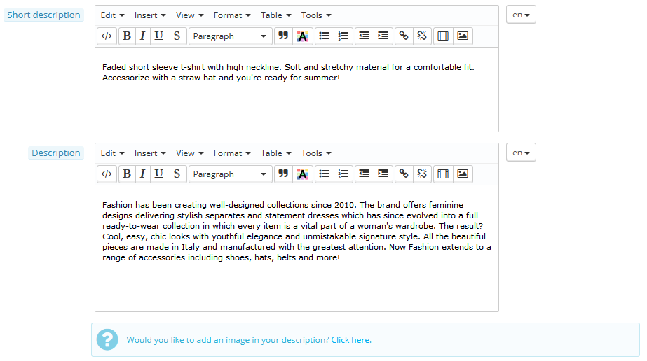

Am unteren Rand des Formulars gibt es zwei Beschreibungsfelder, die jeweils unterschiedlichen Zwecken dienen:

* Im Feld **"Kurzbeschreibung"** können Sie eine kurze Beschreibung einfügen, die in Suchmaschinen und in der Kategorie Beschreibung für Ihr Produkt angezeigt wird.\
  Dieses Feld ist auf 400 Zeichen begrenzt: Wenn Sie diese Grenze überschreiten, wird PrestaShop Sie mit einer roten Meldung warnen. Sie können diese Grenze in der Einstellungsseite "Artikel" ändern.
* Im Feld **"Beschreibung"** können Sie eine vollständige Beschreibung Ihres Produkts einfügen, die direkt auf der Produktseite angezeigt wird. Der Text-Editor bietet eine breite Palette von Optionen für die Erstellung von optisch ansprechenden Beschreibungen (Schriftart, Größe, Textfarbe, etc.).\
  &#x20;Das zweite Feld hat keine Grenzen bezüglich Textlänge, geben Sie alle wichtigen Informationen auf überzeugende Weise über ihren Artikel an.

Unter dem Feld "Beschreibung" finden Sie ein kleines Tool, um ein Bild, das dem Produkt beigefügt wurde, hinzuzufügen (über die Registerkarte "Bilder"), benutzen sie Image-Tags. Klicken Sie auf " hier klicken", um es zu öffnen.

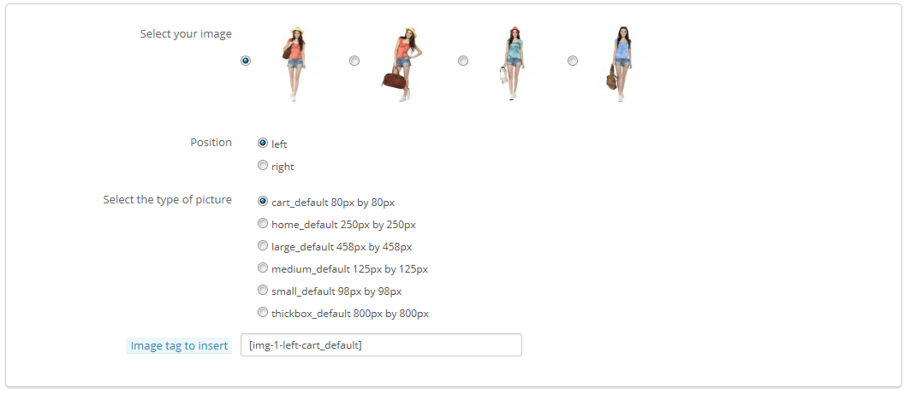Wählen Sie einfach das gewünschte Bild, seine Position und Größe im Text und PrestaShop generiert einen Image-Tag, den sie dann in die Beschreibung einfügen können(vorzugsweise zwischen zwei Absätzen oder ganz am Anfang eines Absatzes).

Im Feld **"Tags"** fügen Sie einige Begriffe und Schlüsselwörter ein, die Ihren Kunden helfen, leicht zu finden, was sie suchen.

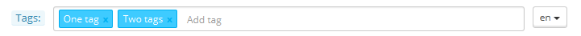

Sie werden im Shop im „Tags“-Block angezeigt (falls vorhanden). Wenn Sie nicht wollen, dass der Tag-Block angezeigt wird, deaktivieren Sie einfach das "Tag-Block" Modul (auf der "Module" Seite).

Unterschiede zu PrestaShop 1.4

In PrestaShop 1.4 konnte man den Hersteller des Artikels direkt in diesem Tab anzeigen. Seit Version 1.5 ist diese Einstellung im Tab "Kategorie/Zubehör" am Ende der Seite. Das Gleiche gilt für das Feld "Standard-Kategorie" und „Zubehör“.

Version 1.4 ermöglichte Ihnen auch, die Größe und das Gewicht des endgültigen Pakets anzugeben. Seit Version 1.5 sind diese Einstellungen im Tab "Versand".

Das Feld "Lagerort" der Version 1.4 findet sich nun im optionalen "Lager"-Tab auf der linken Seite, dieser steht nur zur Verfügung, wenn Sie Erweiterte Lagerverwaltung aktiviert haben, diese ist unter Voreinstellungen>Artikel zu finden.

Sobald Sie alle diese Informationen eingegeben haben, speichern Sie Ihre Arbeit, daraufhin kommen Sie wieder in die Liste der Artikel. Wenn Sie auf "Speichern und auf Seite bleiben" klicken, sind Sie in der Lage, den Artikel sofort weiter zu bearbeiten.

### Den Preis eines Artikels festlegen 

Die Preiseinstellung wird im Tab "Preise" auf der linken Seite durchgeführt. Der Preisbereich kann auf den ersten Blick überfordernd sein, mit Feldern, die sich gegenseitig beeinflussen - aber es ist in der Tat sehr einfach.

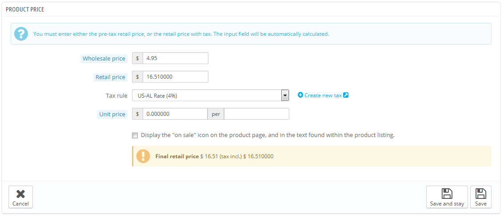

Legen Sie den Preis fest, der in Ihrem Shop angezeigt wird, indem Sie die folgenden Anweisungen befolgen:

* **Wholesale price**. Enables you to instantly know your wholesale, factory price, and thus compare it to your selling price in order to easily calculate your profit.
* **Retail price**. The price of your product before taxes.
* **Tax rule**. The tax applicable to the product. Choose between the different rates that you have registered.\
  &#x20;If you need to create new tax rates, click the "Create New Tax" button. Tax creation is done in the "Localization" menu, "Taxes" page; it is fully explained in the "Understanding Local Settings" chapter of this guide.
* **Eco-tax (tax incl.)**. The value of the ecotax for this product. This value is already included in your retail price. You are supposed to declare that tax to your country's tax agency.\
  &#x20;_Note that this field is not displayed by default_. If you have to include an ecotax, you must first enable it: go to the "Localization" menu, "Taxes" page, "Tax options" section (bottom of the page), and choose "Yes" for the "Use ecotax" option.
* **Retail price with tax**. Displays the price of the product with taxes included. You can edit the value, and it will automatically update the "Pre-tax retail price" field according to the tax rule that you chose.
* **Unit price**. Enables you to conform to local legislations that require products to be displayed with their unit price.\
  &#x20;For instance, if you are selling a pack of 6 cans of soda, then you should fill this field with the price per can, and indicate "can" in the text field. The description on the same line will update accordingly.
* **Display the "on sale" icon on the product page and in the text found within the product listing**. Check that box to show that your product is on sale, both on the product page and in the text on the product listing. An "On sale" icon will appear under the product. You can modify this logo by changing the following file: `themes/default/img/onsale_en.gif`
* **Final retail price**. This price, including the discount taken, will update as you type.

Sie können das "Verkaufspreis brutto" –Feld ausfüllen und wählen, welcher Steuersatz angewendet werden soll, und das Feld wird automatisch den Verkaufspreis netto berechnen. Der umgekehrte Vorgang ist ebenfalls verfügbar.

An dieser Stelle sind Sie mit den wesentlichen Informationen für eine grundlegende Produktseite fertig. Sie können speichern und haben den Artikel sofort zum Verkauf in Ihren Shop zur Verfügung!\
&#x20;Doch lesen Sie weiter, denn es gibt viele weitere Einstellmöglichkeiten, um Ihren Artikel attraktiver für die Kunden zu machen.

#### Sonderpreise: Mengenrabatte 

Sie können den Gesamtpreis des Produkts in Abhängigkeit von der Menge, die Ihr Kunde kauft, der Benutzergruppe, dem Land, etc., ändern. Dies wird im Abschnitt "Sonderpreise" im Tab "Preise" getan. Klicken Sie auf "Sonderpreis hinzufügen", um einen neuen Dialog zum Hinzufügen zu zeigen.

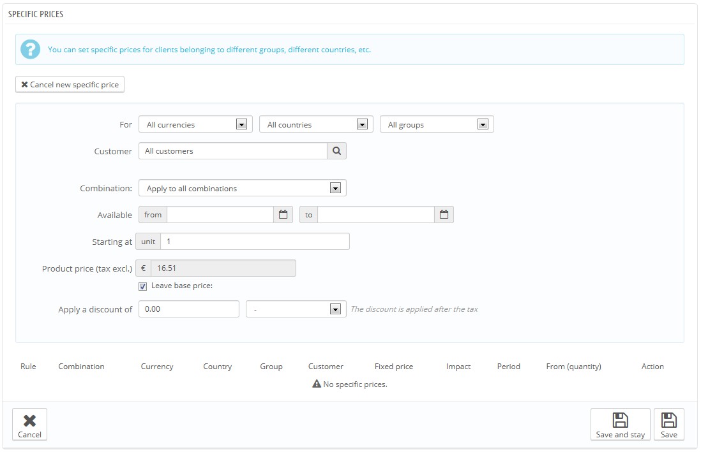

Dies ist eine sehr einfache Möglichkeit, einen Sonderpreis für diesen Artikel(mit all seinen Variationen) zu erstellen.

Klicken Sie auf "Sonderpreis hinzufügen" und ein Formular öffnet sich.

* **Für**. Damit können Sie sehr spezifisch über die verschiedenen Gruppen, für die dieser Preis gilt, inklusive Währungen, Länder und sogar Ihre Kundengruppen (die wir in einem späteren Kapitel besprechen) entscheiden.
* **Kunde**. Sie können noch spezifischer wählen und einem Kunden direkt einen Rabatt gewähren. Beginnen Sie die ersten Buchstaben des Kunden, Vorname oder Nachname, und wählen Sie den gesuchten Kunden.
* **Variante**. Sie können festlegen, dass dieser Sonderpreis für alle Varianten oder nur für eine gilt. Wenn Sie mehr als eine Variation, aber nicht alle von ihnen auswählen möchten, müssen Sie einen Sonderpreis für jede Variante einzeln erstellen.
* **Verfügbar von/ bis**. Hier können Sie einen Datumsbereich, in dem Sonderpreis aktiv sein soll, definieren. Ein Klick auf das Symbol öffnet einen Kalender, was die Wahl vereinfacht.
* **Ab \[] Einheit**. Enthält den Wert, von dem der Rabatt angewendet werden soll. Der Standardwert ist "1", der jede Menge bedeutet.
* **Artikelpreis (ohne MwSt.)**. Hier können Sie einen beliebigen Preis, unabhängig von Berechnungen und regulären Preisen, festlegen. Schreiben Sie in dieses Feld "0", um den Standardpreis zu verwenden.\
  **Grundpreis unverändert**. Markieren Sie dieses Kästchen, um das Feld "Artikelpreis" zurückzusetzen und zu verhindern, dass Sie es manuell bearbeiten.
* **Rabatt in folgender Höhe hinzufügen**. Der Rabatt, der angewendet wird, wenn der Kunde eine Menge des Produkts ausgewählt hat. Verwenden Sie das Dropdown-Menü, um die Art des Rabatts (entweder ein bestimmter Betrag, Währungseinheiten oder ein Prozentsatz des Standardpreises) festzulegen.

Sobald Sie Ihre Werte gewählt haben, klicken Sie auf "Speichern und auf der Seite bleiben": die Zusammenfassung Ihrer Rabatt-Einstellungen erscheint unten. Der Rabatt wird sofort im Shop zu sehen sein.\
Wenn Sie einen Wert löschen möchten, klicken Sie auf das Papierkorb-Symbol in der Tabelle.Wenn Sie einen Wert löschen möchten, klicken Sie auf das Papierkorb-Symbol in der Tabelle.

Wenn Sie komplexere Rabatte erstellen wollen, lesen Sie über das Menü "Preisregeln" im Kapitel "Preisregeln und Gutscheine erstellen".

#### Verwalten der Preis-Priorität 

Einem Kunden könnten mehrere Preise oder Rabattregeln  zugeordnet werden, auch wenn Sie ausführliche Preis und Mengenrabatte mit eigenen Gruppen und Shops(Multishop) zugeordnet haben. PrestaShop verwendet daher eine Reihe von Prioritäten, um einen einzigen Preis festzulegen, der für solche Kunden gilt. Vielleicht möchten Sie zum Beispiel der Benutzergruppe eine höhere Priorität zuweisen, als der Währung.

Sie können die PrestaShop Standardeinstellungen im Abschnitt "Prioritäten-Management" ändern.

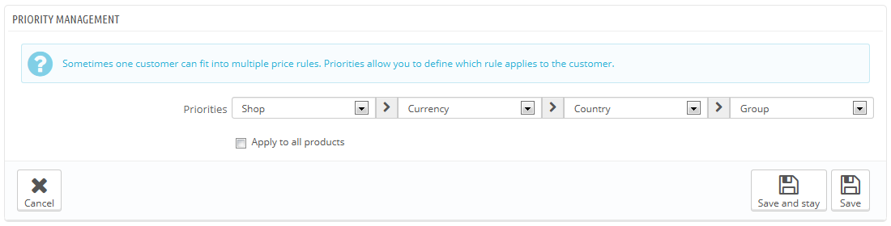

Die Standardreihenfolge von Prioritäten ist:

1. Shop (Bei Multishop).
2. Währung.
3. Land.
4. Gruppe.

mit dem Kontrollkästchen am unteren Rand können Sie die Einstellungen für alle Produkte aktualisieren. Wenn das Kontrollkästchen deaktiviert bleibt, dann gelten die Änderungen nur für das aktuelle Produkt.

### Optimierung der Suchmaschinen-Position (SEO) ihres Artikels 

Zur Verbesserung Ihrer Produktlistung als auch zur höheren Sichtbarkeit Ihres Shops empfehlen wir, dass Sie sorgfältig die SEO-Felder ausfüllen: Meta-Titel, Meta-Beschreibung und Schlüsselwörter, und benutzerfreundliche URLs.

"SEO" selbst steht für "Search Engine Optimization“. Lesen Sie mehr auf Wikipedia:. [Http://en.wikipedia.org/wiki/Search\_engine\_optimization](http://en.wikipedia.org/wiki/Search\_engine\_optimization)

Lernen die besten SEO Praktiken für E-Commerce kennen! Der kostenlose PrestaShop "Complete Guide to SEO": [http://www.prestashop.com/en/white-paper-seo](http://www.prestashop.com/en/white-paper-seo)

Um auf SEO Informationen des Artikels zuzugreifen, öffnen Sie den Tab "SEO" auf der linken Seite.

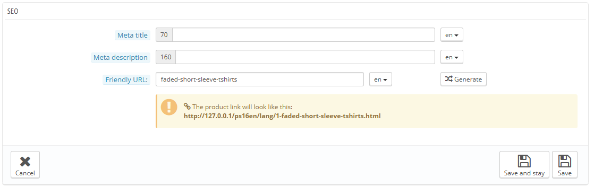

Mit den Feldern dieser Seite können Sie Optimierungen zur höheren  Sichtbarkeit Ihres Katalogs auf Suchmaschinen vornehmen.

* **Meta-Titel**. Dies ist das wichtigste Feld, der Titel, wie er auf allen Suchmaschinen angezeigt wird. Seien Sie sehr sachlich: Sie müssen die Suchmaschinen-Benutzer dazu verleiten, Ihren Link, nicht den einer anderen Website anzuklicken. Stellen Sie sicher, dass der Titel einzigartig für diesen Artikel innerhalb Ihrer Website ist.\

  * Gutes Beispiel: "Levi's® 501® Original Jeans - Tidal Blau - Original Fit".
  * Schlechtes Beispiel: "Item # 02769869B Bestseller".
* **Meta-Beschreibung**. Eine Präsentation des Produkts in nur ein paar Zeilen (im Idealfall weniger als 155 Zeichen) soll das Interesse des Kunden erfassen. Dies wird, abhängig von der Suchanfrage, in den Ergebnissen bei einigen Suchmaschinen angezeigt: einige Suchmaschinen wählen, die gesuchten Schlüsselwörter direkt im Kontext des Inhalts der Seite anzuzeigen. Stellen Sie sicher, dass die Beschreibung einzigartig für diesen Artikel innerhalb Ihrer Website ist.
* **Benutzerfreundliche URL**. Dies ist ein weiterer sehr wichtiger Bereich. Es ermöglicht Ihnen, die Web-Adressen Ihrer Produkte neu zu schreiben, wie Sie es wünschen. Zum Beispiel, anstatt eine Adresse wie\
  &#x20;[http://www.myprestashop.prestashop.com/index.php?id\_product=8\&controller=product](http://www.myprestashop.prestashop.com/index.php?id\_product=8\&controller=product)\
  &#x20;lässt sich schreiben:\
  &#x20;[http://www.myprestashop.prestashop.com/8-name-of-the-product.html](http://www.myprestashop.prestashop.com/8-name-of-the-product.html).\
  Alles, was Sie tun müssen, ist im Feld "Benutzerfreundliche URL" die, die Worte, aus denen die URL bestehen soll, durch Bindestriche getrennt einzutragen.\
  &#x20;Die Schaltfläche **"Erzeugen"** macht es leicht, eine benutzerfreundliche URL basierend auf den Produktnamen zu erzeugen. Einmal erzeugt, können Sie die URL bearbeiten.

Diese URLs funktioniert nur, wenn Benutzerfreundliche URLs aktiviert ist. Sie können dies auf der "SEO & URLs" Einstellungsseite tun, in der Rubrik "URL-Einstellungen".

Mehr Informationen finden Sie auf der "SEO & URLs"-Seite“, welche im Kapitel "Grundlegendes zu den Einstellungen" dieses Handbuchs behandelt wird.

### Verwaltung der Artikelverknüpfungen 

Erstellen von Verknüpfungen für Ihren Artikel bedeutet, ihn mit anderen Inhalten in der Datenbank zu verbinden:

* Produktkategorien.
* Zubehör.
* Hersteller.

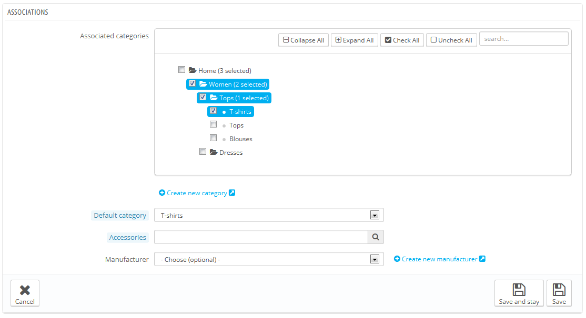

#### Produktkategorien 

Im Abschnitt "verknüpfte Kategorien" können Sie auswählen, in welcher Kategorie das Produkt erscheinen soll. Sie können mehr als eine wählen, aber behalten Sie im Kopf, dass es besser für den Kunden ist, wenn die Kategorie gleichwertige und vergleichbare Produkte enthält. Daher sollten Sie Wurzelkategorien vermeiden und lieber untergeordneten Kategorien verwenden.\
&#x20;So kann beispielsweise die Kategorie "Telefon" Unterrubrik von "Marken" (Apple, Samsung, Nokia, etc.) sein und über "Eigenschaften" (Smart-Phone, Flip-Telefon, etc.) verfügen. Es liegt an Ihnen, wie Sie die Kategorien am nützlichsten für Ihre Kunden anzeigen.

Wenn Sie eine Kategorie hinzufügen wollen, speichern Sie den aktuellen Status Ihres Produktes, bevor Sie auf die Schaltfläche "Neue Kategorie" klicken. Kategorie-Erstellung wird in einem anderen Abschnitt dieses Handbuchs erläutert.

Das "Standard-Kategorie" Dropdown-Menü ist hilfreich, wenn ein Artikel zu verschiedenen Kategorien gehört. Hauptsächlich dient es dazu, die Kategorie festzulegen, in der ein Besucher landet, wenn er durch eine Suchmaschine auf die Website stößt, da der Name der Kategorie in der Artikel-URL angezeigt wird.

„Featured“ Liste

Wenn sie das "Home"-Feld ankreuzen, können Sie das Produkt auf der Homepage Ihres Shops hervorheben, sofern Ihr Template diese Funktion unterstützt. Um ein Produkt aus der Featured-Liste zu entfernen, deaktivieren Sie einfach die "Home"-Box.

#### Zubehör 

Das Feld "Zubehör" gibt Ihnen die Möglichkeit der Wahl relevanten Produkte mit diesem Artikel zu verbinden, um sie Ihren Kunden vorzuschlagen (wenn das Template die Funktion unterstützt). Geben Sie die ersten Buchstaben des Artikels ein und wählen Sie ihn aus. Das Produkt wird dann unterhalb des Textfeldes gelistet.

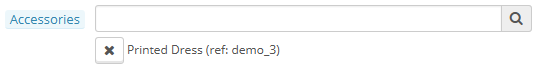

Sie können Produkte mit so vielen anderen Produkten verbinden, wie Sie für notwendig erachten. Klicken Sie auf das Kreuz, um eine Produkt-Verknüpfung zu löschen.

Eine Verknüpfung geht nicht bidirektional: das verknüpfte Produkt wird nicht über eine Verbindung zum aktuellen Produkt verfügen.

Zubehör Hinzufügen / Entfernen wird nicht automatisch gespeichert! Vergessen Sie nicht, auf die Schaltfläche "Speichern" zu klicken.

#### Hersteller 

Ein Produkt kann nur mit einem Hersteller in Verbindung gebracht werden. Wählen Sie einen in dem Dropdown-Menü oder erstellen Sie einen neuen Hersteller, wenn nötig(aber speichern Sie Ihr aktuelles Produkt, bevor Sie auf den Link "neuer Hersteller" klicken).

### Versandkosten: Größe, Gewicht, Lieferant 

Versandkosten dürfen nicht vernachlässigt werden: sie können die endgültigen Kosten einer Bestellung schnell verdoppeln, und Sie sollten diese stark beachten- Kunden hassen böse Überraschungen.

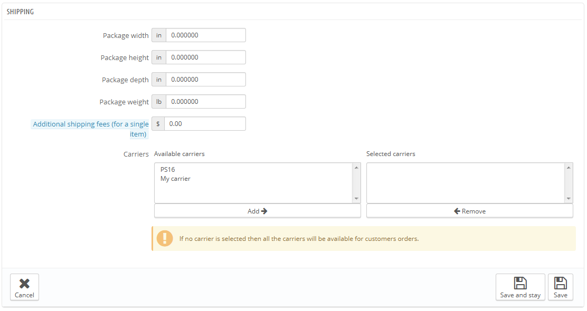

Im Tab "Versand" auf der linken Seite können Sie einige wertvolle Informationen über Ihre Produktpakete angeben:

*   **Paket Breite, Höhe, Länge und Gewicht**. Sie sollten sich bemühen, jedes Feld auszufüllen, da die Kenntnis der genauen Größe und Gewicht der Verpackung nicht nur nützlich für Sie ist, PrestaShop kann auch spezifische Größen / Gewichte, basierend auf diesen Einstellungen, direkt an spezifische Lieferanten automatisch senden. Der Endpreis der Bestellung wird dem Kunden erst angezeigt, wenn PrestaShop (oder der Kunde) einen Lieferanten ausgewählt hat.

    Diese Werte verwenden Standard Gewicht, Volumen, Distanz und Dimensionseinheiten, wie auf der "Lokalisierung"-Seite des Menüs "Lokalisierung" festgelegt.

    These values do not have to be integers. If your products weight less than 1 lbs, you can simply use a period (.) to indicate the fractions:

    * 123 lbs
    * 1.23 lbs
    * 0.23 lbs (equals 3.68 oz)
    * etc.
* **Zusätzliche Versandkosten**. Dies kann für bestimmte Produkte, die besonders schwierig zu verpacken, oder wirklich schwer sind, gelten.
* **Versanddienste**. Sie können festlegen, dass das aktuelle Produkt nur durch eine Auswahl von Lieferanten versendet. Wenn kein Lieferant ausgewählt wird, sind alle für Kundenaufträge verfügbar.

### Hinzufügen von Produktvariationen 

Sie werden oft das gleiche Produkt mit verschiedenen Variationen verkaufen: sie teilen den gleichen Gesamt-Namen, aber sie könnten durch ihre Farbe, Größe, Bildschirmgröße und andere Attribute unterschieden werden. Meistens werden diese Attribute auch noch kombiniert: die rote Version des Artikels mit 1 GB Kapazität oder 2 Gb, mit 12 '' Bildschirm oder 15 '' Bildschirm. Deshalb nennt PrestaShop diese Versionen "Variationen": Ihr Bestand an Artikeln kann aus mehreren Varianten von einem einzigen Produkt bestehen, dessen Attribute einfach in spezifischer Weise kombiniert werden.

Sie können keine Kombinationen erstellen, wenn Sie nicht bereits Attribute erstellt haben.

Außerdem sollten Sie keine Kombination erstellen, die Ihre Kunden nicht wählen können.

Attribute können auf der "Artikeleigenschaften"-Seite aus dem Menü "Katalog" erstellt werden, dies wird im Detail im Kapitel des gleichen Namens in diesem Handbuch erläutert.

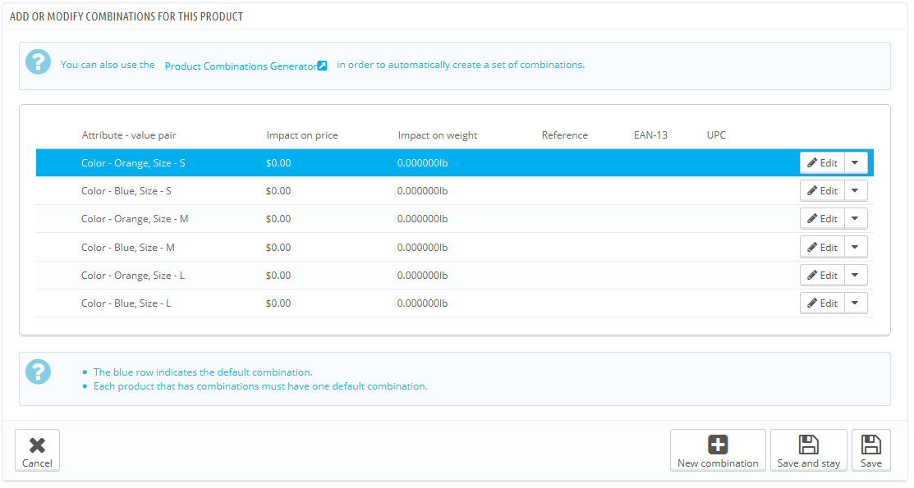

Wie Sie die Attribute kombinieren ist allein Ihre Sache und PrestaShop gibt Ihnen zwei Methoden, dies zu tun.

#### Manuelle Methode 

Diese Methode hilft Ihnen, eine Variation nach der anderen zu erstellen. Daher sollte sie nur bei Artikeln mit wenigen oder ganz bestimmten Variationen genutzt werden, die unter Verwendung der automatischen Methode (siehe nächster Abschnitt) nicht erzeugt werden können.

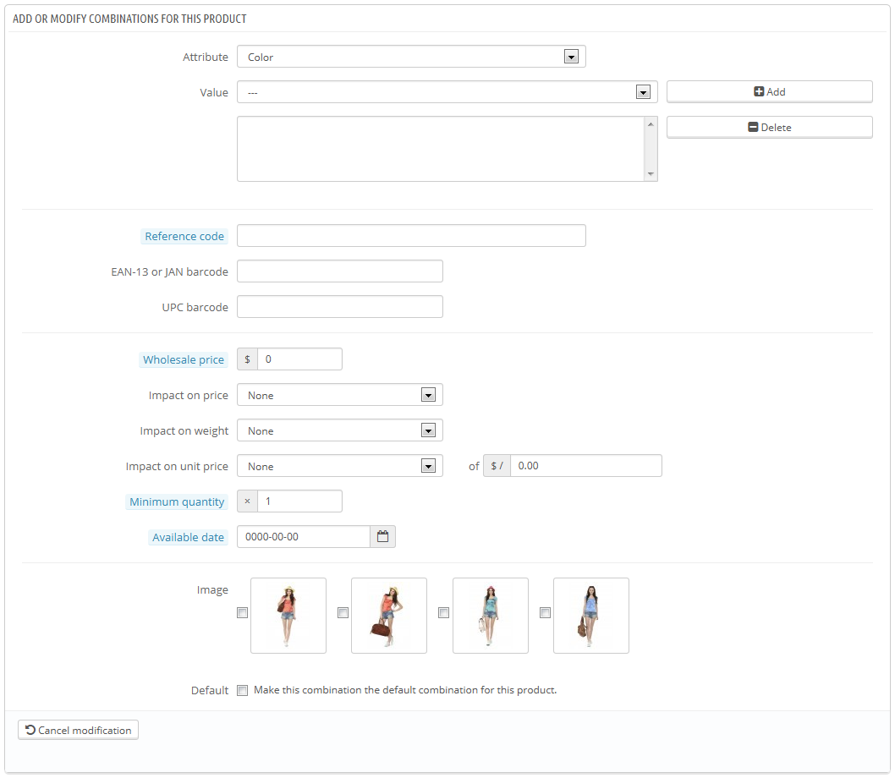

Hinzufügen einer neuen Variante ihres Artikels braucht nur ein paar Schritte. Klicken Sie auf den "neue Variante" -Button am unteren Rand der Seite, neben der Schaltfläche "Speichern". Eine neue Oberfläche wird angezeigt:

* **Varianten**.
  1. Wählen Sie im Drop-down-Menü eine Gruppe von Attributen wie z.B. "Farbe". Der Inhalt der "Wert"-Dropdown-Liste wird entsprechend aktualisiert.
  2. Wählen Sie den Attributwert, den Sie möchten, zum Beispiel "blau".
  3. Klicken Sie auf die Schaltfläche "Hinzufügen" und es wird in der Auswahl angezeigt.\
     &#x20;Sie können so viele Attributwertpaare, wie erforderlich , zu einer Kombination hinzufügen.\
     &#x20;Sie können nur ein Paar pro Attribut hinzufügen: es ist unmöglich, beide haben "Farbe: Blau" und "Farbe: Rot" in eine Kombination setzen; falls dies erforderlich ist, müssen neue Attribute, zum Beispiel "Grundfarbe" und "Sekundäre Farbe", erstellen.\
     &#x20;Sie können ein Attribut-Wert-Paar durch Markieren und Klicken auf die Schaltfläche "Löschen" löschen.
* **EAN-13 und UPC**. Falls erforderlich, tippen Sie den Kombinationsreferenzcode in EAN-13 und / oder UPC Zahlen in jedem Feld ab, als ob Sie einen neuen Artikel in PrestaShop erstellen. Diese Zahlen können von Ihrem Lager oder Ihren Lieferanten verwendet werden. Stellen Sie sicher, dass Sie diese Felder ausfüllen, sie sind oft wesentlich für Ihr Unternehmen.
* **Einkaufspreis**. This field is useful if the original price of the product changes simply because this is a combination.
* **Auswirkungen auf Preis / Gewicht / Einheitspreis**.Wenn die Kombination eine Auswirkung auf den ursprünglichen Preis / Gewicht / Stückpreis hat, wählen Sie das entsprechende Dropdown-Menü. wählen Sie "Erhöhung" oder "Reduzierung" je nach Kontext, und füllen Sie das erscheinende Feld mit den gewünschten Werten.
* **Ökosteuer**. Die spezifische Ökosteuer für diese Kombination (wenn die Option Ökosteuer aktiviert ist).
* **Mindestanzahl**. Setzen Sie diesen Wert, wenn die Variation nur in großen Mengen verkauft werden soll. Dieser legt fest, wie viele Artikel dieser Art zusammen verkauft werden.
* **Lieferdatum**. Wenn dieses Produkt nicht vorrätig ist, können Sie angeben, wann das Produkt wieder verfügbar sein wird.
* **Bild**. Die Bilder, die mit dem Originalartikel verknüpft sind (auf der Registerkarte "Bilder" auf der linken Seite), werden angezeigt. Markieren Sie die Kästchen für die Bilder, die diese Kombination am besten repräsentieren.
* **Standard**. Markieren Sie dieses Kästchen, um diese Variation als Standardvariante für das Produkt festzulegen.

Wenn Sie alle der Kombination der Details festgelegt haben, speichern Sie Ihre Variante über die Schaltfläche "Speichern und auf der Seite bleiben". Ihre Variante wird nun in der Variantenliste im unteren Bereich des Bildschirms angezeigt.

Unterschiede zu PrestaShop 1.4

In PrestaShop 1.4, gab es hier eine "Farbauswahl"-Option am Ende der Liste, mit der Sie wählen konnten, ob eine Farbauswahl auf der Artikelseite angezeigt werden sollte.

Seit PrestaShop 1.5, wurde diese Option verschoben und optimiert. Wenn Sie eine Artikelvariante(im Menü "Katalog" > "Artikelvarianten“) erstellen, können Sie in der Dropdown-Liste "anzeigen als" wählen, ob diese als Dropdown-Liste, Optionsfelder oder als Farbe/Muster angezeigt werden.

#### Automatische Methode 

Wenn Sie viele verschiedene Produktvarianten benötigen, können Sie die "Variantengenerator" verwenden. Mit diesem Tool können Sie automatisch alle möglichen Kombinationen generieren.

Mit einem Klick auf "Variantengenerator" gelangen Sie zur Generierungsseite.

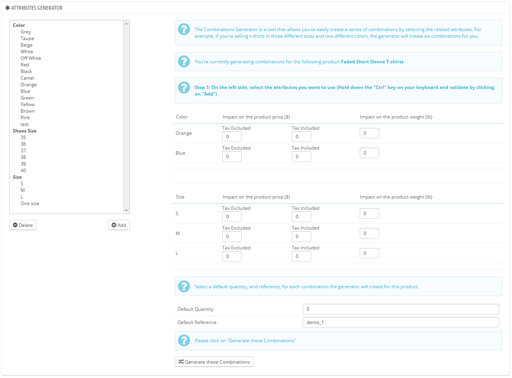

Es wird ein Warnfenster mit dem Text "Alle ungespeicherten Änderungen gehen verloren. Möchten Sie wirklich fortfahren?" Das bedeutet, für diesen Artikel existiert bereits mindestens eine Variante. Wenn Sie damit einverstanden sind, werden alle ungespeicherten Varianten gelöscht. Achten Sie darauf, Ihre Arbeit immer zu speichern, bevor Sie den Generator verwenden!

Auf der linken Seite stehen Artikeleigenschaften und deren zugehörige Werte. Wählen Sie die Eigenschaften aus, indem Sie auf den Wertnamen (wenn Sie mehr als einen Wert auswählen wollen, halten Sie die Strg-Taste gedrückt und klicken) klicken und daraufhin auf "Hinzufügen".

Zum Beispiel könnten Sie die Werte "Blau", "S, M, L" auswählen.

Um eine  ausgewählte Eigenschaft zu entfernen, wählen Sie einfach die betreffenden Werte und klicken Sie auf "Löschen".

Sobald die Eigenschaften ausgewählt wurden, können Sie die Auswirkungen auf den Artikelpreis und das Gewicht für jede Variante bearbeiten. Sie müssen das nicht festlegen: die Variationen können einfach den gleichen Preis und Gewicht haben.

Legen Sie die Menge der einzelnen Produkte im Bereich "Standardmenge" an der Unterseite. Vorsicht, dieser Wert gilt für jede Kombination. Zum Beispiel 200 Produkte jeder Variante = 2 Farben \* 1 Größe \* 200 = 400 Artikel.

Sie können eine Standard-Referenz für diese Kombination hinzufügen, wenn es ihren administrativen Bedürfnissen dient.

Klicken Sie auf den "Diese Varianten erzeugen"-Button und Sie gelangen zurück auf die Registerkarte "Artikelvarianten", mit allen gerade erzeugten Kombinationen. Wenn Sie möchten, können Sie jetzt jede Variante einzeln bearbeiten.

Wie Sie sehen können, hilft der Variantengenerator, viel Zeit zu sparen, wenn Sie zahlreiche Attribute, wie Größen und Materialien kombinieren müssen. Er erstellt automatisch alle möglichen Kombinationen, die dann auf der öffentlichen Seite des Artikels in der Registerkarte „Kombinationen“ angezeigt werden.

Wenn Sie nicht alle erzeugten Varianten behalten möchten oder nicht alle genau die gleichen Attribute besitzen (verschiedene Referenzen, Preise, Lieferdaten, ...), können Sie sie einfach löschen (Papierkorb-Symbol) oder bearbeiten (Stiftsymbol). Das Stern-Symbol setzt die ausgewählte Variante als Standard- in diesem Fall wird diese blau hervorgehoben.

### Verwalten von Produktmengen 

Artikelmengen werden in einer einzigen Registerkarte verwaltet. Die Funktionsweise ist recht einfach: Die Seite zeigt Ihnen eine Tabelle mit allen Varianten für das aktuelle Produkt (wenn es keine Varianten gibt, wird in der Tabelle nur eine einzige Zeile angezeigt). Es ist Ihnen überlassen, den Anfangsbestand für jede Variante festzulegen. PrestaShop wird damit bestimmen, wann ein Produkt bald ohne Lagerbestand oder gänzlich nicht mehr verfügbar ist.

#### Lagerverwaltungsoptionen 

Die Registerkarte Mengen unterstützt die erweiterte Lagerverwaltungs-Funktion, falls aktiviert. Dies bedeutet, dass, wenn z.B. die aktuelle Artikelvariante auf mehrere Speicherorte verteilt ist, ist PrestaShop in der Lage, die genaue Lagerposition jeder Variante zu bestimmen.

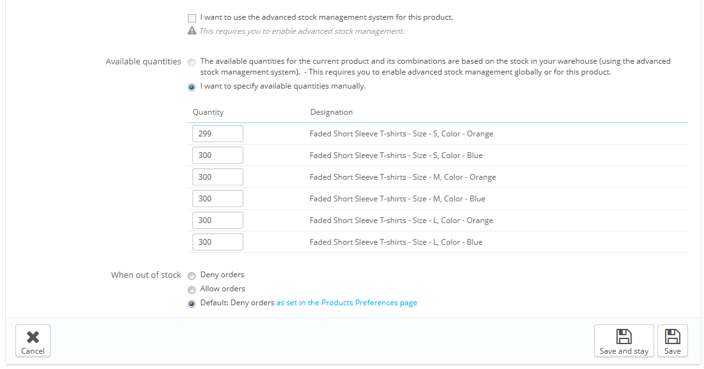

Standardmäßig müssen Sie die aktuellen Produktmengen für jede Variante von Hand verwalten. Mit der fortschrittlichen Lager-Management-Funktion aktiviert, können Sie sich diesbezüglich auf PrestaShop verlassen.

Um erweiterte Lagerverwaltung für das aktuelle Produkt zu verwenden, müssen Sie das Kontrollkästchen "Ich möchte die erweiterte Lagerverwaltung für diese Artikel verwenden." Ausfüllen. Sobald dies ausgewählt ist, steht die Option "Die verfügbaren Mengen für den aktuellen Artikel und seine Varianten sind abhängig vom Lagerbestand" zur Verfügung. Wenn Sie darauf klicken, können die Artikelmengen nicht mehr manuell bearbeitet werden, dies wird nun von ihrer Lagerverwaltung erledigt.

#### Wenn nicht auf Lager 

Mit diesen Optionen können Sie einstellen, wie sich PrestaShop verhalten soll, wenn der Artikel ausverkauft ist: Bestellungen ablehnen(das Produkt ist nicht mehr zum Verkauf verfügbar) oder zulassen(also Pre-Sales). Die dritte und auch Standardoption nutzt einfach die globale Standardeinstellung (Menü "Vorsteinstellungen">"Artikel">"Artikel Lager">"Bestellung von Artikeln zulassen, die nicht am Lager sind“).

#### Verfügbarkeits-Einstellungen 

Am unteren Ende der Seite können Sie das genaue Verhalten von PrestaShop, abhängig von der Verfügbarkeit des aktuellen Produkts, einstellen.

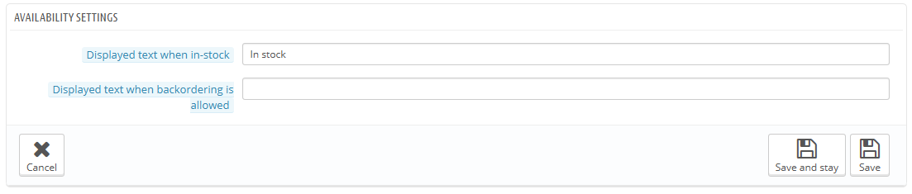

Die Optionen sind:

* **Nachricht, wenn auf Lager**. Hier können Sie eine Nachricht eintragen, die anzeigt wird, wenn der Artikel auf Lager ist, zum Beispiel "Artikel verfügbar". Dies zeigt ihren Kunden, dass Ihr Shop den Artikel sofort versenden kann.
* **Nachricht, falls nicht am Lager, aber lieferbar**. Hier können Sie eine Nachricht eintragen, die anzeigt wird, wenn Ihr Produkt nicht auf Lager ist, aber immer noch bestellbar, zum Beispiel "jetzt vorbestellen!". Dies zeigt ihren Kunden, dass Ihr Shop den Artikel sofort versendet, wenn er auf Lager ist.

Sie können auch konfigurieren die globalen Einstellungen für Ihre Artikel anwenden: die Standard-Option ist, Bestellungen abzulehnen, was aber in den Voreinstellungen geändert werden kann. Dies wird  vollständig im "Voreinstellungen"-Kapitel dieses Handbuchs erläutert.

### Artikelbilder 

Die "Bilder"-Registerkarte auf der linken Seite dient der Aufnahme von Fotos für Ihre Artikelseite. Sie sollten alle Bilder für Ihre Artikel, einschließlich aller ihrer Varianten(Farbe, Größe, Form, etc.), hochladen.

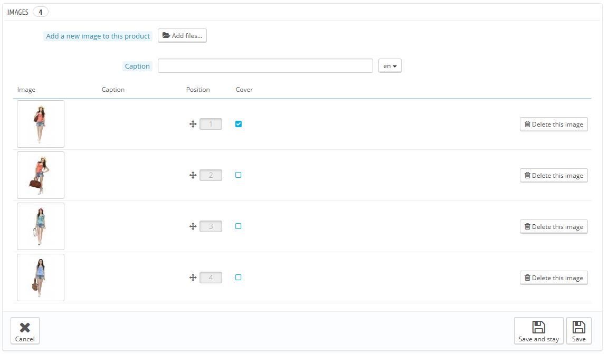

Um ihrem Artikel ein oder mehrere Bilder hinzuzufügen:

1. Klicken Sie auf "Füge Dateien hinzu…" und wählen Sie dann wenigstens eine Bilddatei von Ihrem Computer aus. Sie können so viele Bilder wie nötig auswählen, indem sie die Strg-Taste beim Klicken gedrückt halten oder einfach Eines nach dem Anderen auswählen. PrestaShop wird nun die hochgeladenen Bilder inklusive einem Button zum Entfernen anzeigen.Die maximale Bildgröße für eine Bilddatei bezieht PrestaShop von den PHP-Einstellungen Ihres Servers. Diese Größe kann auf der "Bilder"-Einstellungsseite unter der Rubrik " Maximale Dateigröße des Artikelbildes" gesenkt werden.
2. Geben Sie dem Bild eine Beschriftung. Diese wird angezeigt, wenn das Bild nicht angezeigt werden kann - was sehr gut für die Suchmaschinen-Optimierung sein kann.
3. Klicken Sie auf den Upload-Button, um die Datei online zu stellen.
4. Die hochgeladenen Bilder werden in einer Liste weiter unten angezeigt. Wenn Sie mehr als ein Bild haben, können Sie auswählen, welches Bild als Standard / Cover-Bild genutzt wird, indem Sie das entsprechende „Titelbild“-Kästchen ankreuzen. Das Titelbild wird auch automatisch auf der Artikelseite Ihres Shops angezeigt.\
   Sie können auf eine Miniaturansicht klicken, um das Bild in voller Größe anzuzeigen.

Sobald Sie alle Ihre Produktbilder hochgeladen haben, können Sie die Bildreihenfolge per Drag-and-Drop ändern.

### Konfigurieren von Artikel-Eigenschaften 

In der Registerkarte "Eigenschaften" können Sie Ihre Produkteigenschaften (zB Gewicht, Material, Herkunftsland, usw.) angeben.

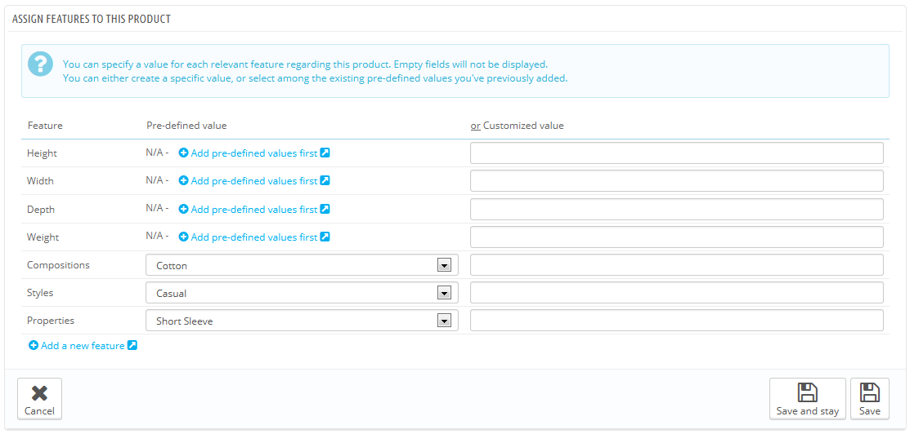

Wenn Sie Merkmale und Werte (z.B. Wolle und Mikrofasermaterialien) erstellen, werden sie den Artikeln zugeordnet, wenn benötigt. Das bedeutet, dass Sie nicht die Eigenschaften für jeden Ihrer Artikel ausfüllen müssen, sondern einfach die erforderlichen Werte einsetzen und später anwenden.

PrestaShop Vergleichsmaschine verlässt sich ganz auf Produkteigenschaften: diese werden verglichen.

Der Produktvergleich arbeitet auf einer Pro-Kategorie Basis, Sie sollten also sicherstellen, dass alle Produkte einer bestimmten Kategorie die gleichen Eigenschaften mit verschiedenen Werten besitzen, um untereinander verglichen werden zu können.

Beachten Sie, dass, im Gegensatz zu den Variationen, **diese Werte für den allgemeinen Artikel gelten** (das bedeutet: alle Ihre Varianten Teilen die gleichen Eigenschaften).

#### Erstellen einer Eigenschaft 

Vor dem Hinzufügen einer Eigenschaft zu einem Artikel müssen Sie sie für den allgemeinen Gebrauch in Ihrem Shop erstellen. Entweder navigieren Sie „Artikeleigenschaften"-Seite des Menüs "Katalog", oder klicken direkt auf die Schaltfläche "Neue Eigenschaft hinzufügen". Es erscheint eine Warnung: "Alle ungespeicherten Änderungen gehen verloren. Möchten Sie wirklich fortfahren?" – Stellen Sie sicher, dass Sie alle Änderungen gespeichert haben.

Artikeleigenschaften und –werte werden in einem gesonderten Teil des Handbuchs erklärt.

#### Eigenschaften einem Artikel zuweisen 

Hier wird davon ausgegangen, dass Sie bereits alle Ihre Eigenschaften und Werte festgelegt haben.

In der Registerkarte "Artikeleigenschaften" bei dem aktuell ausgewählten Artikel wird auf der linken Seite wird eine Tabelle an Eigenschaften angezeigt, wobei alle Eigenschaften Ihres Shops angezeigt werden. Nicht alle von ihnen beziehen sich auf diesen Artikel: PrestaShop wird nur Werte übernehmen, die als relevant für den Artikel gelten.

Sie können entweder einen Wert manuell einstellen, oder Sie können eine der vordefinierten Werten (wie beim Erstellen der Eigenschaft festgelegt) verwenden, wenn solche festgelegt wurden.

Wenn kein Wert für eine Eigenschaft verfügbar ist, erscheint der Hinweis "N / A" (kurz für "nicht verfügbar" oder "nicht anwendbar"), gefolgt von einem "Zuerst einen vordefinierten Wert hinzufügen"-Button.

Wenn Sie einen benutzerdefinierten Wert verwenden, sollten Sie nicht vergessen, ihn für jede Sprache, die Ihr Shop unterstützt, einzustellen. Verwenden Sie den Sprachcode-Button, um die Sprache zu ändern.

Wenn vordefinierte Werte verfügbar sind, werden sie in einer Dropdown-Liste angezeigt. Klicken Sie sie einfach an und wählen den richtigen Wert.

Nachdem Sie alle relevanten Merkmale festgelegt haben, speichern Sie die Änderungen, werden sie sofort übernommen.

Denken Sie daran: Wenn eine Eigenschaft keinen Wert hat, wird sie nicht berücksichtigt und wird nicht in Ihren Shop zu sehen sein.

### Benutzeranpassung 

PrestaShop ermöglicht es Ihren Kunden, einen Artikel, den sie kaufen, zu gestalten.

Beispiel: Sie sind ein Schmuck-Händler und Ihre Kunden haben die Möglichkeit, ihren Schmuck mit einem Text oder einem Bild zu gravieren. Ihre Kunden können den Text und / oder das Bild übermitteln, wenn sie ihre Bestellung aufgeben.

Der Vorteil dieser Funktion ist, sie bietet Ihren Kunden einen persönlichen Service, den sie ohne Zweifel zu schätzen wissen werden.

Hier finden Sie 2 Zeilen, mit denen Sie diese Funktion konfigurieren können.

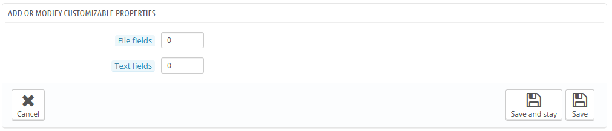

* **Dateifelder**. Setzt die angezeigte Anzahl der Datei-Upload-Tasten auf der Bestellseite. Jeder Button übernimmt nur eine Datei, setzen so viele Felder, wie Sie Ihren Kunden erlauben.
* **Textfelder**. Setzt die angezeigte Anzahl an Textfeldern auf der Bestellseite. Sie können beliebig viele Textfelder hinzufügen. Beispiel: Wenn Sie Ihren Kunden ein 5-zeiliges Text mit jeder Zeile begrenzt auf 14 Zeichen verwenden, können Sie 5 Felder hinzufügen und geben die Anzahl der zulässigen Zeichen im Label an. Sie können die Anzahl der Zeichen in der Zeichenkette nicht einschränken.

Sobald Sie die benötigte Anzahl für jedes Feld hinzugefügt haben, klicken Sie auf "Speichern und auf der Seite bleiben". Die Seite wird neu geladen und zeigt nun Textfelder an. Füllen Sie jedes von ihnen mit dem entsprechenden öffentlichen Label: das wird ein Indikator für den Kunden sein, um spezifisch zu zeigen, welche Information Sie erwarten.

Wenn Sie zum Beispiel Bilder für ein Buchcover brauchen:

* "Front Cover (20,95 x 27,31 cm, Farbe)".
* "Back Cover (20,95 x 27,31 cm, schwarz weiß)".\
  \

Das Gleiche gilt für Text: wenn Kunden Wörter eintragen können, um ein Produkt zu gravieren, könnte das so aussehen:

* "Erste Zeile (24 Zeichen)".
* "Zweite Zeile (24 Zeichen)".
* "Letzte Zeile, Unterschrift (16 Zeichen)".

**Entfernen von Feldern**. Wenn Sie am Ende zu viele Felder hinzugefügt haben, ändern Sie einfach die Anzahl der benötigten Felder für beide der zwei Typen und klicken Sie auf "Speichern und auf der Seite bleiben". Die Seite wird mit der richtigen Anzahl von Feldern neu geladen, die ersten Felder bleiben unverändert erhalten.

Vergessen Sie nicht, die Änderungen zu speichern, wenn Sie fertig sind.

#### Auf der Kundenseite 

Sobald ein Produkt über anpassbare Eigenschaften verfügt, hat seine Front-End-Artikelseite neben dem "Mehr Info"-Punkt eine neue Registerkarte: "Produkt anpassen".

Der Kunde muss die Datei (en) wählen und / oder Text schreiben und speichern, bevor er das Produkt in den Warenkorb legt.

Die benutzerdefinierten Bilder und Texte werden im Warenkorb angezeigt.

Der restliche Kaufprozess ist der gleiche wie üblich.

Sobald die Bestellung vom Kunden bestätigt wurde, erhält der Händler eine Benachrichtigung über die Bestellung im Back-Office.

Er kann dann die Bestellung überprüfen, die Bilder und/oder Texte enthält, diese werden auch für jeden Artikel angezeigt. Der Händler muss dann einfach die Bilder anklicken oder Text per copy / paste kopieren.

Der Rest des Bestell- und Lieferprozesses ist der gleiche wie immer.

### Verwalten von Anhängen 

Mit PrestaShop können Sie Kunden vor ihrem Kauf einige Dateien bereitstellen. Dies wird in der "Anhänge" Registerkarte auf der linken Seite durchgeführt.

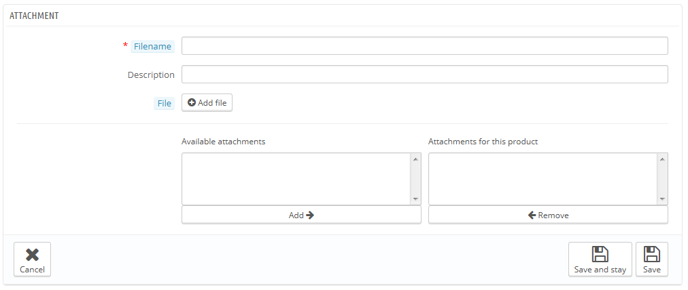

Zum Beispiel, sagen wir, Sie verkaufen Elektronikartikel, und Sie möchten Ihren Kunden eine Anleitung zur Funktion des Artikels zeigen.

Sie können ein Dokument zu diesem Zweck hochladen.

Sie können auch einfach nur ein PDF-Handbuch direkt zum Download direkt auf der Produktseite zur Verfügung stellen.

Hinzufügen eines Anhangs geht wirklich schnell:

1. Füllen Sie den Dateinamen Ihres Anhangs aus(es muss nicht der gleiche wie der ursprüngliche Dateiname sein).
2. Geben Sie ihm eine Beschreibung. Dies hilft Ihnen, Ihre hochgeladenen Dateien mit Sicherheit zu unterscheiden.
3. Klicken Sie auf "Datei hinzufügen", um eine Datei auf Ihrem Computer zum Hochladen auszuwählen. Sobald Sie die Datei auswählen, wird Sie in PrestaShop hochgeladen und in der Liste angezeigt.
4. Der Anhang erscheint in der Liste der Liste "Verfügbare Anhänge": Um Einen Anhang hinzuzufügen, klicken Sie auf die Schaltfläche "Hinzufügen", was sie auf die "Angehängte Dokumente für diese Artikel"-Liste verschiebt.
5. Speichern Sie Ihr Produkt entweder mit der Schaltfläche "Speichern" oder "Speichern und auf der Seite bleiben".

Nun erscheint der Button "Download" auf der Produktseite (wenn das Template die Funktion unterstützt) und Ihre Benutzer können die Datei (en), die Sie gerade hochgeladen haben, herunterladen.

Wenn Sie einen Anhang entfernen möchten, wählen Sie ihn in der "Angehängte Dokumente für diese Artikel" Liste und klicken Sie auf die Schaltfläche "Entfernen". Die Datei wird auf die "Verfügbare Anlagen" Liste verschoben, wenn Sie sie später noch einmal brauchen.

Sie können alle angehängten Dateien Ihres Shops anzeigen, hinzufügen und entfernen, indem Sie auf die "Anhänge" Seite im "Katalog"-Menü navigieren. Dies macht es auch möglich, die Anhänge zu benutzen, die Sie bereits für andere Artikel verwenden: wenn Sie eine Datei auf viele Produkte anwenden müssen, müssen Sie sie nur einmal hochladen.

### Lieferanten 

Die Angabe eines Lieferanten des Produkts ist nicht wirklich wichtig für Ihre Kunden (sehr viel weniger als die Hersteller in jedem Fall), aber es kann sich als ein wesentlicher Teil der eigenen internen Verwaltung, nicht zuletzt bei der Lagerverwaltung herausstellen: Sie müssen einfach wissen, von wem Sie das Produkt gekauft haben. Der Lieferant des aktuellen Produkts kann auf der Registerkarte "Lieferanten" auf der linken Seite eingestellt werden.

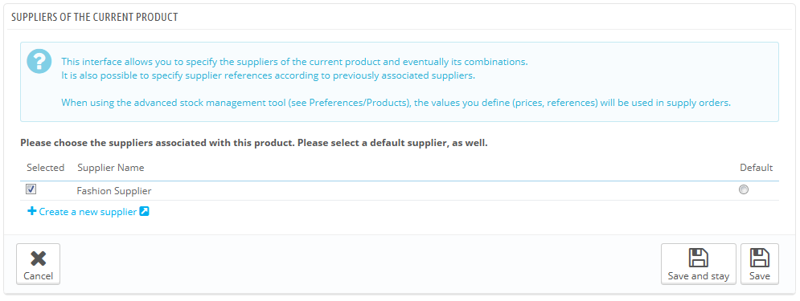

Sie können diese Funktion nicht nutzen, wenn Sie nicht bereits mindestens einen Lieferanten in Ihrem Shop erstellt haben. Die Lieferanten werden auf der "Lieferanten" Seite im "Katalog"-Menü erstellt.

Der Lieferanten-Erstellungsprozess wird im aktuellen Kapitel dieses Handbuchs erläutert.

Sie können direkt mit dem Button "Neuen Lieferanten erstellen" einen Lieferanten hinzufügen.

Verknüpfen des aktuellen Produkts mit einem oder mehreren Lieferanten ist wirklich einfach: klicken Sie einfach auf die Checkbox für den Lieferanten und speichern Sie die Änderungen.

Wird einem Artikel mehr als ein Lieferant zugeordnet, können Sie wählen, welcher der Standard sein sollte, indem Sie einen Radio-Button auf der rechten Seite anklicken.

Hinweis: Die "Standard" Optionsfelder sind standardmäßig nicht verfügbar sind. Um sie zu aktivieren, müssen Sie zuerst auf die Schaltfläche "Speichern und auf der Seite bleiben" klicken, um einen anderen Anbieter als Standard auszuwählen.

#### Produkt-Referenz (en) 

Die Produktlieferant Seite bietet auch eine Tabelle, in der Sie die genaue Referenz und den Stückpreis / Währung für jede Produktkombination festlegen können. Wenn der Artikel mehr als einen Lieferant zugewiesen hat, öffnet sich nur die Tabelle mit den Kombinationen, die mit dem ersten Lieferanten verbunden sind, wobei die anderen standardmäßig geschlossen werden. Klicken Sie auf den Namen eines Lieferanten, um seine Tabelle zu öffnen, womit die anderen sich schließen.

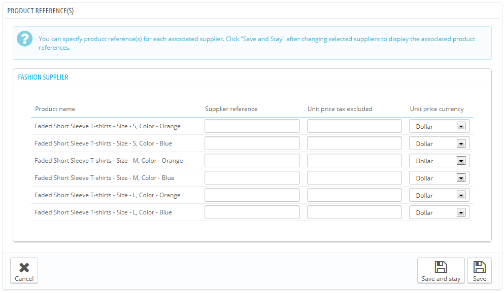

### Verwalten des Lagers(Fortgeschritten) 

Sobald Sie die erweiterte Lagerverwaltung-Option (in der "Artikel"-Voreinstellungsseite) aktiviert haben, wird die neue Registerkarte für alle Produkte zur Verfügung stehen, und hier können Sie angeben, in welchem Lager der aktuelle Artikel gelagert wurde.

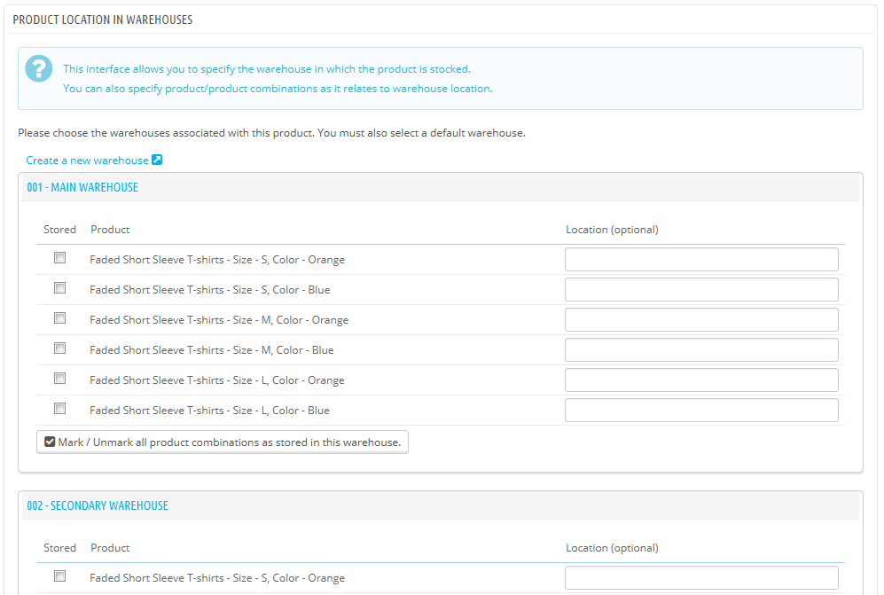

Sie können diese Funktion nicht nutzen, wenn Sie nicht bereits mindestens ein Warenlager in Ihrem Shop erstellt haben. Warenlager werden auf der "Lager"-Seite im "Lager"-Menü erstellt.

Der komplette Lagererstellungsprozess wird in einem anderen Kapitel dieses Handbuchs genauer erläutert:"Verwalten von Lagern".

Sie können eines erstellen, indem Sie auf die Schaltfläche "NEU" klicken.

Das Register "Warenlager" zeigt Ihnen eine Tabelle, die Ihnen ermöglicht, die genaue Position für jede Produktkombination (falls vorhanden) in jedem Warenlager zu finden. Wenn Sie mehr als ein Lager erstellt haben, zeigt die Tabelle nur die erste standardmäßig, wobei die anderen standardmäßig geschlossen sind. Klicken Sie auf einen Warenlager-Namen, um seine Untertabelle öffnen und die anderen zu schließen.

Für jedes Lager, können Sie einstellen, welche Kombination des aktuellen Artikels gespeichert ist, und ein Textfeld ermöglicht es Ihnen, genau anzugeben, wo es in diesem Lagerraum gelagert wird. Sie können alles in diesem Feld schreiben: "Aisle 5", "Neben den Radiohead Alben", "A07 E08 H14", oder etwas, das Ihnen oder Ihrem Verpackungsteam hilft, ein Produkt so schnell wie möglich zu finden.

## Erstellen von Artikel-Bündeln 

Vielleicht möchten Sie ein Paket von mehreren Artikeln verkaufen. Z.B.: ein Computer Start-up-Paket mit dem Computer selbst, einem Monitor und einem Drucker. PrestaShop macht es einfach für Sie, ein "Bundle"-Produkt zu erstellen und weitere Produkte hinzuzufügen, direkt aus dem Katalog zu einem Paket.

Bündel können Bestellungen sehr vereinfachen. Sie erlauben auch Kunden, die Vorteile von Sonderpreisen und Angeboten zu nutzen.

Sie können derzeit keine Variationen oder virtuelle Produkte einem Bündel hinzufügen.

Wenn Sie dennoch Bündel mit Varianten haben möchten, müssen Sie für jede Kombination einen eigenen Artikel erstellen. Dies ist eine bekannte Einschränkung, die in einer kommenden Version PrestaShop behoben wird.

Sie können einem neuen Bündel kein bestehendes Bündel hinzufügen oder importieren.

Das Verfahren, ein Bündel zu erstellen, ist ähnlich dem für die Erstellung eines normalen Produkts:

1. Navigieren Sie auf die Seite "Produkte", im Menü "Katalog".
2. Klicken Sie auf den "NEU" Button.
3. Von der "Information“- Registerkarte auf der linken Seite aus, ändern Sie den Produkttyp zu "Bündel vorhandener Artikel".

Eine neue Registerkarte erscheint auf der linken Seite, mit dem Titel "Artikel dieses Bundles". Dieser Abschnitt enthält ausschließlich zwei Textfelder und eine Schaltfläche:

* Das erste Feld wird verwendet, um nach Artikeln, die bereits in Ihrem Shop erstellt wurden, zu suchen.
* Das zweite Feld wird verwendet, um die Anzahl des ausgewählten Artikels festzulegen.
* Der Button fügt das den Artikel zum Bündel hinzu.

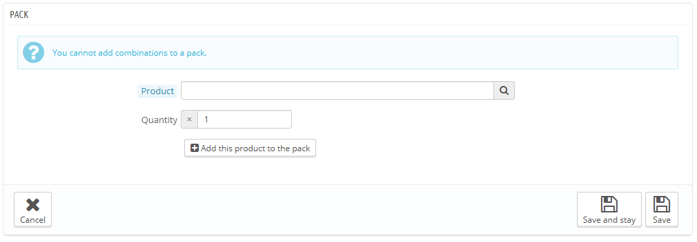

Sie können so viele Artikel bündeln, wie Sie möchten.

Sie können Artikel aus dem Bündel löschen, indem Sie einfach auf das Papierkorb-Symbol daneben klicken.

Sobald Sie den Abschnitt „Artikel dieses Bundles“ abgeschlossen haben, können Sie den Inhalt aller anderen verfügbaren Tabs bearbeiten, als wäre es ein ganz normaler Artikel.

## Erstellen eines virtuellen Artikels 

Ihr Shop kann (teilweise oder ausschließlich) aus virtuellen Produkten bestehen - also Produkte, die nicht versendet werden, sondern heruntergeladen werden (Tickets, e-Bücher / PDF-Dateien, usw.)

\
&#x20;Mit PrestaShop erstellen Sie virtuelle Artikel ganz einfach.

Das Verfahren hierzu ist ähnlich dem der Erstellung eines einfachen Artikels:

* Navigieren Sie auf die Seite "Produkte", im Menü "Katalog".
* Klicken Sie auf den "NEU"-Button.
* Vom "Information"-Tab aus, ändern Sie den Produkttyp auf "Virtueller Artikel".

Die Registerkarten auf der linken Seite ändern sich:

* Nun erscheint links der „Virtueller Artikel“-Tab, „Versand“ verschwindet.\
  \

Der neue Tab verfügt über nur eine Option: sie fragt, ob der virtuelle Artikel, den Sie erstellen, mit einer Datei verknüpft ist(d.h. Ihr Kunde zahlt, um etwas herunterladen).

* Wenn Sie eine Dienstleistung verkaufen, schalten Sie auf „Nein“ und nichts muss heruntergeladen werden.
* Wenn Sie etwas zum Download anbieten, klicken Sie auf die Option "Ja".

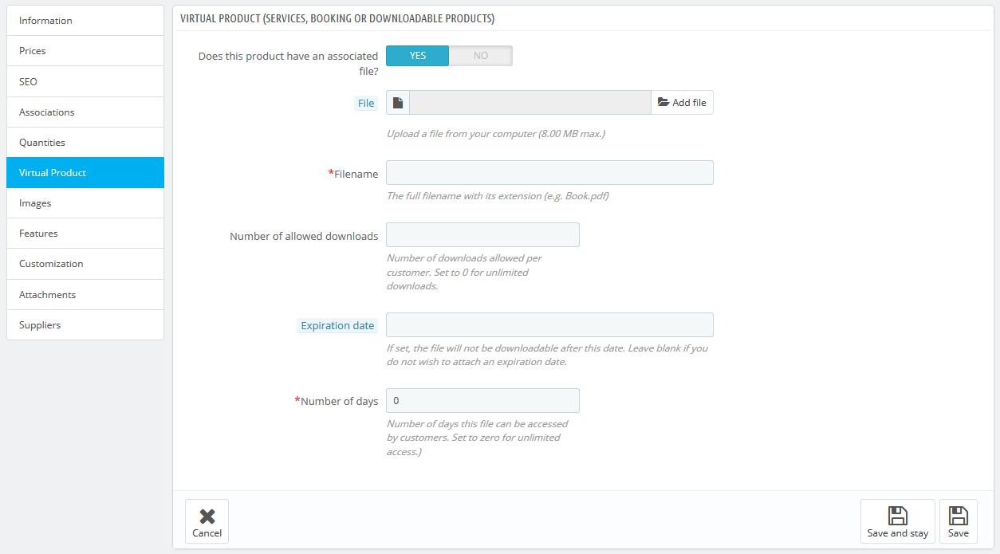

Wenn Sie "Ja" anklicken, öffnet sich in PrestaShop ein neues Formular darunter, durch das Sie die Datei auswählen können:

* **Dateiname**. Der Name der Datei. Dieses Feld wird automatisch ausgefüllt, nachdem die Datei hochgeladen wurde. Es wird nicht empfohlen, sie auf einen anderen Wert ändern.
*   **Datei**. Klicken Sie auf die Schaltfläche "Datei hinzufügen", um nach einer Datei auf Ihrer Festplatte zu suchen. Sobald Sie eine Datei ausgewählt haben, beginnt der Upload.

    Die maximale Datei-Upload-Größe hängt von den Einstellungen Ihres Servers ab und kann nicht von PrestaShop erhöht werden.

    Wenn Sie Zugriff auf die Datei php.ini Ihres Servers haben, sind das die Werte, die Sie ändern sollten:

    * `upload_max_filesize = 20M`
    * `post_max_size = 20M`

    Wenn Sie keinen Zugriff auf die php.ini-Datei haben, erhalten Sie ihn von Ihrem Web-Host.

    Sie sollten die Dateien im ZIP-Format komprimieren, um den Komplikationen mit dem Browser zu vermeiden.

    Wenn Sie ein hochauflösendes Bild verkaufen, können Sie es natürlich noch als Thumbnail unter „Bilder“ hinzufügen.
* &#x20;**Anzahl der erlaubten Downloads**. Sie können bestimmen, wie oft die Datei heruntergeladen werden darf, wenn der Kunde sie gekauft hat. Sie könnten diesen Wert auf 1 oder 5 begrenzen, wenn Sie unbegrenzte Downloads wollen, setzen Sie das Textfeld auf 0.
* **Verfallsdatum**. Bei Eingabe eines Datums wird die Datei ab diesem Datum nicht mehr downloadbar sein. Lassen Sie das Feld frei, wenn Sie kein Ablaufdatum wollen.
* **Anzahl Tage**. Anzahl der Tage, an denen ein Datei-Download für Kundenmöglich ist (0 für unbegrenzt).

Sobald Sie mit dem Tab "Virtueller Artikel" fertig sind, können Sie alle anderen Tabs bearbeiten, als wäre es ein normaler Artikel.
