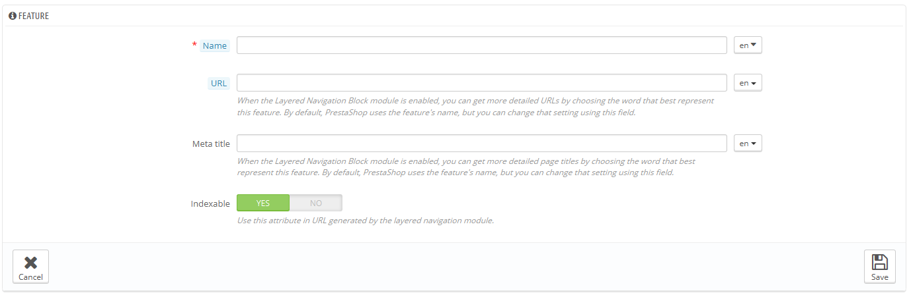

# Artikeleigenschaften

Eigenschaften zeigen die Charakteristik eines Artikels: sie sind die gleichen in allen Produktvarianten.

Eigenschaften sind mit Varianten zu vergleichen, nur, dass ein Produkt nicht mit unterschiedlichen Eigenschaften variiert werden kann, nur mit Varianten.

Der Unterschied zwischen einer Variation und einer Eigenschaft hängt von dem Artikel selbst ab. Einige Artikel könnten die gleiche Eigenschaft und verschiedene Varianten besitzen, wobei die Eigenschaft unveränderlich ist.

Zum Beispiel kann ein Kunde mehrere iPod-Varianten (z.B. variable Farbe, Plattenspeicher) kaufen, aber nicht zwischen Eigenschaften (Gewicht, Größe) unterscheiden.

Ebenso könnte ein weiterer Shop T-Shirt-Varianten (wie Farbe, Größe, Geschlecht) verkaufen, aber nicht basierend auf Eigenschaften(Gewicht).

Eigenschaften werden Artikeln auf einer Pro-Artikel-Basis im Menü "Artikel" hinzugefügt, sie müssen jedoch zuerst auf der "Artikeleigenschaften" Seite unter "Katalog" erstellt werden.

Sie können die Reihenfolge der Eigenschaften durch die Spalte „Position“ neu ordnen.

Durch die rechten Buttons können Sie Artikeleigenschaften bearbeiten, löschen und ansehen. Um die Werte für eine bestimmte Eigenschaft anzuzeigen, klicken Sie auf Anzeigen. Von dort aus können Sie Werte sortieren, bearbeiten und löschen, wenn nötig.

## Hinzufügen einer Eigenschaft 

Klicken Sie auf "NEU". Es erscheint ein sehr schlichtes Formular. Hier benennen Sie die Eigenschaft selbst: zum Beispiel Arten von Kopfhörern, die mit einem Musik-Player verkauft werden.

Geben Sie der Eigenschaft einen neuen Namen und speichern sie, um zur Liste zurückzukehren

Drei weitere Optionen stehen zur Verfügung, wenn Sie das „Layered Navigation Blockmodul“ verwenden. Damit kann man für jede Produkteigenschaft einen konkreten Link setzen. Auf diese Weise sind nicht nur Kunden in der Lage, einen konkreten Link an einen Freund zu schicken, sondern verbessert auch Ihre Suchmaschinen-Platzierung. Das Blockmodul nutzt dies.

* **URL**. Das Wort, das in der URL verwendet werden soll. Standardmäßig verwendet PrestaShop öffentlichen Namen der Eigenschaft.
* **Meta-Titel**. Dieses Wort wird im Seitentitel verwendet. Standardmäßig verwendet PrestaShop den öffentlichen Namen der Eigenschaft.
* **Indizierbar**. Sagt aus, ob Suchmaschinen die Eigenschaft indizieren sollen.

Der Kunde kann die URL einfach durch einen Klick auf eine Eigenschaft erhalten: die URL ändert sich passend zu den Eigenschaften, zum Beispiel # / Farbe-Metall oder # / disk\_space-16GB / Farbe-Grün.

## Hinzufügen eines Wertes zu einer Eigenschaft 

Klicken Sie auf "Neue Eigenschaftswerte hinzufügen". Ein neues Formular öffnet sich.

Das Formular ausfüllen:

* **Eigenschaft**. Wählen Sie die gewählte Eigenschaft aus der Dropdown-Liste aus.
* **Wert**. Geben Sie einen Wert für die Eigenschaft ein, z.B. "£ 5", "27 cm", usw.

... und speichern Sie Ihren Eigenschaftswert. Sie können gleich mehrere Werte für die gleiche Eigenschaft hinzufügen, indem Sie die Änderungen mit der Schaltfläche "Speichern hinzufügen" speichern.

Zwei weitere Optionen stehen zur Verfügung, wenn Sie das „Layered Navigation Blockmodul“ verwenden. Damit kann man für jede Produkteigenschaft einen konkreten Link setzen. Auf diese Weise sind nicht nur Kunden in der Lage, einen konkreten Link an einen Freund zu schicken, sondern verbessert auch Ihre Suchmaschinen-Platzierung. Das Blockmodul nutzt dies.

* **URL**. Das Wort, das in der URL verwendet werden soll. Standardmäßig verwendet PrestaShop öffentlichen Namen des Attributs.
* **Meta-Titel**. Dieses Wort wird im Seitentitel verwendet. Standardmäßig verwendet PrestaShop den öffentlichen Namen der Eigenschaft.

Der Kunde kann die URL einfach durch einen Klick auf eine Eigenschaft erhalten: die URL ändert sich passend zu den Eigenschaften, zum Beispiel # / Farbe-Metall oder # / disk\_space-16GB / Farbe-Grün.
