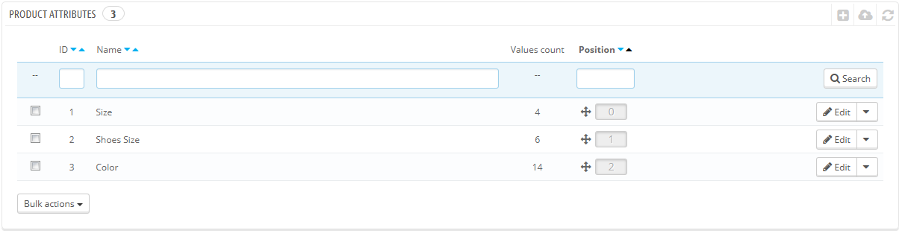
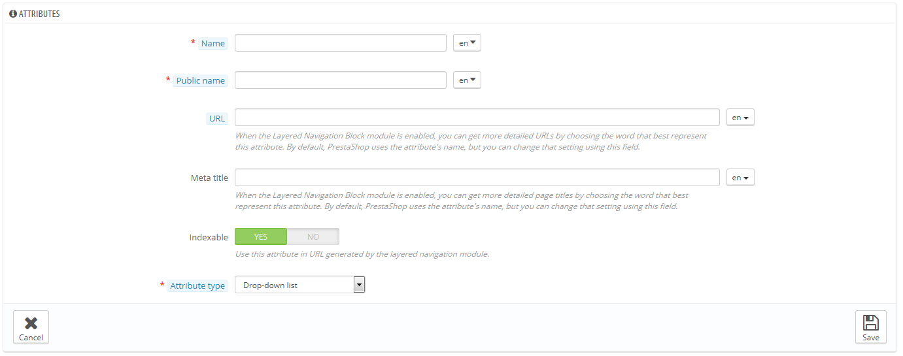
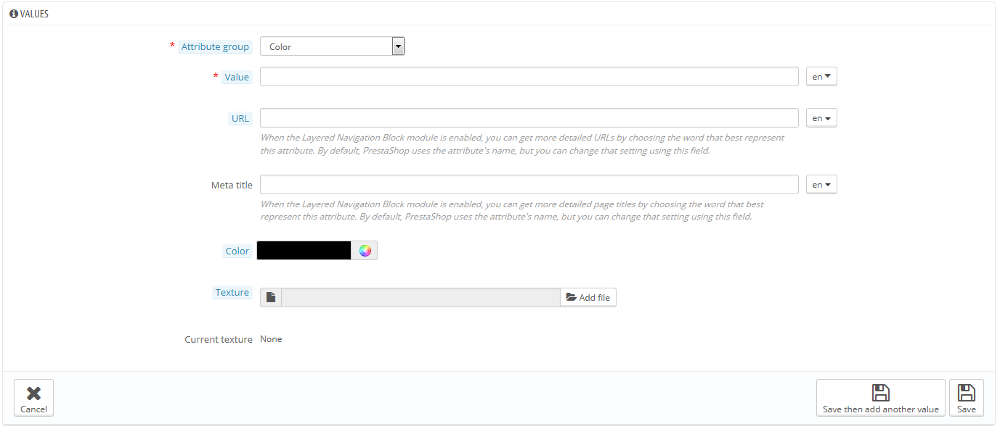

# Artikelvarianten

Varianten sind die Basis von Kombinationen (oder "Varianten" in PrestaShop genannt): Sie können nur Varianten eines Artikels erstellen, wenn sich mindestens eine seiner Eigenschaften ändern kann.\
Sie können sich Varianten als Artikeleigenschaften vorstellen, die sich ändern, aber keinen Einfluss auf den Artikelnamen haben: Farbe, Kapazität, Größe, Gewicht, etc. Es lässt sich alles ändern, was verschiedene Versionen von Artikeln unterscheidet, bis auf den Preis.

Der Unterschied zwischen einer Variante und einer Eigenschaft hängt von dem Artikel selbst ab. Einige Artikel könnten die gleiche Eigenschaft teilen, eine als Variante, eine andere als unveränderlicher Wert.

Zum Beispiel kann ein Kunde einen iPod basierend auf einer Variante kaufen (Farbe, Speicherplatz), aber nicht basierend auf Eigenschaften (Gewicht, Größe).

Ebenso könnte ein weiterer Shop T-Shirts basierend auf Varianten(Farbe, Größe, Geschlecht), aber nicht basierend auf Eigenschaften (Gewicht) verkaufen.

Varianten werden auf der Seite "Artikel" im Menü "Katalog" auf einer pro-Artikel-Basis konfiguriert, müssen aber zuerst unter „Artikelvarianten“ im Menü "Katalog" erstellt werden.

Diese Seite zeigt eine Liste aller derzeit vorhandenen Varianten. Sie können jedes mit den Buttons auf der rechten Seite der Tabelle bearbeiten oder löschen, oder ihre Werte anzeigen, indem Sie auf "Anzeigen" klicken, was eine neue Tabelle öffnet.

Durch Klicken auf die Pfeilsymbole oder per Drag-and-Drop kann die Reihenfolge der Darstellung im Front-Office festgelegt werden, wenn der Mauszeiger über der Spalte „Position“ steht.

## Erstellen einer Variante 

Klicken Sie auf "Neue Variante hinzufügen", um eine neue Variante zu erstellen. Es öffnet sich eine neue Seite.

Füllen Sie das Formular aus:

* **Name**. Die genaue Beschreibung der Variante. Diese sollte so kurz und präzise wie möglich sein, um nicht mit einer anderen Variante verwechselt zu werden.
* **Angezeigter Name**. Dieser Name wird dem Kunden auf den Artikelseiten gezeigt. Da einige Varianten vielleicht den gleichen Namen für sich unterscheidende Eigenschaften haben, können Sie in diesem Feld einen anderen öffentlichen Namen eintragen, damit  der Kunde die Variante im richtigen Kontext unterscheiden kann, Sie die Varianten aber immer noch mit dem oben eingetragenen Namen verwalten können.
* **Anzeigen als**. Legt fest, ob die Varianten als Dropdown-Liste, mit Optionsfeldern oder mit einer Farbauswahl auf der Front-Office-Artikelseite dargestellt werden sollen.

Drei weitere Optionen stehen zur Verfügung, wenn das Modul „Block Facettennavigation“ aktiviert ist. Sie sind nicht streng an die Facettennavigation gebunden: sie geben einen direkten Link zu jeder Artikelvariante. Auf diese Weise ist nicht nur der Kunde in der Lage, einen spezifischen Link an einen Freund zu schicken, die spezifischen Links erreichen auch ein höheres Ranking in Suchmaschinen.

* **URL**. Das Wort, das in der URL verwendet werden soll. Standardmäßig verwendet PrestaShop den öffentlichen Namen der Variante.
* **Meta-Titel**. Das Wort, das im Titel der Seite verwendet wird. Standardmäßig verwendet PrestaShop den öffentlichen Namen der Variante.
* **Indizierbar**. Legt fest, ob Suchmaschinen diese Variante indizieren sollen.

Der Kunde kann die URL erhalten, wenn er auf der Artikelseite einfach die Variante ändert: die URL ändert sich um ein Detail, zum Beispiel `#/color-metal or #/disk_space-16gb/color-green`.

Das Modul „Block Facettennavigation“ nutzt diese Einträge, daher auch die Beschreibungstexte "Bei aktivierter Facettennavigation erhalten Sie eine aussagefähigere URL" und "Verwenden Sie in der URL diese vom Modul Facetten-Navigation generierte Variante".

Speichern Sie die neue Variante, um zur Liste zurückzukehren. Sie können der Variante jetzt Werte hinzufügen.

## Einen neuen Wert erstellen 

Klicken Sie auf "neuen Wert hinzufügen". Eine neue Seite erscheint.

Füllen Sie das Formular aus:

* **Variantengruppen**. Wählen Sie die Variante aus der Dropdown-Liste.
* **Wert**. Geben Sie der Variante einen Wert: z.B. "Rot", "16 Gb", "1.21 gigawatts" ...

Die nächsten Felder werden nur angezeigt, wenn die Variante ein Farbtyp ist.

* **Farbe**. Wenn das Attribut eine Farbe ist, kann ihr Wert in HTML-Farbcode (das heißt z.B. "# 79ff52") angegeben werden, oder Sie verwenden die Farbauswahl, um genau den richtigen Farbton auszuwählen.
* **Muster**. Wenn der Artikel keine einzelne Farbe verwendet, sondern eine Textur(z.B. Tigerstreifen), kann eine kleine Bilddatei hochgeladen werden, die auf der Artikelseite angezeigt wird. Beachten Sie, dass diese die HTML-Farbe ersetzt. Klicken Sie auf die Schaltfläche "Speichern", um den Upload zu starten.\
  Sie können diese Option auch wählen, damit der Kunde zwischen verschiedenen Bildern des Artikels mit unterschiedlichen Farben auswählen kann. Wie dies im Front-End angezeigt wird, hängt von dem verwendeten Template ab.
* **Aktuelles Muster**. Sobald eine Muster-Datei hochgeladen wurde, wird Sie in diesem Abschnitt als Erinnerung angezeigt.

Sie können der gleichen Variante mehrere Werte hinzufügen, wenn Sie auf „Speichern und Hinzufügen“ klicken.

Zwei weitere Optionen stehen zur Verfügung, wenn das Modul „Block Facettennavigation“ aktiviert ist. Sie sind nicht streng an die Facettennavigation gebunden: sie geben einen direkten Link zu jeder Artikelvariante. Auf diese Weise ist nicht nur der Kunde in der Lage, einen spezifischen Link an einen Freund zu schicken, die spezifischen Links erreichen auch ein höheres Ranking in Suchmaschinen.

* **URL**. Das Wort, das in der URL verwendet werden soll. Standardmäßig verwendet PrestaShop den öffentlichen Namen der Variante.
* **Meta-Titel**. Das Wort, das im Titel der Seite verwendet wird. Standardmäßig verwendet PrestaShop den öffentlichen Namen der Variante.

Der Kunde kann die URL erhalten, wenn er auf der Artikelseite einfach die Variante ändert: die URL ändert sich um ein Detail, zum Beispiel `#/color-metal or #/disk_space-16gb/color-green`.

Das Modul „Block Facettennavigation“ nutzt diese Einträge, daher auch die Beschreibungstexte zur Facettennavigation.

Sobald Ihre Varianten erstellt und ihnen Werte hinzugefügt wurden, können Sie für jeden Artikel auf der Seite „Artikel“ im Menü „Katalog“ Varianten hinzufügen.
