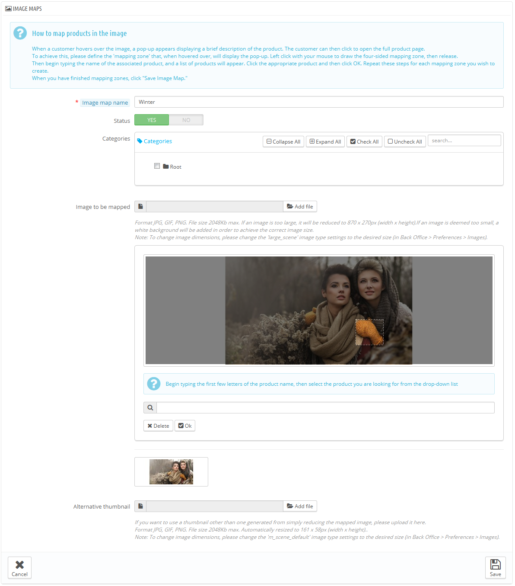

# Bildserien

„Bildserien“ war eine Funktion, die mit der Version 1.1 von PrestaShop eingeführt wurde und bis einschließlich der Version 1.5 verfügbar war.\
**Neue Installationen von PrestaShop 1.6 können diese Funktion nicht mehr nutzen, Versionen, die auf 1.6 aktualisiert wurden, können sie jedoch noch nutzen.**

Wenn Sie eine neue Installation von PrestaShop 1.6 haben, aber trotzdem Bildserien verwenden möchten, gehen Sie wie folgt:

1. Öffnen Sie Verwaltung> Menüpunkte.
2. Klicken Sie auf "Menü hinzufügen"
3. Tragen Sie im Formular einen Namen ein(z.B. "Bildserien“) und tragen Sie bei „Klasse“ „AdminScenes“ ein. Lassen Sie das Feld "Modul" leer und wählen den "Katalog" als übergeordnete Seite.
4. Speichern Sie das Formular. Die Bildserien-Seite steht nun im Menü „Katalog“ zur Verfügung.

**Beachten Sie, dass diese Funktion veraltet ist und kein Support mehr dafür besteht.**

Bildserien sind das Zuordnen von mehreren anklickbaren Zonen auf einem Bild, so können verschiedene Artikelseiten durch einen Klick auf ein einzelnes Bild geöffnet werden. Diese Funktion erleichtert die Navigation für Kunden stark.

Bevor Sie eine Bildserie erstellen, müssen Sie ein Bild haben, das verschiedene Varianten eines Artikels enthält, oder generell verschiedene Artikel.

Ein Klick auf "Bildserien" im Menü „Katalog“ führt zu einer neuen Seite, die die derzeit vorhandenen Bildserien enthält, falls bereits vorhanden.

Um eine neue Bildserie zu erstellen, klicken Sie auf "Neue Bildserie hinzufügen". So gelangen Sie zum Erstellungsformular.

* **Name der Bildserie**. Geben Sie einen Namen für die Bildserie an.
* **Status**. Legt fest, ob das Bild angesehen werden kann oder nicht. Sie können „nein“ wählen, um das Bild erst zur Verfügung zu stellen, wenn alle Links und Einstellungen dazu eingesetzt bzw. durchgeführt wurden.
* **Bildauswahl**. Wählen Sie das Bild, für das Sie eine Bildserie erstellen möchten und klicken Sie dann auf "Speichern und auf der Seite bleiben". Die Seite wird dann neu geladen, mit dem Foto, das Sie hochgeladen haben, und viele weitere Optionen.

Nun lernen Sie, wie man eine Bildserie einrichtet. Klicken Sie irgendwo auf dem Bild und ziehen Sie mit der Maus über einen der Artikel, um die Stelle zu markieren / auszuschneiden, die für den Benutzer anklickbar sein soll.

Ihre Auswahl wird klar und hell sein, während der Rest des Bildes dunkler wird. Achten Sie sorgfältig darauf, die Zone richtig auszuwählen, auf die Kunden klicken können.

Sobald dies geschehen ist:

1. geben Sie im Feld unterhalb des Bildes die ersten Buchstaben des Artikels ein, der der ausgewählten Zone zugeordnet werden soll.In diesem Beispiel würden wir "Kleid" eingeben und mehrere Möglichkeiten erschienen. Wir würden dann "Printed Dress" wählen.
2. Bestätigen Sie die Auswahl mit "OK". Die Bildserie wird nun erstellt.

Wiederholen Sie diesen Vorgang für alle Artikel auf diesem Bild, für die Sie einen Link erstellen möchten.

Die anklickbaren Zonen sind mit dem Symbol „+“ sichtbar gemacht. Bewegen der Maus über das Bild mit dem Mauszeiger öffnet ein kleines Fenster, das den Namen des Artikels zeigt, das Artikelbild, eine kurze Beschreibung und den Preis.

Wenn Sie einen Fehler bei der Auswahl der klickbaren Zone gemacht haben, können Sie dies durch Anklicken der Ecken und Kanten korrigieren.

Wenn Sie einen klickbaren Bereich löschen möchten, wählen Sie einfach den Bereich aus und klicken Sie auf die Schaltfläche "Löschen" im Bild.

Schließlich muss die Bildserie einer Kategorie zugeordnet werden. Dies wird durch die Kontrollkästchen des Abschnitts "Kategorien" durchgeführt.

Klicken Sie auf „Speichern“, sobald Sie alle Änderungen vorgenommen haben.

Die Bildserie ist nun gespeichert und steht in den gewählten Kategorien zur Verfügung.
