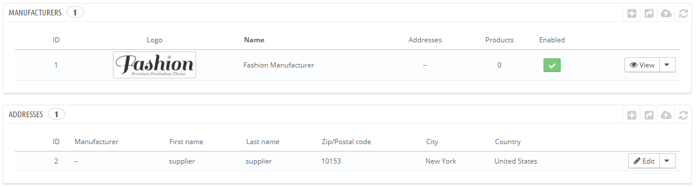
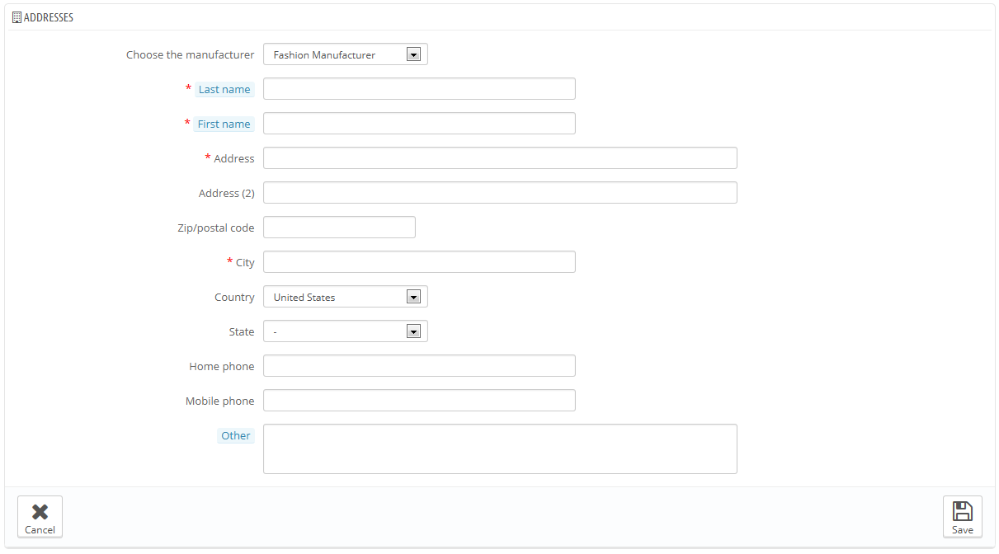

# Hersteller

Sofern Sie Ihre Artikel nicht selbst herstellen, sollten Sie immer den Hersteller in PrestaShop hinzufügen.

In PrestaShop ist ein Hersteller die Marke hinter einem Artikel. Wenn Sie Ihre eigenen Artikel verkaufen, müssen Sie wenigstens ihr eigenes Unternehmen als Hersteller eintragen: dies hilft Ihren Kunden zu finden, was sie suchen und kann bei einigen Suchmaschine Punkten.

Am Front-End Ihres Shops sind die Hersteller alphabetisch geordnet. Sie können diese Reihenfolge nicht ändern.

Neue Hersteller sind automatisch deaktiviert. Sie müssen sie aktivieren, damit sie online sichtbar sind – auch, wenn ihnen noch keine Artikel zugeordnet sind.

Durch die Eingabe von Informationen über die Hersteller haben die Besucher Ihres Shops schnellen Zugriff auf alle Artikel eines bestimmten Herstellers. Dies macht das Navigieren rund um Ihren Shop einfacher für sie. Dies erhöht auch Ihre Sichtbarkeit für Suchmaschinen.

## Erstellen eines Herstellers 

Klicken Sie auf "NEU" und Sie gelangen zu einem neuen Formular.

Füllen Sie alle Felder aus:

* **Name**. Geben Sie den Namen des Herstellers an, um Suchanfragen Ihrer Kunden zu vereinfachen.
* **Kurzbeschreibung**. Die Beschreibung, die in den Suchmaschinen erscheint, wenn ein Benutzer danach sucht. Begrenzt auf 100 Zeichen.
* **Beschreibung**. Fügen Sie eine komplexere Beschreibung Ihres Hersteller und seiner Produkte ein. Sie können detailliert die Qualität ihrer Artikel anpreisen. Die Beschreibung des Herstellers wird in Ihrem Shop angezeigt.
* **Logo**. Ein Hersteller-Logo ist von wesentlicher Bedeutung: Es bringt Kunden dazu, das Vertrauen in die Marke mit ihrem Shop zu verbinden.
* Die SEO-Felder (Titel, Meta-Beschreibung und Meta-Suchworte) bieten die gleiche Funktionalität, wie sie in den anderen Kategorien zu tun.\

  * **Meta-Titel**. Der Titel, der in den Suchmaschinen angezeigt wird, wenn eine Anfrage von einem Benutzer gesendet wird.
  * **Meta-Beschreibung**. Eine Präsentation Ihres Shops in nur wenigen Zeilen, um das Interesse des Kunden zu erfassen. Dies wird in den Suchergebnissen angezeigt.
  * **Meta-Suchwörter**. Suchworte, die Sie benötigen, damit Ihre Website von Suchmaschinen referenziert wird. Sie können mehrere Suchworte durch Komma getrennt schreiben oder Ausdrücke, die in Anführungszeichen stehen müssen, eingeben.
* **Aktivieren**. Sie können einen Hersteller deaktivieren, wenn auch nur vorübergehend. Dies hat nur auf die Liste der Hersteller im Front-End Ihres Shops Einfluss.

Speichern Sie Ihre Änderungen, um zurück zur Liste Herstellerliste zu kommen. Von dort aus können Sie:

* Auf den Namen oder das Logo eines Herstellers klicken, daraufhin erhalten Sie eine Liste aller Produkte, die damit verbunden sind. Wenn es keine gibt, können Sie Artikel damit verbinden, indem Sie die Artikel durch „Katalog“>“Artikel“ unter Kategorie/Zubehör bearbeiten.\
  &#x20;Das gleiche Ergebnis wird durch Klicken auf das Symbol "Anzeigen" auf der rechten Seite erreicht.
* Hersteller Deaktivieren, indem Sie auf den grünen Haken klicken. Sobald deaktiviert, erscheint ein rotes Kreuz: Klicken Sie, um ihn wieder zu aktivieren.
* Bearbeiten / Löschen der Hersteller funktioniert mit den entsprechenden Buttons auf der rechten Seite.

## Hinzufügen einer Herstelleradresse 

An der Unterseite der "Hersteller"-Seite ist ein Abschnitt, genannt "Adressen". Die Adresse jedes Herstellers kann hier hinzugefügt werden. Dies dient vor allem als Erinnerung für sich selbst: Auf diese Weise haben Sie immer die Kontaktadresse für einen Hersteller direkt in PrestaShop.

Klicken Sie auf den Button "NEU", um das Formular zur Erstellung zu öffnen.

Stellen Sie sicher, dass Sie den richtigen Hersteller gewählt haben, und füllen Sie so viele Felder wie möglich aus.
