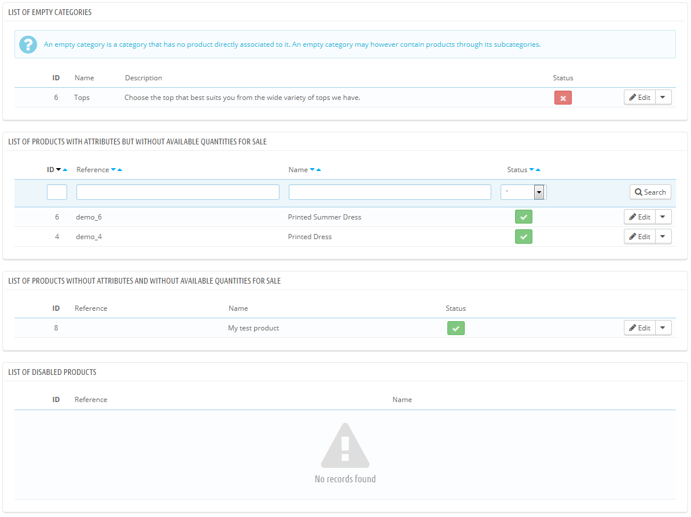

# Kontrollübersicht

Die Kontrollübersicht listet die Abschnitte Ihres Shops auf, die Ihre größte Aufmerksamkeit beanspruchen, um Ihren Shop am effizientesten zu verwalten, und sicherzustellen, dass nichts außer Kontrolle gerät.

Die Seite besteht aus vier Abschnitten:

* **Liste der leeren Kategorien**. Enthält Kategorien, die keine Artikel haben. Sie sollten diese Kategorien entweder löschen oder mit mindestens einem Artikel füllen. Dies verhindert, dass sich Kunden in einem leeren Bereich Ihres Shops wiederfinden.
* **Liste der Artikel mit Varianten, die nicht am Lager sind**.  Listet Artikel, die nicht auf Lager sind. Wenn Sie keinen Grund sehen, wieso bestimmte Artikel hier stehen, reaktivieren Sie sie einfach wieder.
* **Liste der Artikel ohne Varianten, die nicht am Lager sind**. Selbe Funktion wie der Teil darüber, nur mit Artikeln, die keine Varianten besitzen.
* **Liste der deaktivierten Artikel**. Zeigt Ihnen die Produkte, die im Shop deaktiviert wurden und nicht sichtbar für Ihre Kunden ist. Vielleicht erwägen Sie, Lagerbestände für diese Artikel aufzustocken, oder Sie löschen sie einfach.

Die "Kontrollübersicht"-Seite sollte regelmäßig überprüft werden, um ihr Management zu verbessern.
