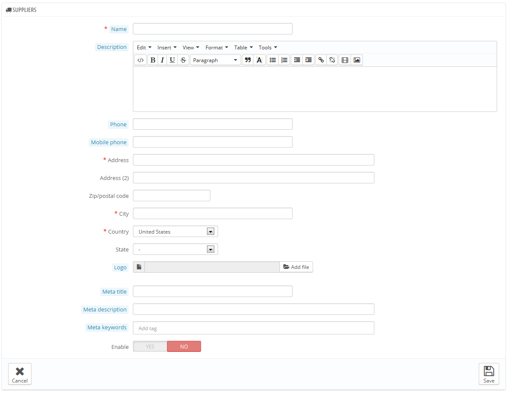

# Lieferanten

Das Hinzufügen von Lieferanten ist optional, wenn Sie bereits über Hersteller verfügen, die Sie direkt beliefern. Es hängt alles von Ihren Bedürfnissen ab, wenn Sie ihr Lieferant jedoch nicht der Hersteller ist, sollten Sie sicherstellen, dass dieser in Ihrem System erstellt und jedem Artikel zugeordnet wurde.

In PrestaShop ist ein Lieferant das Unternehmen, das Ihnen ein Produkt zur Verfügung stellt.

Auch wenn Sie Ihre eigenen Produkte verkaufen, müssen Sie zumindest Ihr Unternehmen als Lieferant erstellen.

Ebenso wie bei den Herstellern haben die Besucher Ihrer Website schnellen Zugriff auf alle Produkte des Zulieferers. Dies macht das Navigieren rund um Ihre Website einfacher für sie. Bezogen auf die Sichtbarkeit sollten Sie alle Felder ausfüllen, um Ihre Position in Suchmaschinen zu verbessern.

Klicken Sie auf "NEU" um das Erstellungsformular anzuzeigen.

Füllen Sie alle Felder aus:

* **Name**. Indicate the name of the supplier in order to simplify your visitor's searches.
* **Beschreibung**. Fügen Sie eine komplexere Beschreibung Ihres Lieferanten, seiner Aktivität und anderer Artikel ein. Die Lieferanten-Beschreibung wird in Ihrem Shop angezeigt.
* Die Adressfelder (Telefon, Adresse, Postleitzahl, Ort, Bundesland und Land). Das Feld "Status" erscheint nur bei entsprechenden Ländern.
* **Logo**. Ein Lieferanten-Logo ist von wesentlicher Bedeutung: Es bringt Kunden dazu, das Vertrauen in die Marke mit ihrem Shop zu verbinden.
* Die SEO-Felder (Titel, Meta-Beschreibung und Meta-Suchworte) bieten die gleiche Funktionalität, wie sie in den anderen Kategorien zu tun.\

  * **Meta-Titel**. Der Titel, der in den Suchmaschinen angezeigt wird, wenn eine Anfrage von einem Benutzer gesendet wird
  * **Meta-Beschreibung**. Eine Präsentation Ihres Shops in nur wenigen Zeilen, um das Interesse des Kunden zu erfassen. Dies wird in den Suchergebnissen angezeigt.
  * **Meta-Suchwörter**. Suchworte, die Sie benötigen, damit Ihre Website von Suchmaschinen referenziert wird. Sie können mehrere Suchworte durch Komma getrennt schreiben oder Ausdrücke, die in Anführungszeichen stehen müssen, eingeben.
* **Aktivieren**. Sie können einen Hersteller deaktivieren, wenn auch nur vorübergehend. Dies hat nur auf die Liste der Hersteller im Front-End Ihres Shops Einfluss.

Speichern Sie Ihre Änderungen, um zurück zur Liste Lieferantenliste zu kommen. Von dort aus können Sie:

* Auf den Namen oder das Logo eines Lieferanten klicken, daraufhin erhalten Sie eine Liste aller Produkte, die damit verbunden sind. Wenn es keine gibt, können Sie Artikel damit verbinden, indem Sie die Artikel durch „Katalog“>“Artikel“ unter Kategorie/Zubehör bearbeiten.\
  &#x20;Das gleiche Ergebnis wird durch Klicken auf das Symbol "Anzeigen" auf der rechten Seite erreicht.
* Lieferanten Deaktivieren, indem Sie auf den grünen Haken klicken. Sobald deaktiviert, erscheint ein rotes Kreuz: Klicken Sie, um ihn wieder zu aktivieren.
* Bearbeiten / Löschen der Lieferanten funktioniert mit den entsprechenden Buttons auf der rechten Seite.
