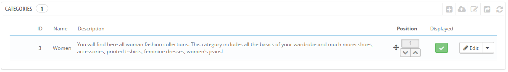

# Verwaltung der Kategorien

Kategorien sind wichtig, da sie ähnliche Artikel zusammenfassen. Dies hilft Kunden besser durch die Vielzahl ihrer Artikel zu navigieren und gezielter zu suchen. Kategorien helfen ihren Kunden auch dabei, Artikel zu vergleichen (durch die PrestaShop Artikel-Vergleichsfunktion).

Sie sollten eine neue Kategorie erstellen, wenn Sie mindestens zwei Artikel mit gleichen Eigenschaften besitzen. Produkte einer Kategorie sollten vergleichbar sein, wenn nicht sogar austauschbar. Halten Sie diesen Gedanken im Hinterkopf, wenn sie neue Artikel und Kategorien anlegen.

Sie könnten nur eine Kategorie erstellen, und alle Artikel würden in einer einzigen globalen Kategorie "Home" zusammengefasst. Aber dann wären Kunden nicht in der Lage, Artikel zu vergleichen.

Sie könnten sich auch entscheiden, Vergleiche nicht zu nutzen und Kategorien frei erstellen. In diesem Fall sollten Sie die Vergleichsfunktion deaktivieren: Navigieren Sie zur Artikel-Voreinstellungsseite und setzen Sie 0 im Feld „Artikelvergleich“.

Bei der Erstellung einer Artikelkategorie sollten Sie sich auf eine Sache konzentrieren: die Produkte dieser Kategorie müssen durch ihre Eigenschaften (nicht ihre Varianten) vergleichbar sein. Dies ist nicht nur für Ihre Kunden gut, es ist darüber hinaus wichtig für die PrestaShop Artikel-Vergleichsfunktion.

Kategorien werden auf der "Kategorien" -Seite des "Katalog"-Menüs verwaltet. Auf dieser Seite finden Sie eine Tabelle mit den derzeit vorhandenen Kategorien und deren wichtigsten Informationen.\
Um Untergruppen anzuzeigen, klicken Sie auf die übergeordnete Kategorie oder wählen Sie "Anzeigen".



Über das Symbol in der "Anzeigen"-Spalte der Tabelle können Sie Kategorien, die nicht für Kunden angezeigt werden sollen, verstecken, indem Sie auf das grüne Häkchen-Symbol klicken, so ändert es sich in ein rotes "X" -Zeichen.

Alle Kategorien sind eigentlich Unterkategorien der Kategorie "Home".\
Um die Kategorie "Home" (oder die ausgewählten Kategorie) zu bearbeiten, klicken Sie auf die Schaltfläche "Bearbeiten" in der Symbolleiste.

Um eine neue Kategorie (oder eine Unterkategorie einer bestehenden Kategorie) zu erstellen, klicken Sie auf den "NEU" Button.


Übersetzen Sie Ihre Kategorien!

Achten Sie darauf, jedes Feld in jeder Sprache, die Ihr Shop unterstützt, zu übersetzen. Um das zu tun, klicken Sie auf den Sprachbutton neben dem Feld, und wählen Sie die Sprache, in der Sie den Text bearbeiten möchten.

Zunächst müssen Sie eine Reihe von allgemeinen Informationen eingeben:

* **Name**. Geben Sie Ihrer Kategorie einen Namen. Am besten sehr kurz und deskriptiv, und wählen Sie Ihre Worte mit Bedacht: Ihre Kunden werden sich beim Navigieren in Ihrem Shop darauf verlassen.
* **Anzeigen**.Wenn z.B. eine Kategorie noch nicht fertiggestellt wurde, schalten Sie diese Fläche auf „nein“, um sie vorerst vor ihren Kunden zu verstecken.
* **Elternkategorie**. Erscheint nicht, Sie eine Root-Kategorie erstellen. Wenn Sie eine Unterkategorie einer anderen als der Root-Kategorie erstellen möchten, wählen Sie die Kategorie, unter der die neue erscheinen soll.\
  Das Formular ist das gleiche bei der Erstellung einer Root-Kategorie. Der einzige Unterschied ist, wenn Sie zuvor bereits eine Kategorie angeklickt haben und dann auf „NEU“ versteht PrestaShop, dass Sie eine Unterkategorie dieser erstellen wollen und füllt das Feld automatisch aus.
* **Beschreibung**. Sie sollten dieses Feld zu füllen, denn es wird nicht nur nützlich für Sie oder Ihre Mitarbeiter, darüber hinaus wird sie Kunden auch angezeigt, wenn es vom Template unterstützt wird.
* **Bild**. Klicken Sie auf "Datei hinzufügen", um ein Bild von Ihrem Computer, das für diese Kategorie steht, hochzuladen.
* **Meta-Titel**. Der Titel, der in den Suchmaschinen angezeigt wird, wenn eine Anfrage gesendet wird.
* **Meta-Beschreibung**. Eine Präsentation Ihrer Kategorie in nur wenigen Zeilen, um das Interesse des Kunden zu erfassen. Dies wird in den Suchergebnissen angezeigt.
* **Meta-Suchworte**. Suchworte, die Sie benötigen, damit Ihre Website von Suchmaschinen referenziert wird. Sie können mehrere Suchworte durch Komma getrennt schreiben oder Ausdrücke, die in Anführungszeichen stehen müssen, eingeben.
* **Benutzerfreundliche URL**. Hier können Sie die Adressen Ihrer Kategorien neu schreiben, wie es Ihnen am besten gefällt.\
  &#x20;Zum Beispiel können Sie anstatt einer Adresse, wie [http://www.example.com/category.php?id\_category=3](http://www.example.com/category.php?id\_category=3) besser [http://www.example.com/123-name-of-the-category](http://www.example.com/123-name-of-the-category) einsetzen.
* **Gruppenzugang**. Restricts access to the category and its products to certain shoppers. To see these categories, your shoppers must belong to a user group. Check out the "Groups" page in the "Customers" menu for more information.
*   **Home-Kategorie**. _Erscheint nur, wenn man eine Home-Kategorie erzeugt._ Wenn Sie die Kategorie als neue Home-Kategorie haben möchten, legen Sie es hier fest.

    Die Root-Kategorie ist sehr nützlich im Multi-Shop-Modus. Stellen Sie sich vor, Sie haben 3 Shops mit unterschiedlichen oder teilweise unterschiedlichen Produkten und Kategorien: vielleicht möchten Sie eine andere Hauptkategorie für jeden Shop verwenden.

    Die Root-Kategorie spiegelt somit die „Home“-Kategorie jedes Shops wider, wenn Sie also nicht wollen, dass Sie gleiche Produkte der selben „Home“-Kategorie haben, müssen Sie verschiedene Root-Kategorien erzeugen.

    Auf diese Weise ist es einfacher, jedem Shop Kategorien  zuzuordnen und Sie können verschiedene Produkte in der Home-Kategorie haben.

Wenn Sie mit der Konfiguration Ihrer Kategorie zufrieden sind, speichern Sie sie, nun kann sie mit Artikeln gefüllt werden.

Neue Kategorien erscheinen nicht automatisch im Menü Ihres Shops. Um Sie anzuzeigen, sollten Sie das Menü mit einem Modul passend zu Ihrem Template bearbeiten.

## Navigieren und Bearbeiten von Kategorien <a href="#verwaltungderkategorien-navigierenundbearbeitenvonkategorien" id="verwaltungderkategorien-navigierenundbearbeitenvonkategorien"></a>

Mit dem Button "Bearbeiten" können Sie die übergeordnete Kategorie der momentan angezeigten Unterkategorien bearbeiten. Dies bedeutet, wenn Sie die Kategorien unter der Home-Kategorie anzeigen lassen, gelangen Sie zur Konfiguration der Home-Kategorie.

Sie können auf eine beliebige Kategorie in der Tabelle klicken: das wird diese Kategorie zu öffnen und ihre Unterkategorien anzeigen. Klicken Sie auf die Schaltfläche "Bearbeiten", um die aktuelle übergeordnete Kategorie zu bearbeiten, bei einem Klick auf den "NEU"-Button wird die neue Kategorie automatisch der Elternkategorie zugeordnet.

## Importieren und Exportieren von Kategorien <a href="#verwaltungderkategorien-importierenundexportierenvonkategorien" id="verwaltungderkategorien-importierenundexportierenvonkategorien"></a>

Neben den "Neu"- und "Bearbeiten"-Buttons verfügt die Buttonleiste der Liste über drei weitere Schaltflächen:

* **Export.** Ermöglicht Ihnen, die Liste aller Kategorien im CSV-Format herunterzuladen.
*   **Import.** Öffnet die Seite "Erweiterte Einstellungen> CSV-Import. Im Kapitel "Erweiterte Einstellungen" erfahren Sie mehr über das Importieren von CSV-Dateien.\
    Ihre CSV-Datei muss folgendes Format haben:

    ```
    ID;Name;Description;Position;Displayed;
    3;iPods;Now that you can buy movies from the iTunes Store and sync them to your iPod, the whole world is your theater.;1;1;
    4;Accessories;Wonderful accessories for your iPod;2;1;
    5;Laptops;The latest Intel processor, a bigger hard drive, plenty of memory, and even more new features all fit inside just one liberating inch. The new Mac laptops have the performance, power, and connectivity of a desktop computer. Without the desk part.;3;1;
    ```

    Die Kategorie-ID ist die ID, nicht Name der Kategorie.
* **Liste aktualisieren**. Lädt die Liste der Kategorien mit allen Änderungen, die Sie gemacht haben, neu.

Weitere Importmöglichkeiten gibt es auf der "CSV-Import" Seite des Menüs "Erweiterte Einstellungen".

## Hinzufügen von Produkten zu einer Kategorie <a href="#verwaltungderkategorien-hinzufuegenvonproduktenzueinerkategorie" id="verwaltungderkategorien-hinzufuegenvonproduktenzueinerkategorie"></a>

Um einen Artikel einer Kategorie hinzuzufügen, müssen Sie die Artikel-Seite öffnen und zum Tab „Kategorie/Zubehör“ navigieren. Hier können Sie den Artikel einer oder mehreren Kategorien zuordnen.

Die Kategorie "Home" ist eine Sonderkategorie, hier markierte Artikel werden auf der Homepage des Shops angezeigt. Standardmäßig können Sie nur 8 Artikel auf der Homepage anzeigen.

Der "Empfohlene Artikel"-Block hängt vom dazugehörigen Modul ab. Wenn Sie mehr (oder weniger) Artikel auf der Startseite möchten, konfigurieren Sie das Modul (auf der "Module" Seite im Menü "Module").

Hinweis: Sie müssen einen Artikel nicht von seiner ursprünglichen Kategorie lösen, damit er auf der Homepage gesehen wird. Ein Artikel kann nach Bedarf beliebig viele Kategorien haben.
