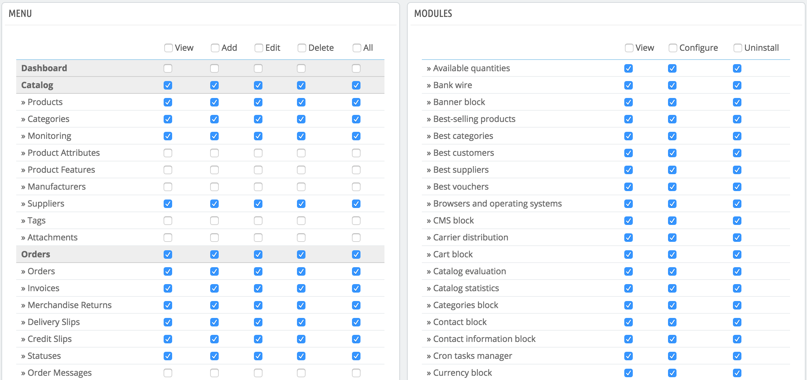

# Berechtigungen

Berechtigungen sind der zentrale Teil der PrestaShop Profile. Sie ermöglichen, sehr präzise zu bestimmen, was ein Mitarbeiter-Account in Ihrem Shop tun kann und nicht tun kann.

Die "Berechtigungen"-Verwaltungsseite besteht aus folgenden Tabs:

* Auf der linken Seite, die verfügbaren Profile.
* Auf der verbleibenden rechten Seite des Bildschirms zeigt PrestaShop die Berechtigungen des angeklickten Profils. Diese Registerkarte enthält zwei Tabellen nebeneinander.

Wenn Sie jedes Profil (außer Superadmin) anklicken, werden die beiden Tabellen angezeigt, um Ihnen den Zugang zur Feinabstimmung zu geben:

* links: Menübezogene Berechtigungen: Sie können entscheiden, was das Profil in den Menüs tun kann. Sie können so ein Profil daran hindern, den Inhalt einer Seite zu bearbeiten, oder sogar das Menü ganz auszublenden.
* rechts: modulbezogene Berechtigungen: Während Sie einigen Profilen vielleicht gestatten, die verfügbaren Module zu sehen, können Sie es vorziehen, dass nur die zuverlässigsten Mitarbeiter in der Lage sein sollten, einige der wichtigsten Module zu konfigurieren. Seit Version 1.6.0.11 können Sie auch angeben, ob sie ein Modul deinstallieren können.

Für jede der Menü Kriterien haben Sie 5 Möglichkeiten:

* **Anzeigen**. Mitarbeiter können Informationen anzeigen.
* **Hinzufügen**. Mitarbeiter können neue Informationen hinzuzufügen.
* **Bearbeiten**. Mitarbeiter können Informationen ändern.
* **Löschen**. Mitarbeiter können Informationen löschen.
* **Alle**. Aktiviert alle oben genannten Optionen für die aktuelle Zeile.

Die Modulkriterien haben nur 2 Möglichkeiten:

* **Anzeigen**. Mitarbeiter können die Konfiguration des Moduls anzeigen.
* **Einstellungen**. Mitarbeiter können das Modul konfigurieren.
* **Deinstallieren**. Neu in 1.6.0.11. Mitarbeiter können das Modul deinstallieren.

Die Superadmin-Berechtigungen können nicht geändert werden: das Profil hat alle Rechte für alle Kriterien.

## Festlegen von Berechtigungen für ein neues Profil 

Für dieses Beispiel werden wir ein neues Profil, "Bestellungs-Vorbereiter" erstellen. Zunächst erstellen Sie das Profil auf der "Profile"-Seite, indem Sie das Feld "Name" ausfüllen. Sobald es gespeichert wird, erscheint es in der Liste der Profile.

Dann müssen Sie Berechtigungen auf diesem neuen Profil zuweisen. Gehen Sie auf die "Berechtigungen"-Seite und klicken Sie auf die Registerkarte für das neue Profil: Die Liste der Kriterien wird angezeigt. Standardmäßig hat ein neues Profil Zugriff auf keine der Back-Office-Seiten und kann nur einige Module im Back-Office anzeigen (für die Seiten ist die Anzeige freigeschaltet).

Sie haben zwei Möglichkeiten, um die Kriterien auszufüllen, je nach den Grenzen oder Freiheiten, die Sie dem Profil zugestehen wollen:

* Klicken Sie auf die Kontrollkästchen der Berechtigungen, eines nach dem anderen, bis das Profil genügend Zugriffsrechte hat, um den Job zu erledigen.
* Lassen Sie alle Kontrollkästchen aktiviert und entfernen Sie dann die Berechtigungen eine nach der anderen, bis es nur die notwendigen Berechtigungen hat.

Sie haben zwei Möglichkeiten, Kontrollkästchen in Gruppen auszufüllen:

* Pro Spalte: an der Spitze jeder Spalte ermöglicht ein Kontrollkästchen, alle Einträge der Spalte anzukreuzen. Deaktivieren entfernt wieder die Haken aller derzeit angekreuzten Kästchen.
* pro Zeile: wenn Sie für eine bestimmte Zeile auf "Alle" klicken, werden alle Kontrollkästchen in dieser Zeile ausgefüllt. Deaktivieren entfernt die Haken aller derzeit angekreuzten Kästchen.

Sie können dann ausgewählte Zeilen ankreuzen, anstatt viel Zeit in die Überprüfung jeder benötigte Zeilen zu stecken.

Um Fehler bei der Konfiguration Ihrer Berechtigungen zu vermeiden, speichert PrestaShop automatisch die Einstellungen jedes Mal, wenn Sie eine Änderung vornehmen. Das heißt, Sie müssen nicht auf eine Schaltfläche "Speichern" klicken. Nachdem Sie dem Profil seine Rechte zugewiesen haben, können Sie auf die "Mitarbeiter" Verwaltungsseite zurückkehren und das Profil Mitarbeitern zuordnen.
