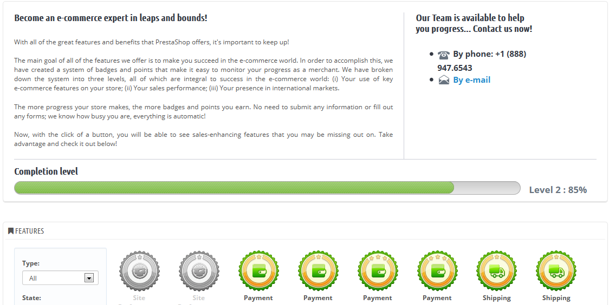

# Handelserfolg

Diese Seite wird durch das Modul mit dem gleichen Namen erzeugt. Es wurde speziell entwickelt, damit PrestaShop Nutzer ihre Fortschritte als E-Commerce-Händler sehen,  wie sie schon gewachsen  sind, sowie Fortschritte im Laufe der Tage, Monate und Jahre. Es wird standardmäßig installiert.

Dieses Modul fügt ein System von Abzeichen und Punkten hinzu, aufgeteilt in drei Ebenen, die alle wesentlich für den Erfolg in der E-Commerce-Welt sind:

* **Maßnahmen**. Ihre Nutzung der wichtigsten E-Commerce-Funktionen wie Site-Performance, Katalog-Größe, Mitarbeiter und SEO.
* **Erreichte Ziele**. Ihr Abschluss der spezifischen E-Commerce-Ziele wie die Anzahl der Kunden, Bestellungen und Umsatz.
* **International**. Verfolgt Ihre Präsenz in wichtigen internationalen Märkten wie Nord- und Südamerika, Ozeanien, Asien, Europa, Afrika und Maghreb.

Je mehr Fortschritte Ihr Geschäft macht, desto mehr Abzeichen und Punkte erhalten Sie. Es besteht keine Notwendigkeit, alle Informationen vorzulegen oder Formulare auszufüllen. Wir wissen, wie beschäftigt Sie sind; alles wird automatisch erledigt. Verwenden Sie dieses Tool, um Ihre Fortschritte und großen Erfolge zu betrachten.
