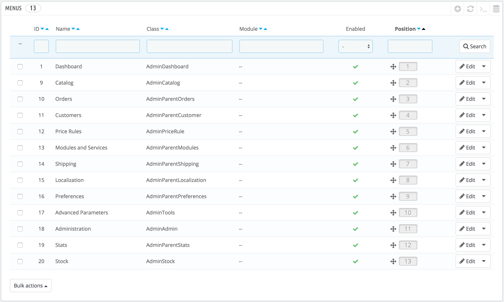
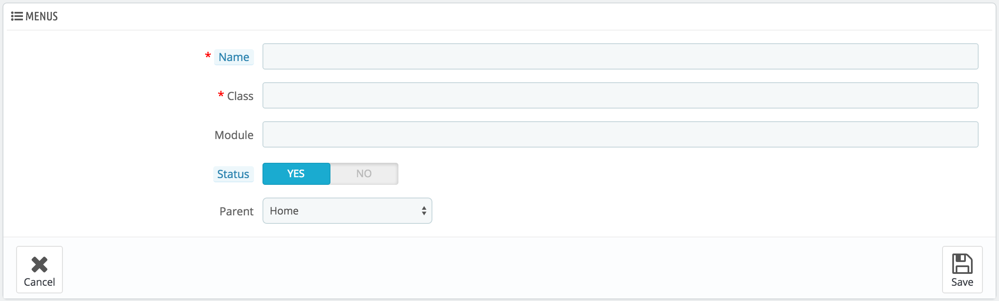

# Menüpunkte

Das PrestaShop Back-Office-Menü ist in seiner Anordnung nicht festgesetzt: Während die Standard-Anordnung darauf ausgelegt ist, die nützlichsten Seiten leicht erreichbar zu machen, können Sie die Anzeige so verändern, dass sie Ihren Wünschen entspricht, entweder teilweise oder sogar komplett.

Die Menüpunkte-Seite ermöglicht es Ihnen, Seiten zu verschieben, zu bearbeiten, zu deaktivieren und sogar neue Seiten zu erstellen.

## Menüs verschieben 

Menüs können direkt in der Liste verschoben werden. Sie können entweder auf die Pfeile in der Spalte "Position" klicken, oder einfach die Zeile selbst ziehen und an der gewünschten Position ablegen. Sobald Sie die Zeile ziehen, speichert PrestaShop die Position automatisch. Sie können die Zeilen ziehen, wenn der Mauszeiger über der Spalte "Position" ist.

Sie können ein Menü deaktivieren, indem Sie einfach auf den grünen Haken in der Spalte "Aktiviert" klicken. Beachten Sie, dass dies das Menü für alle Back-Office-Benutzer deaktiviert. Wenn Sie ein Menü für eine bestimmte Gruppe von Benutzern ausblenden möchten, bearbeiten Sie die Berechtigungen von deren Profil auf der "Berechtigungen" Verwaltungsseite.

## Seiten verschieben 

Um auf Seiten eines Menüs zuzugreifen, klicken Sie auf "Details" im Aktionsmenü. Eine neue Liste mit den in diesem Menü enthaltenen Seiten erscheint, mit den gleichen Spalten.

Die Seiten können innerhalb eines Menüs direkt in der Liste verschoben werden. Sie können entweder auf die Pfeile in der Spalte "Position" klicken, oder einfach die Zeile selbst ziehen und an der gewünschten Position ablegen. Sobald Sie die Zeile ziehen, speichert PrestaShop die Position automatisch. Sie können die Zeilen ziehen, wenn der Mauszeiger über der Spalte "Position" ist.

Sie können eine Seite auch zu einem ganz anderen Menü verschieben. Dies kann nicht direkt in der Liste durchgeführt werden; Sie müssen dazu das Bearbeitungsformular der Seite öffnen, in dem Sie die Option "Übergeordnet". Ändern Sie diese Option zu einem anderen Menü und speichern Sie die Änderungen; wenn Sie nun zurück zur Seite „Menüpunkte“ navigieren, werden Sie sehen, dass die Seite verschoben wurde.

Sie können eine Seite deaktivieren, indem Sie einfach auf den grünen Haken in der Spalte "Aktiviert" klicken. Beachten Sie, dass dies die Seite für alle Back-Office-Benutzer deaktiviert. Wenn Sie eine Seite für eine bestimmte Gruppe von Benutzern ausblenden möchten, bearbeiten Sie die Berechtigungen in deren Profil, auf der "Berechtigungen" Verwaltungsseite.

## Erstellen einer neuen Seite oder eines Menüs 

Klicken Sie auf Button "Menü hinzufügen", um zum Erstellungsformular zu gelangen.

Diese Seite enthält einige Optionen, die zuerst kompliziert wirken können:

* **Name**. Tragen Sie einen eindeutigen Namen ein, da dieser zur internen Identifizierung dient.
* **Klasse**. Kurz gesagt basieren PrestaShop Backoffice-Seiten auf bestimmten internen PHP-Dateien, die "admin-Controller" heißen, und sind am häufigsten im / controllers / admin Ordner Ihrer PrestaShop Installation gespeichert. Beim Erstellen einer neuen Seite müssen Sie wissen, welchen Controller Sie brauchen, und vor allem den Namen seiner Klasse - das ist der Name der PHP-Datei.Wenn Sie zum Beispiel eine Seite zur Backup-Verwaltung erstellen möchten, müssen Sie zuerst den Controller-Namen (in diesem Fall, AdminBackupController) finden, und ihn in das Feld „Klasse“ kopieren.
* **Modul**. In einigen Fällen kommt der Controller für eine Seite, die Sie erstellen möchten, aus einem Modul. In diesem Fall müssen Sie auch die Kennung des Moduls angeben(in den meisten Fällen der Ordnername) und in das Feld "Module" kopieren (in Kleinbuchstaben). Auf diese Weise weiß PrestaShop, dass es kein Controller aus dem / controllers / admin-Ordner ist, im Ordner / modules / Name-des-Modulordners/.
* **Status**. Sie können eine Seite jederzeit deaktivieren, beachten Sie aber, dass dies alle Back-Office-Benutzer beeinflusst.
* **Übergeordnet**. Sie können jedes Menü wählen, aber der Konsistenz willen sollten Sie sicherstellen, eines zu wählen, das im Kontext auch dazu passt.

Wenn Sie eine neue Menü-Seite erstellen möchten, wählen Sie „Startseite“ bei „Übergeordnet“.
