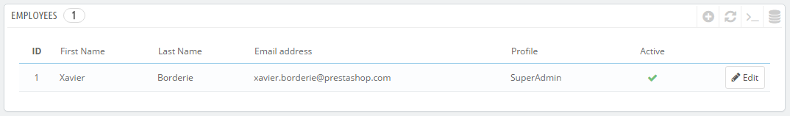
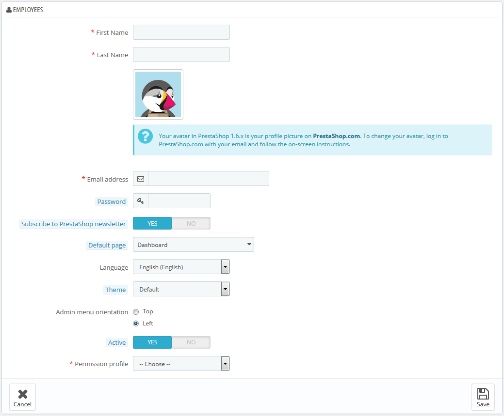
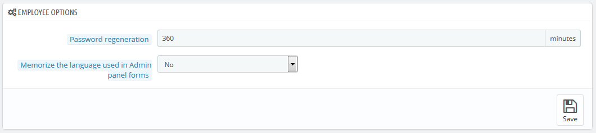

# Mitarbeiter

Die "Mitarbeiter" Verwaltungsseite listet alle Benutzerkonten auf, die Zugriff auf das Back-Office Ihres Shops haben. Standardmäßig werden Sie das Konto, das bei der Installation des Shops angelegt wird finden, mit den rechten des Superadmin. Der Superadmin hat Zugriff auf alle Funktionen von PrestaShop ohne Einschränkung.

Sie sollten ein neues Mitarbeiterkonto für jeden Mitarbeiter erstellen, der in Ihrem Shop involviert ist. Das bedeutet, dass Sie niemals einen allgemeinen Account erstellen sollten, den jeder benutzen kann, weil Sie den Überblick über die verschiedenen Aktionen Ihrer Mitarbeiter behalten müssen. Mitarbeiter können Bestellungen bearbeiten, Zahlungen akzeptieren und Rückerstattung erstellen, und Sie sollten wissen, wer was getan hat. Ein persönlicher Zugang für jeden Mitarbeiter ist eine gute Möglichkeit für Sie sicherzustellen, dass Ihr Team Ihren Shop verantwortungsvoll verwaltet.

## Hinzufügen eines neuen Mitarbeiters 

Mit der Schaltfläche "NEU" kommen Sie zum Erstellungsformular für Mitarbeiter.

Es verfügt über einige Einstellungen:

* **Vorname** und **Nachname**. Der Name wird Kunden nicht angezeigt, aber ist sehr hilfreich, wenn Sie wissen möchten, wer was in Ihrem Shop gemacht hat.
* **E-Mail-Adresse**. Wenn erlaubt, wird der Mitarbeiter E-Mails der Kunden und PrestaShop Benachrichtigungen an diese Adresse geschickt bekommen. Sie wird auch als Login-Kennung des Kontos verwendet.
* **Passwort**. Versuchen Sie, ein sicheres Passwort zu wählen. Sie wollen nicht, dass ein Mitarbeiter-Account von unbekannten Personen genutzt wird.
* **Für den PrestaShop Newsletter registrieren**. Abonnieren Sie den PrestaShop Newsletter, um Tipps und Tricks des PrestaShop-Teams zu erhalten.
* **Standard-Seite**. Sie können entscheiden, welche Seite der Benutzer nach dem Einloggen sieht. Dies könnte die Seite „Übersicht“ für SuperAdmins  sein, oder die Seite „Bestellungen“ für Verkäufer.
* **Sprache**. Die Standardsprache, da Ihr Unternehmen möglicherweise in englischer Sprache geführt wird, aber Ihr Logistiker vielleicht aus einem anderen Land stammt. Achten Sie darauf, die erforderlichen Sprachen hinzuzufügen, auf der "Sprachen"-Seite unter dem Menüpunkt "Lokalisierung".
* **Template**. Das Back-Office von PrestaShop kann ein anderes Template als den Standard verwenden. Sie können wählen, welches hier verwendet werden soll.
* **Ausrichtung Admin-Menü**. Jeder Mitarbeiter kann festlegen, wie das Menü dargestellt werden soll, oben oder links.
* **Aktiv**. Sie können ein Konto zeitweise oder endgültig abschalten. Dies ermöglicht Ihnen, temporäre Konten zu erstellen, zum Beispiel, wenn Sie Hilfe während der Feiertage oder der Shopping-Saison brauchen.
* **Berechtigungen**. Es ist sehr wichtig, dass Sie jedem Mitarbeiter-Konto das richtige Profil zuordnen. Ein Profil ist mit einem Satz von Berechtigungen und Zugriffsrechten gebunden und Sie sollten sich die bereits vorhandenen ansehen, die auf der "Profile"-Seite unter dem Menüpunkt "Verwaltung" aufgeführt sind(siehe unten für weitere Informationen). Das Profil legt fest, auf welchen Teil des Backoffice Ihres Shops der Mitarbeiter Zugriff hat; zum Beispiel werden, wenn sich der Mitarbeiter anmeldet, nur die Seiten / Menüs angezeigt, die als zugänglich in seinem Profil konfiguriert wurden, werden. Dies ist eine sehr wichtige Einstellung.

Der Profil-Avatar (das Bild, das Sie ins Backoffice stellen) ist mit Konto des Benutzers im PrestaShop Forum verbunden. Wenn Sie also dieses Bild anpassen möchten, müssen Sie zunächst ein Konto im Forum erstellen: [http://www.prestashop.com/forums/](http://www.prestashop.com/forums/)

## Optionen Mitarbeiter 

Der Abschnitt an der Unterseite der "Mitarbeiter" Seite, direkt unter der Mitarbeiter-Liste, hat zwei Optionen:

* **Wiederherstellung des Passworts**. Ermöglicht es, die Häufigkeit, in der ein Mitarbeiter sein Passwort ändern kann, festzulegen.
* **Speicherung der Standardsprache**. Bei "Ja" können die Mitarbeiter ihre eigene Standardsprache speichern.

