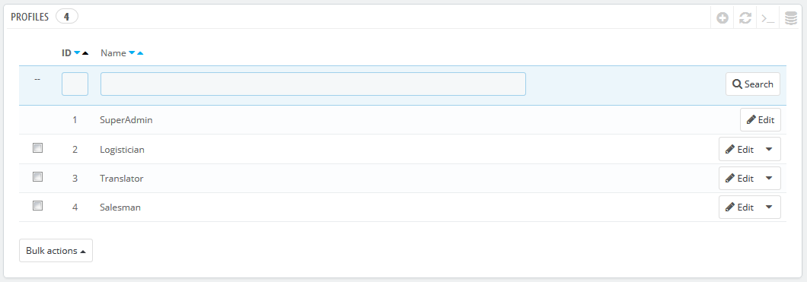
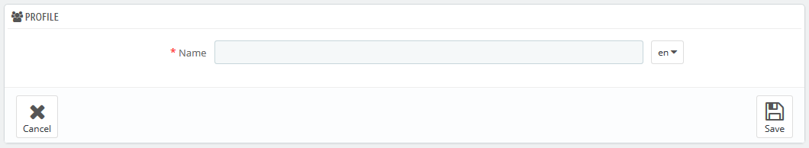

# Profile

PrestaShop kann jedem Mitarbeiter bestimmte Pflichten und Rechte auflegen, was Ihnen hilft, den Online-Shop effektiv zu verwalten. Zum Beispiel hat der Administrator Zugriff auf den gesamten Shop, ohne Einschränkung zu haben, während ein Mitarbeiter nur Zugriff auf den Katalog oder Bestellungen hat.

Standardmäßig hat PrestaShop 4 einsatzbereite Profile:

* **Superadmin**. Der höchste Rang. Es verfügt über alle Rechte und kann auf alles der PrestaShop Installation zugreifen.
* **Logistician**. Die Verantwortlichen für die Verpackung und das Senden von Bestellungen. Nur Zugriff auf die Bestelllungen, Versand- und Lager-Management-Seiten, und einen Teil der Katalog- und Kundenseiten.
* **Translator**. Diejenigen, die für die Übersetzungen des Textinhalts Ihres Shops beauftragt sind. Können auf Artikel und Kategorien, CMS Inhalte und die "Übersetzungen"-Seite zugreifen.
* **Salesman**. Ihre Vertriebsmitarbeiter, wenn vorhanden. Neben den Zugriffsrechten des Übersetzers können sie auch auf die Kundenseiten, die Module, Webservice und auf einige Statistiken zugreifen.

Sie können die Details der Zugriffsrechte durch die Überprüfung jedes Profils auf der "Berechtigungen" Seite (siehe unten) sehen.

Das Superadmin Profil kann nicht gelöscht werden, sondern nur umbenannt.

Es sollte mindestens ein Mitarbeiter ein Superadmin Profil haben.

## Hinzufügen eines neuen Profils 

Sie können so viele Profile wie nötig hinzuzufügen.

Das Hinzufügen eines neuen Profils ist ziemlich einfach: klicken Sie einfach auf "NEU", geben Sie einen eindeutigen Namen für das neue Profil ein und speichern Sie.

Der komplexere Teil kommt bei der Festlegung der neuen Zugriffsrechte. Dies wird auf der "Berechtigungen"-Seite getan.
