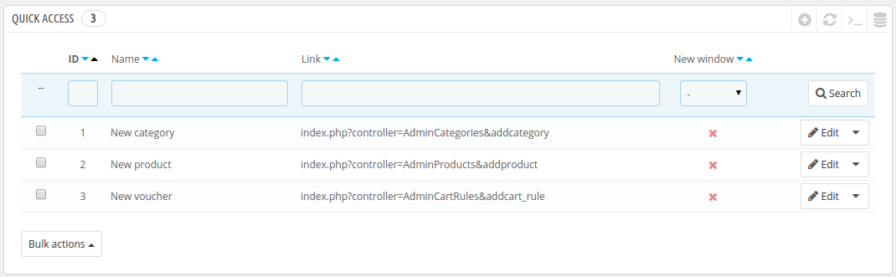
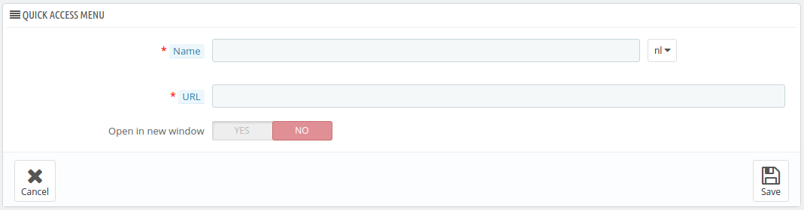

# Schnellzugriff

PrestaShop kann praktische Verknüpfungen zu Ihren wichtigsten Seiten erstellen, auf die über das Menü "Schnellzugriff" zugegriffen werden kann, an der oberen rechten Ecke jeder Seite des PrestaShop Backoffice (direkt neben dem Benutzernamen).

Auf der "Schnellzugriff"-Verwaltungsseite können Sie spezifische Verknüpfungen erstellen, und die Navigation im Verwaltungsbereich noch intuitiver für Sie und Ihr Team machen.

Die Seite zeigt alle Links, die bereits erstellt wurden. Standardmäßig sind es:

* **Neue Kategorie**. Mit diesem speziellen Link gelangen Sie direkt zur Erstellung einer Kategorie.
* **Neuer Artikel**. Dieser spezielle Link führt Sie direkt auf die Seite der Artikelentstellung.
* **Neuer Gutschein**. Mit diesem speziellen Link gelangen Sie direkt zur Warenkorb-Preisregeln-Seite.

Seiten, die in einem neuen Tab / Fenster geöffnet werden, sind grün "aktiviert" in der Spalte „Neues Fenster".

Sie können beliebig viele Verknüpfungen nach Bedarf erstellen – Sie sollten es nur nicht übertreiben, da dies das Menü "Schnellzugriff" langsamer macht.

## Einen neuen Link erstellen 

Erstellen wir als Beispiel einen Schnellzugriff auf die Seite „Bestellungen“, von der aus Sie eine neue Bestellung erstellen und sogar neue Kunden und deren Adressen hinzufügen können.

Wie üblich, bringt Sie der Button "NEU" zum Erstellungsformular:

* **Name**. Geben Sie dem Link einen eindeutigen Namen. Machen Sie ihn kurz und beschreibend.
* **URL**. Geben Sie die Adresse der Seite hier ein. Hier können Sie sogar Seiten mit komplexen Verbindungen erstellen, wie quick Links:\

  1. Während Sie die Seite der Linkerstellung offen lassen, navigieren Sie zur Seite „Bestellungen“ in einem neuen Browser-Tab.
  2. Kopieren Sie die Internet-Adresse aus der Adressleiste des Browsers. Zum Beispiel, http://www.myprestashop.com/admin8945/index.php?controller=AdminOrders\&token=f326b0419984706791c03f7e96599147.
  3. Entfernen Sie den gesamten \&Token = xxx Teil und behalten Sie die spezifischen Bits (d.h. nicht die Domäne und das Admin-Verzeichnis). In unserem Fall: `index.php?controller=AdminOrders`.
  4. Fügen Sie das Ergebnis in das Feld "URL" im Erstellungsformular ein.
* **Öffnen in einem neuen Fenster**. Geben Sie hier an, ob Sie diese Registerkarte in einem neuen Fenster geöffnet haben wollen oder nicht. In der Regel sollte ein Link im Back-Office im selben Tab / Fenster gehalten werden, und Links, die über die Grenzen des Back-Office hinausgehen(Front-Office, anderen Websites insgesamt) sollten in einem neuen Fenster / Tab geöffnet werden.

Beachten Sie, wenn Sie Links zu anderen Seiten zu erstellen, zum Beispiel zu Ihrem PayPal-Konto oder Ihrem Webmail-Account, fügen Sie einfach die vollständige URL in das Feld "URL" ein, das Präfix `http://` einbezogen.
