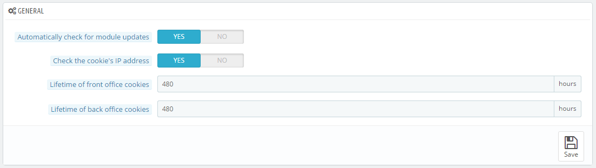
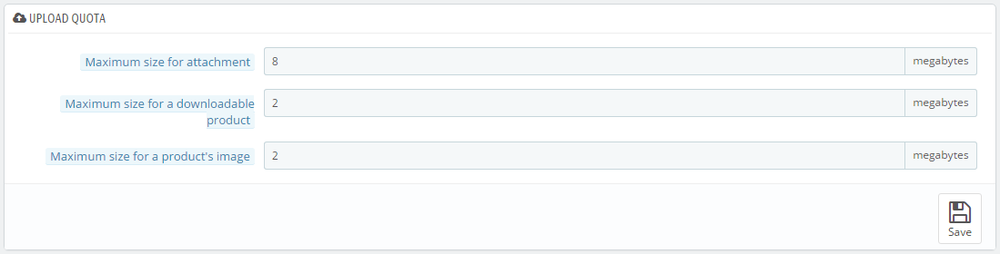
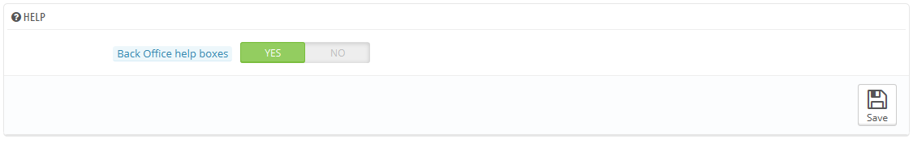
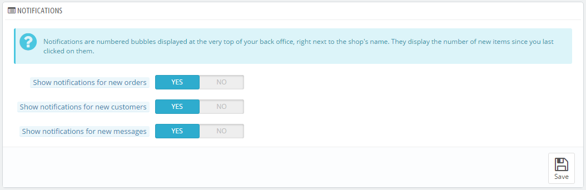

# Verwalten der Voreinstellungen

Die Verwaltungsseite "Voreinstellungen" enthält allgemeine Optionen und Einstellungen bezogen auf die Funktion von PrestaShop. Sie hat vier Abschnitte.

## Allgemein 

Dieser Abschnitt enthält weitere allgemeine Einstellungen:

* **Automatisch nach Updates der Module suchen**. Sie können PrestaShop einstellen, regelmäßig zu überprüfen, ob es neue Versionen der Module auf der Addons Website gibt. Wenn dem so ist, wird auf der "Module"-Seite der Button „aktualisieren“, direkt neben dem Button "Deinstallieren" angezeigt.
* **IP-Adresse des Cookies überprüfen?**. Dies ist eine zusätzliche Sicherheitsmaßnahme, die Sie einstellen können, um zu überprüfen, dass der User auch von der IP, die in seinem Browser Cookie gespeichert ist, herkommt.
* **Laufzeit des Front Office Cookies**. Standardmäßig hat ein PrestaShop Cookie eine Laufzeit von 480 Stunden (20 Tage). Sie können diesen Wert reduzieren, wenn Sie das Gefühl haben, mehr Sicherheit zu benötigen.
* **Laufzeit des Back-Office Cookies**. Standardmäßig hat ein PrestaShop Cookie eine Laufzeit von 480 Stunden (20 Tage). Sie können diesen Wert reduzieren, wenn Sie das Gefühl haben, mehr Sicherheit zu benötigen.

## Upload-Volumen 

Diese Seite hilft Ihnen, die zugelassene Größe der hochgeladenen Dateien von Ihrem eigenen Team zu definieren – nicht die Ihrer Kunden.

Es gibt drei Möglichkeiten, von denen es eine allgemeingültige gibt, die beiden anderen sind präziser:

* **Maximale Größe des Dateianhangs**. Der Standardwert wird direkt von Ihrem Server übernommen, Sie können ihn aber bei Bedarf senken.
* **Maximalgröße für Download-Artikel**. Wenn Sie virtuelle Artikel (Leistungen, Buchungen und Download-Produkte) verkaufen, kann diese Einstellung die Größe der Dateien, Ihr Team hochladen kann, begrenzen, und damit die zugelassene Größe der Endprodukte. Planen Sie im Voraus, so dass nicht eines Ihrer Teammitglieder blockiert wird.
* **Maximale Größe der Artikelbilder**. Ebenso können Sie die Größe des Bildes, das Sie oder Ihr Team in Ihren Shop hochladen können, begrenzen. Dies kann als Erinnerung dienen, dass Team-Mitglieder sich bemühen sollten, die Größe des Bildes zu reduzieren, da es oft nicht sinnvoll ist, Bilder größer als 600x600 (was in etwa 200 kB ist, wenn richtig komprimiert) hochzuladen. Siehe die "Bilder" Voreinstellungen Seite für die eingestellten Bildgrößen. Dies hat den zusätzlichen Vorteil, dass sowohl auf dem Server Speicher gespart wird, die Bandbreitennutzung geringer ist und die benötigte Prozessorleistung reduziert wird(da PrestaShop die Größe der Bilder für Miniaturansichten usw. ändert).

## Hilfe 

Diese Option wurde in PrestaShop 1.6.0.11 entfernt.

Um Ihnen bei der täglichen Nutzung von PrestaShop zu helfen, hat das Entwicklerteam einige Tipps und Tricks der Benutzeroberfläche hinzugefügt.

## Nachrichten 

Nachrichten sind nummerierte Blasen die im Kopfbereich des Back Office rechts vom Shopnamen eingeblendet werden. Sie zeigen neue Bestellungen, Anmeldungen oder Nachrichten seit dem letzten Anklicken an.

Sie können wählen, welche Inhaltstypen angezeigt werden sollen:

* **Benachrichtigungen über neue Bestellungen anzeigen**. Anklicken öffnet eine größere Blase, die Bestelldetails zu den letzten Bestellungen enthält.
* **Benachrichtigungen über neue Kunden anzeigen**. Anklicken zeigt die zuletzt registrierten Kunden an.
* **Benachrichtigungen über neue Mitteilungen anzeigen**. Anklicken zeigt eine größere Blase, die die E-Mails der Personen, die zuletzt eine Nachricht über das Kontaktformular gesendet haben. Von dort aus können Sie die entweder Mails öffnen, oder Sie öffnen die "Kundenservice" -Seite, um die vollständige Liste zu sehen.
