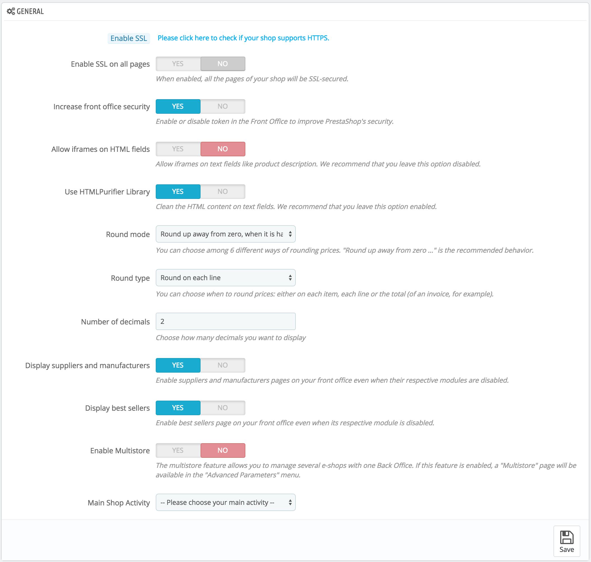

# Allgemein

Die Einstellungsseite "Allgemein" verfügt über eine Handvoll von spezifischen Einstellungen, die nicht in die anderen Menüs passt. Diese sind jedoch wesentlich:

* **SSL aktivieren**. SSL bedeutet "Secure Sockets Layer" und umfasst TSL (für "Transport Layer Security"). Beide sind kryptographische Internet-Protokolle, für sichere Web-Kommunikation. [Http://en.wikipedia.org/wiki/Secure\_Sockets\_Layer](http://en.wikipedia.org/wiki/Secure\_Sockets\_Layer): Hier können Sie mehr über diese Protokolle auf Wikipedia lesen.\
  Die Bereitstellung einer SSL-Verbindung zu Ihrem Shop ist nicht nur hervorragend für jegliche Internettransaktionen, sondern auch eine gute Möglichkeit, Ihren Kunden die Sicherheit der eigenen Daten (Authentifizierung, Kreditkarte, etc.) in Ihren Shop zu zeigen, da moderne Browser jetzt visuelle Hinweise zeigen, dass die Verbindung gesichert ist. Wenn Ihr Hosting-Provider SSL unterstützt, stellen Sie auch sicher, die SSL-Unterstützung PrestaShop zu aktivieren, indem Sie auf den Link klicken. Dies wird einen Selektor öffnen, in dem Sie "Ja" oder „nein“ wählen können.
* **Front Office Sicherheit verbessern**. Dies fügt Sicherheitstokens zu Ihrem Shop hinzu, um seine Sicherheit zu verbessern. So ist jede URL spezifisch für eine Kunden-Sitzung, und kann nicht in einem anderen Browser wie sie ist verwendet werden, so sind Informationen, die möglicherweise während der Sitzung gespeichert wurden, geschützt.
* **Iframes in HTML-Feldern erlauben**. Die Option ermöglicht es Ihnen, Iframes in Textfeldern, wie beispielsweise Produktbeschreibungen zu stellen. Iframes sind HTML-Elemente, die es möglich machen, externe Inhalte die eigene Seite einzubetten. Wir empfehlen Ihnen, diese Option, wenn nicht notwendig, deaktiviert zu lassen.
* **HTMLPurifier verwenden**. Kunden können Informationen zu Ihrem Shop mit Textfeldern (zum Beispiel Produktbeschreibungen oder Kundeninformationen) zu senden, aber Hacker können auch versuchen, diese Felder zu verwenden, um bösartigen Code in Ihren Shop zu senden. Diese Option gewährleistet, dass alle an Ihren Shop gesendeten Daten sicher sind. Sie sollten nur dann deaktivieren, wenn Sie genau wissen was Sie tun.
*   **Rundungsmodus**. Nach Steuern und Rabatt kann ein Preis zu viele Dezimalstellen wie $ 42,333333333 aufweisen. Der Rundungsmodus wird im gesamten PrestaShop verwendet, in der Front-Office-Preis-Anzeige, als auch beim Prozess der Preisberechnung (Steuern, Rabatt, etc.). Für sich selbst macht eine Rundung nichts aus, Wirkung ist jedoch viel größer, wenn man die Rechnungssumme betrachtet, wenn man viele Einzelteile mit Steuern und Rabatten hinzufügt und berücksichtigt.\
    Es gibt sechs Modi:\

    * **Kaufmännisch aufrunden**. Dies ist der empfohlene Modus. 42.55555555 wird 42.56.
    * **Kaufmännisch abrunden**. 42.55555555 wird 42.55.
    * **Mathematisch runden zur nächsten geraden Zahl**. 42.55555555 wird 42.56.
    * **Mathematisch runden zur nächsten ungeraden Zahl**. 42.55555555 wird 42.57.
    * **Immer aufrunden**. 42.55555555 wird 42.56.
    * **Immer abrunden**. 42.55555555 wird 42.55.

    For versions below 1.6.0.11

    Die Rundungsoption wurde stark für die Version 1.6.0.11 überarbeitet. Vor dieser Version gab es nur eine Möglichkeit:

    Rundungsmodus. Nach Steuern und Rabatt kann ein Preis zu viele Dezimalstellen wie $ 42,333333333 aufweisen. Der Rundungsmodus wird im gesamten PrestaShop verwendet, in der Front-Office-Preis-Anzeige, als auch beim Prozess der Preisberechnung (Steuern, Rabatt, etc.). Es gibt drei Modi:

    * **Superior**. Aufrunden: 42,333333333 wird 42.34.
    * **Inferior**. Abrunden: 42,333333333 wird 42.33.
    * **Classic**. Es rundet den Wert nach oben oder unten, je nach Wert: up, wenn sie über 0,5, nach unten, wenn unter 0,5.
* **Rundungsregel**. Diese Option ermöglicht Ihnen, die Art der Rundung, die einen enormen Einfluss auf die Berechnung des Gesamtpreises hat, wählen. Es gibt drei Auswahlmöglichkeiten, in progressiver Reihenfolge:\

  * **Pro Artikel runden**. Jeder Artikelpreis wird vor der Berechnung des Gesamtpreises gerundet. Wenn es einen Artikel mehr als einmal gibt, wird dieser separat vor der Berechnung gerundet.
  * **Pro Zeile runden**. Jede Zeile wird  vor der Berechnung des Gesamtpreises gerundet. Wenn es einen Artikel mehrmals gibt, wird die Rundung auf deren Gesamtwert erfolgen.
  * **Gesamtsumme runden**. Die Rundung wird nur auf die endgültige Berechnung durchgeführt, nachdem die Werte aller Elemente hinzugefügt wurden.
* **Anzahl der Nachkommastellen**. Sie können die Anzahl der Dezimalstellen, auf die der Wert gerundet wird, wählen. Zum Beispiel, wenn Sie "3", 42,333333333 wird 42,334.
* **Lieferanten und Hersteller anzeigen**. Hersteller- und Lieferantenseiten auch dann im Shop anzeigen, wenn die zugehörigen Module deaktiviert sind.
* **Verkaufshits anzeigen**. Aktivieren Sie die Verkaufshits-Seiten in Ihrem Front-Office, auch wenn das Top-Seller-Block-Modul ist deaktiviert.
* **Multishop aktivieren**. Dieser kleine Option hat erhebliche Auswirkungen: Ihre Einzel-shop Installation von PrestaShop verwandelt sich in einen Multishop Installation. Dies ermöglicht Ihnen den Zugriff auf die neue "Multishop" Seite im Menü "Erweiterte Einstellungen", und jede Verwaltungsseite kann kontextualisiert seine Einstellungen entweder auf alle Shops, eine bestimmte Gruppe von Shops oder einen einzigen Shop angewendet werden.\
  Sie können mehr über die PrestaShop Multishop-Funktion durch das Lesen des Kapitels "Multishopverwaltung" dieses Handbuchs lesen.
* **Branche des Shops**. Vielleicht haben Sie die falsche Branche bei der Installation von PrestaShop eingestellt. Sie können die korrekte Tätigkeit hier wählen.\
  \

