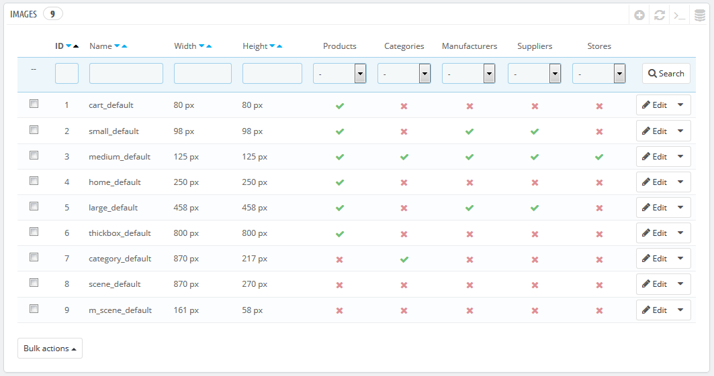
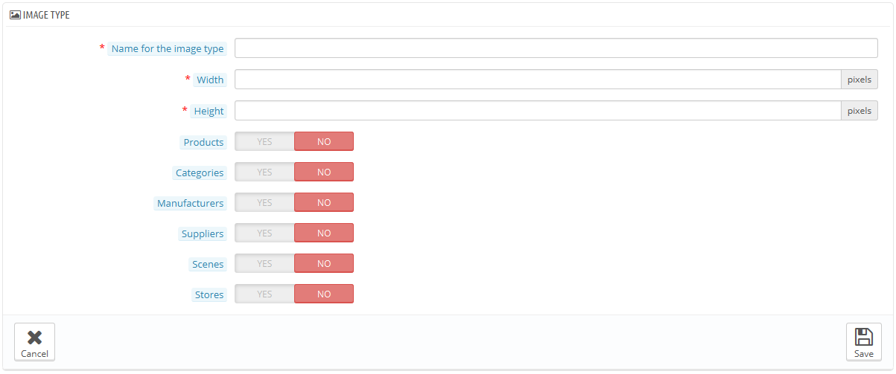
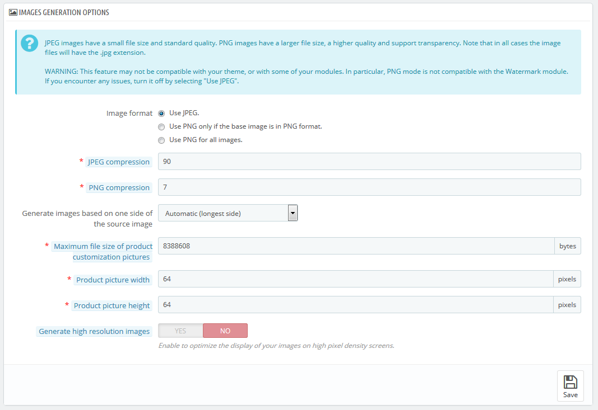
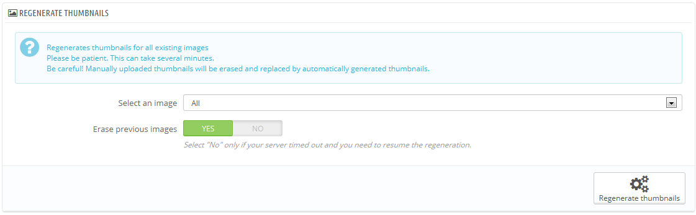

# Bilder

Auf der "Bilder"-Voreinstellungsseite können Sie die verschiedenen Bildgrößen festlegen, die Ihre Kunden in Ihrem Shop sehen können.

Wenn Sie ein Bild in PrestaShop hochladen, generiert PrestaShop automatisch verschiedene Größen dieses Bildes, einschließlich Miniaturansichten und einer mobilen Version (je nachdem, wofür dieses Bild benutzt wird). Daher müssen Sie nur eine "Master" Version Ihres Bildes hochladen, groß genug, um es in alle Größen zu skalieren.

Wenn Sie sicherstellen, dass Ihr Bild korrekt in der Größe verändert wird, sollten Sie Bilder hochladen, die zum Größenverhältnis der verschiedenen Bildgrößen passen. Wenn Ihr hochgeladenes Bild nicht das gleiche Breite-Höhe-Verhältnis wie Ihre Einstellungen hat, besteht das Risiko, einen Whitespace auf geänderten Bildern zu sehen.

Sie können die Bildgröße für bestimmte Inhalte direkt in der Liste der Bildgrößen aktivieren.

Auf der Seite "Artikel" unter dem Menüpunkt "Voreinstellungen" können Sie wählen, ob gezoomt wird, wenn man mit dem Cursor über das Bild eines Artikels fährt.

## Hinzufügen einer neuen Bildgröße 

Sie können einfach eine neue Bildgröße und sogar die Art des Inhalts eintragen.

Klicken Sie auf "NEU", dann:

1. Geben Sie die den Namen, Breite und Höhe an.
2. Wählen Sie, für welche Art von Inhalten das Format gilt.
3. Überprüfen Sie die Eingabe.

## Bilder-Einstellungen 

*   Bildformat. Sie haben die Wahl zwischen zwei der wichtigsten Dateiformate: JPEG und PNG. Beide können gut von den Browsern genutzt werden. JPEG hat eine gute Kompressionsrate, aber dies kann zu sichtbaren Bildfehlern führen. Der PNG Komprimierungsalgorithmus ist nicht so gut wie bei JPEG, aber es gibt vergleichsweise weniger sichtbare Artefakte; Dennoch werden sehr viel ältere Browser dieses Format nicht erkennen könnten.

    Die Wahl zwischen einem und dem anderen ist oft eine Frage des Geschmacks. Davon abgesehen bleibt JPEG die empfohlene Wahl. Wenn Sie lieber Datenverluste verhindern möchten, wählen Sie die zweite Option, "PNG nur verwenden, wenn die Bilder im PNG-Format vorliegen".

    PNG-Format ist nicht mit dem "Wasserzeichen" Modul kompatibel.
* JPG-Qualität. Alles unter 80 oder im schlimmsten Fall 75 erzeugt Kompressionsartefakte und wird nicht empfohlen.
* PNG-Komprimierung. Wählen Sie nicht mehr als 6 oder im schlimmsten Fall 7, um sichtbaren Kompressionsartefakten vorzubeugen.
* Bei der Bilderzeugung Proportionen beibehalten. Mit dieser Funktion können Sie das Artikelbild in den vorher festgelegten Räumen positionieren:\

  * Wählen Sie "Höhe", um die Rahmenhöhe zu füllen (die Breite wird dann neu berechnet, um das gleiche Höhe / Breite-Verhältnis wie in der Originaldatei zu behalten).
  * Wählen Sie "Breite", damit das Bild die Breite des Rahmens füllt (die Höhe wird dann neu berechnet, um das Seitenverhältnis beizubehalten).
  * Wählen Sie "Auto", so dass die Breite und Höhe berechnet werden, um den Raum, den das Bild nutzen kann, zu maximieren.
* Maximale Dateigröße des Artikelbildes. Ihre Kunden können Bilder für kundenspezifische Produkte hochladen. Standardmäßig setzt PrestaShop diesen Wert auf die maximale PHP-Einstellung - dies können mehrere Megabyte sein: zum Beispiel bedeutet, 8 MB 8.388.608 Byte. Sie können diesen Wert bei Bedarf erweitern, aber stellen Sie sicher, dass Ihre PHP-Installation in der Lage ist, mit Datei-Uploads dieser Größe umzugehen.
* Breite des Artikelbildes. Standardmäßig können Kunden-Bilder eine maximale Breite von 64 Pixeln haben.
* Höhe des Artikelbildes. Standardmäßig können Kunden-Bilder eine maximale Höhe von 64 Pixeln haben.

## Wiederherstellen von Vorschaubildern 

Möglicherweise sind Sie mit den Größen der Miniaturbilder in Ihrem Shop unzufrieden. Dieser Abschnitt ermöglicht es Ihnen, sie alle wiederherzustellen- oder nur die für eine bestimmte Art von Inhalt:

1. Ändern Sie die Bildgröße-Einstellungen in der Tabelle am Kopf der "Bilder" Einstellungsseite.
2. Wählen Sie die Bilder, die wiederhergestellt werden sollen.
3. Geben Sie an, ob die vorherigen Bilder behalten werden sollen oder nicht.
4. Klicken Sie auf "Wiederherstellen der Vorschaubilder".

Manuell hochgeladene Thumbnails werden gelöscht und durch automatisch generierte Thumbnails ersetzt.
