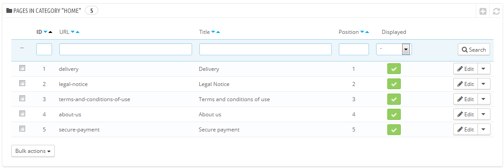
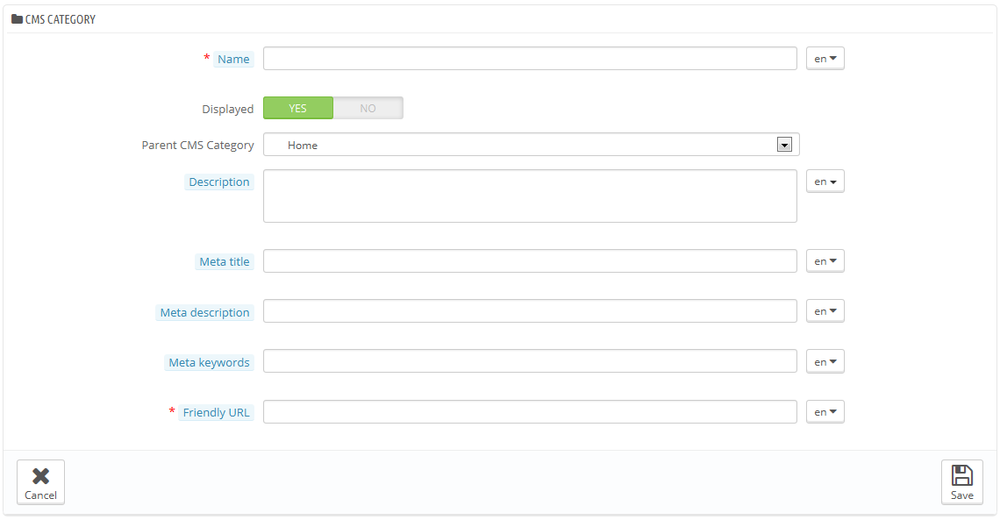
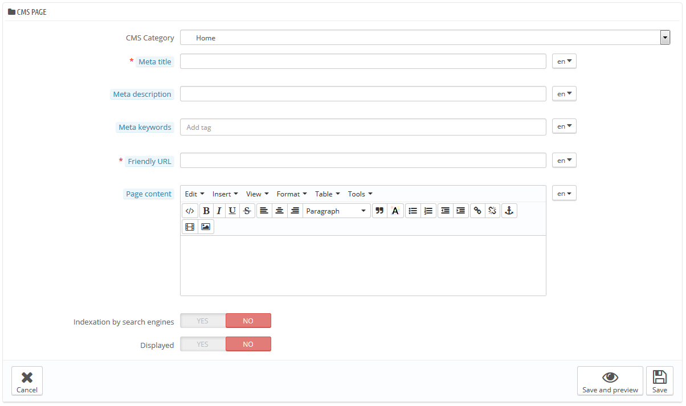

# CMS-Seiten

Mit PrestaShop können Sie Content-Seiten so einfach erstellen, wie Artikelseiten, mit ihrem CMS-Tool. Die Seiten werden Kunden im "Information"-Block auf Ihrer Homepage und im Website-Menü angezeigt. Sie können CMS-Seiten mit den Erstellungsbuttons in der oberen Menüleiste ("Top horizontal menu"-Modul, kann auf der Seite "Module" konfiguriert werden) hinzufügen.

Auf der "CMS"-Seite finden Sie alle Content-Seiten, die zuvor auf Ihren Shop angelegt wurden, für die aktuell gewählte Kategorie (standardmäßig ist die Homepage die einzige Kategorie).

Vergessen Sie nicht, eine Version von jeder Seite für jede Ihrer unterstützten Sprachen zu erstellen! Wie üblich klicken Sie auf die Sprachenauswahl für jedes Feld, um die Sprache zu ändern.

## Erstellen einer neuen CMS Kategorie 

Klicken Sie auf "Neue CMS-Kategorie hinzufügen", um eine CMS-Kategorie zu erstellen - eine Unterkategorie der Stammkategorie "Home". Sie können so viele Kategorien wie nötig erstellen.

Das Erstellungsformular ist recht einfach:

* **Name**. Achten Sie darauf, etwas kurzes und einfaches zu verwenden.
* **Anzeigen**. Entscheiden, Ob die Kategorie und ihre Seiten für die Öffentlichkeit einsehbar sind, oder verborgen.
* **CMS-Elternkategorie**. Die Kategorie, unter der diese Kategorie platziert ist. Standardmäßig ist es "Home". Sie können eine unbegrenzte Anzahl an Ebenen von Unterkategorien haben.
* **Beschreibung**. Füllen sie dieses Feld in allen Sprachen aus, manche Templates können diese Informationen für den Kunden aufrufen.
* **Meta-Titel**. Der Name der Kategorie, wie im Browser angezeigt.
* **Meta-Beschreibung**. Wird verwendet, um den Inhalt dieser Kategorie für Suchmaschinen zu beschreiben.
* **Meta-Suchworte**. Wird von Suchmaschinen benutzt, um zu verstehen, aus welcher Art von Informationen die Kategorie besteht.
* **Benutzerfreundliche URL**. Macht es Suchmaschinen einfacher zum indizieren Ihrer Inhalte und für besseres Verständnis der Nutzer über den Inhalt der Seite. Dieses Feld wird automatisch gefüllt, abhängig vom Namen der Kategorie, aber Sie können sie immer noch manuell bearbeiten.

Wenn Sie die Kategorie speichern, bringt Sie PrestaShop zurück in die Tabelle, diesmal mit der neu geschaffenen Kategorie als Basis. Daher werden Sie keine Unterkategorien oder Unterseiten sehen, es sei denn Sie erstellen einige.\
Um zurück in die Root-Kategorie zu gehen, klicken Sie auf "Start" in der Rubrik "Aktuelle Kategorie" am Kopf der Seite. Sie können dann die jeweiligen Seiten aus der Root-Kategorie nehmen und sie in Ihre neu erstellte Kategorie verschieben, wenn Sie möchten.

Um Untergruppen zu erstellen, ändern Sie einfach die "Elternkategorie"-Option von "Home" auf die gewünschte Hauptkategorie für die Kategorie, die Sie erstellen.

## Erstellen einer neuen CMS Seite 

Klicken Sie auf die Schaltfläche "Neue CMS-Seite hinzufügen", um zum Erstellungsformular zu gelangen:

* **Kategorie CMS**. Die Standardkategorie ist die Home-Seite Ihres Shops. Wenn Sie diese Seite in einer anderen Kategorie haben wollen, müssen Sie diese zuerst erstellt haben.
* **Meta-Titel**. Der Name der Seite, wie im Browser angezeigt.
* **Meta-Beschreibung**. Verwendet, um den Inhalt dieser Seite für Suchmaschinen zu beschreiben.
* **Meta Suchworte**. Wird von Suchmaschinen verwendet, um zu verstehen, welche Art von Informationen die Seite enthält.
* **Benutzerfreundliche URL**. Macht es Suchmaschinen einfacher zum indizieren Ihrer Inhalte und für besseres Verständnis der Nutzer über den Inhalt der Seite. Dieses Feld wird automatisch gefüllt, abhängig vom Namen der Kategorie, aber Sie können sie immer noch manuell bearbeiten.
* **Inhalt der Seite**. Dies ist der Hauptinhalt Ihrer Seite. In diesem WYSIWYG-Editor können Sie so viel Text setzen, wie Sie möchten, auch Bilder oder Videos mit "Bild einfügen" oder "Video einfügen".
* **Indizierung (Suchmaschinen)**. Gibt an, ob Suchmaschinen diese Seite indexieren sollen oder nicht.
* **Anzeigen**. Entscheiden, Ob die Seite für die Öffentlichkeit einsehbar ist, oder verborgen, um Sie als Entwurf privat zu halten.

Sind alle Felder ausgefüllt, klicken Sie auf "Speichern". Wenn aktiviert, können Sie dann das Ergebnis direkt in Ihrem Online-Shop betrachten.
