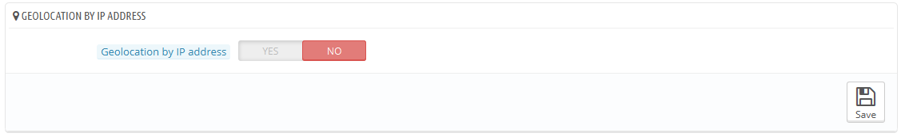
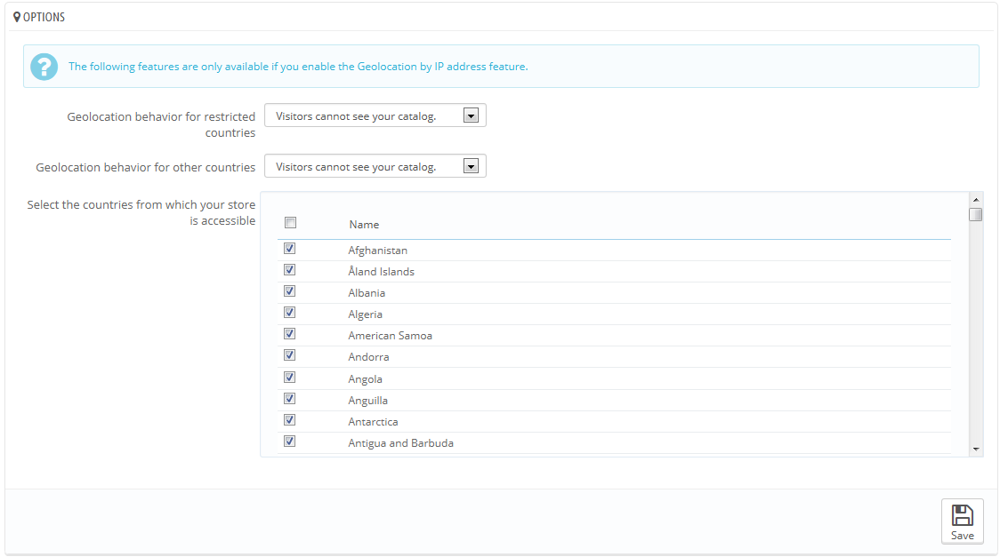
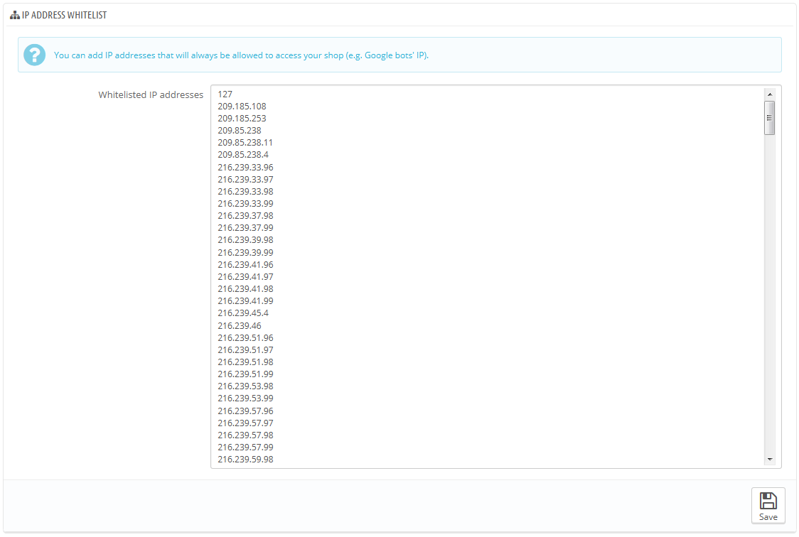

# Geotargeting

Geotargeting " ordnet IP-Adressen oder IPTC/XMP ihrer geografischen Herkunft zu." (lesen Sie mehr auf [http://en.wikipedia.org/wiki/Geolocation](http://en.wikipedia.org/wiki/Geolocation)). In unserem Fall wird Geotargeting verwendet, um den Standort eines Besuchers herauszufinden, mit seiner IP und anderen Tools. Eine der Anwendungen von Geotargeting ist es, Besucher aus bestimmten Städten / Ländern zu blockieren.

Wie auf der Seite angedeutet, müssen Sie, um Geotargeting ausführen zu können, zuerst eine spezielle Datei downloaden: [http://geolite.maxmind.com/download/geoip/database/GeoLiteCity.dat.gz](http://geolite.maxmind.com/download/geoip/database/GeoLiteCity.dat.gz). Diese Datei ist die Datenbank von MaxMind, eine genaue Datenbank von Städten und Orten. Laden Sie sie herunter, indem Sie auf den Link klicken, entpacken Sie den Inhalt dann in das / tools / geoip / Verzeichnis Ihrer PrestaShop Installation

Sobald die Datei dort platziert ist, aktivieren Sie die Option "Geotargeting über IP-Adresse" und die Funktion wird aktiviert.

## Optionen 

Sie können wählen, welche Länder auf Ihren Shop zugreifen können(standardmäßig alle) und Verhaltensweisen für eingeschränkte und uneingeschränkte Länder (oder "andere" Länder) festlegen. Sie können zwischen diesen drei Möglichkeiten wählen:

* Besucher können Ihren Katalog nicht sehen.
* Besucher können Ihren Katalog sehen, aber keine Bestellung aufgeben. Wie der „Katalog“-Modus.
* Alle Funktionen sind verfügbar (nur für die uneingeschränkten Länder).

Sie können Länder aktivieren oder deaktivieren, indem Sie auf die Kontrollkästchen am Anfang der Liste klicken. Stellen Sie bei der Auswahl der Länder, die auf Ihren Online-Shop zugreifen können, sicher, kein Land aus Versehen zu blockieren, da Sie sonst potenziellen Umsatz durch seine Bewohner verlieren!

## Whitelist der IP-Adressen 

Dieser Abschnitt ermöglicht es Ihnen, bestimmte IPs trotz Blockens zuzulassen. Dies kann bei Spammern, Bots oder Angriffen Abhilfe schaffen. Es ist bereits eine Liste von bekannten guten IPs gefüllt. Fügen Sie so viele wie nötig ein, eine pro Zeile, und klicken Sie auf "Speichern".

