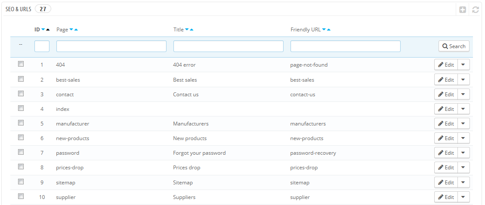
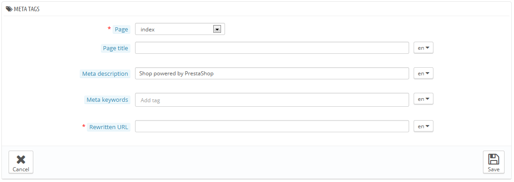
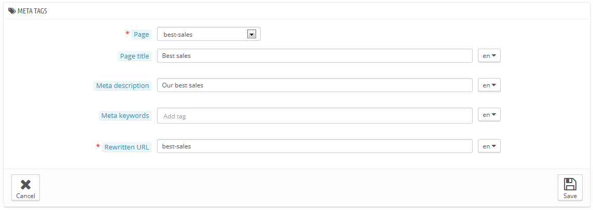
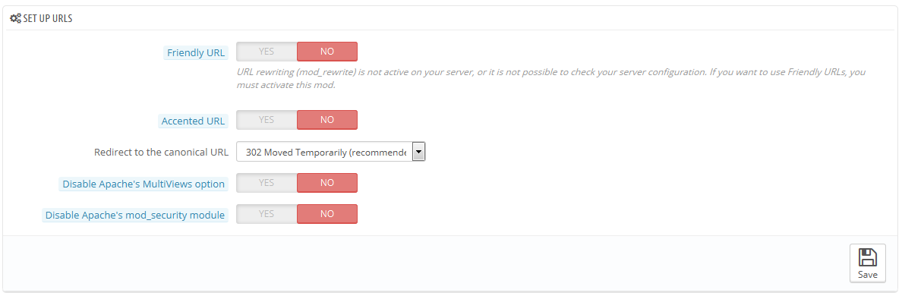
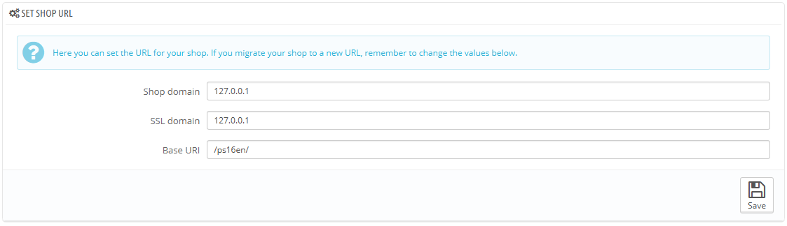
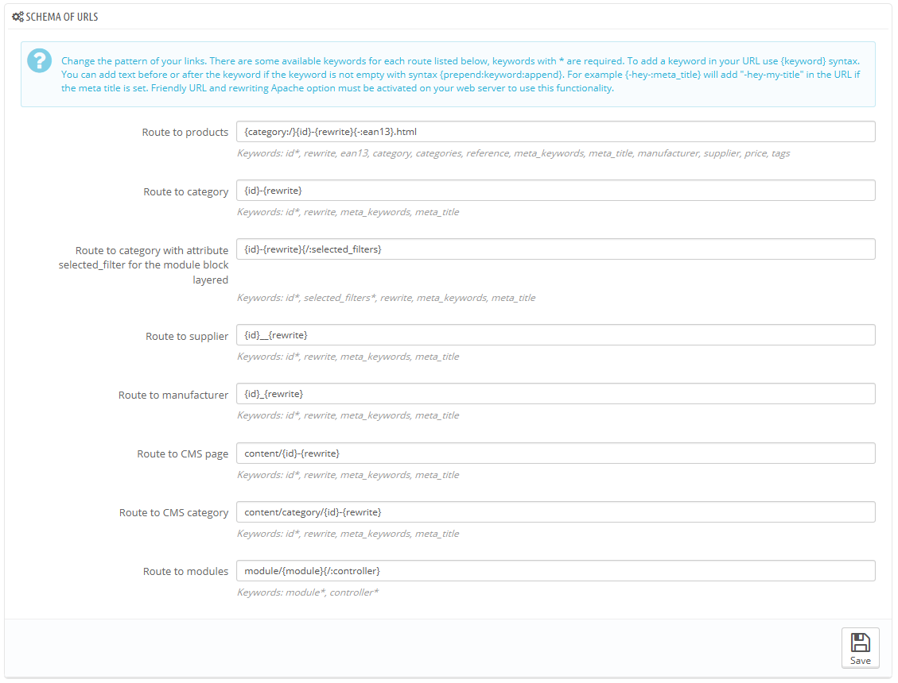
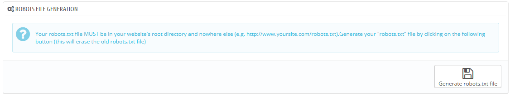

# SEO & URLs

Die Tools auf dieser Seite helfen Ihnen, die Präsenz Ihrer PrestaShop Website bei Suchen zu verbessern, und somit mehr potenzielle Kunden zu erreichen.

SEO bedeutet Suchmaschinen-Optimierung auf Deutsch übersetzt. Eine Reihe von Techniken zur Verbesserung der Sichtbarkeit einer Website für Suchmaschinen. [Http://en.wikipedia.org/wiki/Search\_engine\_optimization](http://en.wikipedia.org/wiki/Search\_engine\_optimization): Sie können mehr über das Thema auf dieser Wikipedia-Seite lesen.

URL ist die Abkürzung für "Uniform Resource Locator", oder einfacher gesagt die Online-Adresse einer Web-Seite. Sie können mehr über URLs bei Wikipedia lesen: [http://en.wikipedia.org/wiki/URL](http://en.wikipedia.org/wiki/URL)

Standardmäßig sind die PrestaShop deep URLs (dh PHP-Einträge anstatt sprechende Namen) sind eher wenig informativ, sowohl für den Kunden, als auch für Suchmaschinen: eine URL wie [http://www.myprestashop.com/product.php?id\_product=](http://www.myprestashop.com/product.php?id\_product=) 27 lässt Besucher nicht wissen, welches Produkt auf dieser Seite zu finden ist. Benutzerfreundliche URLs sind der Weg dies zu erreichen, zum Beispiel [http://www.myprestashop.com/2-music-players/27-ipod-nano-green](http://www.myprestashop.com/2-music-players/27-ipod-nano-green).

Wie Sie oben im zweiten Beispiel sehen können, können Kategorien und Produkte eine Benutzerfreundliche URL haben: im obigen Beispiel wird es wie folgt festgelegt: id\_category = 2 wird zu 2-Musik-Player und id\_product = 27 wird zu 27-ipod-nano-Grün. Während die IDs standardmäßig nicht entfernt werden können, können die Wörter entweder aus dem Kategorie / Artikelnamen erzeugt werden, oder manuell geschrieben. Im Tab "SEO" der jeweiligen Konfiguration kann man sofort das Feld „Benutzerfreundliche URL“ finden.

Es gibt noch andere einzelne Seiten in Ihrem PrestaShop, die von benutzerfreundlichen URLs profitieren: CMS-Seiten, Benutzerkonto-Seiten, Seiten mit automatisch generierten Inhalten ... Die "SEO & URLs"-Seite zeigt Ihnen eine Liste der Seiten und ermöglicht Ihnen, ihre benutzerfreundlichen URLs sowie deren Meta-Tags (Titel, Beschreibung, Tags) zu bearbeiten.

Benutzerfreundliche URLs funktionieren nur mit einem Server-Setup, das URL-Rewriting unterstützt (durch den Apache-Webserver mod\_rewrite Funktion, zum Beispiel). Überprüfen Sie, ob Ihr Server diese Funktion hat (fragen Sie Ihren Hosting-Provider!), sonst kann Ihr Shop völlig unzugänglich werden, wenn Sie URLs aktivieren, die der Server nicht unterstützt!

Homepage SEO settings

Um die Meta-Tags der Homepage zu ändern, müssen Sie lediglich die "SEO & URLs" Seite öffnen, die Einstellungen der "index"-Seite öffnen, und dort die SEO Informationen bearbeiten.

Ein paar Tipps:

* Der Standard-Homepage-Titel ist der Name des Shops, und daher ist das Feld „Seitentitel“ leer. Wenn Sie etwas in das Feld eintragen, wird der vollständige Titel der Homepage folgender sein "\<Inhalt> - \<Name des Shops>".\
  Der Name des Shops wird während der Installation von PrestaShop festgelegt, kann aber von der "Shopadressen"-Einstellungsseite geändert werden (Option "Name des Shops" im "Kontaktangaben" Abschnitt).
* Halten Sie Ihre Beschreibung kurz: Ein Textabsatz ist genug.
* Um einen Tag hinzuzufügen, klicken Sie auf das Feld "Tag hinzufügen" und bestätigen Sie mit Enter. Sie können Tags entfernen, indem Sie auf das Kreuz klicken.
* Sie müssen bei URL-Rewrite nichts einfügen, wenn dort nicht sowieso schon etwas steht.

Beachten Sie, wenn Ihr Shop bereits von Google oder einer anderen Suchmaschine indiziert wurde, könnte es eine Weile dauern, bis die Änderungen in den Suchergebnissen angezeigt werden. Bitte haben Sie Geduld.

An der Unterseite der "SEO & URLs" -Seite gibt drei Abschnitte mit zusätzlichen Optionen: URL Einstellungen, Shop-URL festlegen und Robots-Datei erzeugen. Siehe unten für eine Erklärung von diesen.

## Hinzufügen einer neuen benutzerfreundlichen URL 

Benutzerfreundliche URLs können auf der Konfigurationsseite von jedem Artikel, Kategorie, CMS-Seite eingestellt werden ... Diese Erstellungsseite ist nur für einige automatische Seiten nützlich, die meiste Zeit werden Sie sich nicht um diese kümmern müssen.

Stellen Sie sicher, die Felder für alle verfügbaren Sprachen in Ihren Shop zu füllen: es ist nicht nur für Benutzer der jeweiligen Länder ungemein nützlich, einige Suchmaschinen können dies sogar ausnutzen.

Klicken Sie auf den "NEU" Button, um das Erstellungsformular für  benutzerfreundliche URLs zu öffnen. Hier gibt es folgende Felder:

* **Seite**. Die Dropdown-Liste zeigt Ihnen alle Seiten, die von einer benutzerfreundlichen URL profitieren können.
* **Seitentitel**. Der Titel, der bei einer Suchanfrage in Suchmaschinen angezeigt wird.
* **Meta-Beschreibung**. Eine Präsentation der Seite in wenigen Worten, um das Interesse des Kunden zu erreichen. Sie wird in den Suchergebnissen angezeigt.
* **Meta-Suchworte**. Sie müssen Suchwörter definieren, damit Suchmaschinen Ihre Seite referenzieren. Sie können mehrere eintragen: Geben Sie die Worte und drücken Sie Enter, der Tag wird in einem gelben Block gekapselt, mit einem kleinen Kreuz-Symbol am Rand, um ihn wieder zu löschen.
* **URL-Rewrite**. Hier können sie die benutzerfreundliche URL festlegen. Am besten kurz und deskriptiv. Verwenden Sie nur Buchstaben und Zahlen und ersetzen Sie Leerzeichen (" ") durch Bindestriche ("-").

## URL-Einstellungen 

Die wichtigsten Optionen für benutzerfreundliche URLs:

*   **Benutzerfreundliche URL**. Aktivieren Sie diese Option, wenn Sie wissen, dass Ihr Server URL-Rewriting unterstützt. Wenn nicht, lassen Sie es auf "Nein".

    Möglicherweise sehen Sie eine Meldung wie "URL-Rewriting (mod\_rewrite) nicht aktiv oder Serverkonfiguration kann nicht überprüft werden. Wenn Sie benutzerfreundliche URLs verwenden möchten, müssen Sie diese Funktion aktivieren". In diesem Fall kann PrestaShop Ihre Server-Einstellungen nicht erkennen, aber das bedeutet nicht, dass die Funktion nicht funktioniert. Sie müssen es selbst testen.
* **URL mit Umlauten**. PrestaShop ist jetzt in der Lage, URLs mit Sonderzeichen für Artikel mit nicht-ASCII-Namen zu erzeugen. Sie können diese Option hier deaktivieren.
* **Zur kanonischen URL weiterleiten**. Eine PrestaShop-Seite kann viele URLs haben, am häufigsten, wenn Parameter berücksichtigt werden müssen: zum Beispiel führen [http://example.com/product.php?id=5\&option1](http://example.com/product.php?id=5\&option1) und [http://example.com/product.php?id](http://example.com/product.php?id) = 5 & option2 Punkt zu dem gleichen Artikel, mit nur einen Unterschied. Da Ihr Artikel eine URL haben soll und nicht viele doppelte, sollten Sie kanonische URLs aktivieren.\
  Kanonische URLs sind eine Möglichkeit, selbst erstellte Duplikate zu beseitigen – welche Ihr Suchmaschinen-Ranking drastisch senken können, da dies als Spam gilt. Um Spam in Suchmaschinen zu vermeiden, Suchmaschinen denken Sie Spamming ihrem Index sind, verwendet PrestaShop den  rel = "canonical" Link-Tag um anzugeben, welche die Basis-URL für einen bestimmten Inhalt ist.\
  Während es wird dringend empfohlen wird, diese Option zu aktivieren, hängt es auch von Ihrem Template ab, den Tag richtig zu verwenden. Benutzen Sie den Template-Designer für weitere Informationen.\
  Es gibt drei Möglichkeiten:\

  * **Kein Redirect**. Sie könnten doppelte URLs erhalten.
  * **301 dauerhaft verschoben**. Gibt den HTTP-Statuscode 301 und zeigt auf die Haupt-URL, damit Suchmaschinen nur noch die Haupt-URL berücksichtigen.
  * **302 Temporär verschoben**. Gibt den HTTP-Statuscode 302 und zeigt auf die Haupt-URL, damit Suchmaschinen wissen, dass sich die Haupt-URL später ändern könnte.
* **Apache-Option MultiViews abschalten**. Apache ist der beliebteste Web-Server und wird wahrscheinlich von Ihrem Web-Host für Ihre Website verwendet (Sie sollten dies selbst nochmal überprüfen). Multiview ist ein Content-Negotiation-System: Wenn aktiviert, versucht der Web-Server dem Benutzer eine Seite in der für ihn am besten passenden Sprachversion unter der gleichen URL zu zeigen. Leider könnte dies zu Problemen mit den PrestaShop benutzerfreundlichen URLs führen. Wenn dies der Fall ist, können Sie versuchen, Multiview mit dieser Option zu deaktivieren.
* **Apache-Option mod\_security abschalten**. mod\_security ist ein Modul des Apache-Web-Servers, das als Firewall fungiert und Ihren Server vor Angriffen schützt. Es kann jedoch auch einige Features blocken oder sogar Fehler in bestimmten Konfigurationen erzeugen. In einem solchen Fall schalten Sie bitte die Firewall hier aus.

In früheren Version von PrestaShop musste man eine neue .htaccess-Datei erzeugen, nachdem benutzerfreundliche URLs aktiviert wurden. Das ist nicht mehr der Fall, seit Version 1.5: die .htaccess-Datei wird nun durch PrestaShop verwaltet, Sie müssen sich nicht mehr darum kümmern.

## Shop-URL festlegen 

In diesem Abschnitt können Sie einige der Standard-Server-Einstellungen sehen und bearbeiten:

* **Shop-Domain**. Hauptdomainname oder IP-Adresse Shops.
* **SSL-Domain**. Die sichere Domain oder IP-Adresse(https: //).
* **URI der Startseite**. Der Ordner, in dem Sie PrestaShop installiert haben. Wenn sie im Root der Domain ist, verwenden Sie "/".

Sie sollten diese Felder nicht bearbeiten, wenn Sie nicht genau wissen, was Sie tun. Ein Fehler könnte Ihren Shop unzugänglich machen.

## URL-Schema 

**Neu in 1.6.**

Sie können die Art, wie benutzerfreundliche URLs generiert werden, ändern, indem Sie die Pfade ändern.

Zum Beispiel ist der Standardpfad zu einem Artikel {category:/}{id}-{rewrite}{-:ean13}.html, der dann zum Beispiel in /summer-dresses/7-printed-chiffon-dress.html resultiert.\
Sie könnten diesen Pfad umschreiben in  `{manufacturer:/}{id}-{rewrite:/}`, um /fashion-manufacturer//7-printed-chiffon-dress/ zu erhalten.

8 Felder stehen standardmäßig zur Verfügung, jedes hat eine Liste der verfügbaren Stichworte. Einige Schlüsselwörter sind Pflichtfelder und sind mit einem \* gekennzeichnet.

Sobald Sie Ihre Felder aktualisiert haben sollten Sie nicht vergessen, auf die Schaltfläche "Speichern" im Abschnitt "URL-Einstellungen" zu klicken, um Ihre .htaccess-Datei, die für Ihre benutzerfreundlichen URLs notwendig ist, neu zu erstellen.

## Robots-Datei erzeugen 

Eine robots.txt-Datei kann bestimmte automatisierte Bots und Web-Spiders, die durch das Web crawlen, um mehr Web-Seiten auf ihrem Server hinzuzufügen, blockieren. Einige Bots sollten Sie nicht blockieren, damit diese vollen Zugriff auf Ihre Website haben, Dienste wie Google oder Yahoo. Es gibt jedoch einige andere, die meistens nur Schaden anrichten, wie beispielsweise Spam-Bots, Content Thiefs, E-Mail-Collectors, usw. Beachten Sie, dass Bots dies einfach ignorieren können, das es keine Direktive ist, sondern nur ein Vorschlag.

Das PrestaShop Tool zur Erstellung von robots.txt erzeugt einfach eine Datei mit Ausschluss Richtlinien für Dateien und Verzeichnisse, die nicht für die Öffentlichkeit bestimmt sind und nicht indiziert werden sollten. Diese Richtlinien gelten für alle Bots, gut oder schlecht: die erzeugte Datei verwendet "User-agent: \*" string.

Durch Klicken auf die Schaltfläche "robots.txt erzeugen" werden alle bestehenden robots.txt-Dateien durch eine neue ersetzt. Wenn Sie also eigene Regeln hinzufügen möchten, tun Sie es nachdem PrestaShop seine Version der Datei erstellt hat.

