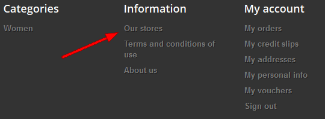
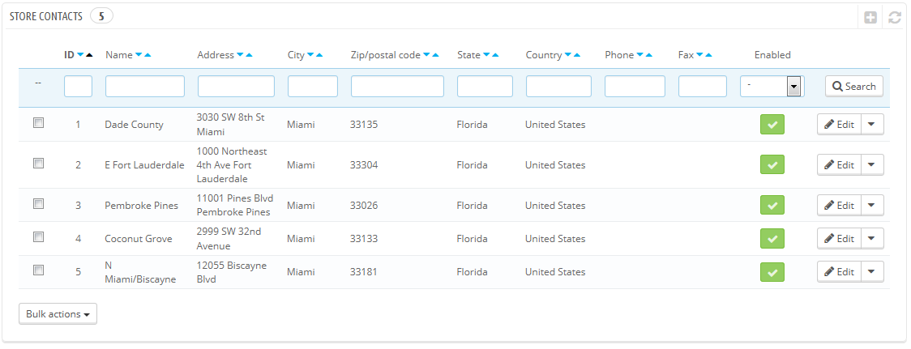
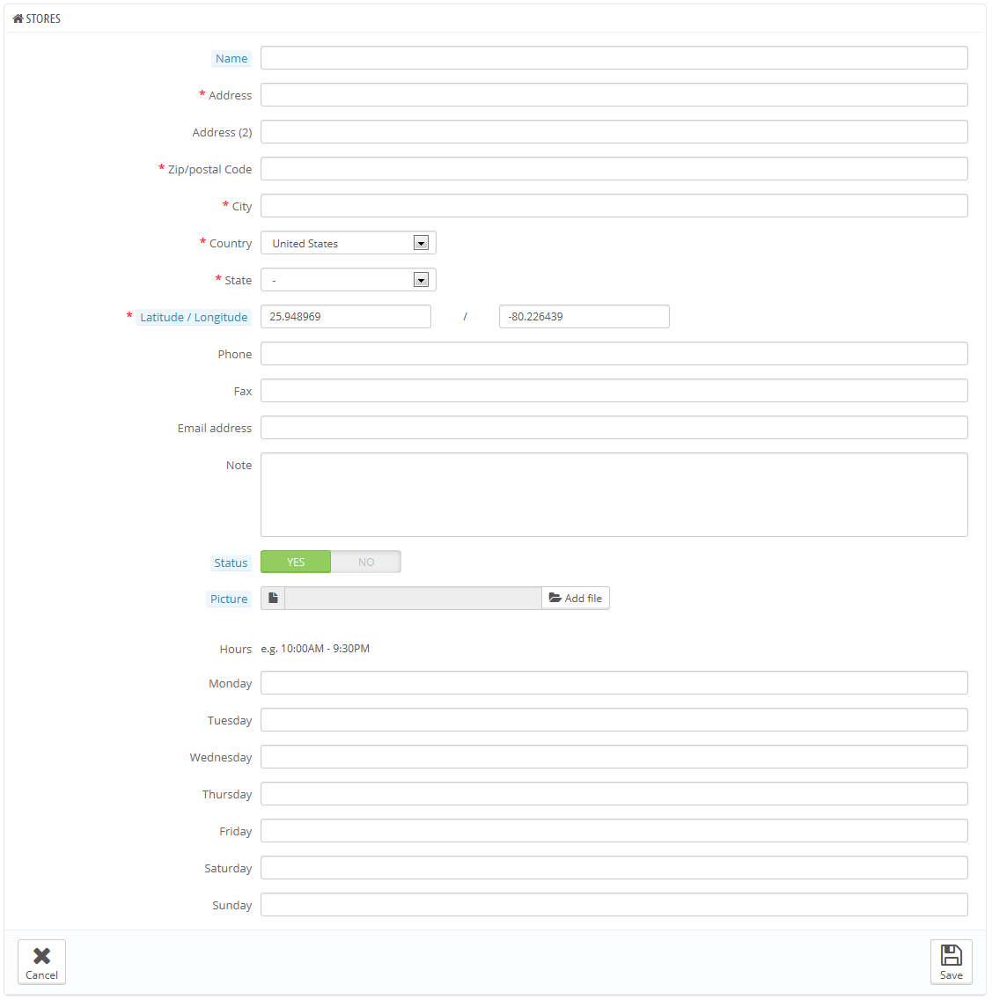
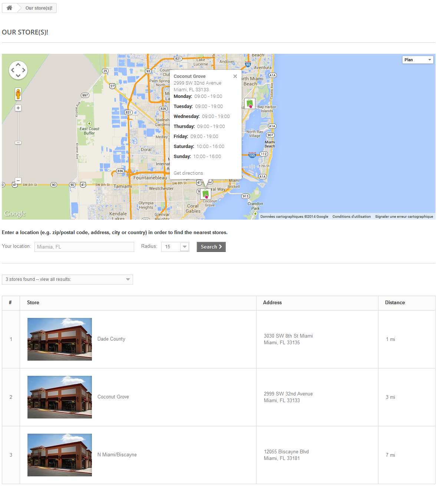
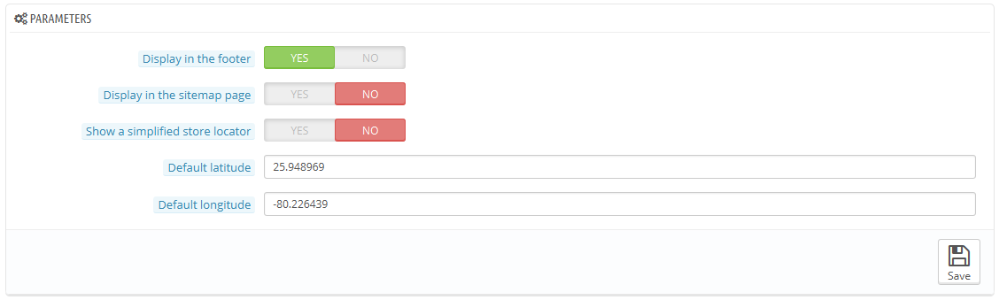
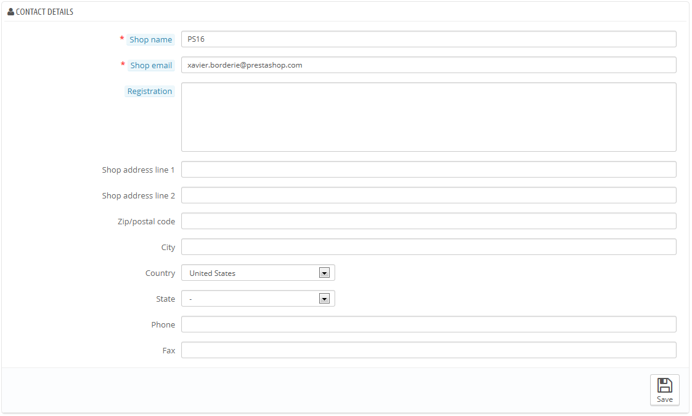

# Shopadressen

PrestaShop bietet ein vollständiges Lokalisierungstool für Ihre Kunden, mit detaillierten Kontaktinformationen angegeben.

Benutzer können die Seite Shop-Finder aus dem Front-Office erreichen.

Offensichtlich ist diese Funktion nur dann sinnvoll, wenn Sie physische Geschäfte haben, wohin Kunden kommen können, um Produkte zu kaufen.

Sie können diese Funktion nicht deaktivieren, aber Sie können Sie für Kunden unerreichbar machen:

* Löschen Sie alle Geschäfte auf der "Shopadressen" Verwaltungsseite. Der Shop-Finder Block wird nicht mehr auf der Front-Seite angezeigt.
* Gehen Sie auf die "Module" Seite im Menü "Module". Finden Sie das "Shop-Finder" Modul und deaktivieren Sie es.
* Deaktivieren Sie den Link in der Fußzeile: Auf der "Shopadressen" Verwaltungsseite wählen Sie "Nein" für die Option "Anzeige im Footer".

Wenn Sie die Geschäfte in der Datenbank haben, aber sie nicht im Front Office anzeigen wollen, führen Sie folgende Anweisungen vorübergehend oder dauerhaft aus:

1. Gehen Sie auf die "Positionen" Seite im Menü "Module".
2. Suchen Sie den Abschnitt " displayRightColumn ", um den "Shop-Finder" aus der Liste zu löschen, klicken Sie entweder auf das Papierkorb-Symbol, oder markieren Sie das entsprechende Kontrollkästchen und klicken Sie auf den "Ausgewählte Objekte entfernen" am oberen Rand der Seite.
3. Laden Sie die Seite neu: der Shop-Finder-Block sollte nicht mehr hier sein. Wenn er immer noch aktiv ist, könnte das am Cache liegen: gehen Sie zur "Leistung"-Seite des Menüs "Erweiterte Einstellungen", und deaktivieren Sie den Cache vorübergehend. Sobald das erledigt ist, laden Sie die Seite neu.

Sie können den Block auch zurück in die rechte Spalte der "Positionen" Seite einstellen:

1. Klicken Sie auf den "Modul hinzufügen" Button oben rechts auf der Seite.
2. Wählen Sie die das "Shop-Finder" Modul in der Liste.
3. Wählen Sie den "displayRightColumn (rechte Spalte Blöcke)" Hook.
4. Speichern Sie die Seite. Laden Sie die Front-Seite: Der Shop-Finder-Block sollte wieder in der rechten Spalte zu sehen sein.

## Shop-Liste 

Sie können wählen, wie diese Geschäfte im Front-Office angezeigt werden. Der Kunde kann auf diese über den Link "Unsere Shops" zugreifen (je nach Template)

Alle Ihre Geschäfte sind in einer praktischen Liste aufgeführt, mit Informationen zu jedem Geschäft sowie einem Indikator, der anzeigt, ob der Laden gerade geöffnet hat oder nicht - Sie könnten zum Beispiel die Informationen für eine neue Filiale im Voraus sammeln, um seine Seite bereit für die Eröffnung zu haben.

### Das Hinzufügen eines neuen Geschäfts 

Wie üblich klicken Sie auf "NEU", um zum Erstellungsformular zu gelangen.

Füllen Sie so viele Felder wie möglich aus, so werden sie Ihren Kunden in der Karte korrekt angezeigt.

Ein sehr wichtiger Bereich ist der "Breiten- / Längengrad", denn PrestaShop verwendet diese Daten, um die Position Ihres Shops anzuzeigen. Sie können das Online-Tool Steve Morse verwenden, um die Koordinaten einer angegebenen Adresse zu bekommen: [http://stevemorse.org/jcal/latlon.php](http://stevemorse.org/jcal/latlon.php).

Achten Sie darauf, ein Bild der Ladenfront hinzuzufügen, so sind Ihre Kunden in der Lage, Ihr Geschäft auf der Straße zu finden.

Schließlich sind die Geschäftszeiten ein wesentlicher Bestandteil eines jeden Geschäfts, und Sie sollten so präzise wie möglich sein.

## Einstellungen 

* **Anzeige im Footer**. Standardmäßig zeigt PrestaShop einen Link zum Shop-Finder mit dem Titel "Unsere Shops" in der Fußzeile Ihres Shops. Im Standard-Template findet man dies im "Information" Block, unter den besonderen Einträgen (Bestseller, neue Produkte, Sonderangebote, etc.). Sie können sich entscheiden, den Link hier nicht anzeigen zu lassen.
* **Auf der Sitemap-Seite anzeigen**. Sie können den Link "Unsere Shops" auf der Sitemap Ihres Shops anzeigen lassen, die alle Seiten auf Ihrer Website listet (nicht mit der Google-Sitemap-Datei zu verwechseln, die für SEO Zwecke genutzt wird).
* **Vereinfachte Anzeige der Ortsbestimmung des Shops**. Reduziert die Geschäfte auf eine Liste, ohne Karte und Funktion.
* **Standard-Breitengrad und Standard-Längengrad**. Die Standard-Startposition Ihrer Karte. Sehr nützlich, wenn Sie viele Geschäfte haben und Sie lieber die Aufmerksamkeit der Kunden auf einen bestimmten Bereich lenken wollen.

## Kontaktangaben 

Dieser Abschnitt ermöglicht es Ihnen, die wichtigsten Details Ihres Unternehmens anzugeben, anstatt die von einem bestimmten Geschäft. Sie sollten alle Felder mit Informationen zu Ihrem Sitz füllen, so ist dies sicher die Adresse, die Kunden verwenden können, um Sie zu kontaktieren, oder sogar zu besuchen.

Diese Felder sollten sorgfältig ausgefüllt werden:

* Name des Shops. Der Name Ihres Shops. Halten Sie ihn kurz, denn er wird in all Ihren Seitentiteln verwendet und referenziert.
* E-Mail des Shops. Die offizielle Adresse für Ihr Unternehmen. Verwenden Sie die Kontakt-E-Mail-Adresse, die die Kunden sehen sollen, wenn sie eine E-Mail von Ihrem Shop erhalten.
* Anmeldung. Geben die gesetzlichen Registrierungsnummern Ihrer Firma an, die auf dem Rechtssystem Ihres Landes (DUNS-Nummer in den USA, SIRET-Nummer in Frankreich, CNPJ Zahl in Brasilien, etc.) beruhen. Dies zeigt, dass Sie eine voll registrierte Firma sind, wodurch Kundenvertrauen gesteigert werden kann.
* Adresse Zeile 1 / Adresse Zeile 2 / PLZ / Stadt/ Bundesland / Land. Verwenden Sie die offizielle Adresse Ihres Unternehmens. Die Option "Bundesland" wird nur angezeigt (durch die "Bundesländer" Seite im Menü "Lokalisierung"), wenn das ausgewählte Land festgelegte Bundesländer in Ihrer Datenbank hat.
* Telefon. Die offizielle Kontakttelefonnummer für Ihr Unternehmen. Wenn Sie diese Angabe nicht wünschen, lassen Sie sie frei.
* Fax. Die offizielle Kontakt Faxnummer für Ihr Unternehmen.

Verwenden Sie keinen Doppelpunkt (":") im Namen Ihres Shops, da sonst einige Features (zum Beispiel E-Mail-Versand kann fehlschlagen) nicht funktionieren.

Sie können den Doppelpunkt mit einem Spiegelstrich ersetzen, wenn nötig. Beispielsweise können Sie schreiben: "MyStore - Der beste Platz für Produkte" anstelle von "MyStore: Der beste Platz für Produkte."
