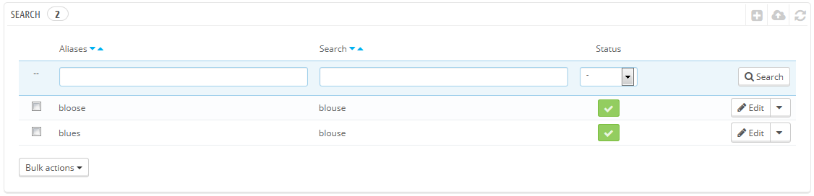
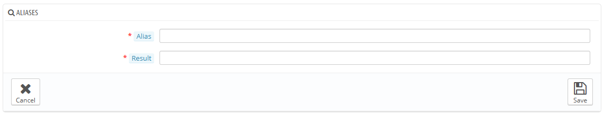
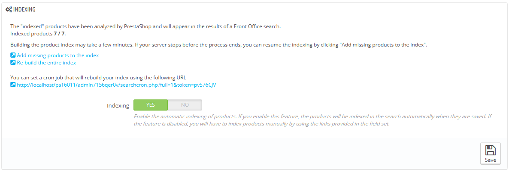
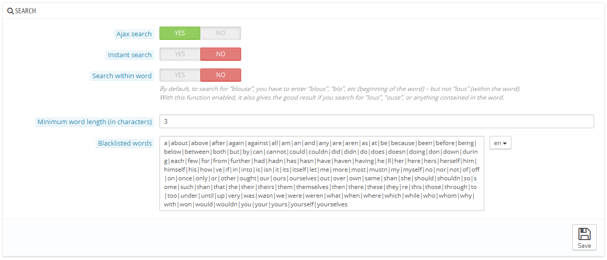
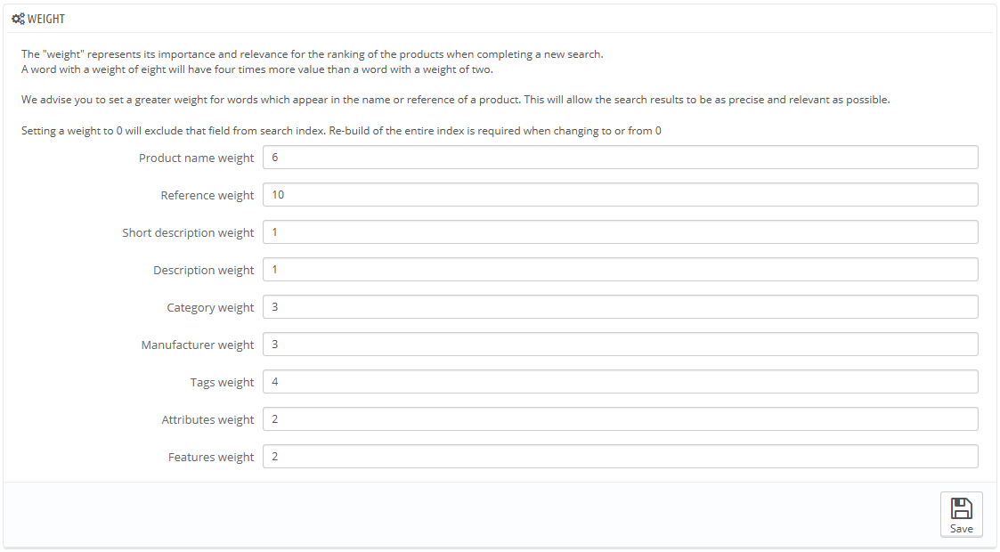

# Suche

Auf der "Suchen"-Seite können Sie Ihre Shop-Suchfunktionen konfigurieren.

## Suche 

Wenn Kunden eine Anfrage mit Ihrer Shop-internen Suchmaschine machen, können sie Fehler in der Rechtschreibung machen. Wenn PrestaShop dann nicht die richtigen Ergebnisse anzeigt, kann die "alias" Funktion dieses Problem lösen. Sie sind in der Lage, Wörter mit Rechtschreibfehlern zu nehmen und auf die korrekten Wörter verweisen zu lassen.

Um einen nützlichen Alias zu erstellen, sollten Sie zuerst herausfinden, welche Rechtschreibfehler am häufigsten durch Benutzer eingegeben werden:

1. Gehen Sie auf die Rubrik "Shop-Suche" -auf der Seite "Statistik" unter dem Menüpunkt "Statistik". Sie können die eingegebenen Wörter Ihrer Kunden, als auch die häufigsten Fehler sehen.
2. Nehmen Sie die häufigsten, und fügen Sie sie in die Liste der Aliaswörter ein, um Benutzer auf die richtigen Produkte zu verweisen.
3. Klicken Sie auf der Einstellungsseite „Suche“ auf die Schaltfläche "Neuen Alias hinzufügen".

Das Erstellformular ist sehr einfach: Sie geben den Tippfehler ein, der korrigiert werden soll, und das richtige Wort.

Zum Beispiel, sagen wir, Ihre Besucher schreiben häufig "Player" als "palyer" und "plaier". Sie können einen Alias für jeden dieser Tippfehler, die zum Wort "Player" gehören, erstellen. Ihre Aliase können, sobald sie gespeichert sind, verwendet werden.

Sie sollten auch die Abschnitte in diesem Handbuch zu den Meta-Tags durchlesen, um besser zu verstehen, wie man Artikel anzeigt, die sich auf eingegebene Wörter Ihrer Kunden beziehen. Siehe "Verwaltung des Katalogs".

## Indizierung 

Dieser Abschnitt enthält Informationen über die Anzahl der Artikel, die durch die Suchfunktion Ihres Shops durchsucht werden können, und vergleicht sie mit der Anzahl der in der Datenbank vorhandenen Produkte.\
Wenn die Werte nicht übereinstimmen, müssen Sie auf die Schaltfläche "Fehlende Artikel indizieren" klicken. Nur die neuen Produkte werden indiziert.\
Wenn Sie mehrere Änderungen an bereits indizierten Produkte vorgenommen haben, können Sie „Index vollständig regenerieren“ wählen. Der Prozess "Index vollständig regenerieren" nimmt mehr Zeit in Anspruch, ist aber viel gründlicher.

PrestaShop gibt Ihnen auch die URL, mit der Sie einen Cronjob für die regelmäßige Neuindizierung erstellen können. Wenn Sie cron und crontab nicht kennen, fragen Sie Ihren Web-Host.

Schließlich ermöglicht die Option "Indexing" Ihnen, ein Produkt zu indizieren, sobald es erstellt / geändert wurde, damit was einen Cronjob nutzlos macht.

## Suchoptionen 

Dieser Abschnitt ermöglicht es Ihnen, das Verhalten der Suchfunktion Ihres Shops zu konfigurieren:

* **Ajax-Suche**. Hier werden die ersten 10 Suchanfragen des Besuchers in Echtzeit unter dem Eingabefeld während der Eingabe angezeigt
* Sofortsuche. Bei Sofortsuche werden schon bei Abfrageeingabe alle passenden Artikel angezeigt. Diese Einstellung ist standardmäßig deaktiviert, weil die Besucher nicht immer wollen, dass Ergebnisse schon nur nach Eingabe einiger Buchstaben in die Suchleiste angezeigt werden. Verwenden Sie die Funktion deshalb mit Vorsicht.
* **Wortbestandteil suchen**. Diese Option verbessert die Suche, indem Sie Abfragen richtig bearbeitet, die nicht nur den Anfang des Suchwortes enthalten; zum Beispiel "lu" für "Bluse".
* **Minimale Wortlänge**. Sie können die Mindestlänge der Wörter festlegen, auf die im Suchindex reagiert wird. Diese Funktion ermöglicht es Ihnen, kurze Wörter, wie Präpositionen oder Waren (die, und, der, etc.) aus den Suchanfragen zu beseitigen.
* **Nicht zu indizierende Wörter**. Sie können die Wörter, die von Ihren Besuchern eingegeben werden dürfen, weiter filtern. Geben Sie diese direkt in das Feld, getrennt durch "|" ("pipe" alt+<, nicht kleines L) ein. Standardmäßig füllt PrestaShop die Liste automatisch mit ein paar kurzen Worten.

## Gewicht 

PrestaShop ermöglicht es Ihnen, bestimmte Daten zu priorisieren, wenn eine Suche in Ihrem Shop durchgeführt wird.

Das "Gewicht" eines Artikels stellt seine Bedeutung und Relevanz für das Ranking der Produkte dar, wenn Kunden eine Suche starten. Ein Element mit einem Gewicht von 8 hat 4-mal höhere Priorität als ein Element mit einem Gewicht von 2.

Zum Beispiel: "Gewichtung Artikelbezeichnung" ist standardmäßig auf 6, "Gewichtung Tags" ist 4, und "Gewichtung Kurzbeschreibung", sowie "Gewichtung Langbeschreibung" sind bei 1. Dies bedeutet, dass ein Produkt mit "ipod" im Namen eher in den Suchergebnissen erscheint als ein anderes Produkt, das nur den Tag "ipod" hat. Inzwischen wird ein Produkt, das "iPod" nur in der Beschreibung hat, den niedrigsten Rang in den Suchergebnissen haben.

Es gibt viele Faktoren, denen man eine Gewichtung zuweisen kann: kurze Beschreibung, Kategorie, Tags, Eigenschaften, etc. Sie werden feststellen, dass die Anzeigereihenfolge der Ergebnisse umgedreht werden kann, da die Gewichtung aller verschiedenen Felder geändert werden kann. Feinabstimmung wird mehr Einfluss auf einen großen Katalog mit vielen Referenzen haben.

Sobald Sie Ihre Änderungen speichern, werden sie sofort wirksam.
