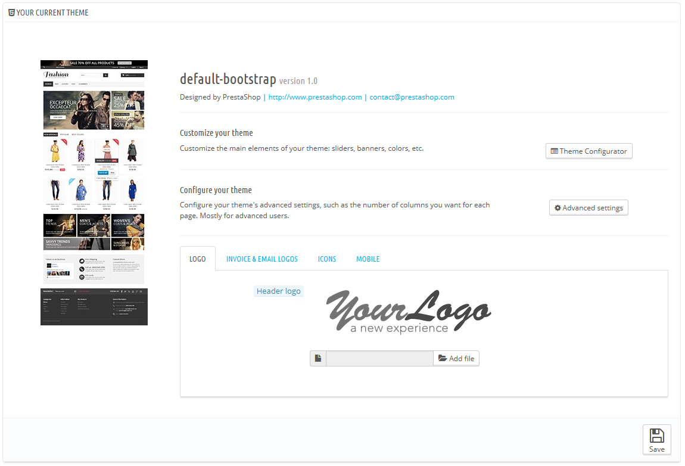
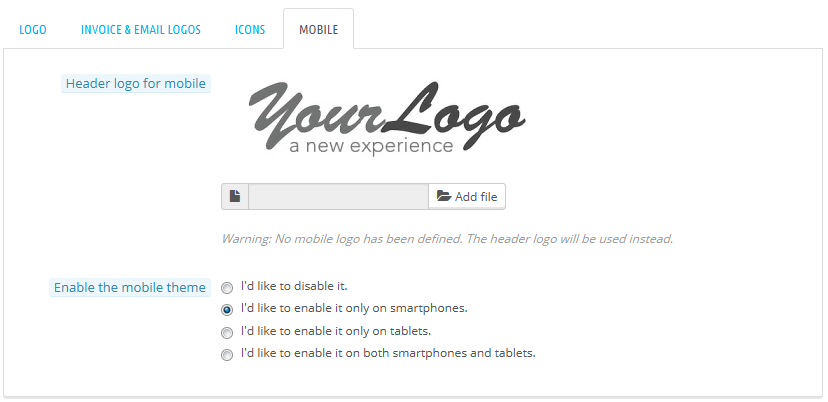
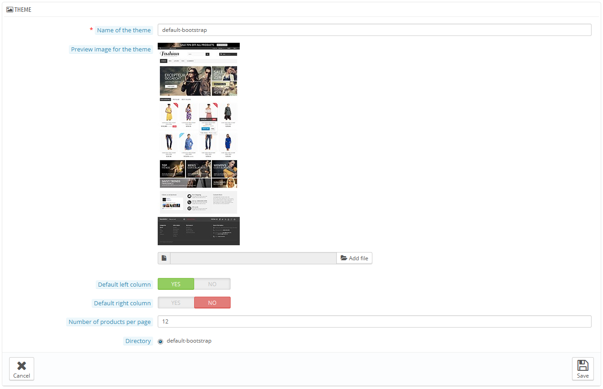
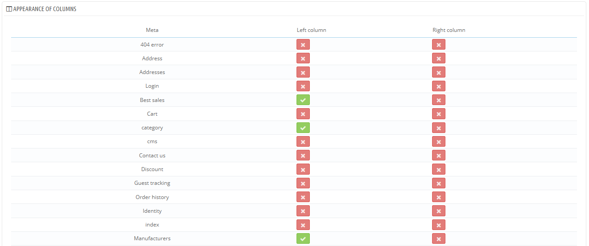
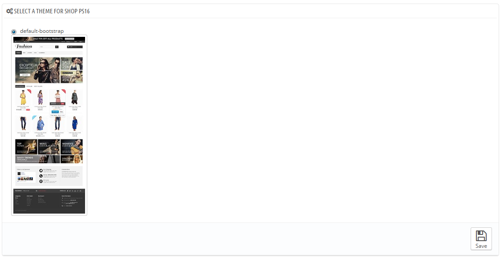
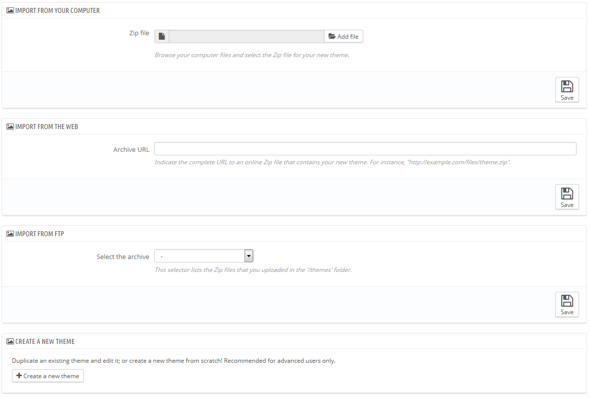
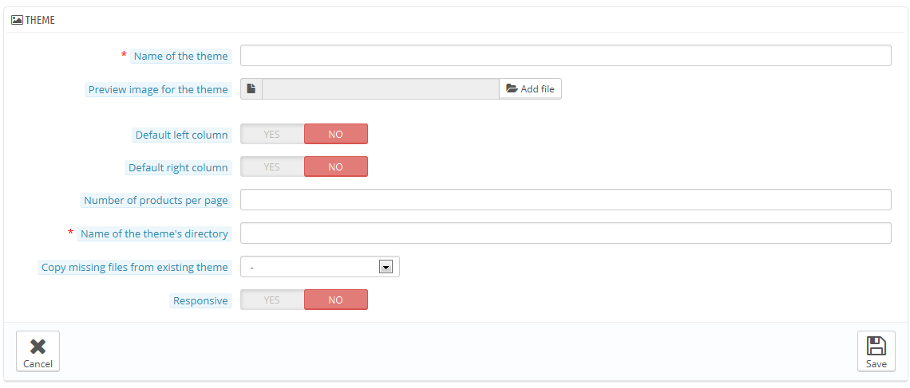
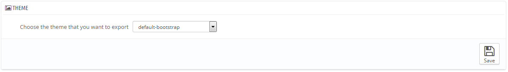
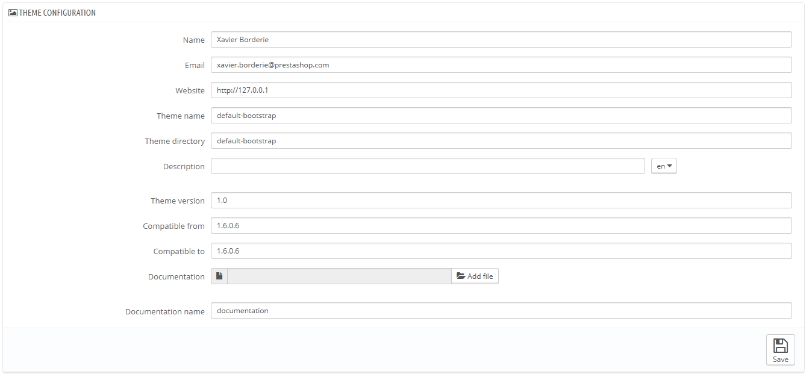
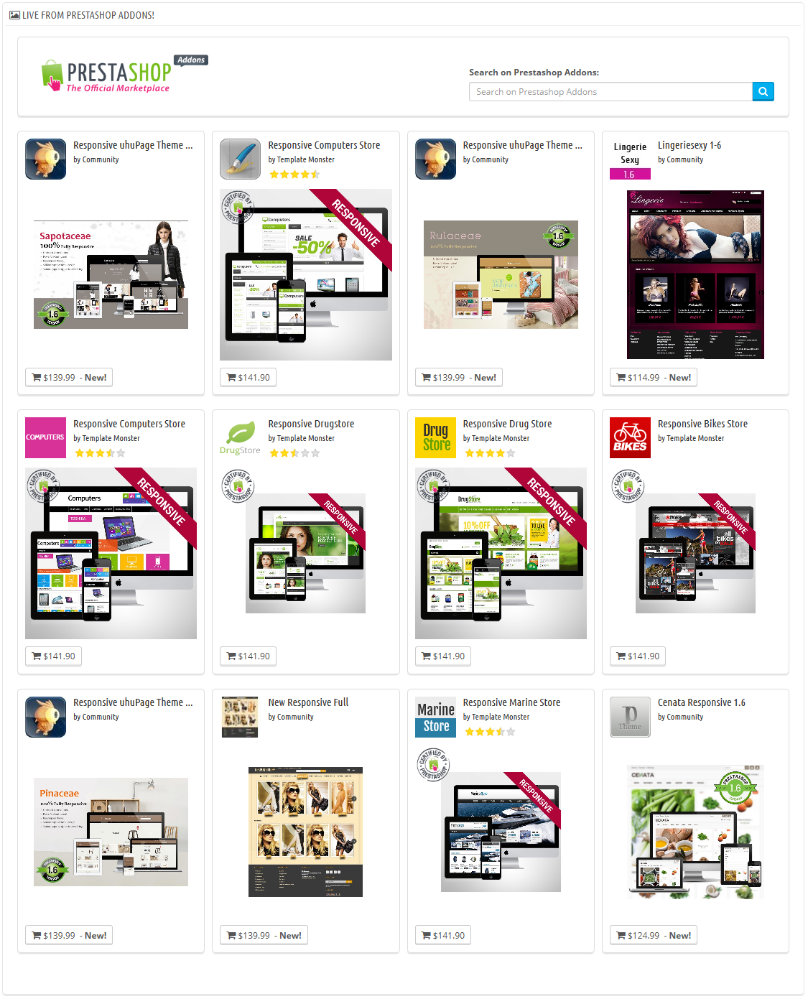

# Templates

/\*\<!\[CDATA\[\*/\
div.rbtoc1597071541078 {padding: 0px;}\
div.rbtoc1597071541078 ul {list-style: disc;margin-left: 0px;}\
div.rbtoc1597071541078 li {margin-left: 0px;padding-left: 0px;}\
\
/\*]]>\*/

* [Templates Voreinstellungen](templates.md#Templates-TemplatesVoreinstellungen)
  * [Aktuelles Template](templates.md#Templates-AktuellesTemplate)
    * [Der Template-Konfigurator](templates.md#Templates-DerTemplate-Konfigurator)
    * [Erweiterte Einstellungen des Templates](templates.md#Templates-ErweiterteEinstellungendesTemplates)
  * [Wählen Sie ein Template für Ihren Shop](templates.md#Templates-WählenSieeinTemplatefürIhrenShop)
  * [Hinzufügen und Exportieren eines Templates](templates.md#Templates-HinzufügenundExportiereneinesTemplates)
    * [Ein Template importieren: Klicken Sie auf "Template hinzufügen"](templates.md#Templates-EinTemplateimportieren:KlickenSieauf%22Templatehinzufügen%22)
    * [Erstellung eines brandneuen Templates](templates.md#Templates-ErstellungeinesbrandneuenTemplates)
    * [Ein Template Exportieren](templates.md#Templates-EinTemplateExportieren)
  * [Direkt aus PrestaShop Addons!](templates.md#Templates-DirektausPrestaShopAddons!)

Auf der "Templates"-Seite können Sie effizient Ihre Templates verwalten.

## Aktuelles Template 

Der erste Abschnitt der Seite dient als Vorschau des Templates, das Sie gerade verwenden, mit seinen Details:

* Template-Name.
* Template-Version.
* Name des Autors, Website und E-Mail-Adresse.
* Miniaturansicht für das Template.

In diesem Abschnitt können Sie auch auf eine Handvoll von Tools zugreifen, die Ihnen helfen, das aktuelle Template schnell anzupassen: Logo der Kopfzeile, E-Mail logo, Rechnungslogo, Favicon, Shop-Symbol. In diesem Abschnitt finden sich folgende Funktionen:

* Template einrichten. Ein Link zum Template-Konfigurator(vorausgesetzt, dass das Template-Konfigurator-Modul tatsächlich installiert und aktiviert ist).
* Erweiterte Einstellungen. Ein Link zu den erweiterten Einstellungen des Templates.
* 4 Registerkarten mit Optionen für das Erscheinungsbild des Templates:\

  * **Logo**. Das Logo, das auf allen Seiten Ihres Shops angezeigt wird.
  * **Logos für Rechnung und E-Mails**. Die Logos, die jeweils auf Rechnungen und deren E-Mail-Benachrichtigungen Ihres Shops angezeigt werden.
  * **Icons**. Favicon Ihres Shops (wird in der Adressleiste des Browsers angezeigt) und Ihr Warenlager-Icon(für den Einsatz auf der Shop Karte als Indikator, wo ein Geschäft ist).
  * **Mobil**. Das Logo, das auf allen Seiten Ihres Shops angezeigt wird, wenn er durch ein mobiles Gerät abgerufen wird. Sie können auch wählen, die mobile Version Ihres Templates für bestimmte Geräte zu aktivieren oder zu deaktivieren.

Das Standard-Template verwendet das "yourlogo" Logo. Es wird dringend empfohlen, alle Logos zu ändern und stattdessen Ihre eigenen zu verwenden!

Im Multishop-Modus können Sie diese Änderungen auf alle Ihre Shops oder nur auf eine Gruppe von Shops anwenden.

"Mobil-Template aktivieren" ermöglicht Ihnen, das Standardmobildesign zu bedienen. Mit diesem Template kann jeder PrestaShop-Händler seinen Shop mobil zugänglich machen: von der Startseite über den Zahlungsprozess bis zu den Artikelseiten und Conversion-Trichter.

Das Mobil-Template funktioniert nur für das PrestaShop Standard-Template, da es in seinem Ordner enthalten ist: / themes / default /mobile. Daher wird es nicht funktionieren, wenn Sie ein anderes Template nutzen, das nicht sein eigenes Mobil-Template besitzt.

Nichtsdestotrotz können Sie das Standardmobildesign mit einem anderen Template verwenden, zumindest temporär: kopieren Sie einfach den Ordner des mobilen Templates aus dem Ordner des Standard-Templates zum Ordner des neuen Templates. Wenn zum Beispiel der Ordner Ihres neuen Templates / themes / Magnolie ist, kopieren Sie / themes / default / mobile zum Ordner des neuen Templates: / themes / magnolia / mobile.\
Dies ist besonders nützlich, wenn das neue Template nicht über ein responsives Design verfügt: auf diese Weise können Sie Ihren Shop immer noch auf mobilen Geräten relativ gut anzeigen lassen- wenn auch mit dem Standard PrestaShop Look.

### Der Template-Konfigurator 

Das Template-Konfigurator Modul hilft Ihnen, einige Aspekte Ihres Templates zu konfigurieren.

Ein Klick auf den Link von der "Templates"-Voreinstellungsseite öffnet seine Konfigurationsseite. Auf dieser Seite finden Sie direkte Links zu den häufigsten Front-Office-Modulen: Sie können hier einige Funktionen, wie die Anzeige der Social Buttons oder den Facebook-Block, aktivieren und deaktivieren (sofern ihre jeweiligen Module aktiviert sind), und direkten Zugriff auf deren Konfigurationsseiten erhalten. Sie können auch den Zugriff auf Live-Edit von dort aus aktivieren, was es ermöglicht, die Hauptfarbe und Schriftart Ihres Templates zu ändern.

In einem zweiten Abschnitt ermöglicht der Template-Konfigurator, auf einfache Weise Bilder mit Links an bestimmten Hooks der Website zu befestigen: home, top, left, right, footer. Jede verfügbare Sprache hat ihren eigenen Tab mit eigenen Hooks, die Sie von hier aus bearbeiten können: dies ist wichtig, da Bilder oft Text enthalten, so dass es notwendig ist, eine Version des Bildes pro verfügbarer Sprache zu haben.

Das Modul wird in mehr Einzelheiten im Kapitel "Native Module" dieses Handbuchs erläutert.

Wenn Sie das Standard-Template haben und es anpassen wollen, finden Sie [hier](https://www.prestashop.com/blog/en/image-sizes-types-prestashops-default-template/) eine Zusammenfassung der verschiedenen Bildgrößen, die Sie brauchen werden.

### Erweiterte Einstellungen des Templates 

Durch Klicken auf die Schaltfläche "Erweiterte Einstellungen" werden die wichtigsten Informationen über das Template angezeigt(siehe "Erstellen eines brandneuen Templates" weiter unten, um eine Erklärung der Felder zu finden).

Unterhalb des Hauptteils zeigt der Abschnitt "Anzeige der Spalten" eine Vielzahl von Informationen über die Art, wie die linken und rechten Spalten angezeigt werden, abhängig von der Seite:

* Wenn das Kontrollkästchen aktiviert ist, wird die Spalte in der Seite (zum Beispiel die Kategorien-Seite) angezeigt.
* Wenn nicht, wird es nicht auf dieser Seite angezeigt werden.

Beachten Sie, dass selbst wenn Sie die Schaltflächen aktivieren, sind diese Einstellungen nur zu Informationszwecken, das Template ist nicht unbedingt in der Lage, die Änderungen anpassen zu können!

## Wählen Sie ein Template für Ihren Shop 

Dieser Abschnitt wird nur gezeigt, wenn Sie mindestens zwei Templates installiert haben. Er präsentiert Ihnen weitere Templates Ihrer PrestaShop Installation neben dem bereits aktivierten.

In diesem Abschnitt sind nur die Miniaturansichten der verfügbaren Templates mit deren Namen sichtbar.

Bewegen Sie den Mauscursor über die Miniatur, und ein Menü mit zwei Optionen wird angezeigt:

* **dieses Template verwenden**. Dies wird Ihr aktuelles Template mit diesem Template ersetzen.
* **dieses Template löschen**. Dadurch werden Dateien dieses Templates von Ihrem Web-Server gelöscht.

Unten links befindet sich ein Button, der Sie zum Addons-Marktplatz weiterleitet, wo Sie weitere Templates finden können.

Im Multishop-Modus können Sie nicht ein Template auf alle Ihre Shops oder eine Gruppe von Shops anwenden; Sie müssen Sie einen einzigen Shop im Multishop-Menü wählen und dann ein Template für ihn auswählen.

## Hinzufügen und Exportieren eines Templates 

Mit zwei Buttons am oberen Rand der Seite können Sie ein Template importieren und installieren (mit verbundenen Modulen) oder ein Template und seine Module exportieren, um es mit der Welt zu teilen.

### Ein Template importieren: Klicken Sie auf "Template hinzufügen" 

Diese Seite zeigt Ihnen 3 Methoden, um ein neues Template zu installieren:

* Import aus Ihrem Computer,
* Import aus dem Internet,
* Import via FTP.

Der „Neues Template erstellen“-Button führt Sie zu dem Template Erstellungsformular, das im nächsten Abschnitt gezeigt wird.

Unabhängig von dieser Methode bleibt der Vorgang der gleiche: Geben Sie den Speicherort des Zip-Archivs des Templates an und klicken Sie dann auf "Speichern". Das einzige, was sich ändert, ist die Quelle der Zip-Datei:

* **Import aus Ihrem Computer**. Verwenden Sie den Datei-Explorer, um das Archiv zu finden.
* **Import aus dem Internet**. Geben Sie die direkte öffentliche URL des Archivs an.
* **Import via FTP**. Laden Sie das Archiv mit Ihrem FTP-Client in den folgenden Ordner: / themes /.

Klicken Sie auf "Speichern", um Ihre Auswahl zu bestätigen. Das Template ist nun installiert und PrestaShop fragt, ob Sie Module, die mit dem Template verbunden sind, importieren möchten und ob die aktuelle Modulkonfiguration berücksichtigt werden soll.

Klicken Sie ein letztes Mal auf "Speichern". Eine endgültige Bestätigungsseite zeigt Ihnen alle Änderungen, die auf Ihre PrestaShop Installation angewendet werden. Klicken Sie auf "Fertig stellen", um den Vorgang zu beenden.

### Erstellung eines brandneuen Templates 

Der beste Weg, um ein neues Template für PrestaShop zu erzeugen, ist, die Dateien aus dem Standard-Template zu kopieren, und die TPL und CSS-Dateien Ihren eigenen Wünschen anzupassen. Der Grund dafür ist, dass ein PrestaShop Template viele Dateien erfordert, um zu funktionieren: ausgehend von einem bestehenden Template. statt von Grund auf neu, stellen Sie sicher, dass in Ihrem eigenen Design nicht irgendein Teil fehlt.

Sie können dies direkt auf dem Web-Server tun, PrestaShop macht es aber auch einfach, die Dateien aus einem installierten Template zu kopieren und Ihr neues Template in ihrem System zu installieren(ein Schritt, den Sie sowieso in jedem Fall tun).

All dies wird durch Klicken auf die Schaltfläche "Neues Template erstellen" von der Seite "Neues Template hinzufügen"(siehe oben) begonnen. Ein neues Erstellungsformular wird angezeigt.

Füllen Sie die Felder aus:

* **Template-Name**. Stellen Sie sicher, dass der Name nicht bereits von einem anderen Thema verwendet wird(Check auf der Addons Website).
* **Vorschau des Template-Logos**. Sie sollten immer ein Vorschaubild hinzuzufügen, da es klar zeigt, wie das Template aussieht. Wenn Sie noch keines haben, lassen Sie es für später frei, wenn Sie eines haben.
* **Standardspalte links und rechts**. Geben Sie an, ob Ihr Template eine Spalte (oder auch zwei) hat, und wenn ja, auf welcher Seite des Bildschirms. Dies ist rein informativ und kann jederzeit geändert werden.
* **Anzahl Artikel pro Seite**. Geben Sie die standardmäßige Anzahl der Artikel an, die auf einer Seite angezeigt werden sollen. Diese Option kann später angepasst werden.
* **Name des Template-Verzeichnisses**. Versuchen Sie, einen ähnlichen Namen wie den Ihres Templates zu verwenden. Wenn Sie einen Template Ordner nicht bereits erstellt haben, wird PrestaShop einen für Sie erstellen.
* **Fehlende Dateien aus vorhandenem Template kopieren**. Dies ist die sauberste Methode, um ein neues Template aus Dateien eines anderen Templates zu erstellen. Wählen Sie "default-Bootstrap" oder jedes andere Template, das Sie möchten, um Ihr Template zu erstellen.
* **Responsive**. Geben Sie an, ob Ihr Thema ein responsives Design hat(wenn Sie nicht wissen, was ein responsives Design ist, dann sollten Sie "Nein" wählen). Dies ist rein informativ und kann jederzeit geändert werden.

Klicken Sie auf Speichern und PrestaShop wird diese Informationen für Sie zu umsetzen: Das Template ist bereit, aktiviert zu werden, und sein Vorschaubild erscheint in der Design-Auswahl.

Es liegt nun an Ihnen, Dateien von Ihrem Template zu bearbeiten, um es einzigartig zu machen. Wählen Sie Ihr neues Template, und fangen Sie an!\
Wenn Sie mit Ihrem Entwurf und Coding fertig sind, gehen Sie zurück zu dieser Einstellungsseite und ändern Sie entsprechend die Felder: Vorschaubild, Spalten, Anzahl der Artikel, Responsiv.

Ist Ihr Template so gut, dass andere Händler Geld dafür bezahlen würden? [Http://addons.prestashop.com/](http://addons.prestashop.com/): Sie können es auf Addons, dem offizielle Template& Modul-Marktplatz von PrestaShop verkaufen.

### Ein Template Exportieren 

Dieser Abschnitt ist nur verfügbar, wenn mindestens ein Template in Ihrem PrestaShop installiert ist. Es gibt Ihnen die Möglichkeit, Ihr Modul im richtigen Format zu exportieren (mit einer Arbeitskonfigurationsdatei).

Ein Template-Export ist sehr nützlich, wenn Sie es entweder einem Freund zur Verfügung stellen, eine Sicherungskopie erstellen,  oder auf dem Addons-Marktplatz verkaufen möchten ([http://addons.prestashop.com/](http://addons.prestashop.com/) ). Es wird nicht nur ein komplettes ZIP-Archiv mit Ihrem Template erzeugt, es fügt auch viele Informationen in XML-Dateien ein, die sehr nützlich sind, wenn es sowohl um das Hochladen auf Addons, als auch beim Import in einen anderen PrestaShop geht.

Wählen Sie ein Template und klicken Sie auf "Speichern". Ein Konfigurationsformular wird angezeigt, in dem Sie die Parameter zum Export einstellen können: Name des Autors, Webseite, Template-Name, Versionskompatibilität usw.

Sind alle Parameter richtig eingestellt, klicken Sie auf "Speichern". Ihr Browser wird eine Datei herunterladen wollen. Speichern Sie sie auf Ihrer Festplatte, geben Sie dann der gespeicherte Datei einen richtigen Namen. Von hier aus können Sie dieses Template ganz einfach teilen, und wenn es ein selbst erstelltes ist, können Sie es auf dem Addons-Marktplatz auf [http://addons.prestashop.com/](http://addons.prestashop.com/) verkaufen.

## Direkt aus PrestaShop Addons! 

Dieser letzte Abschnitt präsentiert Ihnen 12 der neuesten Templates aus dem PrestaShop Addons Marktplatz. Sie können auf jedes Bild klicken, um die Addons-Seite des Templates zu erreichen, einen besseren Blick darauf zu bekommen, und vielleicht zu kaufen.

Sie können auch das Suchformular verwenden, um das Template zu finden, das am besten zu Ihrem Shop passt.

