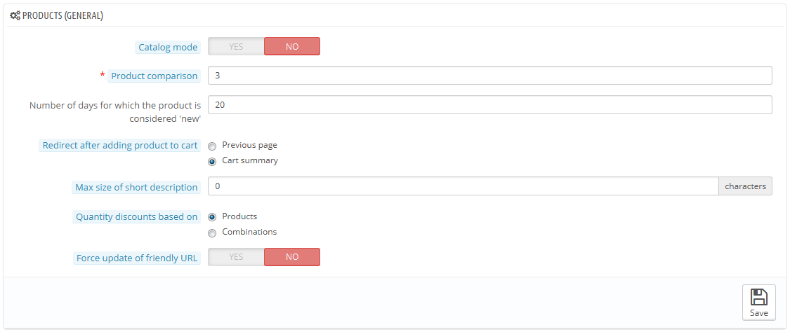
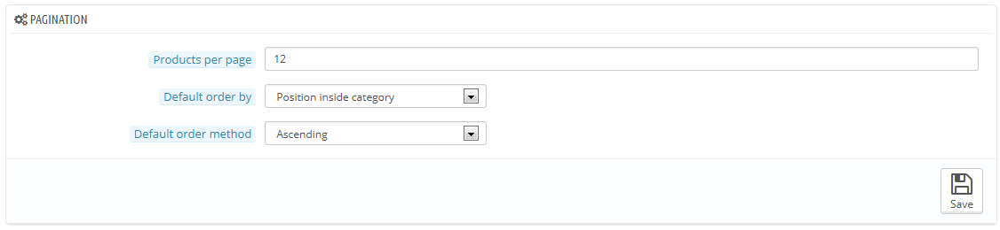
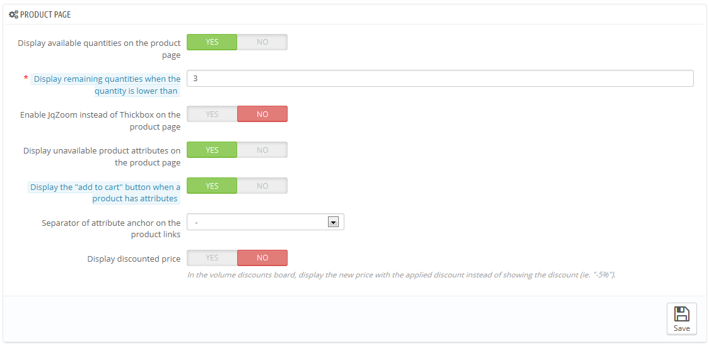
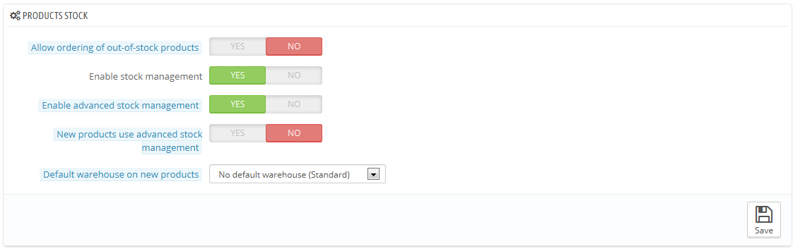

# Voreinstellung Artikel

Diese Seite enthält ein paar Einstellungen in Bezug darauf, wie Ihre Artikel gehandhabt und durch PrestaShop angezeigt werden sollen.

## Allgemein 

* **Katalog-Modus**. Aktivieren wird Ihren Shop in eine einfache Galerie der Artikel umwandeln, ohne Möglichkeit, die Artikel zu kaufen.
* **Artikelvergleich**. Die maximale Anzahl von Produkten, die für den Vergleich ausgewählt werden kann.
* **Anzahl der Tage, in denen der Artikel als „NEU“ angesehen wird**. Wenn Sie einen Artikel in Ihrem Shop hinzufügen wird er als neuer Artikel gelistet und durch den "Neue Artikel" Block und die "Neue Artikel" Seite angezeigt. Im Feld können Sie festlegen, wie viele Tage das Produkt auf dem Block und der Seite sichtbar bleibt. Mit dieser Funktion wählen Sie, wie Ihr Shop mit neuen Artikeln umgeht. Die "Neue Artikel" Seite wird in der Regel von den meisten Kunden abgerufen.
* **Weiterleitung nach dem Hinzufügen eines Artikels in den Warenkorb**. Sie können den Kunden entweder auf die vorherige Seite zurückleiten oder in die Warenkorb Zusammenfassung.
* **Kurzbeschreibung Max Größe**. Ihr Produkt hat zwei Beschreibungen: eine "kurze Beschreibung" und eine normale. Die Kurzbeschreibung, die in Suchmaschinen und in der Kategorie Beschreibung für Ihr Produkt angezeigt wird, ist auf 400 Zeichen standardmäßig begrenzt, aber diese Option ermöglicht es Ihnen, diese Grenze zu ändern. 0 bedeutet, dass es keine Begrenzung gibt.
* **Mengenrabatt basiert auf**. Diese Einstellung zeigt an, auf was PrestaShop Mengenrabatte geben soll: pro Artikel oder pro-Variante(über die mehrere Artikel verfügen können).
* **Aktualisierung der Benutzerfreundlichen URLs erzwingen**. Standardmäßig wird die benutzerfreundliche URL einer Artikelseite aus dem Artikeltitel erzeugt, und es bleibt die gleiche, auch wenn sich danach der Artikeltitel ändern – denn, um auch referenziert werden, sollten Ihre URLs stabil sein. Wenn Sie diese Option aktivieren, wird PrestaShop die URL jedes Mal wenn Sie den Produktnamen oder Seitentitel ändern, aktualisieren.

## Anzeigeoptionen 

* **Artikel pro Seite**. Geben Sie an, wie viele Produkte auf den Seiten Ihrer Kategorien angezeigt werden.
* **Standard-Sortierung**. Geben Sie die Reihenfolge der Artikel in Ihrem Shop an. 6 Möglichkeiten stehen zur Verfügung:\

  * **Artikelname**. Zeigt Ihre Produkte auf der Grundlage der alphabetischen Reihenfolge.
  * **Artikelpreis**. Zeigt Ihre Produkte nach ihren Preisen.
  * **Datum des Hinzufügens**. Zeigt Ihre Produkte nach dem Tag, an dem sie in Ihrem Shop erstellt wurden.
  * **Datum der Änderung**. Wenn Sie einen Artikel bearbeiten, wird das Änderungsdatum aktualisiert. Diese Option ordnet Artikel in der Reihenfolge der Änderungen an.
  * **Position in der Kategorie**. Zeigt Ihre Artikel, wie sie in den Kategorien in Ihrem Katalog positioniert sind. Die Positionen der Artikel können direkt im Katalog mit Hilfe der Positionspfeile geändert werden.&#x20;
  * **Hersteller**. Zeigt Ihre Produkte in alphabetischer Reihenfolge der Namen ihrer Hersteller.
  * **Artikelmenge**. Zeigt die Artikel auf der Grundlage ihrer verfügbaren Menge.
  * **Artikel-Nr**. Zeigt Ihre Produkte auf der Grundlage ihrer Nummer.
* **Standard-Sortierreihenfolge**. Die oben genannten Optionen können in aufsteigender oder absteigender Reihenfolge sortiert werden.

## Artikelseite 

* **Verfügbare Mengen auf der Artikelseite anzeigen**. Durch Aktivierung dieser Funktion können Besucher die verfügbaren Mengen der einzelnen Artikel sehen. Die Darstellung dieser Informationen kann verwendet werden, um Verkäufe in den Fall, dass die Menge auf Lager gering ist, anzukurbeln. Die angezeigten Mengen sind die ausgewählten Eigenschaften und Varianten.
* **Verbleibende Mengen anzeigen, wenn die Menge niedriger ist als**. Sie können wählen, dass eine Warnung angezeigt wird, wenn der verbleibende verfügbare Bestand für ein Produkt unter einen bestimmten Wert kommt. Diese Option ist besonders nützlich für die Förderung der Einkäufe. Der Text und die Platzierung der Benachrichtigung hängt von dem Template ab; im Standard-Theme, ist es "Achtung: Nur noch wenige Einheiten auf Lager", und ist direkt unter dem Feld "Menge" platziert.
* **JqZoom anstatt Thickbox für Artikelbild aktivieren**. Standardmäßig wird beim Klicken auf ein Bild eine größere Version des Artikels als Overlay auf der Seite angezeigt. Sobald Sie diese Funktion aktivieren, werden die Besucher noch immer in der Lage sein, auf das Bild zum zoomen zu klicken, aber ein Zoom erscheint auch, wenn die Maus über das Bild des Artikels fährt.
* **Nicht verfügbare Varianten auf der Artikelseite anzeigen**. Ihre Artikel können aus vielen verschiedenen Eigenschaften und Varianten zusammengesetzt sein: Farbe, Größe, Kapazität, usw. Attribute können auf der "Eigenschaften" Seite des "Katalog" Menüs bearbeitet werden. Lesen Sie das Kapitel mit dem Titel "Den Katalog verwalten", um mehr über Eigenschaften und wie man sie benutzt zu lernen.\
  Wenn eine oder mehrere Eigenschaften nicht mehr verfügbar sind, haben Sie zwei Möglichkeiten:\

  * Erste Möglichkeit: Lassen Sie diese Einstellung aktiv. Beispiel: Der "iPod Shuffle" ist nicht mehr verfügbar in "Blue". Wenn diese Option aktiviert ist, werden die Produktkombinationen im Shop sichtbar bleiben. Eine Meldung zeigt an, dass das Produkt in der gewählten Kombination nicht mehr verfügbar ist; Kunden wird empfohlen, eine andere Kombination zu wählen. Wenn Sie „Bestellung von Artikeln zulassen, die nicht am Lager sind " aktiviert haben(siehe unten), dann werden sie in der Lage sein, Kombinationen, die nicht zur Verfügung stehen, trotzdem ihrem Wagen hinzuzufügen.
  * Zweite Möglichkeit: Deaktivieren Sie diese Einstellung. Wenn die "Blue" Kombination des"iPod Shuffle" nicht mehr verfügbar ist, wird diese Auswahl auch nicht länger im Front-Office angezeigt und der Kunde kann sie nicht auswählen. Diese Funktion hilft, die Verfügbarkeit Ihrer Produkte übersichtlich darzustellen.
* **Button "In den Korb" in Listenansicht immer anzeigen**. Diese Option verhindert, dass Kunden aus der Listenansicht einen Artikel direkt in den Warenkorb legen können, wenn der Artikel mehrere Varianten hat. Dies zwingt die Kunden, den Artikel auf der Artikelseite hinzuzufügen, und nicht die Standardvariante per Abkürzung zu bestellen. Beachten Sie, dass Artikelvarianten immer noch ein "Warenkorb"-Symbol in der Listenansicht haben.
* **Trennzeichen von Attribut Anker auf den Produkt-Links**. Wählen Sie das Trennzeichen zwischen "," und "-".
* **Ermäßigten Preis anzeigen**. Auf der Mengenrabatt-Tafel direkt den rabattierten Preis anstelle des Rabattsatzes (z.B. -5%) anzeigen.

## Artikel Lager 

* **Bestellung von Artikeln zulassen, die nicht am Lager sind**. Wenn ein Artikel keinen verfügbaren Bestand mehr hat, kann der Kunde trotzdem bestellen.
* **Bestandsverwaltung aktivieren**. Diese Option ermöglicht den Zugriff auf grundlegende Bestandsverwaltungsoptionen und Funktionen: Sie können die aktuellen Artikelmengen einstellen und PrestaShop diese automatisch für jede Bestellung senken lassen, und "rücklagern" bei allen stornierten Bestellungen.\
  Standardmäßig sollten Sie diese Funktion aktiviert lassen, sonst deaktivieren sie das gesamte Bestandsmanagement Ihres Shops. Nur, wenn Sie keine physischen Bestände haben, sollten Sie sie deaktivieren - zum Beispiel, wenn Sie nur digitale Produkte vertreiben.
* **Erweiterte Lagerverwaltung aktivieren**. Eine weitere Option, die große Auswirkungen hat: es fügt ein neues Menü namens "Lager" hinzu, welches es erlaubt, Ihr Lager sehr genau zu verwalten, auf einer Pro-Warenlager-Basis, wenn notwendig. Bewegung, Abdeckung, Aufstockung Bestellungen usw.: Sie können alle Details zu Ihrem Lager zu sehen\
  Sie können mehr über Erweiterte Lagerverwaltung im Kapitel "Lagerverwaltung" dieses Handbuchs lesen.
* **Erweiterte Lagerverwaltung für neue Artikel automatisch aktivieren**. Wenn aktiviert, werden neue Produkte automatisch in die fortschrittliche Lager-Management-Funktion eingebunden. Das Standard Warenlager wird in der nächsten Option ausgewählt.
* **Standard-Warenlager für neue Artikel**. Wenn neue Artikel die erweiterte Lager-Management-Funktion nutzen, legen Sie hier das Standardlager fest.
