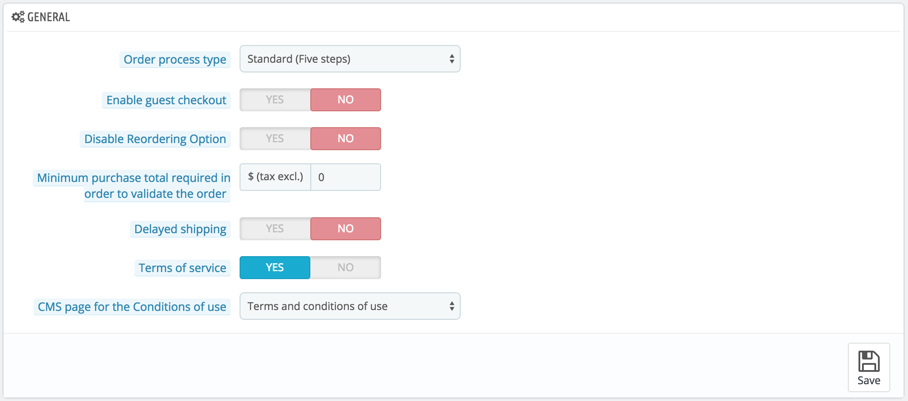
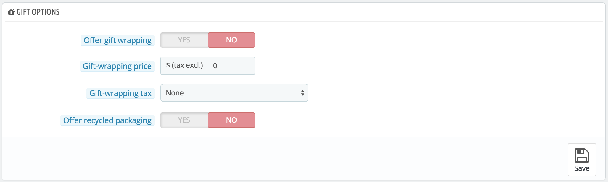

# Voreinstellung Bestellungen

Die Voreinstellungsseite „Bestellungen“ umfasst Kundenbestellungen, aber auch Geschenksendungen.

## Allgemein 

* **Art des Bestellvorgangs**. Standardmäßig hat der Kunde 5 Schritte, die ihn durch den Bestellvorgang führen, die jeweils auf ihrer eigenen Seite durchlaufen werden. Sie können jedoch festlegen, dass sie alles auf einer einzigen Seite durchführen. Die Seite wird länger sein, aber einige Kunden werden diesen Ansatz bevorzugen.
* **Gastbestellung zulassen**. Erlaubt nichtregistrierten Besuchern zu bestellen, ohne ein Konto zu erstellen.
* **Re-Order deaktivieren**. Bei Einstellung auf "Ja" sind Kunden nicht mehr in der Lage, eine früher getätigte Bestellung in ihrer Historie mit einem Klick zu wiederholen.
* **Mindestkaufsumme zur Durchführung einer Bestellung**. Gibt die Mindestmenge an, die im Warenkorb sein muss, damit eine Bestellung gültig ist. Wenn die Menge in diesem Bereich nicht erreicht wird, können Ihre Kunden ihren Einkauf nicht abschließen. Wenn Sie nicht möchten, dass eine Mindestmenge festgelegt ist, geben Sie "0" in das Feld ein.
* **Verzögerter Versand**. Wenn Sie die Option "Bestellung von nicht verfügbaren Artikeln Erlauben" (die "Artikel" Einstellungsseite) aktivieren, können Sie erlauben, dass Einzelteile versendet werden können, sobald sie verfügbar sind, und in so viele Sendungen wie nötig aufgeteilt(je nachdem, wie Ihr Team entscheidet) werden. Zunächst wird PrestaShop die Bestellung in zwei Teile teilen: die verfügbaren Posten werden sofort gesendet, während die anderen Artikel zu einer zweiten Bestellung hinzugefügt werden, die darauf wartet, überprüft zu werden.
* **Allgemeine Geschäftsbedingungen**. Kunden müssen Ihre Nutzungsbedingungen akzeptieren, bevor sie eine Bestellung aufgeben.
* **CMS-Seite für AGB**. Ihre "Nutzungsbedingungen" werden auf einer statischen Seite ("CMS-Seite") gespeichert. Wählen Sie, welche Seite verwendet werden soll, so dass PrestaShop alles korrekt anzeigen kann.

## Geschenkoptionen 

* **Geschenkverpackungen anbieten**. Lassen Sie Ihren PrestaShop Geschenkverpackungen nach Kundenwunsch und die Möglichkeit der Zugabe einer gedruckten Nachricht anbieten. Es ist immer ein nettes Feature für Leute, die Geschenke durch Ihren Shop senden möchten.
* **Preise Geschenkverpackungen**. Setzt den Preis Ihres Geschenkpapier-Service.
* **Steuer auf Geschenkverpackung**. Bei Bedarf gibt dieses Feld die lokalen Steuern für Geschenkverpackungen an. Sie können mehr Steuern auf der Seite "Steuersätze" hinzufügen, im Menü "Lokalisierung".
* **Recycling-Geschenkverpackungen anbieten**.
