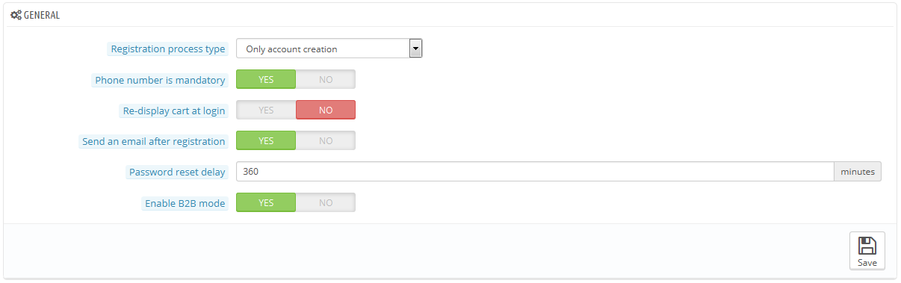

# Voreinstellung Kunden

Die "Kunden" Seite fasst kundenbezogene Optionen zusammen, vor allem den B2B-Modus.

* **Typ des Registrierungsprozesses**. Sie können Besucher einen neuen Account ohne unmittelbare Verpflichtung, eine Adresse zu registrieren, erstellen lassen. Oder Sie zwingen Besucher, eine Adresse einzutragen, sobald sie ihren Account erstellen.\
  Die erste Option eröffnet eine schnellere Kontoerstellung, aber es wird ein neues Adressformular geöffnet, wenn ein Kunde etwas bestellen möchte.\
  Auf der anderen Seite macht die zweite Option die Kontoerstellung länger, aber zumindest können Sie sicher sein, dass bei einer Bestellung die Adresse bereits eingetragen ist.
* **Telefonnummer ist ein Pflichtfeld**. Ebenso können Sie Ihrem Kunden vorschreiben eine Telefonnummer einzutragen oder nicht. Eine Telefonnummer kann von unschätzbarem Wert für Sie sein, da dies es möglich macht, einen Kunden direkt zu kontaktieren, aber einige Kunden werden sich weigern, diese Art von Information preiszugeben. Wenn Sie "Nein" wählen, werden die "Telefonnummer" Felder immer noch im Adresserfassungsformular angezeigt, aber sie werden keine Voraussetzung mehr sein.
* **Warenkorb nach Anmeldung neu anzeigen**. Wenn der Kunde einen Warenkorb hatte, mit dem er nicht zur Kasse ging, wird er wieder angezeigt, sobald er sich wieder anmeldet.
* **Bestätigungs-Mail nach Anmeldung senden**. Sie können eine E-Mail an jeden Neukunden mit einer Zusammenfassung seiner Kontoinformationen (E-Mail, Passwort) senden.
* Verzögerung Passwort-Reset. Sie können den Zeitraum festlegen, in dem ein Kunde ein neues Passwort für sein Konto festlegen kann, nach der letzten Änderung. Standardmäßig wird es bei 360 Minuten eingestellt.
* **Aktiviere B2B-Modus**. Der B2B-Modus bringt eine Menge von neuen Features in Ihren Shop. Kunden werden nicht mehr als Personen, sondern als Unternehmen betrachtet, deshalb werden einige neue Optionen angezeigt:\

  * Das Profil hat neue Felder zu Fachinformationen (DUNS-Nummer in den USA, SIRET-Nummer in Frankreich, CNPJ Zahl in Brasilien, etc.),
  * Die Preise können für  bestimmte Gruppen ausgeblendet werden,
  * Die Preise können auf einer Pro-Kundenbasis für den gesamten Katalog oder pro Kategorie verwaltet werden,
  * Rechnungen können manuell erzeugt werden,
  * etc.
