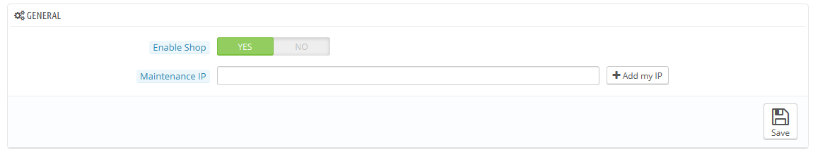

# Wartung

Diese sehr einfache Einstellungsseite ist von unschätzbarem Wert, wenn Sie Änderungen an Ihrem Shop machen wollen, ohne, dass Ihre Kunden etwas bemerken. Zum Beispiel, wenn Sie mehrere neue Artikel auf einmal hinzufügen möchten, oder wenn Sie das Template ändern und verschiedene Tests vor der Bereitstellung durchführen möchten.

Diese Seite hat nur zwei Optionen:

*   **Shop aktivieren**. Sie können diese Option verwenden, um Ihren Shop vorübergehend zu deaktivieren, zum Beispiel, wenn Sie Wartungsarbeiten an Ihrem Shop ausführen wollen.

    Der Webservice wird immer noch aktiv sein, so dass Ihre Daten immer noch zur Verfügung stehen, wenn man einen Schlüssel besitzt. Wenn Sie auch den Webservice deaktivieren möchten, gehen Sie zu der Einstellungsseite "Webdienste", im Menü "Erweiterte Einstellungen".
* **Wartungs IP**. Die Wartungs IP ermöglicht es Leuten, den Shop zu besuchen, auch wenn er deaktiviert ist. Dies bedeutet, dass Sie Allen den Zugriff über das Internet auf Ihren Shop verwehren können, aber immer noch Team-Mitgliedern Zutritt gestatten können. Um die IP-Adresse eines Computers herauszufinden, klicken Sie vom gewählten Computer auf [http://www.whatismyip.com/](http://www.whatismyip.com/). Klicken Sie auf "Meine IP-Adresse hinzufügen", wenn Sie nur die IP-Adresse Ihres aktuellen Computers hinzuzufügen möchten.\
  Wenn Sie mehrere IP-Adressen hinzuzufügen möchten, trennen Sie diese durch Kommas ",".
