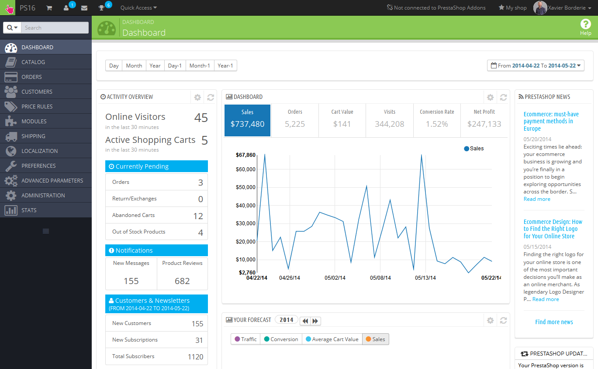

# Acessando o Back Office do PrestaShop

"Back Office" é o nome dado ao **painel de administração** do seu site PrestaShop. Você vai passar a maior parte do seu tempo neste painel, pois tudo é feito diretamente no Back Office: a adição / edição / remoção de produtos, cadastro de transportadoras, a construção de pacotes, criar vales, manter contato com os clientes, melhorar a sua loja, etc.

Durante o processo de instalação, a pasta `/ admin` é renomeada unicamente para a sua loja (por exemplo, `/ admin7890` ), por razões de segurança. Use esse novo nome da pasta para acessar sua loja (por exemplo: [http://myprestashop.com/admin7890](http://myprestashop.com/admin7890) ).

&#x20;A mudança de nome é feita automaticamente pelo PrestaShop . Tenha o cuidado de memorizar o nome dessa pasta a primeira vez que você acessá-la após a instalação.

Você verá a página de login para o Back Office de sua loja:

Digite o endereço de e-mail e a senha que você registrou quando instalou o PrestaShop. Clique no botão "Log In", e você será levado para o painel do Back Office, uma espécie de página de boas vindas para este painel de controle.

A partir desta etapa em diante, você pode começar a configurar sua loja e vender produtos aos seus clientes.

Leia o próximo capítulo deste guia do usuário, chamado "Primeiros passos com PrestaShop 1.6", para entender todas as várias seções do back office.
