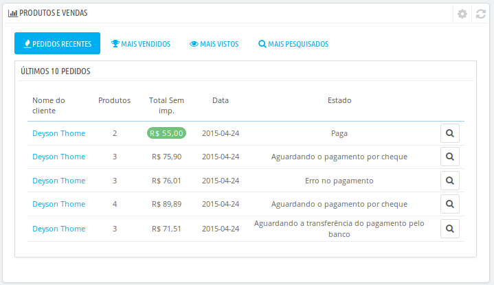

# Descobrindo a Área Administrativa

/\*\<!\[CDATA\[\*/\
div.rbtoc1597243849331 {padding: 0px;}\
div.rbtoc1597243849331 ul {list-style: disc;margin-left: 0px;}\
div.rbtoc1597243849331 li {margin-left: 0px;padding-left: 0px;}\
\
/\*]]>\*/[Descobrindo a Área Administrativa](descobrindo-a-area-administrativa.md#DescobrindoaÁreaAdministrativa-DescobrindoaÁreaAdministrativa)[Visão Geral da Interface Principal](descobrindo-a-area-administrativa.md#DescobrindoaÁreaAdministrativa-VisãoGeraldaInterfacePrincipal)[A Barra Superior](descobrindo-a-area-administrativa.md#DescobrindoaÁreaAdministrativa-ABarraSuperior)[Os Menus ](descobrindo-a-area-administrativa.md#DescobrindoaÁreaAdministrativa-OsMenus)[Os Botões](descobrindo-a-area-administrativa.md#DescobrindoaÁreaAdministrativa-OsBotões)[Ajuda Contextual](descobrindo-a-area-administrativa.md#DescobrindoaÁreaAdministrativa-AjudaContextual)[O Painel de Controle](descobrindo-a-area-administrativa.md#DescobrindoaÁreaAdministrativa-OPaineldeControle)[Barra Horizontal  ](descobrindo-a-area-administrativa.md#DescobrindoaÁreaAdministrativa-BarraHorizontal)[A Coluna da Esquerda](descobrindo-a-area-administrativa.md#DescobrindoaÁreaAdministrativa-AColunadaEsquerda)[Coluna Central](descobrindo-a-area-administrativa.md#DescobrindoaÁreaAdministrativa-ColunaCentral)[ Coluna da Direita](descobrindo-a-area-administrativa.md#DescobrindoaÁreaAdministrativa-ColunadaDireita) 
----------------------------------------------------------------------------------------------------------------------------------------------------------------------------------------------------------------------------------------------------------------------------------------------------------------------------------------------------------------------------------------------------------------------------------------------------------------------------------------------------------------------------------------------------------------------------------------------------------------------------------------------------------------------------------------------------------------------------------------------------------------------------------------------------------------------------------------------------------------------------------------------------------------------------------------------------------------------------------------------------------------------------------------------------------------------------------------------------------------------------------------------------------------------------------------------------------------------------------------------------------------------------------------------------------------------------

## Descobrindo a Área Administrativa 

Agora que você instalou o PrestaSop 1.6 e que está devidamente logado em sua área administrativa Agora que você instalou PrestaShop 1.6 e que está devidamente registrado na sua área de administração, você deve procurar encontar seu caminho através da interface de administração, entender suas notificações e saber onde encontrar qualquer informação de que necessite.

O projeto da área de administração da loja foi completamente renovada na versão 1.6 do PrestaShop, a fim de ser mais intuitivo e ergonômico , bem como trabalhar melhor em dispositivos móveis.

Algumas páginas e opções estão nas mesmas posições em que seriam encontradas na versão 1.5, mas independente disso, um pouco de uso por parte do usuário será necessário para o domínio produtivo do novo ambiente.\

&#x20;Nós criamos esta seção para ajudá-lo a aprender como aproveitar ao máximo a nova interface de gerenciamento PrestaShop. Embora esta interface tenha sido projetada para ser ergonômica e fácil de usar, é recomendável que você estude este guia desde o início,  a fim de compreender plenamente todo potencial de sua nova ferramenta de negócios online!

### Visão Geral da Interface Principal 

Tire um tempo para examinar o Painel de Controle. A primeira página que você verá quando entrar em seu back-office é a página inicial. Nesta página, você terá , não apenas uma visão geral de tudo o que você precisa saber sobre sua loja, a qualquer momento, mas também links rápidos para as páginas dos principais processos,     no caso do novato em PrestaShop,  também dará dicas sobre questões que devem receber sua atenção.

#### A Barra Superior 

No topo do back office está uma barra preta que contém algumas informações e links:

* **O logo da PrestaShop** - seguido da versão referente.
* **O** **nome de sua loja** - À partir de qualquer página,ao ser clicado, lhe trará de volta à página inicial do painel de sua loja.
* **Ícone do Carrinho** - Se houver algum pedido, ao posicionar o mouse abre uma janela (Tool Tip). E ao ser clicado apresenta um pequeno quadro, conforme na figura abaixo, onde são apresentados os novos pedidos que foram feitos, desde a última vez que clicou neste ícone. E à partir daí pode-se verificar os novos pedidos ou clicar para visualizar a lista com todos os pedidos.
* **Ícone Persona** - Um balão indicará o número de novos clientes cadastrados na loja, se houver algum. Ao ser clicado  abre-se um painel com os últimos clientes registados. A partir daqui, você pode ver os detalhes de algum desses novos clientes, ou ir para a página que exibe a lista completa de clientes.&#x20;
* **Ícone de Carta** - Uma balão indicará o número de novas mensagens recebidas no Atendimento ao Cliente, se houver alguma. Clicando sobre ele, um painel tendo uma destas novas mensagens recebidas na área de atendimento ao cliente, ou poderá ir para a página que exibe a lista completa de mensagens.
* **Ícone de Troféu** - Um balão indicará o número de novas medalhas recebidas, se houverem. Clicando sobre ele, se abrirá um painel que apresenta o seu progresso como comerciante. À partir daqui, você pode acessar a página que exibe a lista completa de medalhas (conquistas) e pontos do módulo  "Experiência Comercial".
* &#x20;**Acesso Rápido** - Este é o menu Links Rápidos, que apresenta os links mais úteis, que são indicados no painel que se abre ao clicarmos em "Acesso Rápido" no menu "Administração".  Na parte inferior do referido painel existe a opção de "adicionar página atual aos links rápidos", bastando para isso,  clicar no referido link.
* &#x20;**Conectar à sua conta do MarketPlace do PrestaShop** - Abre uma janela modal permitindo que você conecte sua loja para o mercado de complementos ( Addons MarketPlace ), e assim, obter atualizações dos módulos e temas que você comprou.
* **O link Minha Loja** - Abre a sual loja ( Página frontal da loja ) em uma nova aba do navegador.
* **O menu ( seu nome )** - Um menu dropdown simples, com um lembrete da conta administrativa com a qual você está conectado no momento. Ele contém os seguintes links:\
  &#x20;
  * **Link "Minhas preferências"**. Te leva a página de preferências de sua conta, de onde selecionar algunas opções pessoais (por exemplo, o idioma do back-office ou a senha).
  * **Link "Sair"**. Desconectará a conta em uso no momento.

#### Os Menus  

Durante suas atividades diárias, na administração de sua loja, você terá que navegar por muitas páginas e opções de back office.

Por padrão, o menu do PrestaShop 1.6 é mostrado no lado esquerdo da página. Mas você pode alterar isso, optanto pelo menu no topo da página e na horizontal conforme a figura abaixo. Para isso, vá no seu nome e clique, em sguida verá uma janela de opções e entre essas a opção " Minhas Preferências ", clique nessa e na página que abrir, observe a última opção inferior, "Orientação do menu do Admin " onde tem as opções Topo e Esquerda. Marque 'Topo', Para desfazer, refaça o processo e marque 'Esquerda'.

Em qualquer formato, vertical ou horizontal, o conteúdo de cada menu é exibido quando o mouse passa sobre o rótulo do menu, reduzindo assim a necessidade de carregar novas telas apenas para acessar as opções de menu.

Complementando a informação acima, a orientação vertical pode ser minimizada para funcionar apenas com os seus ícones, bastando clicar no ícone de "linhas paralelas" na parte inferior deste menu.

Cada menú coloca em ação um cojunto de tarefas e contextos:

* **Campo de busca com lista em dropdown**: permite efetuar buscas dentro do conteúdo da sua loja.
* **Catálogo**: Esse é o coração de sua loja. Por aqui poderá adicionar produtos, criar categorias, configurar as tranportadoras e fornecedores.
* **Compras**: Uma vez que os clientes iniciam a colocação de produtos nos seus carrinhos, os pedidos começarão a serem vistos deste ítem do menu, assim como suas faturas relacionadas. É por aqui também que você irá gerenciar as devoluções de mercadorias, comprovantes de entregas e de créditos, status do pedidos e poderá gerenciar as mensagens relacionadas aos pedidos.
* **Clientes**: Este menu lhe dará  acesso à todas as informações do cliente. Você pode mudar seus endereços, criar grupos de usuários para aplicar promoções específicas, gerenciar o serviço no pós-venda, e até mesmo adicionar títulos sociais quando necessário.
* **Regras de Preços**: É um menu muito específico que permite a você criar facilmente vouchers e reduções de preços por meio de um conjunto de regras.
* **Módulos**: Nesta seção você encontrará recursos para estender o poder e a utilidade de sua loja, adicionando e ativando módulos. Mais de uma centena estão incluídos por padrão, e muitos outros mais estão disponíveis para compra no mercado de Complementos ([http://addons.prestashop.com/](http://addons.prestashop.com/)). Este menu lhe permite administrar seus temas e é também onde você pode posicionar os blocos de conteúdo à partir do seu módulo sobre o tema (incluindo o recurso Live Edit). A página final permite aplicar configurações globais para seus módulos de pagamento.
* **Envio**: (Frete) Tudo o que se refere aos transportadores e aos custos de transporte, bem como ao marketing.
* **Localização**: Ajuda a configurar sua loja com elementos relacionados ao local, tais como:  linguagem e traduções, moeda, unidades de medida, os impostos e as regras fiscais, e entidades geográficas (regiões, países e etc).
* **Preferências**: PrestaShop é uma solução de ecommerce altamente configurável, por isso você pode alterar praticamente tudo que queira alterar através desta aba do menu, que lhe apresenta todas as funcionalidades às quais você pode aplicar suas preferências.
* **Parâmetros Avançados**: Contém links para as ferramentas específicas e páginas de informação que são muito específicas para caber em outros menus, como as configurações do serviço da web, a ferramenta de backup do banco de dados, melhoria do desempenho (Otimização) da página, 1-Click Upgrade entre outros.
* **Administração**: Aqui se apresentam todas as configurações relacionadas à própria back office. Por exemplo, o conteúdo do menu "Acesso Rápido", a lista de seus funcionários e suas respectivas permissões e a ordem dos itens dos menus, entre outros.
* **Estatísticas**: Este menu dá  acesso a todas as inúmeras estatísticas e gráficos gerados no PrestaShop à partir dos dados colhidos no PrestaShop.

&#x20;  Estes são os menus padrão. Note-se que os módulos podem adicionar novas opções para as páginas existentes, novas páginas para os menus existentes, e até mesmo novos menus.

Além disso, um menu só está disponível quando a opção adequada está definida:

* **Estoque**: Este menu dá acesso a um recurso para gestão do seu estoque de produtos, bem como os movimentos desse estoque e os seus pedidos de reposição.\
  \
  &#x20;    Este menu está disponível apenas se a opção "Ativar gestão de estoque avançado"  for  habilitado. Para habiltar  esta funcionalidade vá em:  Preferências > Produtos > Estoque de Produto.\
  \
  &#x20;Todos os menus padrão, incluindo a gestão de estoque avançado, são explicados em pormenor neste guia do usuário.

### Os Botões 

Muitas páginas de administração usam botões regularmente , que são apresentados tanto na parte superior quanto na parte inferior da tela. Por exemplo, a página de criação / modificação de um produto pode conter até 8 botões disponíveis.

Mais do que apenas atalhos, eles oferecem recursos reais que você usa com frequência.

Os botões disponíveis variam muito, dependendo do contexto. Na verdade, duas páginas podem não apresentar o mesmo conjunto de botões. No entanto, existem alguns que serão vistos muitas vezes:

* **Adicionar Novo**: Abre a página de criação para o conteúdo atual: novos produtos, nova categoria e etc.\

* **Módulos e Serviços Recomendados**: Abra uma janela com os módulos disponíveis para o contexto atual.\

* **Ajuda**: Abre a documentação on-line para a página atual.

O botão "Módulos e Serviços Recomendados" permite que você veja os módulos que se aplicam ao contexto da página onde o botão é acionado. Por exemplo, se você estiver em Envio (Frete) > preferências e clicar no referido botão será apresentada a lista de módulos relacionados , presentas na seção " Entregas e Logística" da página de módulos e disponíveis para instalação. Isto é muito útil para encontrar rapidamente um determinado módulo necessário para implementação e configuração de determinada funcionalidade na loja.

A maioria dos formulários do back-office são validados utilizando um botão na parte inferior da tela:

* **Salvar** : Salva o conteúdo da página atual e retorna à lista de elementos existentes.\

* **Salvar e Permanecer** : Salva o conteúdo da página atual e mantém a página aberta.\

* **Cancelar** : Retorna a lista de itens existentes.

As tabelas de apresentação das listas ( de produtos, de categorias, de clientes, etc.) têm seu próprio conjunto de botões para gerenciar os itens listados:

* **Adicionar Novo** : Criar novo elemento no contexto atual.\

* **Exportar** :  Fazer download de um arquivo CSV com todos os itens.\

* **Importar** : Leva você para a página de opções de importação CSV, de onde você pode importar seus arquivos CSV.\

* **Atualizar Lista** : Carregue a lista novamente para apresentar as últimas alterações.
* **Mostrar consulta SQL** : Fornece a consulta SQL para reproduzir em seu próprio Gerente de SQL a sua pesquisa ou filtro.\

* **Exportar para o Gerenciador SQ**L : Abre ferramenta Gerenciador SQL do PrestaShop  (nos "Parâmetros avançados") do menu, a partir do qual você pode consultar base de dados da PrestaShop com instruções SQL ("SELECT ... FROM ... WHERE ...").\
  &#x20;Se a sua lista de itens foi filtrada (por nome, por exemplo), então a instrução SQL padrão vai levar isso em conta (por exemplo, " ``WHERE 1  AND b.`name` LIKE '%blusa%'`` " para lista de produtos).

### Ajuda Contextual 

Desde a versão 1.6.0.7 do PrestaShop que a documentação do software está integrada diretamente na interface do software, clicando no botão "Ajuda" a partir de qualquer página de back-office, a interface principal é reduzida em largura para exibir uma nova coluna à direita contendo a documentação desta parte do back-office.

Outro clique no botão "Ajuda" fecha a coluna de ajuda contextual. Se você não fechar a coluna Ajuda,  PrestaShop irá entender que você deseja manter a coluna de ajuda visível em todas as páginas do back-office, e manterá assim até que você clique no botão para fechá-la.

Se a área de exibição do navegador for menor do que 1220 pixels de largura, PrestaShop irá abrir a documentação de ajuda em uma nova janela do navegador em vez de reduzir o espaço dedicado à interface principal.

### O Painel de Controle 

Vamos explore o conteúdo do Dashbord / Painel de Controle. Pode parecer um pouco confuso de início, mas logo se descobre que ele fornece um excelente resumo das atividades diárias de sua loja em uma simples uma olhada.\
\
&#x20;O painel é dividido em quatro áreas principais: uma barra horizontal, e três colunas

Modo Demonstração

Por padrão, o painel usa dados falsos para que você possa ver como as estatísticas são exibidas.

Ao usar o PrestaShop em uma loja real, você deve desabilitar esses dados falsos para utilizar os seus dados reais: a opção "Modo de demonstração" pode ser desativada na parte superior direita da tela.

#### Barra Horizontal   

No topo do painel de controle está uma barra  que lhe permite escolher o período de tempo usado para exibir estatísticas no Painel.\
\
&#x20;Três conjuntos de opções estão disponíveis:\
\
&#x20;Hoje, este mês, este ano.\
&#x20;Ontem, mês passado e ano passado .\
&#x20;Uma data específica (o botão direito, abre um selecionador de período).\
\
&#x20;Ao escolher uma opção o conteúdo de todos os blocos que estão no painel serão atualizados, de modo que sejam apresentados os dados relativos ao período selecionado. Blocos que não apresentam estatísticas não são atualizados.\
\
&#x20;Para selecionar um período de tempo, você pode clicar no primeiro e no último dia desse período no calendário (a ordem não é importante), ou você pode inserir as datas no formato MM-DD AAAA  nos respectivos campos de texto. Após selecionar o período que deseja verificar clique em "Aplicar" para ver as atualizações no painel de controle, dependendo de suas configurações editadas no módulo correspondente.

Você também pode comparar dois períodos de tempo juntos, marcando a caixa "COMPARADO COM" . Selecione o segundo período como faria para o primeiro (os dois podem até mesmo se sobreporem), em seguida, clique no botão "Aplicar".

Ao comparar dois períodos, alguns dos blocos de conteúdo serão atualizados para indicar a evolução dos dados (ver, por exemplo, o principal bloco "Painel", que apresenta dados à partir do módulo Tendências do Painel ).

#### A Coluna da Esquerda 

Por padrão, esta coluna apresenta dados do módulo Estatísticas do Painel, que fornece os principais dados estatísticos de seu banco de dados para que você possa avaliá-los com uma simples visualização:

* Visitantes online nos últimos 30 minutos
* Carrinhos de compras ativos nos últimos 30 minutos
* Pedidos pendentes, devoluções de mercadorias, carrinhos abandonados e produtos fora de estoque
* Notificações de novas mensagens, consultas sobre pedidos e comentários
* Novos clientes e novas subscrições de boletim informativo&#x20;
* &#x20;Estatísticas de tráfego: visitas, visitantes únicos, fontes de tráfego e links diretos &#x20;

#### Coluna Central  

É na coluna central que o nome "Painel de Controle" mostra sua importância: a área do painel apresenta ao usuário (você)  os números mais importantes referentes às atividades diárias de sua loja, junto com um gráfico de vendas e uma lista das últimas encomendas.&#x20;

Cada vez que você entrar na área de administração da sua loja,a primeira coisa que verá, será a evolução que esses números tiveram  . Este é o lugar onde você vê a sua loja de viver e respirar. Podemos dizer que é aqui que você sua loja viva e respirando.

Por padrão, existem três blocos de conteúdo nesta coluna, que são tratados por módulos a eles correspondentes:

* **Painel** (Módulo Tendências do Painel)  Esse é o bloco principal de informações do painel de controle. Através dos seus diversos gráficos relacionados ao desempenho da sua loja, você poderá saber como andam suas vendas, pedidos, valor médio dos carrinhos, visitas, taxas de conversão e lucro líquido por períodos selecionados e com isso avaliar de forma segura se seu negócio online vai bem ou mal. E ao passar o mouse sobre a linha do gráfico receberá informações de cada ponto.\
  \
  \
  \
  Ao clicar no ícone de configuração (canto superior direito), um painel se abre onde você pode configurar várias taxas sua loja (taxas bancárias, custos de transporte, alojamento, etc.) para indicar melhor suas tendências.\
  &#x20;
* **Previsão** (Módulo Painel de Metas - Objetivos)  Este bloco apresenta os objetivos que você definiu para os próximos meses e faz a comparação com os resultados obtidos . Passe o mouse sobre o gráfico para ver mais detalhes.\
  \
  Dependendo de seus resultados mensais, você deve atualizar os seus objetivos futuros. Você pode definir suas metas no formulário de configuração (na roda dentada que fica no canto superior direito deste bloco) e indicar as suas expectativas mês após mês em termos de tráfego, taxas de conversão e valor médio do carrinho. A coluna "Vendas" será atualizado de acordo com os objetivos definidos nas outras colunas (por exemplo, para cada 1000 os visitantes com uma taxa de conversão de 2% e uma cesta média de R$ 10,00, você deve começar 1000 \* (2/100) \* 10 = R$ 200,00) Você pode alterar a moeda na página "moeda" no menu "Localização".
* **Produtos e Vendas**  (Módulo Painel de Produtos): Este bloco apresenta uma tabela com seus últimos pedidos e um ranking de seus produtos: os mais vendidos, os mais visualizados e os mais buscados (dados colhidos no campo de busca de sua loja e não nos motores de buscas).\
  \
  \
  Você pode definir o número de elementos a serem mostrados em cada tabela no formulário de configuração do bloco que pode ser acessado ao clicar na roda dentada (ícone de configurações) que fica no canto superior direito do quadro.

#### &#x20;Coluna da Direita 

Esta coluna é meramente informativa e nos mostra as últimas notícias à partir do [site da PrestaShop](http://www.prestashop.com), é por aqui que você saberá quando uma nova versão estará disponível para a atualização de sua loja, além de outras informações úteis.

Esta também oferece um bloco chamado de " Modo de Demonstração ", onde você pode desativar os dados fictícios inseridos para apresentar aos usuários as funcionalidades disponíveis na loja, depois de desativar essa função você poderá usar a função à partir dos dados reais de sua loja, que serão obtidos pelo sistema de estatísticas do PrestaShop.\
