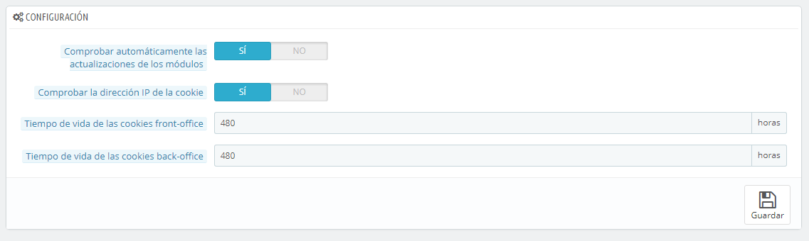

# Administración de Preferencias

La página de administración "Preferencias" contiene opciones generales y ajustes concernientes a la manera en cómo PrestaShop trabaja. Ésta tiene cuatro secciones:

## General 

Esta sección presenta los ajustes más generales:

* **Comprobar automáticamente las actualizaciones de los módulos**. Puedes pedirle a PrestaShop que compruebe regularmente si hay nuevas versiones de los módulos disponibles en el sitio web de PrestaShop Addons. Si así fuera, la página "Módulos" mostraría un enlace "¡Actualízalo!" en la lista desplegable de las acciones de los módulos que tengas instalados.
* **Comprobar la dirección IP de la cookie**. Esta es una medida de seguridad adicional: puedes pedirle a PrestaShop que compruebe si el usuario viene de la IP almacenada en la cookie de su navegador.
* **Tiempo de vida de la cookie de Front-Office**. De manera predeterminada, el tiempo de vida de una cookie PrestaShop es de 480 horas (20 días). Puedes reducir esta longevidad si piensas que la seguridad de tu tienda depende de ello.
* **Tiempo de vida de la cookie de Back-Office**. De manera predeterminada, el tiempo de vida de una cookie PrestaShop es de 480 horas (20 días). Puedes reducir esta longevidad si piensas que la seguridad de tu tienda depende de ello.

## Cuota de subida 

Esta página te permite definir el tamaño máximo de los archivos que puede subir tu propio equipo de empleados - este límite no es el de tus clientes, por lo tanto no afecta a ellos.

Se presentan tres opciones, la primera más general y las dos siguientes más específicas:

* **Tamaño máximo para los archivos adjuntos**. El valor predeterminado se toma directamente de la configuración de tu servidor, pero se puede disminuir si es necesario.
* **Tamaño máximo para un producto descargable**. Si vendes productos virtuales (servicios, reservas y productos descargables), esta opción te permite limitar el tamaño de los archivos que tu equipo puede subir – y en consecuencia, el tamaño del producto. Planifica bien su uso, con el fin de no entorpecer el trabajo a algún miembro de tu equipo que necesite subir un archivo de mayor peso.
* **Tamaño máximo para una imagen de producto**. Del mismo modo que en la opción anterior, puedes limitar el tamaño de las imágenes que se sube a la tienda por parte tuya o de tus empleados. Esta opción puede servir como recordatorio a los miembros de tu equipo para que reduzcan el tamaño de las imágenes, ya que a menudo no es útil cargar imágenes con un tamaño superior a 600x600 (los que suponen aproximadamente 200 kb cuando están debidamente comprimidas).\
  Dirígete a la página de preferencias "Imágenes" para establecer los diversos tamaños imágenes que tu tienda debe utilizar. Esto tiene el beneficio añadido de ahorrar espacio y ancho de banda en el servidor, así como de evitar sobrecargas al procesador (ya que PrestaShop redimensiona las imágenes cargadas, creando las miniaturas, u otros formatos especificados).

## Ayuda 

_Esta opción ha sido eliminada en PrestaShop 1.6.0.11._

Para ayudarte con tu uso diario de PrestaShop, el equipo de desarrollo ha añadido algunos trucos y consejos dentro de la interfaz.

Puedes visualizar y acceder a ellos utilizando una de estas dos opciones:

* **Cajas de ayuda del BackOffice**. Esta opción mostrará cajas de color amarillo con información de ayuda, en las secciones más complejas.
* **Ocultar los consejos de optimización**. Esta opción mostrará una sección con sugerencias de configuración en la página principal del back-office de PrestaShop.

## Notificaciones 

Las notificaciones son globos de ayuda emergente  que se presentan en la parte superior de cualquier página del panel de administración, justo al lado derecho del nombre de la tienda. Éstas muestran el número de nuevas notificaciones desde la última vez que hiciste clic.

Puedes optar por no recibir ciertos tipos de contenido:

* **Mostrar las notificaciones para los nuevos pedidos**. Al hacer clic en esta notificación, la interfaz mostrará el número de pedidos recientes, su importe total y los nombres de los clientes. Desde aquí, puedes abrir una sola página de cualquiera de los nuevos pedidos, o abrir la página "Pedidos" para obtener el listado completo.
* **Mostrar notificaciones para los nuevos clientes**. Al hacer clic en esta notificación, la interfaz mostrará los nombres de los usuarios registrados desde tu última verificación. Desde aquí, puedes abrir una sola página de cualquiera de los nuevos clientes, o abrir la página "Clientes" para obtener el listado completo.
* **Mostrar las notificaciones para nuevos mensajes**. Al hacer clic en esta notificación, la interfaz mostrará la dirección de correo electrónico de las últimas personas que te enviaron un mensaje utilizando el formulario de contacto de tu tienda. Desde aquí, puedes acceder a cualquiera de estos nuevos mensajes, o abrir la página "Servicio al cliente" para obtener el listado completo.
