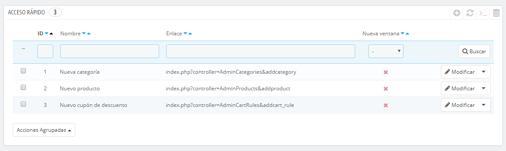
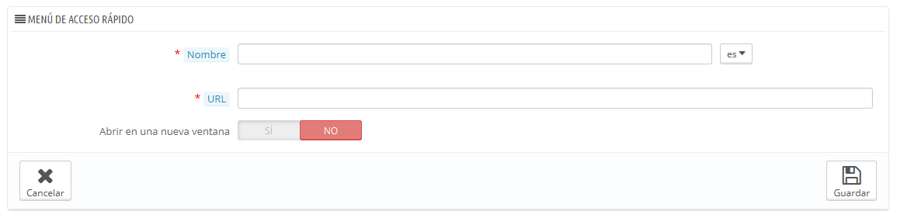

# Configuración de Acceso rápido

PrestaShop ofrece accesos rápidos y directos a las páginas más importantes, a las que puedes acceder desde el menú "Acceso rápido", situado en la parte superior derecha de cada página del panel de administración (justo al lado del nombre de usuario).

La página de administración "Acceso rápido" te permite crear accesos directos personalizados, para facilitar la navegación a las zonas de administración más relevantes y utilizadas por ti y por tu equipo.

La página muestra todos los accesos directos que han sido creados. De manera predeterminada, están creados los siguientes accesos rápidos:

* **Nueva categoría**. Este acceso rápido te lleva directamente al formulario de creación de categorías.
* **Nuevo producto**. Este acceso rápido te lleva directamente a la página de creación de productos.
* **Nuevo cupón de descuento**. Este acceso rápido te lleva directamente a la página de creación cupones de descuento/reglas del carrito.

Las páginas que se abren en una nueva pestaña/ventana tienen una marca de verificación de color verde en la columna "Nueva ventana".

Puedes crear tantos accesos directos como necesites – pero asegúrate de no establecer demasiados, ya que harás que el menú de "Acceso rápido" sea demasiado largo, y su nombre carecería de todo sentido si haces complicada la navegación a través de éste.

## Añadir un nuevo enlace 

Vamos a crear un acceso directo de la página de creación de pedidos, desde la cual puedes crear un nuevo pedido, e incluso añadir nuevos clientes y sus direcciones sobre la marcha.

Como es habitual, tendrás que hacer clic en el botón "Añadir Nuevo" para abrir el formulario de creación:

* **Nombre**. Otorga al acceso directo un nombre único. Éste debe ser corto y descriptivo.
* **URL**. Indica la dirección de la página. Sigue las siguientes instrucciones para establecer páginas incluso con vínculos complejos como enlaces rápidos:\

  1. Mientras mantienes la página de creación de enlaces abierta, dirígete a la página "Pedidos" bajo el menú "Pedidos" abriéndola en una nueva pestaña del navegador.
  2. Copia la dirección web desde la barra de direcciones del navegador. Por ejemplo, [http://www.miprestashop.com/admin8945/index.php?controller=AdminOrders\&token=f326b0419984706791c03f7e96599147](http://www.miprestashop.com/admin8945/index.php?controller=AdminOrders\&token=f326b0419984706791c03f7e96599147).
  3. Borra completamente la parte `&token=xxx`, manteniendo tan sólo las partes importantes (así que no mantengas en la cadena de texto ni el nombre del dominio ni el de la carpeta de administración). En nuestro caso: `index.php?controller=AdminOrders`.
  4. Pega el resultado en el campo "URL" del formulario de creación.
* **Abrir en una nueva ventana**. Indica si deseas que esta pestaña se abra en una nueva ventana o no. En general, los enlaces correspondientes al back-office deben mantenerse dentro de la misma pestaña/ventana, y los enlaces que te dirijan fuera del back-office (front-office, u otros sitios) deben abrirse en una nueva ventana/pestaña.

Ten en cuenta que a pesar de todo, puedes crear vínculos a otros sitios, por ejemplo, a tu cuenta de PayPal o a tu webmail. Simplemente pega la dirección del sitio web en el campo "URL", incluyendo el prefijo `http://`.
