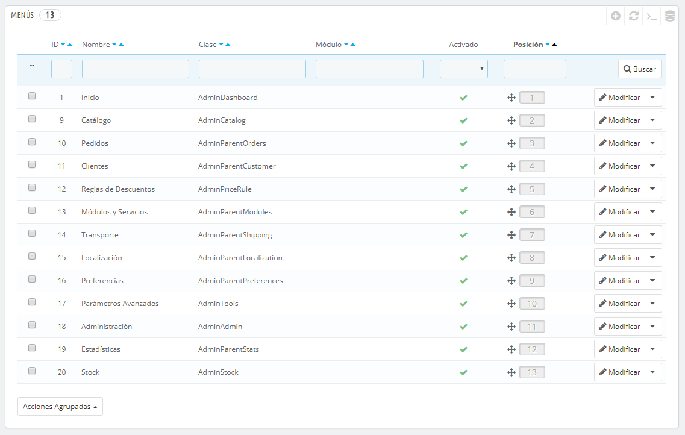

# Configuración de Menús de Administración

La organización de los menús en el back-office de PrestaShop no están escritos en piedra: aunque la disposición predeterminada ha sido diseñada para ofrecer un acceso más rápido a las páginas de mayor utilidad, es posible que tengas una opinión diferente, y desees cambiar la organización, en parte o en su totalidad.

Esta página de administración te permite mover, editar, desactivar e incluso crear páginas.

¡

## Mover menús 

Los menús pueden ser movidos directamente a través de esta lista. Puedes hacer clic sobre las flechas de la columna "Posición", o arrastrar la fila y soltarla en la posición que desees. Tan pronto como sueltes la fila en la posición deseada, PrestaShop guardará automáticamente el cambio. Puedes arrastrar la fila posicionando el cursor del ratón sobre la columna "Posición".

Puedes desactivar un menú simplemente haciendo clic en la marca de verificación de color verde de la columna "Activado". Ten en cuenta que esta acción desactivará el menú para todos los usuarios del back-office. Si deseas ocultar un menú a un conjunto específico de usuarios, edita los permisos de perfil, en la página de administración "Permisos".

## Mover páginas 

Para acceder a las páginas de un menú, haz clic en la acción "Detalles" del menú de acciones. Un nuevo listado aparece con las páginas presentes en ese menú, y con las mismas columnas que aparecían en la anterior pantalla.

Las páginas de un menú pueden ser movidas directamente desde la lista. Puedes hacer clic sobre las flechas de la columna "Posición", o arrastrar la fila y soltarla en la posición que desees. Tan pronto como sueltes la fila en la posición deseada, PrestaShop guardará automáticamente el cambio. Puedes arrastrar la fila posicionando el cursor del ratón sobre la columna "Posición".

También puedes mover una página a un menú diferente. Sin embargo, esto no se puede hacer directamente desde la lista. Para realizar esto: debes abrir el formulario de edición de la página, donde encontrarás la opción "Padre". Cambia esa opción a otro nombre del menú, guarda los cambios que has realizado, y si regresas a la página "Menús", comprobarás que la página se habrá movido al menú que has seleccionado.

Puedes desactivar una página simplemente haciendo clic en la marca de verificación de color verde de la columna "Activado". Ten en cuenta que esta acción desactivará la página para todos los usuarios del back-office. Si deseas ocultar una página a un conjunto específico de usuarios, edita los permisos de perfil, en la página de administración "Permisos".

## Crear una nueva página o menú 

Haz clic en el botón "Añadir nuevo menú" para abrir la página del formulario de creación.

Este formulario contiene unas cuantas opciones, algunas de las cuales pueden resultar complejas:

* **Nombre**. Establece un nombre único, ya que servirá de identificador interno
* **Clase**. Sin entrar en demasiados detalles técnicos: una página del back-office de PrestaShop está basada en archivos internos de PHP específicos, que son llamados "admin controllers", y que normalmente se encuentran almacenados en la carpeta `/controllers/admin` de tu instalación de PrestaShop. Al crear una nueva página, debes saber cuál es el controlador de destino, y lo más importante el nombre de su clase – que es el nombre del archivo PHP.\
  Por ejemplo, si deseas crear una página que muestre la página de administración de copias de seguridad de PrestaShop, debes primero encontrar el nombre del controlador (en este caso, `AdminBackupController`), y copiarlo en el campo "Clase".
* **Módulo**. En algunos casos, el controlador de administración para el cual estás creando una página proviene de un módulo. En estos casos, también debes especificar el identificador del módulo (en la mayoría de los casos, el nombre de la carpeta), y copiarlo en el campo "Módulo", en minúsculas. De esta forma, PrestaShop sabe que no debes buscar el controlador en la carpeta `/controllers/admin` sino en la carpeta `/modules/NOMBRE-DEL-MÓDULO/`.
* **Estado**. Puedes desactivar una página en cualquier momento, pero ten en cuenta que esto afecta a todos los usuarios del back-office.
* **Padre**. Puedes elegir cualquier menú, pero en aras de la coherencia, asegúrate de elegir uno que corresponda a la página que estás creando.

Si quieres crear un nuevo menú, elige "Inicio" como padre.
