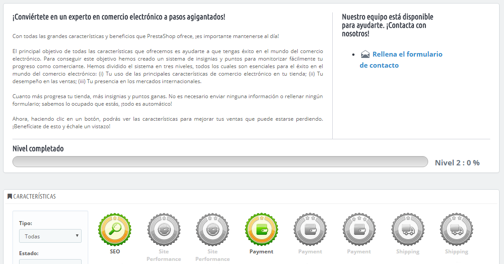

# Experiencia Comercial (Experiencia minorista)

Esta página es generada por el módulo del mismo nombre. Este módulo ha sido diseñado específicamente para ayudar a los usuarios de PrestaShop a realizar un seguimiento de tu progreso como e-comerciante, y comprobar cuánto has ido creciendo y progresando en los días, meses y años desde que abriste tu tienda en línea al público.

Este módulo añade sistema de medallas y puntos, dividido en tres niveles, todos ellos integrados para triunfar en el mundo del e-commerce

* **Características**. Tu uso de las características clave del comercio electrónico, tales como: Rendimiento del sitio, Tamaño del catálogo, Empleados y SEO.
* **Logros**. Tu cumplimiento de las metas específicas claves del comercio electrónico, como el número de clientes, pedidos, e ingresos.
* **Internacional**. Seguimiento de tu presencia en mercados internacionales clave, tales como las Américas, Oceanía, Asia, Europa, África y El Magreb.

Cuanto más progrese tu tienda, más medallas y puntos ganarás. No hay necesidad de entregar esta información, ni de rellenar ningún formulario. Sabemos lo ocupado que estás; todo se hace automáticamente. Utiliza esta herramienta para impulsar tu negocio, ver tu progreso y reflexionar sobre tus grandes logros conseguidos.
