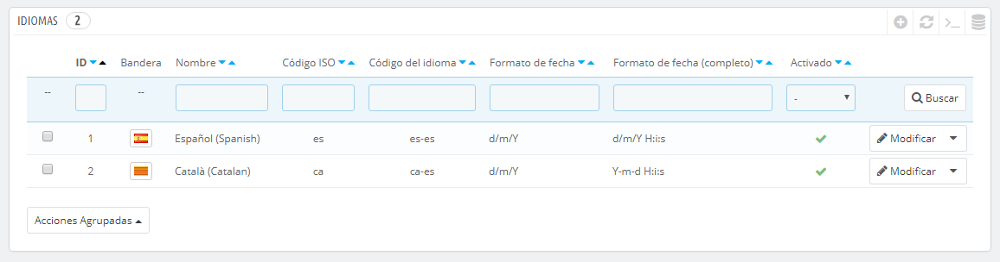
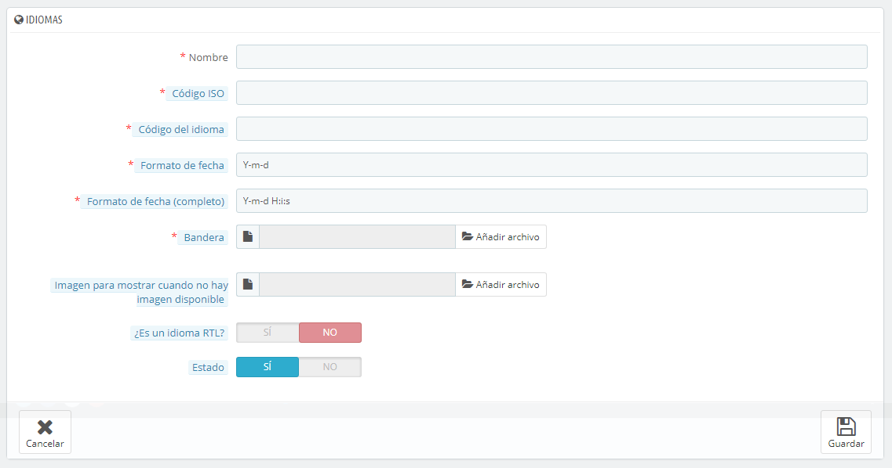

# Idiomas

PrestaShop fue diseñado para ser multilingüe: en la instalación española hay dos idiomas instalados de manera predeterminada, pero muchos más idiomas están disponibles para descargar y utilizar.

La página "Idiomas" gestiona los idiomas que se pueden ver en el back office y front-office de tu tienda.

La página muestra los idiomas ya instalados en tu tienda, junto con alguna otra información de interés: código ISO, código del idioma, formato de fecha (corto y completo). Puedes activar o desactivar un idioma haciendo clic en el icono de la columna "Activado".

Para añadir un idioma, basta con importar la ubicación del paquete de un país que utilice ese idioma (en la página "Localización"). Si esto no funciona, o si necesitas algo que se adapte mejor a tus necesidades, puedes añadir un nuevo idioma manualmente, utilizando el formulario que se encuentra tras el botón "Añadir nuevo".

## Crear un nuevo idioma 

Crear un nuevo idioma significa tener que traducir todos los textos del front-end de PrestaShop, así como el back-end, los módulos, etc., o bien arriesgarte a que tus clientes no entiendan el idioma y utilizar las cadenas de texto en el idioma inglés, incluido en PrestaShop de manera preseterminada. La traducción se realiza con la herramienta disponible en la página "Traducciones", bajo el menú "Localización".

También puedes crear un nuevo idioma para integrarlo en un paquete de idioma que hayas descargado desde el sitio oficial de PrestaShop.

Para crear un nuevo idioma, debes rellenar tantos campos del formulario como sea posible:

* **Nombre**. El nombre es público. Si vas a crear este idioma para un uso regional, puedes indicarlo en el nombre: por ejemplo, "Francés (Quebec)".
* **Código ISO**. Introduce el código ISO 639-1 de 2 letras. Para obtener mayor información, consulta: [http://en.wikipedia.org/wiki/List\_of\_ISO\_639-1\_codes](http://en.wikipedia.org/wiki/List\_of\_ISO\_639-1\_codes).\
  &#x20;Si estás importando un paquete de idioma, este código debe coincidir exactamente con el del paquete.
* **Código del idioma**. Introduce las 4 letras pertenecientes al código del idioma, en el formato `xx-yy`, siendo `xx` el código ISO del idioma (igual que el anterior), e `yy` el código ISO del país, utilizando ISO 3166-1 alpha-2 ([http://en.wikipedia.org/wiki/ISO\_3166-1\_alpha-2](http://en.wikipedia.org/wiki/ISO\_3166-1\_alpha-2)). Para obtener mayor información, consulta: [http://es.wikipedia.org/wiki/C%C3%B3digo\_de\_idioma\_IETF](http://es.wikipedia.org/wiki/C%C3%B3digo\_de\_idioma\_IETF).
* **Formato de fecha**. Los países no siempre comparten la misma representación en el formato de la fecha (Consulta: [http://en.wikipedia.org/wiki/Date\_format\_by\_country](http://en.wikipedia.org/wiki/Date\_format\_by\_country)). Por lo tanto, cuando tu tienda muestre 02/08/12, un cliente de Francia entenderá "August 2nd, 2012", mientras que otro cliente en EE.UU. lo interpretará como "February 8th, 2012" – y un cliente japonés podría leer esta fecha como "August 12th, 2002". Por esta razón, es importante indicar el formato de fecha ligado al idioma. Las letras utilizadas deben ser las de la función PHP's `date()`: [http://www.php.net/manual/es/function.date.php](http://www.php.net/manual/es/function.date.php).
* **Formato de fecha (completo)**. Igual que el formato de fecha anterior, pero incluyendo el formato horas-minutos.
* **Bandera**. Sube una imagen de la bandera que mejor se adapte al idioma que quieras añadir. Ésta debe ser de 16\*11 píxeles. Te recomendamos que utilices las imágenes de banderas gratuitas FamFamFam Flags: [http://www.famfamfam.com/lab/icons/flags/](http://www.famfamfam.com/lab/icons/flags/).
* **Imagen para mostrar cuando no hay imagen disponible ("Sin imagen")**. Sube una imagen que será mostrada cuando un producto no cuente todavía con una imagen. Esta imagen es simplemente una imagen en blanco, con el texto "Sin imagen" o "Imagen no disponible" en el idioma que se encuentre creando. La imagen debería ser de 250\*250 píxeles. Puedes encontrar ejemplos de imágenes del tipo "Sin imagen" en el directorio `/img/l` de la instalación de PrestaShop.
* **¿Es éste un idioma RTL?**. Algunos idiomas se escriben de derecha a izquierda, sobre todo los que utilizan la escritura árabe o el alfabeto hebreo ([http://es.wikipedia.org/wiki/Escritura\_de\_derecha\_a\_izquierda](http://es.wikipedia.org/wiki/Escritura\_de\_derecha\_a\_izquierda)). Cuando un tema de PrestaShop está bien codificado, permite gestionar idiomas RTL - siempre y cuando se establezca como tal.
* **Estado**. Puedes desactivar un nuevo idioma hasta que no se encuentre traducido completamente.
* **Selección de tienda**. Puedes hacer que el idioma sólo esté disponible para una selección de tus tiendas, por ejemplo tiendas cuyo objetivo sea cubrir una determinada zona local.

Una vez que hayas guardado y activado este idioma, puedes importar el paquete de idiomas. Esto se realiza en la página "Traducciones", bajo el menú "Localización". Utiliza la opción "Importar un paquete de idioma manualmente".

Por último, asegúrate de que todo funciona correctamente: dirígete al front-office de tu tienda y haz clic en las banderas situadas en la parte superior. Del mismo modo, los clientes pueden seleccionar un idioma adicional mediante el uso de estos iconos.
