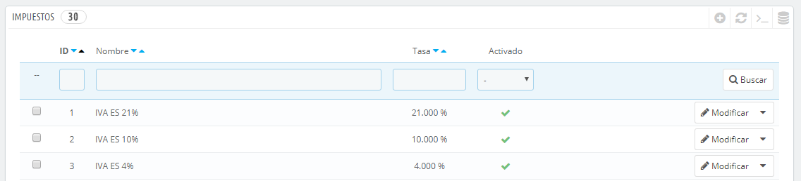
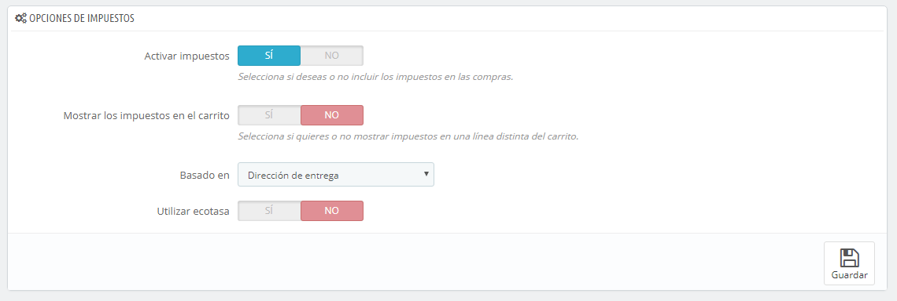
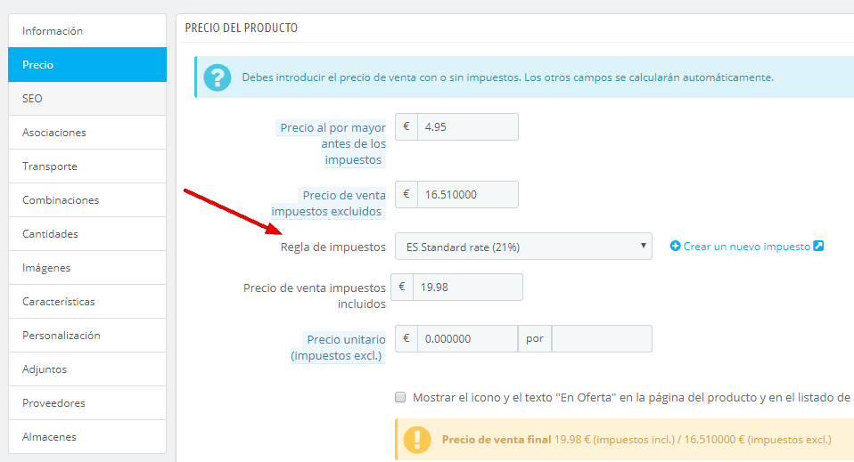
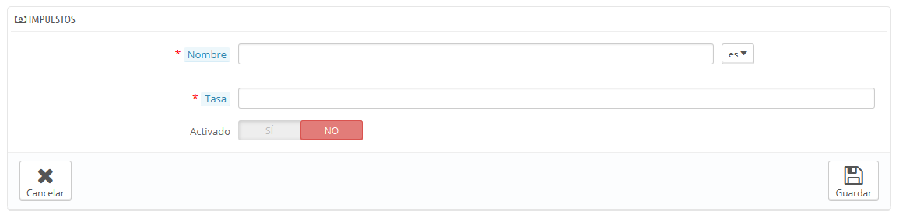

# Impuestos

Los impuestos son un tema complejo, que debes comprender plenamente, ya que tienen un impacto significativo en los precios de tus productos y/o en tus gastos de envío. Aunque esta guía de usuario no está destinada a enseñarte todos los entresijos de los impuestos, vamos a tratar de ofrecerte los mejores consejos.

Los impuestos son una "contribución obligatoria a los ingresos del Estado, impuesta por el gobierno sobre los trabajadores, ingresos y beneficios de las empresas o añadido al coste de algunos bienes, servicios, y transacciones". En resumen, cada producto que vendas está sujeto a unos impuestos de ventas, que dependen de las leyes fiscales de tu país. En efecto, tu contribuyes al funcionamiento del Estado o del Gobierno (bienes y servicios públicos) con un porcentaje del total de tus ventas, según lo definido en las tasas de impuestos locales.

Hay multitud de tipos impositivos en el mundo, y varían considerablemente de un país a otro, e incluso dentro de un mismo país si este tiene estados federales (USA, Alemania, España, Rusia...). Por lo tanto, debes asegurarte de ajustarse estrictamente a las leyes fiscales de tu país, e incluso a los de tu provincia (estado) o localidad. Consulta con tu representante fiscal local tan pronto como te sea posible con el fin de obtener todos los detalles oficiales.

De forma predeterminada en PrestaShop, un impuesto se aplica a todos los países/estados/zonas. Para aplicar un tipo de gravamen específico para un país o un conjunto de países (y no para algunos otros), debes crear una regla de impuesto. La regla de impuesto se aplica sobre la base de cada producto, durante la creación del producto (pestaña "Precios").

No puedes aplicar directamente un impuesto a un producto; sólo puedes aplicarle reglas de impuesto. Por lo tanto, debe registrarse primero todos los impuestos pertinentes, y a continuación, crear una regla de impuesto para dicho impuesto, con el fin de especificar los países a los que se les aplica el impuesto, y finalmente establecer el impuesto al producto.

## Opciones de impuestos 

En la parte inferior de la página se encuentra la sección "Opciones de impuestos". Estas opciones se aplican a toda la tienda, y a todos los pedidos.

* **Activar impuestos**. Indica si los impuestos deben ser incluidos en cada pedido o no.
* **Mostrar los impuestos en el carrito**. Es posible que prefieras que el cliente no sepa los impuestos que se aplican al pedido. En ese caso, desactiva esta opción.
* **Basado en**. El cliente puede optar porque no se entreguen  sus productos en la dirección de facturación. Esto puede tener un gran impacto en los impuestos. De manera predeterminada, PrestaShop basa tus tasas de impuestos sobre la dirección de entrega, pero puedes elegir que se basen en la dirección de facturación.
* **Utilizar ecotasa**. La ecotasa se refiere a "impuestos destinados a promover las actividades ecológicamente sostenibles a través de incentivos económicos". Este es un impuesto que los propietarios de las tiendas pagan con el fin de "sentir la carga social de sus acciones". Aprende más sobre la ecotasa en esta página de la Wikipedia: [http://es.wikipedia.org/wiki/Ecotasas](http://en.wikipedia.org/wiki/Ecotax).\
  &#x20;Una vez que hayas activado el uso de la ecotasa, todas las páginas back-office de tus productos mostrarán el campo "Ecotasa (ya incluida en el precio)" en su pestaña "Precios". Deberías rellenar este campo con el valor exacto de los impuestos, el cual depende de las leyes fiscales de tu país (que probablemente se basa en el precio del producto).

Si decides activar la ecotasa después de haber añadido los productos, tendrás que editar todos ellos con el fin de establecer correctamente el impuesto para cada producto.\
&#x20;Ten en cuenta que si ya has establecido las ecotasas para tus productos, y posteriormente decides desactivarla, todos tus productos perderán sus impuestos ecológicos. La reactivación de la ecotasa significará tener que establecer las ecotasas de todos tus productos de nuevo.\
&#x20;La ecotasa también será mostrada al cliente, en la página del producto.

## Añadir un nuevo impuesto 

Añadir un nuevo impuesto es muy fácil, porque son las reglas de impuestos las que llevan a cabo todo el trabajo de especificar los países en los que se aplica el impuesto. El formulario de creación de impuestos es muy corto:

* **Nombre**. Sea muy específico, ya que esto te ayudará a construir reglas de impuestos más rápidamente.\
  &#x20;Se recomienda añadir recordatorios en el nombre, tales como el país/grupo/zona a los que se aplica el impuesto, seguido de la tasa. Esto te será de gran ayuda para reconocer el impuesto que debes utilizar en una regla de impuesto.
* **Tasa**. La tasa exacta, en el formato XX.XX.
* **Activado**. Puedes deshabilitar y habilitar un impuesto en cualquier momento.\
  \
  
