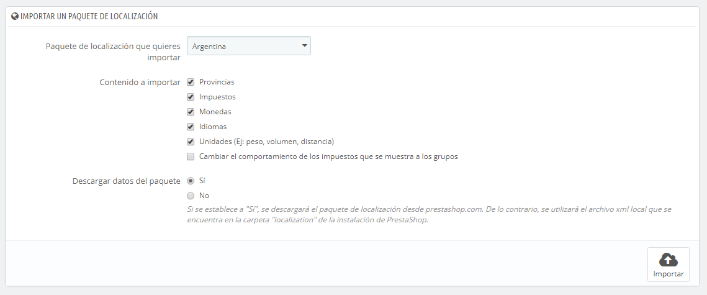
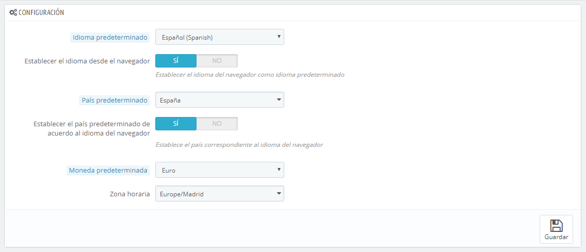
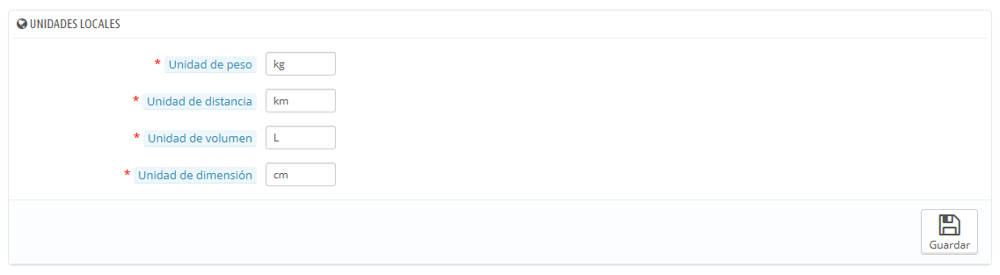
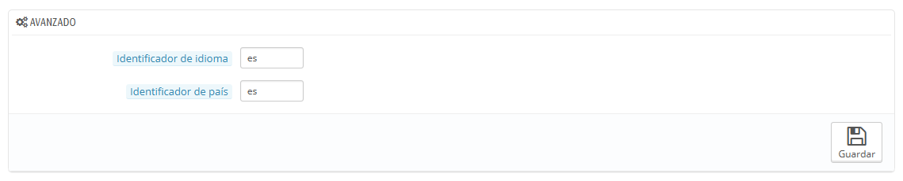

# Localización

La página principal bajo el menú "Localización" te permite configurar las unidades utilizadas por tus productos.

## Importar un paquete de localización 

Esta sección te ofrece una extensa lista de los paquetes de localización existentes que puedes importar. No sólo te permite configurar PrestaShop con tus propias unidades locales, sino que también te permite añadir otros datos:

* **Provincias (Estados)**. Cuando envías un producto a un país, puede ser importante saber a qué zona geográfica o estado se envía éste, ya que esto podría tener un impacto en gastos de aduanas e impuestos locales. Los estados añadidos pueden ser visualizados y editados en la página "Provincias (Estados)" bajo el menú "Localización".
* **Impuestos**. La verdadera importancia de la localización son los impuestos locales, y pueden ser numerosos y variados, dependiendo del país o el estado o provincia. PrestaShop le proporciona un soporte básico para los principales impuestos y reglas tributarias. Los impuestos y reglas tributarias añadidos pueden ser visualizados y editados en las páginas "Impuestos" y "Reglas de impuestos" bajo el menú "Localización".
* **Monedas**. Los clientes extranjeros aprecian la posibilidad de ver los precios de tu tienda en sus propias monedas. Deberías al menos de establecer tu tienda para aceptar dólares y euros, además de la moneda de tu país (si no es una de esas dos). Una vez añadida la moneda, tienes que activarla utilizando la página "Monedas" bajo el menú "Localización", y asegurarte de que la tasa de conversión es correcta. Las monedas añadidas pueden ser visualizadas y editadas desde la página "Monedas".
* **Idiomas**. Todos los campos públicos de tu tienda pueden estar escritos en varios idiomas, y es muy importante que hagas esto al menos para los nombres y las descripciones de tus productos. Ten en cuenta que al importar un idioma  también se importa su formato de fecha (d/m/Y, m/d/Y, d.m.Y, ...), entre otras cosas. Los idiomas añadidos se pueden visualizar y editar en la página "Idiomas" bajo el menú "Localización".
* **Unidades**. Peso, dimensiones, volumen, distancia: estas unidades son esenciales para describir correctamente un producto a tu cliente, y para la información del embalaje de tu producto. Las unidades pueden ser visualizadas y editadas desde esta misma página, en la sección "Localización".
* **Cambiar el comportamiento de los impuestos mostrados para los grupos**. Este campo no trata de datos que puedan importarse, pero es un ajuste de configuración que puedes cambiar al realizar una importación. \
  

Como puedes ver, estos datos adicionales son opcionales: puedes optar por importar la moneda y el idioma de un país determinado, y no sus impuestos, por ejemplo.

Aunque no debes añadir demasiados datos locales ya que esto puede abrumar a tus clientes, sí que puede ser útil importar el paquete de localización de aquellos países que más visitan tu tienda (según tus estadísticas).

Además de las unidades predeterminadas, **no puedes eliminar automáticamente todos los datos de un determinado país**; si necesitas eliminar los datos tendrás que hacerlo manualmente, en sus respectivas páginas bajo el menú "Localización".

## Configuración 

Esta sección agrupa cuatro ajustes locales predeterminados, de primordial importancia:

* **Idioma predeterminado**. Este es el idioma principal de tu tienda. Este ajuste influye en el idioma del back-office de tu tienda (incluyendo el idioma principal para tus productos), así como el front-office. Ten en cuenta que el idioma del front-office podría adaptarse a la configuración del navegador del cliente.
* **País predeterminado**. La ubicación de tu negocio. Si tienes sede en muchos países, utiliza tu país principal.
* **Moneda predeterminada**. La moneda en la que se establecieron por vez primera los precios de tus productos. Las monedas se añaden mediante la importación y la activación de la moneda de un país. Ten en cuenta que si cambias de moneda después de que ya hayas establecido algunos precios de productos, tendrás que actualizar manualmente todos los precios existentes. Asegúrate realizar este ajuste desde el principio y una sóla vez.
* **Zona horaria**. Tu propia zona horaria. Especialmente útil para promociones diarias: debes saber exactamente cuándo empiezan y terminan.\
  

Desde la versión 1.6.0.10, la configuración de los campos "Idioma predeterminado" y "Páis predeterminado" presentan un ajuste adicional:

* Para "Idioma predeterminado": **Establecer idioma desde el navegador**. PrestaShop establecerá el idioma predeterminado de la tienda en función de la configuración regional del idioma establecida en el navegador del visitante (por ejemplo: fr\_CA establecería el idioma Francés)
* Para "País predeterminado": **Establecer el país predeterminado desde el idioma del navegador**. PrestaShop establecerá  el país predeterminado de la tienda en función de la configuración regional del territorio establecido en el navegador del visitante (por ejemplo: fr\_CA establecería el país por defecto en Canadá).

## Unidades locales 

Las unidades físicas que se presentan en esta sección (peso, distancia, volumen, dimensión), se utilizan tanto en las páginas de tus productos como para el propio embalaje – y en última instancia, son una parte esencial en tu relación con tu transportista.

Estos valores pueden ser establecidos al importar el paquete de localización para un país, pero puedes editarlos manualmente tras la importación. Por ejemplo, si quieres utilizar centilitros en lugar de litros para la unidad de volumen, cambia el valor predeterminado "L" a "cL".

Los valores deben ser símbolos de las unidades del Sistema Internacional de Unidades ([http://es.wikipedia.org/wiki/Sistema\_Internacional\_de\_Unidades](http://es.wikipedia.org/wiki/Sistema\_Internacional\_de\_Unidades)).

## Avanzado 

Esta última sección te pedirá que configures el idioma y el país local de tu servidor, en formato de código ISO:

* Para el idioma: código ISO 639-1 ([http://en.wikipedia.org/wiki/List\_of\_ISO\_639-1\_codes](http://en.wikipedia.org/wiki/List\_of\_ISO\_639-1\_codes)).
* Para el país: código ISO 3166-1 Alpha 2 ([http://en.wikipedia.org/wiki/ISO\_3166-1\_alpha-2](http://en.wikipedia.org/wiki/ISO\_3166-1\_alpha-2)).

\
Estos valores pueden ser establecidos al importar el paquete de localización para un país, pero puedes editarlos manualmente en cualquier momento.
