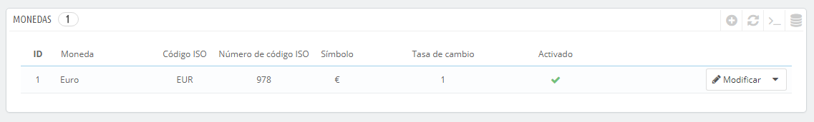

# Monedas

PrestaShop puede aceptar una gran cantidad de monedas. De manera predeterminada, sólo hay una moneda establecida: el Euro. Sin embargo, debes añadir y configurar nuevas monedas en función de las necesidades de tus clientes. De hecho, los clientes apreciarán la posibilidad de visualizar los precios de tu tienda en la moneda de su país.

Las dos secciones que aparecen en la parte inferior de la página "Monedas" son muy simples pero esenciales, ya que están relacionadas con las tasas de cambio de las divisas (o "tasas de conversión"). Citando a Wikipedia, "En financias, el tipo o tasa de cambio entre dos divisas es la tasa o relación de proporción que existe entre el valor de una y la otra. Dicha tasa es un indicador que expresa cuántas unidades de una divisa se necesitan para obtener una unidad de la otra." Las tasas cambian diariamente, a veces drásticamente dependiendo de los acontecimientos actuales, y tu tienda siempre debe estar actualizada con los últimos valores.

Para cambiar la moneda predeterminada utilizada en tu tienda, debes ir a la página "Localización" en el menú "Localización", y utilizar la opción "Moneda predeterminada" de la sección "Configuración".\
Si la moneda que deseas utilizar no está disponible en esta opción, debes importar la moneda desde uno de los países que la utilicen, utilizando la sección "Importar un paquete de localización" de la página "Localización".

## Actualizar las tasas de cambio 

En PrestaShop, hay dos formas de actualizar tus tasas de cambio:

* **Manualmente**. En la sección "Tasas de cambio", haz clic en el botón "Actualizar las tasas de cambio". Esto descargará el archivo de actualización desde los servidores de [PrestaShop.com](http://prestashop.com) utilizando el web-service PrestaShop.
* **Automáticamente**. Esta es la forma recomendada. En lugar de tener que hacer clic en el botón "Actualizar las tasas de cambio" una o tres veces al día, puedes crear una tarea cron que desencadenará la descarga de los archivos de las tasas de cambio con la frecuencia que consideres necesaria. Añade la URL prevista a tu archivo `crontab` para activar la actualización automática. Si no sabes lo que es una tarea cron o un archivo crontab, ponte en contacto con tu proveedor de hosting.

Ten en cuenta que las tasas se proporcionan tal cual: el equipo de PrestaShop pone mucha atención para tener las tasas correctas en estos archivos, pero pueden diferir ligeramente de los valores reales, ya que estas tasas pueden fluctuar considerablemente en un corto período de tiempo.

## Añadir una nueva moneda 

La forma más sencilla de añadir la moneda de un país es mediante la importación de su paquete de localización. Esto se realiza en la página "Localización", bajo el menú "Localización". Una vez importada, debes dirigirte a la página "Monedas" para activarla.

Es posible que tengas que añadir una moneda que no aparezca en ninguno de los paquetes de localización. En ese caso, puedes utilizar el formulario de creación de monedas.

* **Nombre de la moneda**. El nombre de la moneda, preferentemente en Inglés para que la mayor cantidad de clientes posibles puedan entenderlo.
* **Código ISO**. El código ISO 4217 de tres letras perteneciente a la moneda. Consulta la siguiente página de la Wikipedia: [http://es.wikipedia.org/wiki/ISO\_4217](http://es.wikipedia.org/wiki/ISO\_4217).
* **Código numérico ISO**. El código ISO 4217 de tres dígitos numéricos perteneciente a la moneda. Consulta la página indicada en el campo anterior, de la Wikipedia.
* **Símbolo**. El símbolo de la moneda, si lo tiene. Consulta la siguiente página de la Wikipedia: [http://en.wikipedia.org/wiki/Currency\_sign](http://en.wikipedia.org/wiki/Currency\_sign).
* **Tasa de cambio** (o **Tasa de conversión** en versiones anteriores). Esta tasa se define de acuerdo a la moneda predeterminada de tu tienda. Por ejemplo, si la moneda predeterminada es el Euro y esta moneda es el dólar, teclea "1.16", ya que 1€ por lo general equivale a $1.16 (en el momento de escribir este texto). Utiliza el conversor que encontrarás en la siguiente página: [http://www.xe.com/ucc/](http://www.xe.com/ucc/).
* **Formato de moneda**. Establece como quieres que se visualicen los precios. La X corresponde al símbolo de la moneda. Tienes cinco posibilidades.
* **Decimales**. Puedes indicar si tu tienda debe mostrar decimales. Aunque puedes elegir tener todos los precios en números redondos, los descuentos y otras variaciones de precios podrían justificar la utilización de números decimales. Puedes prevenir cualquiera de estos casos, utilizando esta opción.
* **Espaciado**. Una vez elegido el formato de la moneda, puedes elegir si deseas establecer un espacio en blanco entre el símbolo y el precio. Algunos idiomas requieren de éste. Por ejemplo, los españoles utilizamos "50€" mientras que los franceses utilizan "50 €". Selecciona la opción que te parezca mejor.
* **Activado**. Las monedas pueden ser desactivadas en cualquier momento, tanto desde su propia página de edición, como desde la tabla de monedas que encontrarás en la página "Monedas".
* **Selección de tienda**. Puedes hacer que la moneda sólo esté disponible para una selección de tus tiendas, por ejemplo, tiendas cuyo objetivo sea cubrir una determinada zona local.
