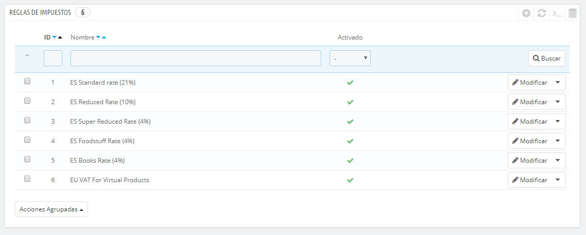
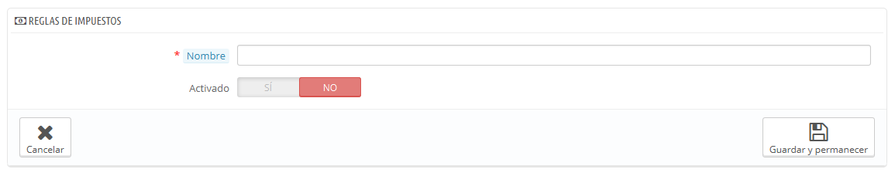
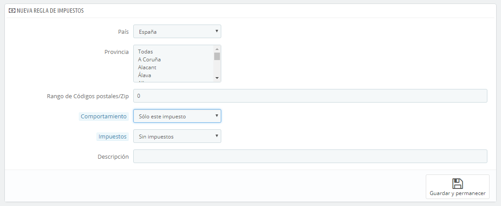

# Reglas de impuestos

Las reglas de impuestos permiten aplicar un impuesto a un conjunto de países.

De forma predeterminada en PrestaShop, un impuesto se aplica a todos los países/estados/zonas. Para aplicar un tipo de gravamen específico para un país o un conjunto de países (y no para algunos otros), debes crear una regla de impuesto. La regla de impuesto se aplica a continuación sobre la base de cada producto, durante la creación del producto (pestaña "Precios").

No puedes aplicar directamente una tasa de impuesto a un producto; sólo puedes aplicarle reglas de impuestos. Por lo tanto, deben registrarse primero todas las tasas de impuestos pertinentes y, a continuación, crear una regla de impuesto para dicha tasa de impuesto, con el fin de especificar los países a los que se les aplica el impuesto, y finalmente establecer el impuesto al producto.

Algunos ejemplos de reglas de impuestos ya están registrados en esta página, dependiendo del país que seleccionaste durante la instalación de PrestaShop. Las reglas de impuestos son establecidas para cada tasa: las reglas en realidad sirven como una especie de filtro por países, limitando el uso de dichos impuestos a un conjunto específico de países.

Debes editar algunas de las reglas ya existentes para entender mejor cómo se crean las reglas de impuestos.

## Añadir una nueva regla de impuesto 

Puedes añadir tantas reglas de impuestos, como sea necesario. Debes asegurarte de que todas las reglas de impuestos requeridas estés registradas en tu tienda.

La creación de una nueva regla de impuesto se realiza en dos pasos:

1. Crear la regla de impuesto:
   * Haz clic en el botón "Añadir nuevo".
   * En el formulario que aparece, establece un nombre para la regla. Utiliza un nombre identificativo: por ejemplo el código del país de la regla de impuesto, su nombre, incluso el valor del impuesto, de esta forma será más fácil de identificar y encontrar. Si PrestaShop ya tiene establecida una regla de impuesto para este país, utiliza este nombre identificativo como fuente de inspiración.\
     
   * Selecciona si la regla pasará a estar activa tras su creación o no. Puedes habilitarla más tarde si es necesario.
   * Haz clic en el botón "Guardar y permanecer". La página se recargará, mostrando en la parte inferior la cabecera de una tabla.
2. Especifica el país y su comportamiento:\

   * Haz clic en el botón "Añadir nueva regla de impuestos".\

     * Un nuevo formulario aparece. Rellena todos sus campos:\
       
     * **País**. El país a la que está destinada la regla de impuestos que estás creando.\

       * **Estado**. Algunos países tienen estados federales registrados en PrestaShop (vea la página "Estados", bajo el menú "Localización"). En ese caso, puedes hacer que el impuesto sea aún más específico, o permitir que éste se aplique a todo el país. Puedes seleccionar más de un estado manteniendo pulsada la tecla Ctrl mientras haces clic en los nombres de estado.
     * **Rango de códigos postales/Zip**. Ya tengas o no el país estados registrado, puedes especificar aún más la aplicación de este impuesto utilizando los códigos postales de los clientes. Este campo te permite definir códigos postales en los que se debe aplicar el impuesto: puedes introducir un sólo código postal, o definir un rango utilizando para ello un guion. Por ejemplo, puedes especificar "75000-75012" para crear un rango de todos los códigos postales que estén incluidos entre estos dos números.
     * **Comportamiento**. Algunos clientes pueden tener una dirección que coincida con más de una de las reglas de impuestos. En ese caso, puedes elegir cómo esta regla de impuesto debe comportarse:\

       * **Sólo esta tasa**. Se aplicará sólo este impuesto, ninguno otro de los impuestos existentes.
       * **Combinar**. Combinar impuestos. Por ejemplo: 100€ + (10% + 5% => 15%) => 115€.
       * **Uno tras otro**. Aplicar impuestos, uno tras otro. Por ejemplo: 100€ + 10% => 110€ + 5% => 115.5€.
     * **Impuestos**. La tasa  que se utilizará para esta regla de impuestos. Dicha tasa debe estar ya registrada en PrestaShop. Si no fuera así: elige "Ninguna tasa", para desactivar la tasa del impuesto, guarda esta página, y dirígete a la página "Impuestos" para crear una nueva tasa, a continuación, vuelve a esta página para editar esta regla de impuestos.
     * **Descripción**. Debes añadir un breve texto como recordatorio de por qué existe esta regla de impuestos para este país.
   * Haz clic en "Guardar y permanecer". El país será añadido a la tabla de abajo, y puedes comenzar a añadir otro país utilizando los nuevos campos vacíos.

Ten en cuenta que la regla por defecto que se aplica a tus productos estará basada en la tasa del país predeterminado de tu tienda.
