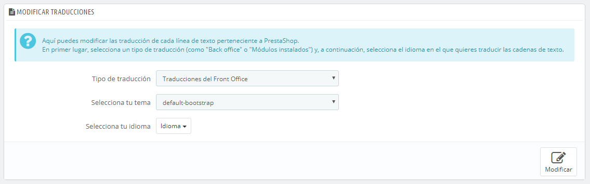
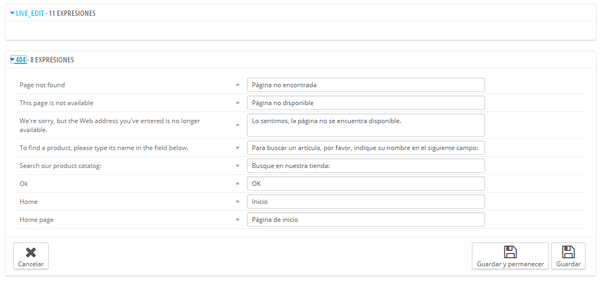
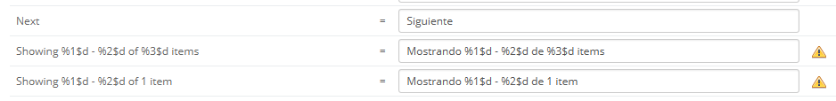
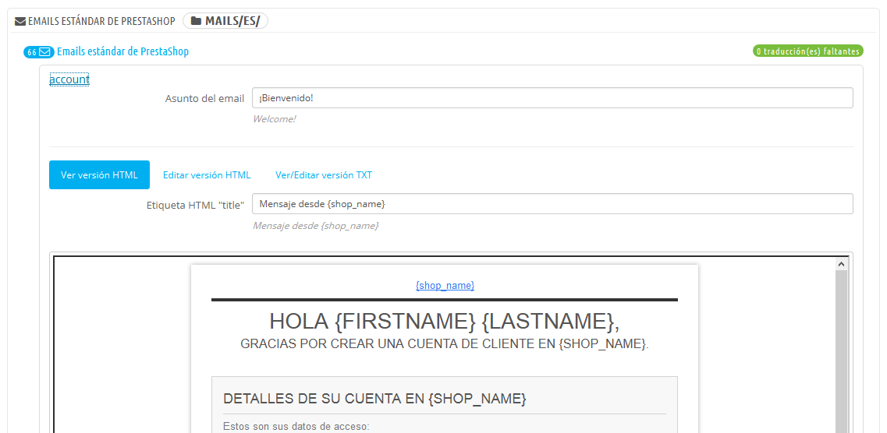
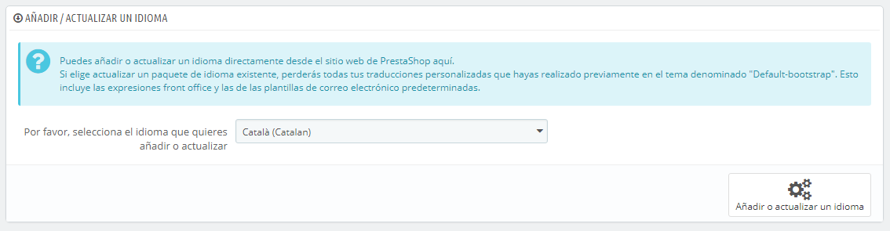
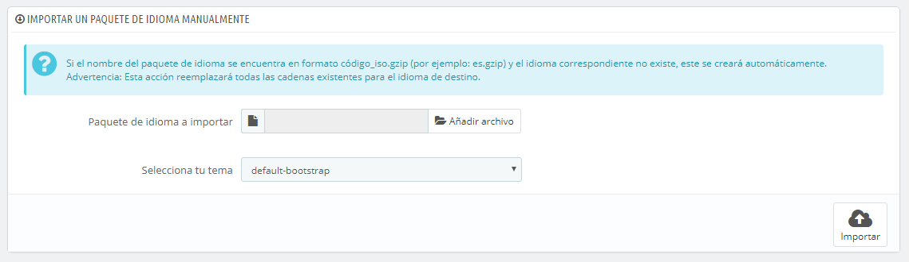
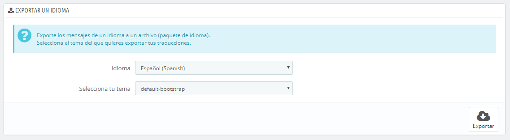
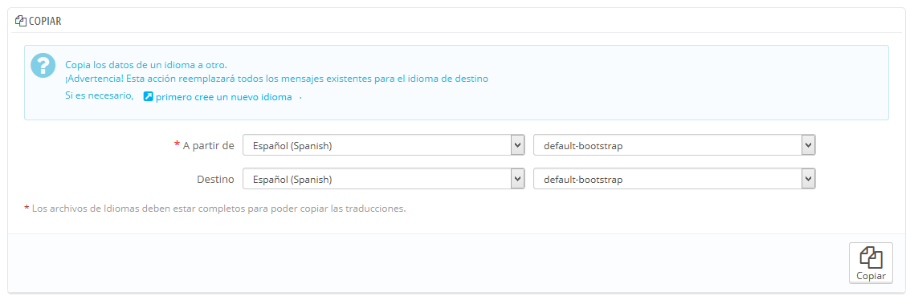

# Traducciones

PrestaShop te proporciona una completa herramienta de traducción para tu tienda. Esta permite añadir y editar las traducciones de tus páginas. De esta manera, tu eres realmente el dueño de tu tienda, y puedes gestionar las cadenas de traducción sin tener que esperar a que los traductores oficiales publiquen correcciones.

Incluso si no deseas corregir el trabajo de los traductores, pero sí quieres cambiar el estilo que ellos utilizaron (menos formal, menos prolijo, etc.), y personalizar los diferentes textos disponibles, adaptando así tu sitio web a tus clientes; por ejemplo, una tienda de ropa hip-hop podría utilizar expresiones diferentes de la de una tienda de relojes de lujo.

El proceso de adaptar un programa a una lengua extranjeras es llamado _internacionalización y localización_, o por sus siglas i18n y L10n.\
&#x20;La internacionalización es el primer paso, donde los desarrolladores eligen un mecanismo para la traducción del software. Todas las cadenas del software son posteriormente convertidas para hacer uso de este mecanismo.\
&#x20;La localización es el segundo paso, donde usuarios bilingües o multilingües traducen las cadenas originales del software a su propio idioma. La localización también puede proporcionar datos y ejemplos locales con el fin de adaptar el software a los usuarios de cada país.\
Puedes aprender más sobre los procesos i18n y L10n en la siguiente página de la Wikipedia: [http://en.wikipedia.org/wiki/Internationalization\_and\_localization](http://en.wikipedia.org/wiki/Internationalization\_and\_localization)

El equipo de PrestaShop ha optado por utilizar su propia herramienta integrada de traducción, de manera que cualquier persona puede personalizar su tienda conforme a sus necesidades.\
La traducción de la comunidad se realiza desde una versión en línea de Prestashop que se encuentra abierta para los que quieran colaborar a ella, que encontrarás en la siguiente dirección: [https://crowdin.net/project/prestashop-official](https://crowdin.net/project/prestashop-official).

Los paquetes de las traducciones oficiales se pueden descargar manualmente desde la siguiente dirección: [http://www.prestashop.com/es/traducciones](http://www.prestashop.com/es/traducciones).

## Modificar una traducción 

La herramienta más importante de la página "Traducción" se encuentra en la sección "Modificar traducciones". Aquí es donde puedes editar una traducción, y personalizar completamente todas y cada una de las cadenas de texto, si así lo deseas.

Selecciona la sección de la traducción que deseas editar:

* **Traducciones del Front Office**. El texto visible por tus clientes cuando navegan por tu tienda.
* **Traducciones del Back Office**. El texto que aparece en las páginas del panel de administración de tu tienda.
* **Traducciones de los mensajes de error**. Los mensajes de error que pueden aparecer en el front-office de tu tienda.
* **Traducciones de los nombres de los campos**. El nombre de los campos, que aparecen tanto en el front-office como en el back-office de tu tienda.
* **Traducciones de los módulos instalados.** Los términos utilizados por los módulos instalados. Ten en cuenta que los módulos que están disponibles pero no instalados no aparecerán en la herramienta.
* **Traducciones de los archivos PDF**. Los términos usados en los archivos generados en formato PDF: facturas, albaranes, etc.
* **Traducciones de las plantillas de E-mail**. Los términos utilizados en las plantillas de correo electrónico predeterminadas.

Algunas categorías tienen una segunda lista desplegable, la cual lista los temas disponibles. Los temas PrestaShop tienen sus propias cadenas, así como también pueden tener sus propios módulos, plantillas PDF y plantillas de correo electrónico. Esta lista desplegable te permite elegir el tema que deseas editar.

Una vez realizada tu selección, haz clic en la bandera del idioma para el que deseas cambiar la traducción.

Una larga página se mostrará en pantalla. Ésta contiene los cientos de cadenas disponibles para esa categoría, a veces dividido en decenas de un grupo de campos.

De manera predeterminada, tan sólo los grupos de campos que tienen cadenas sin traducir serán abiertos. Si deseas abrir todos ellos, haz clic en el botón situado en la parte superior izquierda dos veces: una para cerrar todos ellos, y otra segunda vez, para expandir todos ellos. Puedes abrir y cerrar los grupos de campos uno por uno haciendo clic en sus títulos.

Modificar una traducción es muy fácil:

* Haz clic sobre el grupo de campos que desees modificar,
* Edita su contenido,
* Haz clic sobre el botón "Actualizar traducciones y permanecer" si deseas guardar y continuar editando traducciones de este grupo de campos, o bien sobre el botón "Actualizar traducciones" para guardar y regresar a la página principal "Traducciones".

PrestaShop 1.5 introduce una nueva sintaxis donde las cadenas pueden contener especificadores de formato, tales como `%s`, `%d`, `%1$s`, `%2$d`, etc.

Cuando encuentres una cadena que contenga tales especificadores de formato, significará que PrestaShop la reemplazará por un valor dinámico real antes de mostrar la cadena traducida.\
Por ejemplo, en la cadena "Su pedido en %s ha sido realizado", `%s` será reemplazado por el nombre de la tienda. Así pues, debes mantener estos especificadores de formato en tu traducción final; por ejemplo, en francés, la traducción sería la siguiente "Votre commande sur %s a bien été enregistrée."

Técnicamente, tener especificadores de formato evita tener que dividir las cadenas en partes. Así, en versiones anteriores de PrestaShop, "Su pedido en %s ha sido realizado." se habría dividido en dos partes: "Su pedido en" y "ha sido realizado.". Si bien la traducción literal de estas partes era entendible y funcional para algunos idiomas, esto hacía que la traducción fuese casi imposible de realizar para muchos otros, especialmente en los idiomas bidireccionales como el árabe o el hebreo. Gracias a los especificadores de formato añadidos en PrestaShop 1.5, estas cadenas son ahora completamente traducibles en cualquier idioma.

Algunas cadenas podrían tener un icono de advertencia a su derecha. Esto indica que la cadena contiene algún/os especificadores de formato. Puedes hacer clic en el icono para obtener más información.\
&#x20;En caso que una cadena contenga un especificador de formato, debes asegurarte de que el contenido de esa variable será colocado en el flujo correcto de la frase, y evitar la traducción literal.\
Los especificadores de formato numéricos (`%1$s`, `%2$d`, etc.), permiten a los traductores reordenar esta variable dentro de la cadena, manteniendo el significado de cada una de las cadenas separadas por el especificador. De esta manera, un traductor francés podría optar por traducir "Pedido #%1$d de %2$s" en "Commande n°%1$s du %2$s" o bien utilizar "Le %2$s, commande n°%1$s".

### Características específicas 

La mayoría de las categorías traducidas presentan sus cadenas de la misma forma: las cadenas de la categoría están agrupadas en un grupo que puede cerrar o expandir haciendo clic en su título. El título indica el número de expresiones que el grupo contiene, y cuando sea necesario, el número de expresiones que faltan, entre paréntesis y en rojo.

Sin embargo, hay tres categorías que no se ajustan a esta descripción:

* **Traducciones de los mensajes de error**. Las cadenas no están agrupadas en conjunto, se muestran todas juntas.
* **Traducciones de los archivos PDF**. Solamente hay un grupo de campos, "PDF".
* **Traducciones de las plantillas de E-mail**. Las cadenas son divididas por grupos, pero ya no se presentan como simples campos de texto. Cada e-mail tiene dos modelos: uno en formato HTML, que presenta estilos y colores, y otro en formato de texto plano, presentando un mensaje en texto bruto. Mientras el texto plano puede ser editado directamente desde los campo de texto, el modelo HTML sólo puede ser editado haciendo clic sobre el botón "Editar esta plantilla de e-mail" situado en la parte inferior de la vista previa. Ese clic activa la vista previa dentro de un campo de texto WYSIWYG (lo que ves es lo que obtienes), con un completo editor en la parte superior (basado en TinyMCE: [http://www.tinymce.com/](http://www.tinymce.com/)). Además de editar el texto, puedes cambiar el diseño como mejor te parezca, por ejemplo, puedes cambiar los colores para adaptarlos al estilo de tu tienda.\
  Ten en cuenta que las plantillas de correo electrónico cuentan con variables, como `{lastname}` o `{shop_name}`, que PrestaShop sustituirá por sus valores reales al enviar el e-mail. Asegúrate por tanto de mantener estas variables en tu traducción.

## Añadir / Actualizar un Idioma 

Las traducciones de PrestaShop están disponibles en paquetes, que combinan las traducciones de las diferentes categorías dentro de un archivo zip. Muchos paquetes de idiomas están disponibles gratuitamente para que puedas descargarlos e instalarlos directamente desde los servidores de [PrestaShop.com](http://prestashop.com). PrestaShop se encargará de descargar el paquete de idioma, desempaquetarlo y crear las subcarpetas necesarias en la carpeta `/translation` de tu instalación.

También puedes actualizar los idiomas instalados actualmente, directamente desde los servidores de [PrestaShop.com](http://prestashop.com), pero recuerda que cualquier cambio que hayas realizado en tus traducciones se perderá una vez que actualices.

## Importar un paquete de idioma manualmente 

En caso de que no desees utilizar un paquete de traducción oficial, sino uno personalizado (ya sea proporcionada por alguien que conoces, o quieras exportarlo desde otra instalación de PrestaShop), entonces esta herramienta es adecuada para ti.

Selecciona el archivo Zip, elige el tema al que quieres aplicar este paquete, a continuación, haz clic en el botón "Importar", y el paquete se instalará en la carpeta `/translation`.

Si ya existe una carpeta de idioma con el mismo código ISO 639-1, ésta será reemplazada por los archivos del paquete que estás importando.

## Exportar un idioma 

Puedes crear tu propio paquete de idioma utilizando esta herramienta, ya sea para hacer una copia de seguridad de tu traducción personalizada, o bien para importar esta traducción en otra instalación de PrestaShop – ya sea propia o de otra persona.

Para ello, tan sólo tienes que seleccionar el idioma y el tema de la traducción que deseas exportar, y hacer clic en el botón "Exportar".

Ten en cuenta que el paquete contendrá el tema para la que realizaste la traducción.

## Copiar 

Puedes copiar el contenido de un idioma a otro. Esto es especialmente útil cuando se quiere reemplazar los datos de un tema por los de otro tema.

Selecciona el idioma de origen y el tema, a continuación, el idioma de destino y el tema, tras realizar esas acciones haz clic en el botón "Copiar". En la mayoría de casos, el idioma debe ser el mismo en las dos listas desplegables.

Si ya existe una carpeta para el idioma en el tema del destino, ésta será reemplazada por los archivos del idioma y tema que estás copiando.

Es posible que prefieras primero crear un nuevo idioma para el tema de destino, y posteriormente copiar el idioma de origen a éste.
