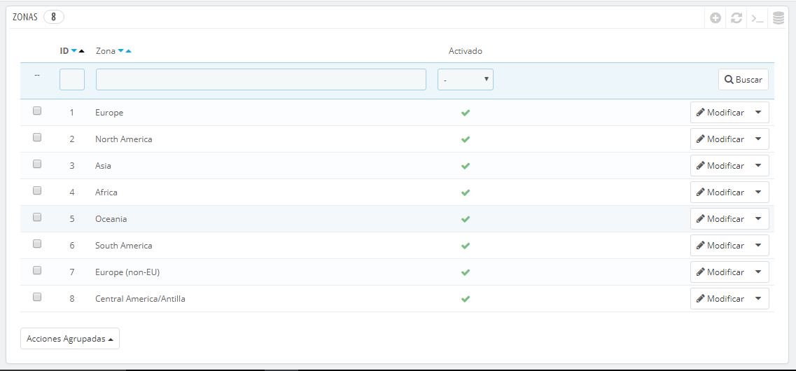
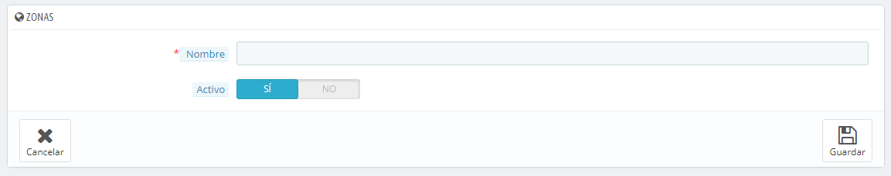

# Zonas

Las zonas PrestaShop son una lista de las subregiones del mundo ([http://es.wikipedia.org/wiki/Subregi%C3%B3n](http://es.wikipedia.org/wiki/Subregi%C3%B3n)). Esto ayuda a categorizar los países.

\
Si lo necesitas, puedes crear más zonas: haz clic sobre el botón "Añadir nuevo" para mostrar en pantalla el formulario de creación.

Todo lo que necesitas es un nombre y un estado, para indicar por ejemplo que no se realizan entregas en Oceanía.\
&#x20;Si tienes establecido el modo multitienda, puedes también asociar una zona con una selección de tiendas.
