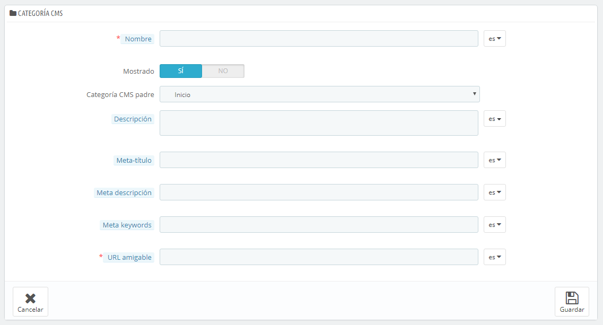

# CMS - Gestionar el Contenido Estático

PrestaShop te permite crear páginas con contenido estático tan fácilmente como creas las páginas de productos, para ello deberás utilizar la herramienta CMS. Las páginas se mostrarán a los clientes en el bloque de "Información", en la página de inicio, y en el menú de la tienda. Puedes añadir páginas CMS al menú superior utilizando el módulo "Menú horizontal superior" (el cual puedes configurar desde la página "Módulos").

La página "CMS" te presenta todas las página con contenido estático que fueron creadas previamente en tu tienda, para la categoría seleccionada (de manera predeterminada, la página de inicio es la única categoría disponible).

¡No te olvides de crear tantas versiones de cada página, como idiomas soporte tu tienda! Como siempre, tendrás que hacer clic en el selector de códigos de idioma situado junto a cada campo para traducir los textos en cada idioma.

## Crear una nueva categoría CMS 

Haz clic en el botón "Añadir una nueva categoría CMS" para crear una nueva categoría CMS – ésta será, una subcategoría de la categoría padre, "Inicio". Puedes crear tantas categorías como necesites.

El formulario de creación es bastante sencillo de completar:

* **Nombre**. El nombre debe ser corto e identificativo.
* **Mostrada**. Determina si la categoría y sus páginas serán visibles a nivel público, o permanecerán ocultas.
* **Categoría padre CMS**. La categoría bajo la cual se encontrará esta categoría: de manera predeterminada, "Inicio". Puedes tener un número ilimitado de subcategorías.
* **Descripción**. Rellena este campo en todos los idiomas disponibles en tu tienda, ya que algún tema podría mostrar esta información a los clientes.
* **Meta título**. El nombre de la categoría. Este nombre será utilizado por los motores de búsqueda.
* **Meta descripción**. Se utiliza para describir el contenido de esta categoría en los motores de búsqueda.
* **Meta palabras clave**. Utilizado por los motores de búsqueda para conocer el tipo de información que contendrá la categoría.
* **URL amigable**. Facilita que los motores de búsqueda indexen tu contenido, y que los visitantes sepan de antemano lo que van a encontrar en esta categoría. Este campo es rellenado automáticamente al introducir el nombre de la categoría, pero puedes editarlo manualmente si lo crees necesario.

Al guardar la categoría, PrestaShop te lleva de regreso a la página de las tablas, pero esta vez utilizando la nueva categoría que has creado como base. Por lo tanto, no visualizarás ninguna subcategoría o subpágina creada en este momento.\
Para volver a la categoría raíz, haz clic en "Inicio" en la sección "Categoría actual" en la parte superior. Puedes editar las páginas de la categoría raíz, y trasladarlas a la categoría que acabas de crear si lo deseas.

Para crear subcategorías, simplemente cambia la opción "Categoría padre CMS" de "Inicio" a la categoría padre para la que estás creando esta subcategoría.

## Crear una nueva página CMS 

Haz clic en el botón "Añadir una nueva página CMS" para acceder al formulario de creación:

* **Categoría CMS**. La categoría predeterminada es la página principal de tu tienda. Si deseas tener esta página en otra categoría, primeramente debes haberla creado.
* **Meta título**. El nombre de la página, que se mostrará en el navegador.
* **Meta descripción**. Se utiliza para describir el contenido de esta página en los motores de búsqueda.
* **Meta palabras clave**. Utilizado por los motores de búsqueda para conocer el tipo de información que contendrá la página.
* **URL amigable**. Facilita que los motores de búsqueda indexen tu contenido, y que los visitantes sepan de antemano lo que van a encontrar en esta página. Este campo es rellenado automáticamente al introducir el nombre de la página, pero puedes editarlo manualmente si lo crees necesario.
* **Contenido de página**. Este es el contenido principal de la página. En este editor WYSIWYG, puedes escribir el texto que consideres necesario, e incluso añadir imágenes o videos en la misma utilizando "Insertar imagen" o "Insertar medio embebido".
* **Indexación por motores de búsqueda**. Indica si los motores de búsqueda deben registrar esta página o no.
* **Mostrada**. Puedes elegir si la página será accesible a nivel público, o si deseas guardarla de momento como borrador y no hacerla pública todavía.

Haz clic en el botón "Guardar y previsualizar" para visualizar la página en el contexto gráfico de tu tienda.
