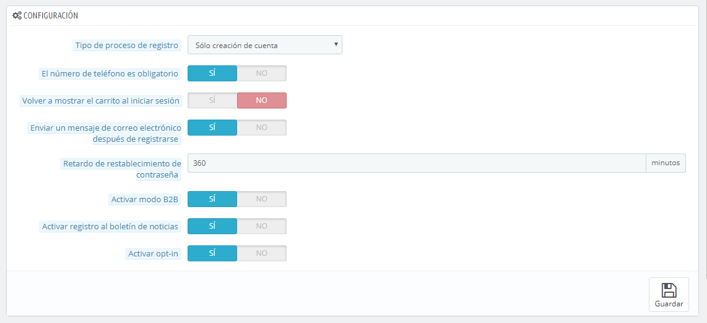

# Preferencias de Clientes

La página preferencias de "Clientes" aparecida en la versión 1.5 reúne todas las opciones relacionadas con los clientes, incluyendo el modo B2B.

* **Tipo de proceso de registro**. Puedes permitir a los visitantes crear una nueva cuenta sin obligar inmediatamente a registrar una dirección, o forzarles a registrar una dirección tan pronto como ellos crean su cuenta.\
  La primera opción hace que sea más rápido el proceso de crear una cuenta, lo cual es fabuloso, pero esta añadirá una nueva pantalla obligatoria una vez que ellos quieran validar un pedido, que no podrán evitar.\
  &#x20;Por otra parte, la segunda opción alarga el proceso de creación de una cuenta, pero ya contarán con  una dirección registrada cuando quieran validar el pedido.
* **El número de teléfono es obligatorio**. Al igual que en la opción anterior, puedes requerir que tus clientes registren un número de teléfono, o no. Disponer de los números de teléfono de tus clientes puede resultar muy valioso, ya que esto hace que pueda contactar con ellos directamente, sin embargo algunos clientes son reacios a proporcionar este tipo de información. Si seleccionas "No", el campo "Número de teléfono" seguirá apareciendo en el formulario de creación de la cuenta de los clientes, pero no será un campo requerido.
* **Volver a mostrar el carrito al iniciar sesión**. Si el cliente tiene un carrito que no completó (no terminó en un pedido) en su última sesión, puedes mostrárselo la siguiente vez que vuelva a iniciar sesión en tu tienda.
* **Enviar un mensaje de correo electrónico después de registrarse**. Puedes hacer que PrestaShop envíe un e-mail a cualquier cliente que acabe de crear una cuenta, con un resumen de la información de su cuenta (email, contraseña).
* **Retardo de restablecimiento de contraseña**. Puedes optar por limitar la frecuencia con la que un cliente puede generar una nueva contraseña para su cuenta. De manera predeterminada, esta opción está establecida en 360 minutos – 6 horas.
* **Activar modo B2B**. El modo B2B añade nuevas características a tu tienda. Los clientes ya no son considerados individuos sino empresas, y nuevas opciones aparecen:\

  * El perfil de cliente tiene nuevos campos relacionados con la información profesional (Número Duns en USA, número SIRET en Francia, número CNPJ en Brasil, etc.),
  * Los precios pueden estar ocultos a ciertos grupos,
  * Los precios pueden ser personalizados para cada usuario, para todo el catálogo o para determinadas categorías,
  * Las facturas pueden ser generadas manualmente,
  * etc.
