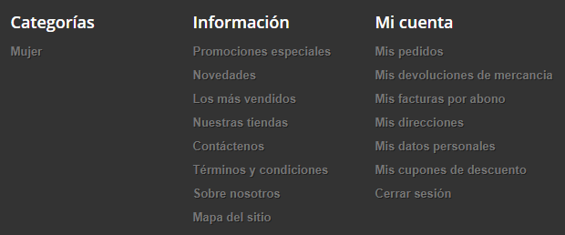
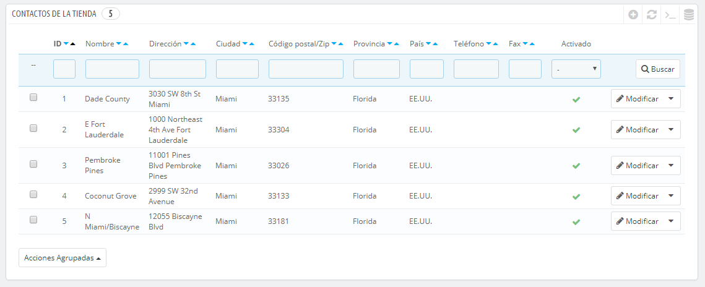
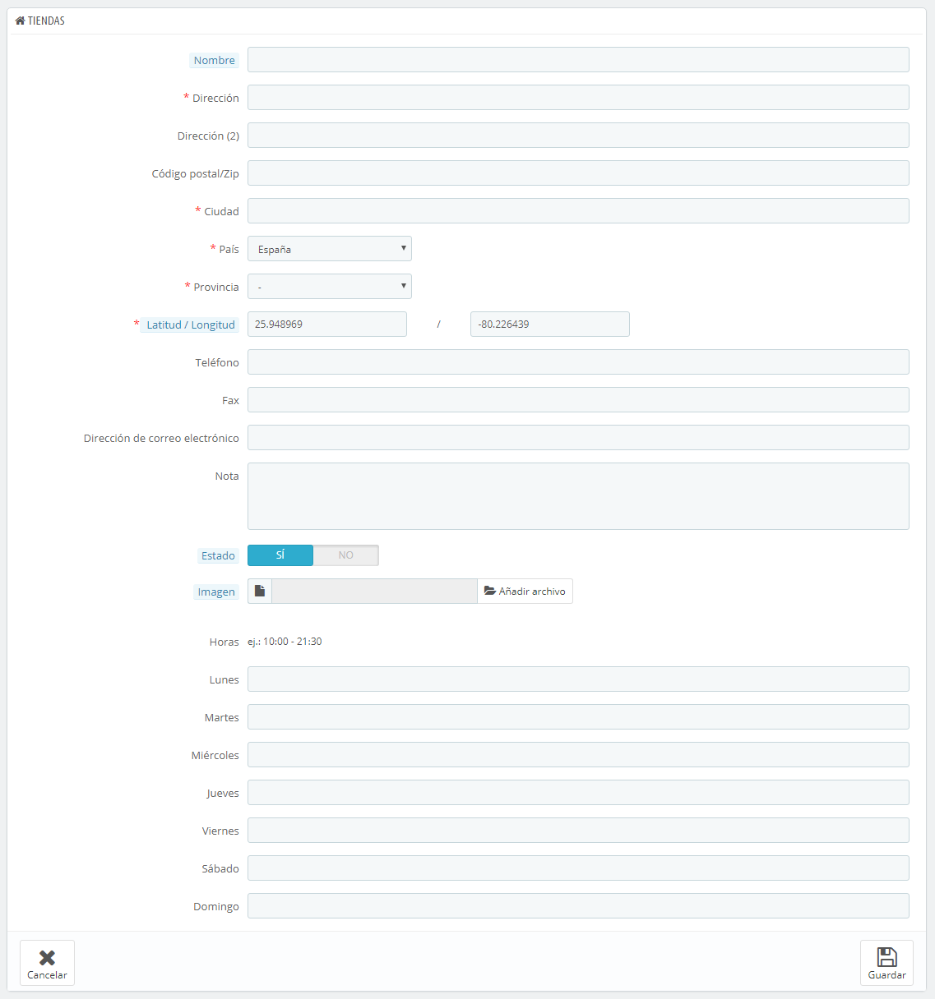
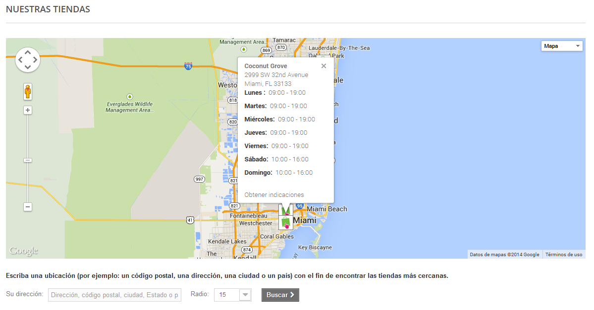
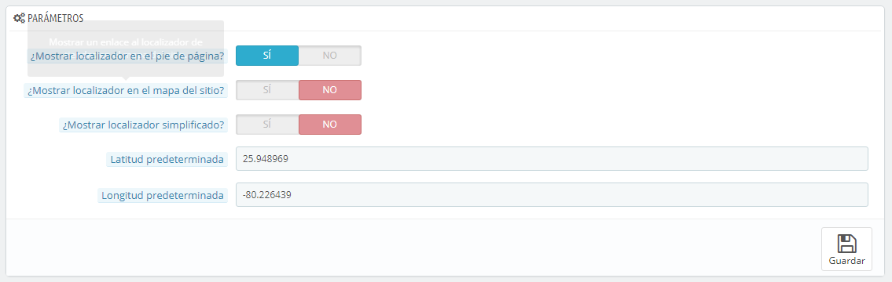
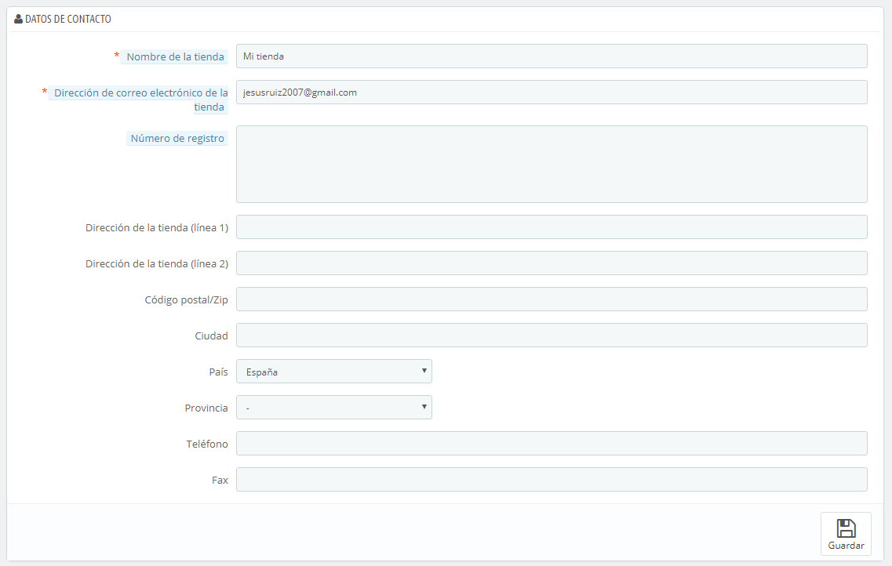

# Preferencias de Contactos de la tienda

PrestaShop ofrece a tus clientes una completa herramienta para localizar tu tienda física, mostrando además toda la información relacionada con las formas de contacto que quieras especificar.

Los clientes pueden encontrar la ubicación de tu tienda física, en la página del front-office "Nuestras tiendas".

Obviamente, esta característica sólo será de utilidad si dispones de tiendas físicas, donde los clientes pueden comprar tus productos.

No se puede deshabilitar esta característica, pero puedes hacer que esta no sea accesible por tus clientes:

* Elimina todas las tiendas listadas en la página de preferencias "Contactos de la tienda". El bloque "Nuestras tiendas" ya no aparecerán en el front-office.
* Dirígete a la página "Módulos y Servicios" bajo el menú "Módulos y Servicios". Encuentra el módulo "Bloque de localización de Tiendas" y desactívalo.
* Desactiva el enlace situado en el pie de página: en la página de preferencias "Contactos de la tienda", selecciona "No" para la opción "Mostrar localizador en el pie de página".

Si quieres seguir manteniendo las tiendas entu base de datos, pero no quieres que el bloque "Nuestras tiendas" sea mostrado en el front-page, temporalmente o permanentemente:

1. Dirígete a la página "Posiciones de los módulos" en el menú "Módulos y Servicios".
2. Encuentra la sección "displayLeftColumn", y elimina el "Bloque de localización de Tiendas" de la lista, haciendo clic en el icono de la papelera, o bien marcando su casilla de verificación y haciendo clic en el botón situado en la parte superior de la página "Eliminar hooks seleccionados".
3. Recarga el front-page: el bloque "Nuestras tiendas" ya no debería aparecer en el front-office. Si éste todavía sigue apareciendo, podría ser debido a la caché: dirígete a la página "Rendimiento" del menú "Parámetros Avanzados", desactiva la caché y fuerza la compilación de la caché de plantillas. Una vez realizado estos cambios, recarga el front-page.

Puedes volver a posicionar el bloque en la columna derecha cuando lo desees desde la página "Posiciones de los módulos":

1. Haz clic en el botón "Insertar un módulo" situado en la parte superior derecha de la página.
2. Elige el módulo "Bloque de localización de Tiendas" en la lista.
3. Elige el gancho (hook) "displayRightColumn".
4. Guarda la página. Recarga el front-page: el bloque "Nuestras tiendas" debería estar de vuelta en la columna derecha.

## Listado de tiendas 

Puedes elegir cómo se muestran estas tiendas en el front-office. El cliente puede acceder a ellas a través del enlace "Nuestras tiendas" (dependiendo del tema)

Todas tus tiendas están listadas en una lista, que te ofrece  la información principal de las mismas y un indicador de si la tienda está activa – es posible que, por ejemplo, quieras añadir la información de tu propia tienda física, para que tus clientes locales puedan comprar tus productos sin necesidad de pedirlos a través de tu tienda en línea.

### Añadir una nueva tienda física 

Haz clic en el botón "Añadir nuevo" para acceder al formulario de creación:

Rellena todos los campos que consideres necesarios. Estos datos serán visualizados por tus clientes en el mapa.

Un campo muy importante es el de "Latitud / Longitud", ya que éste es el que utiliza PrestaShop para indicar la ubicación de tu tienda. Puedes utilizar la herramienta en línea de Steve Morse para obtener las coordenadas de tu tienda: [http://stevemorse.org/jcal/latlon.php](http://stevemorse.org/jcal/latlon.php).

Asegúrate de añadir una foto de la fachada de tu tienda, ya que esta ayudará a tus clientes a encontrarla.

Finalmente, el horario de oficina es una parte esencial de cualquier tienda física, así que debes ser lo más preciso posible con este dato.

## Parámetros 

* **Mostrar localizador en el pie de página**. De manera predeterminada, PrestaShop muestra un enlace al localizador de tiendas, titulado "Nuestras tiendas", en el pie de página de tu tienda. En el tema predeterminado, este aparece en el bloque de "Información", bajo el listado de los productos (más vendidos, novedades, ofertas, destacados, etc.). Puedes optar por mostrar o no el enlace en este bloque.
* **Mostrar localizador en el mapa del sitio**. Puedes optar por añadir el enlace "Nuestras tiendas" en la página "Mapa del sitio" de tu tienda, la cual lista todas las páginas de tu sitio (no debes confundir ésta con el archivo Google Sitemap, ya que este último se utiliza para fines SEO).
* **Mostrar localizador simplificado**. El localizador de tiendas se presenta como un mapa interactivo con un campo de búsqueda. Con esta opción puedes hacer que se presente una interfaz mucho más simplificada, mostrando solamente el listado de tus tiendas.
* **Latitud predeterminada** y **Longitud predeterminada**. La posición inicial de tu mapa. Muy útil si tienes varias tiendas y deseas destacar principalmente una de ellas a tus clientes.

## Datos de contacto 

Esta sección te permite especificar mayor información sobre tu empresa, y no de una tienda en particular. Debes rellenar todos los campos con la información de la sede central de tu empresa, ya que esta será sin duda la dirección a la que los clientes escriban, o incluso visiten.

Estos campos deben ser rellenados con mucho cuidado:

* **Nombre de la tienda**. El nombre de tu negocio. Este debe ser corto y descriptivo, ya que será utilizado en todas tus comunicaciones y en los títulos de las páginas.
* **Dirección de correo electrónico de la tienda**. La dirección de correo electrónico oficial de tu negocio. Utiliza la dirección de correo electrónico de contacto general que los clientes deben ver cuando reciban un mensaje de correo electrónico de tu tienda.
* **Número de registro mercantil**. Indica el número de registro legal de tu empresa, el cual depende del sistema legal de tu país (número Duns en EE.UU., número SIRET en France, número CNPJ en Brasil, etc.). Esto es un claro indicativo para tus clientes de que tu negocio ha sido registrado oficialmente, lo que les dará confianza para comprar en tu tienda.
* **Dirección de la tienda (línea 1)** / **Dirección de la tienda (línea 2)** / **Código Postal/ZIP** / **Ciudad** / **Provincia (Estado)** / **País**. Utiliza la dirección de contacto oficial de tu negocio. La opción "Estado" sólo aparece cuando el país seleccionado tiene estados registrados en tu base de datos (puedes comprobarlo desde la página "Provincias (Estados)" en el menú "Localización")
* **Teléfono**. El número de teléfono oficial de tu negocio. Si prefieres que los clientes no te llamen, no pongas nada en este campo.
* **Fax**. El número de fax oficial de tu negocio.

No utilices el signo de puntuación dos puntos (":") en el nombre de tu tienda, ya que éste podría provocar que alguna funcionalidad no trabaje correctamente (por ejemplo, podría producirse errores al enviar correos electrónicos).

Puedes reemplazar el signo de puntuación dos puntos con un guion, si necesitas especificar dos secciones en el título. Por ejemplo, utiliza "Mi Tienda – El mejor lugar para comprar artículos" en lugar de "Mi Tienda: El mejor lugar para comprar artículos".
