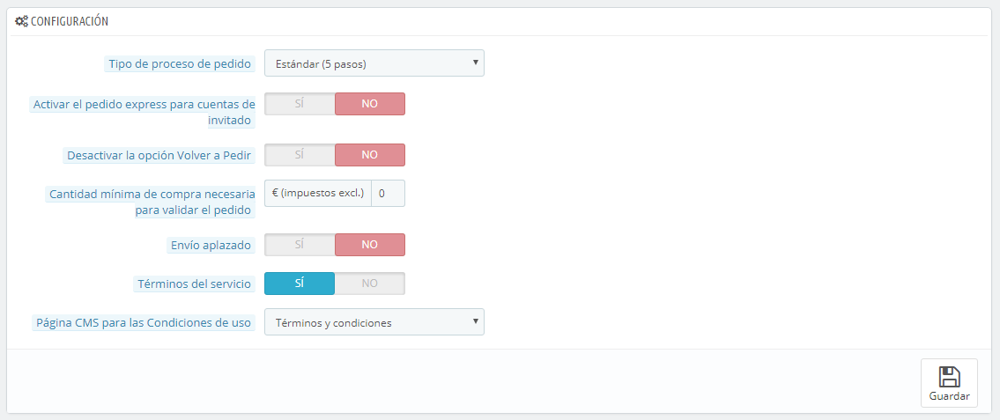
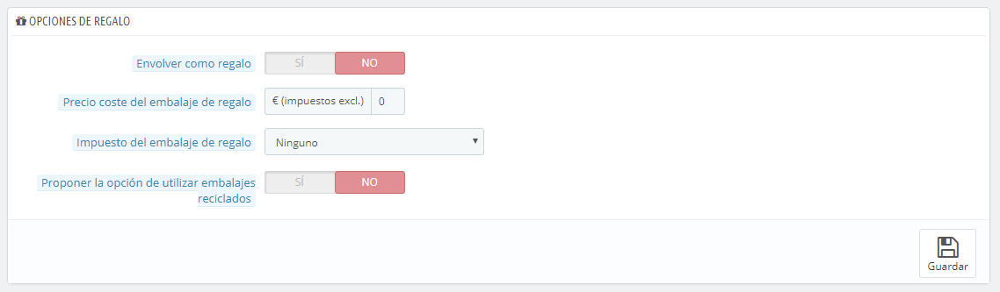

# Preferencias de Pedidos

La página de preferencias "Pedidos" permite configurar aspectos de los pedidos realizados por los clientes, pero también algunos otros detalles, como los regalos.

## Preferencias Generales 

* **Tipo de Proceso de pedido**. De forma predeterminada, el cliente tiene que realizar 5 pasos para completar el proceso de compra, cada uno en una página diferente. Sin embargo, puedes optar porque todos los pasos se desarrollen en una misma página. La página será más larga, pero algunos clientes podrían preferir este enfoque.
* **Activar el pedido express para cuentas de invitado**. Permite a los visitantes no registrados poder realizar un pedido, sin tener que crear una cuenta.
* **Desactivar la opción volver a pedir**. Si se establece en "Sí", los clientes no podrán volver a pedir de nuevo un pedido que ya ha sido realizado anteriormente, mediante  un clic simple de ratón desde su historial de pedidos (esto es un requisito obligatorio en algunos países de Europa: por lo que deberás deshabilitar esta opción – y por lo tanto establecerla en "Sí").
* **Cantidad mínima requerida para validar el pedido**. Permite indicar la cantidad mínima que debe haber en el carrito para admitir un pedido. Si no se alcanza el importe establecido en este campo, tu cliente no podrá procesar la compra. Si no quieres utilizar una cantidad mínima, introduce "0" en este campo.
* **Envío parcial**. Si tienes activada la opción "Permitir la venta de productos que no están en stock" (en la página de preferencias de "Productos"), te asegurarás de que los productos se envíen a medida que estén disponibles, en tantos paquetes como sea necesario (tu equipo de logística deberá valorar los paquetes necesarios). Inicialmente, PrestaShop dividirá el pedido en dos partes: los productos en stock serán enviados inmediatamente; el resto de los productos serán enviados tan pronto como se encuentren disponibles.
* **Términos del servicio**. Obliga a que tus clientes tengan que aceptar los términos del servicio, antes de que puedan validar el pedido.
* **Página CMS para las Condiciones de uso**. Las "condiciones de uso" de tu tienda, estarán disponibles en una página estática (una "página CMS"). Selecciona la página que deseas utilizar para que PrestaShop puede vincularla.

## Opciones de embalaje como regalo 

* **Envolver como regalo**. Permite al cliente envolver tus paquetes para regalo, acompañados de un mensaje personal. Esta es una opción esencial para las personas que desean enviar regalos desde tu tienda.
* **Precio del embalaje de regalo**. Establece aquí el precio del servicio de embalaje como regalo.
* **Impuesto a aplicar al embalaje de regalo**. Si lo requiere, indica el impuesto del servicio de embalaje como regalo. Puedes añadir otros impuestos desde la página "Impuestos", bajo el menú "Localización".
* **Empaques reciclados**. Permite que el cliente elija si desea recibir el pedido en embalaje reciclado. Si puedes ofrecer este servicio, muchos clientes te lo agradecerán.
* **Proponer la opción de utilizar embalajes reciclados**. Si puedes ofrecer este servicio, muchos clientes te lo agradecerán.
