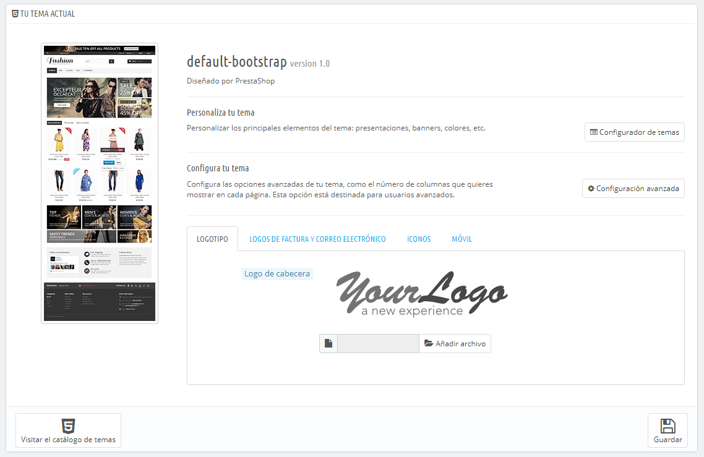
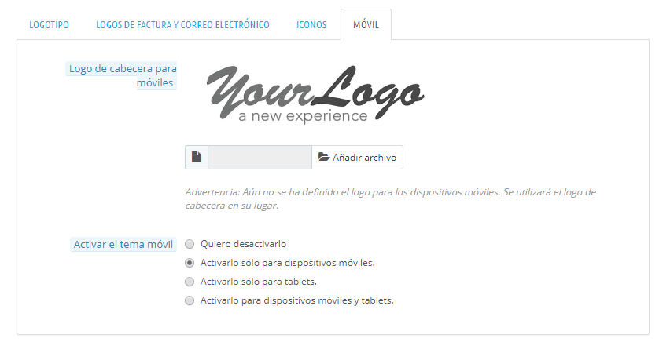
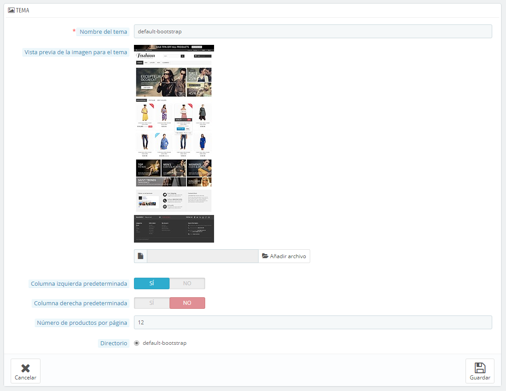
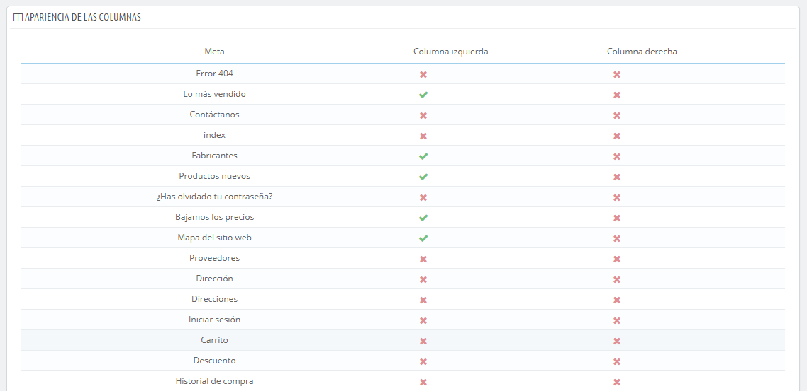
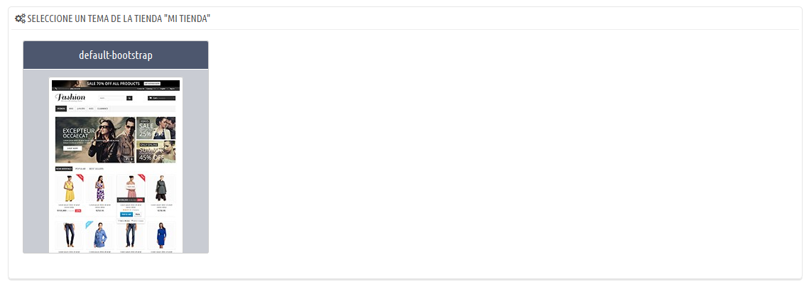
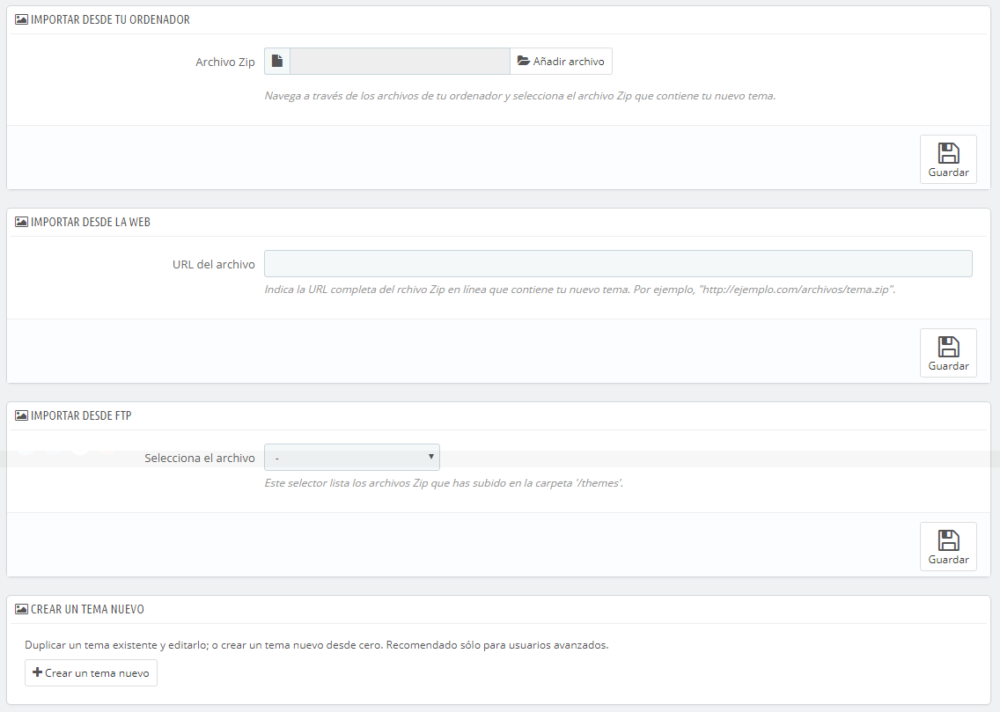
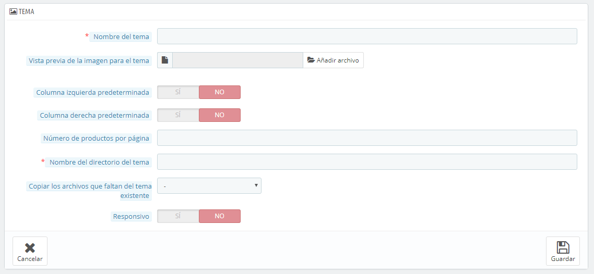
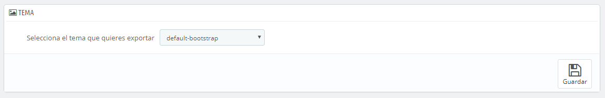
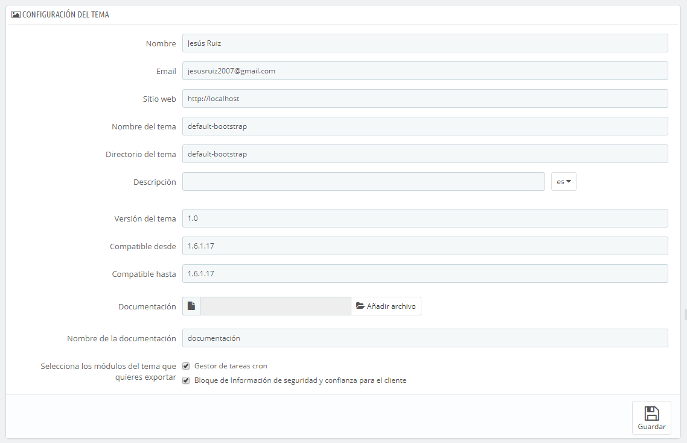
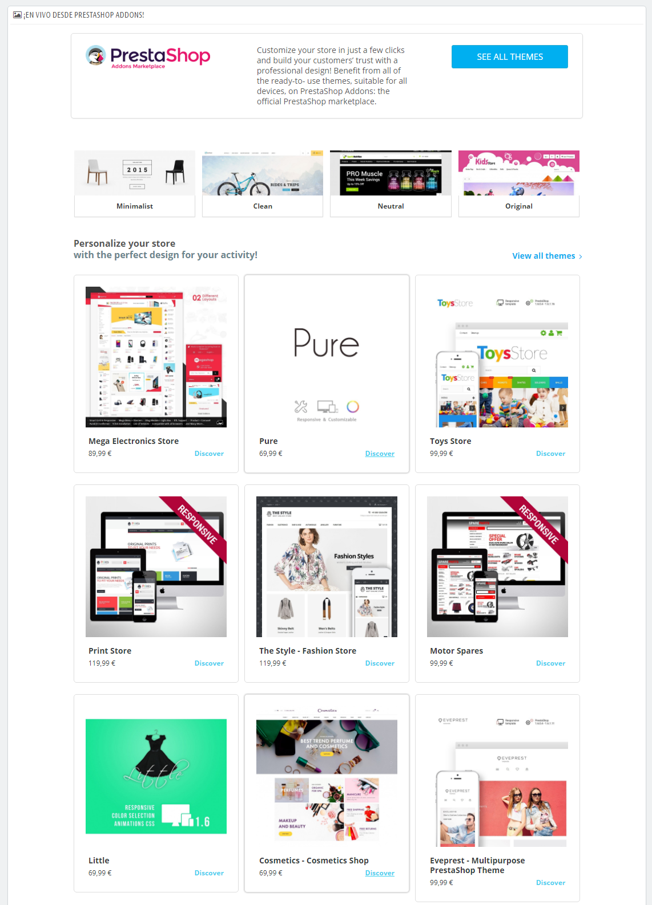

# Preferencias de Temas

/\*\<!\[CDATA\[\*/\
div.rbtoc1597066526746 {padding: 0px;}\
div.rbtoc1597066526746 ul {list-style: disc;margin-left: 0px;}\
div.rbtoc1597066526746 li {margin-left: 0px;padding-left: 0px;}\
\
/\*]]>\*/

* [Preferencias de Temas](preferencias-de-temas.md#PreferenciasdeTemas-PreferenciasdeTemas)
  * [Tu tema actual](preferencias-de-temas.md#PreferenciasdeTemas-Tutemaactual)
    * [El Configurador de Temas](preferencias-de-temas.md#PreferenciasdeTemas-ElConfiguradordeTemas)
    * [Configuración avanzada del tema](preferencias-de-temas.md#PreferenciasdeTemas-Configuraciónavanzadadeltema)
  * [Seleccionar un tema para la tienda \<nombre>](preferencias-de-temas.md#PreferenciasdeTemas-Seleccionaruntemaparalatienda%3Cnombre%3E)
  * [Adición y exportación de un tema](preferencias-de-temas.md#PreferenciasdeTemas-Adiciónyexportacióndeuntema)
    * [Importar un tema: el botón "Añadir tema"](preferencias-de-temas.md#PreferenciasdeTemas-Importaruntema:elbotón%22Añadirtema%22)
    * [Crear un nuevo tema](preferencias-de-temas.md#PreferenciasdeTemas-Crearunnuevotema)
    * [Exportar un tema](preferencias-de-temas.md#PreferenciasdeTemas-Exportaruntema)
  * [¡En vivo, desde PrestaShop Addons!](preferencias-de-temas.md#PreferenciasdeTemas-¡Envivo,desdePrestaShopAddons!)

La página preferencias de "Temas", te permite gestionar de manera eficiente tus temas.

## Tu tema actual 

La primera sección de la página sirve como recordatorio de cuál es el tema que estás utilizando actualmente, con sus detalles:

* Nombre del tema.
* Versión del tema.
* Nombre del autor del tema, sitio web y dirección de correo electrónico.
* Miniatura para el tema.

Esta sección también te proporciona acceso a un puñado de herramientas , que te ayudarán a personalizar rápidamente el tema actual: logotipo de la cabecera, logotipo facturas y email, favicon, el icono de la tienda, e incluso el separador para la barra de navegación pueden modificarse fácilmente desde aquí.

* **Personalizar tu tema**. Un enlace al Configurador de Temas (siempre que el módulo Configurador de Temas esté instalado y activado).
* **Configurar tu tema**. Un enlace a la configuración avanzada del tema.
* 4 pestañas están disponibles en las opciones de configuración del aspecto del tema:
  * **Logotipo**. El logotipo que aparecerá en todas las páginas de tu tienda.
  * **Logotipos de Factura y Correo electrónico**. Los logotipos que respectivamente aparecerán en las facturas de tu tienda, y en tus notificaciones de correo electrónico.
  * **Iconos**. El favicon de tu tienda (que se muestra en la barra de direcciones del navegador web), y el icono de tu tienda (utilizado en el Mapa de localización de la tienda como indicador de dónde se encuentra ésta ubicada).
  * **Dispositivos móviles**. El logotipo que aparecerá en todas las páginas de tu tienda, cuando se accede a través de un dispositivo móvil. También puedes optar por activar o desactivar la versión móvil de tu tema de manera selectiva (si existe) para teléfonos inteligentes, tabletas, o ambos.

El tema utiliza como logotipo predeterminado "YourLogo". ¡Recomendamos encarecidamente que cambies todas las instancias del logotipo y utilices el tuyo!

En el modo multitienda, puede aplicar estos cambios a todas tus tiendas o a un grupo de ellas, utilizando el menú multitienda.

La opción "Activar el tema móvil", te da la opción de utilizar el tema móvil de manera predeterminada. Con este tema, cualquier comerciante puede tener tu tienda adaptada a los dispositivos móviles: desde la página de inicio hasta la del proceso de pago, incluyendo las páginas de productos y la del embudo de conversión.

El tema móvil sólo funciona con el tema predeterminado de PrestaShop, ya que está incluido en la carpeta: `/themes/default/mobile`. Por lo tanto, no va a funcionar si utilizas otro tema que no disponga de su propio tema móvil.

Sin embargo, puedes utilizar fácilmente el tema móvil predeterminado con cualquier otro tema, al menos temporalmente: simplemente copia la carpeta del tema móvil de la carpeta del tema predeterminado, en la carpeta del tema nuevo, y debería de funcionar. Por ejemplo, si la carpeta de tu nuevo tema es `/themes/magnolia`, copia la carpeta `/themes/default/mobile` a la carpeta del nuevo tema: `/themes/magnolia/mobile`.\
&#x20;Esto es particularmente útil si el tema del nuevo tema no cuentan con un diseño responsable: de esta manera, tu tienda presentará un diseño atractivo y adaptado a los dispositivos móviles - aunque con la apariencia predeterminada.

### El Configurador de Temas 

El módulo Configurador de Temas, te ayuda a configurar algunos aspectos de tu tema.

Al hacer clic en el enlace de la página de preferencias "Temas", se abre su página de configuración. Esta página te ofrece enlaces directos a los módulos más utilizados del front-office: desde aquí puedes activar y desactivar una docena de funcionalidades, tales como mostrar botones sociales o el bloque de Facebook (siempre que sus respectivos módulos estén activados), y obtener un acceso directo a la página de configuración. También puedes activar y acceder al Live Configurator, desde el que podrás cambiar fácilmente el color y la fuente principal utilizada en tu tema.

En una segunda sección, el Configurador de Temas  hace posible que puedas enganchar fácilmente las imágenes con enlaces en los ganchos específicos de la página de inicio: home, top, left, right, footer. Cada idioma tiene disponible su propia sección con sus propios ganchos: esto es esencial, ya que las imágenes suelen contener texto directamente en ellos, por lo que es necesario contar con la mayor cantidad de versiones de la imagen para todos los idiomas soportados y disponibles en tu tienda.

El módulo se explica con más detalles en el capítulo "Configurar y Trabajar con los módulos nativos" de esta guía.

### Configuración avanzada del tema 

Haz clic en el botón "Configuración avanzada", para visualizar la información principal del tema (véase más abajo la sección "Crear una nueva plantilla" para obtener una detallada explicación de los campos).

Debajo de la sección principal, la sección "Apariencia de las columnas" muestra una gran cantidad de información sobre la forma en que aparecen las columnas izquierda y derecha, dependiendo de la página en la que nos encontremos:

* Si la casilla está marcada, la columna aparece en la página (por ejemplo, la página Categoría).
* Si la dejas desmarcada, no aparecerá en esa página.

Ten en cuenta que incluso aunque puedas hacer clic en los botones para establecer la apariencia a tu gusto, ¡estos ajustes de configuración son sólo informativos, y el tema no necesariamente podría adaptarse a los cambios que realices.!

## Seleccionar un tema para la tienda \<nombre> 

Esta sección tan sólo se muestra en pantalla si tienes al menos dos temas instalados. Estos se presentan junto con los otros temas disponibles en la instalación de PrestaShop estando por defecto uno de ellos ya habilitado.

Esta sección simplemente te muestra las miniaturas de los temas disponibles, junto con sus nombres.

Establece el cursor del ratón sobre la miniatura para mostrar un menú con dos opciones:

* **Utilizar este tema**. Reemplazará tu tema actual por este tema.
* **Eliminar este tema**. Se eliminarán los archivos del tema de tu servidor.

En la parte superior derecha, el enlace "Visita la tienda de temas" abre una nueva página del mercado PrestaShop Addons, donde puedes encontrar más temas.

En el modo multitienda, no se puede aplicar un tema a todas tus tiendas o a un grupo de tiendas; debes seleccionar una única tienda en el menú multitienda, y a continuación, elegir un tema.\

## Adición y exportación de un tema 

Dos botones en la parte superior de la pantalla te permiten importar un tema e instalarlo (y adjuntar sus módulos), o exportar un tema y sus módulos de tu tienda con el fin de compartirlo con el mundo.

### Importar un tema: el botón "Añadir tema" 

Esta pantalla te presenta 3 métodos que puedes utilizar para instalar un nuevo tema: desde tu computadora, a partir de un sitio web público, o desde tu propio servidor FTP. Un último botón te lleva al formulario de creación de temas, presentado en la siguiente sección.

Sea cual sea el método, el proceso sigue siendo el mismo: indicar la ubicación del archivo Zip del tema, y a continuación, hacer clic en "Guardar". Lo única cosa que cambia es el origen desde el que cargamos el archivo Zip:

* **Importar desde tu ordenador**. Utiliza el explorador de archivos para encontrar el archivo.
* **Importar desde una web**. Indica la dirección URL pública directa del archivo.
* **Importar desde FTP**. Utilizando un cliente FTP, carga el archivo en la carpeta : `/themes/` .

Haz clic en "Guardar" para validar tu elección. Tras la instalación del tema,  PrestaShop te permitirá activar o desactivar los módulos que fueron importados junto con el tema, te preguntará lo que deseas hacer con la configuración de los módulos actuales, y te indicará que es posible que tengas que regenerar las imágenes para adaptarlas al nuevo tema.

Una página de confirmación final te presenta todos los cambios aplicados a tu instalación de Prestashop. Haz clic en "Terminar" para finalizar el proceso.

### Crear un nuevo tema 

La mejor manera de crear un nuevo tema para PrestaShop es copiar los archivos desde el tema predeterminado, y empezar a modificar sus archivos TPL y CSS para crear los tuyos propios. La razón es que un tema PrestaShop requiere que muchos de los archivos se encuentren presentes,  por lo que es mejor partir de un tema existente en lugar de empezar de cero, así te aseguras que a tu tema no le falte ninguna parte.

Puedes hacer esto directamente desde el servidor web, pero PrestaShop hace que sea fácil copiar los archivos de un tema instalado y registrar tu nuevo tema en tu sistema (un paso que tendrías que hacer en cualquier caso).

Todo esto se realiza haciendo clic en el botón "Crear un nuevo tema", al que puedes tener accedo desde el botón "Añadir tema" situado en la parte superior de la pantalla. Tras realizar esta acción, un formulario aparecerá en pantalla.

Rellena los campos:

* **Nombre del tema**. Asegúrate que el nombre no esté siendo ya utilizado por otro tema (puedes comprobarlo desde el sitio web de Prestashop Addons).\
  &#x20;****&#x20;
* **Vista previa de la imagen para el tema**. Siempre debes añadir una imagen de previsualización, ya que te servirá como recordatorio del aspecto del tema. Si no tienes una todavía, puedes incluirla cuando llegue el momento de lanzar el tema.
* **Columna izquierda predeterminada** y **Columna derecha predeterminada**. Indica si tu tema tiene una columna (o dos columnas), y si es así, en qué lado de la pantalla aparecerá. Este campo es puramente informativo, y puedes cambiarlo en cualquier momento.
* **Nombre del directorio del tema**. Trata de utilizar un nombre que sea identificativo con el nombre que tiene tu tema. Si aún no has creado una carpeta para los temas, PrestaShop creará una para ti.
* **Copiar los archivos que faltan del tema existente**. Este es el método más limpio para iniciar un nuevo tema a partir de los archivos de otro tema. Al comenzar, se recomienda utilizar este método para crear un nuevo tema a partir de los archivos del tema predeterminado, ya que esto te asegura disponer de todos los archivos necesarios.
* **Responsivo**. Indica si tu tema tiene un diseño responsivo o no (si no sabes lo que es un diseño responsivo, entonces probablemente deberías elegir "No"). Este campo es puramente informativo, puedes cambiarlo en cualquier momento.

Haz clic en Guardar, y PrestaShop registrará esta información para ti: el tema estará listo para ser activado, y su imagen de vista previa aparecerá en el selector de temas.

¡Ahora te toca a ti modificar los archivos de tu tema para hacerlo realmente único!. Desde tu servidor local (¡no lo hagas desde una tienda en producción!), selecciona tu nuevo tema, y ¡comienza a trabajar!\
Una vez que hayas terminado con el diseño y el código de la plantilla, regresa a la  página de ajustes y realiza los cambios necesarios en consecuencia: imagen de previsualización definitiva, columna predeterminada, número de productos, y adaptabilidad del diseño.

¿Es el tema que has creado tan bueno que piensas que otros comerciantes podrían estar interesados en comprarlo? Puedes venderlo en el marketplace oficial de temas y módulos de PrestaShop (Addons): [http://addons.prestashop.com/](http://addons.prestashop.com/).

### Exportar un tema 

Esta sección está disponible tan sólo cuando hay al menos un tema instalado en tu sitio PrestaShop. Esta opción te proporciona un método para exportar tu tema en el formato correcto (más concretamente con un archivo de configuración de trabajo).

Exportar un tema es muy útil y deberías de hacerlo cuando desees crear una copia de seguridad de éste, o cuando quieras crear un archivo del tema para enviárselo a un amigo o subirlo al marketplace de PrestaShop ([http://addons.prestashop.com/](http://addons.prestashop.com/)). Esta opción no sólo genera un archivo Zip completo de tu tema, sino que también añade mucha información en un archivo XML, que te será de utilidad tanto al subir el tema a Prestashop Addons, como cuando quieras utilizarlo en otro sitio PrestaShop.

Selecciona un tema y haz clic en "Exportar tema". Un formulario de configuración se mostrará en pantalla, en donde podrás ajustar los parámetros de la exportación del tema: nombre del autor, módulos del tema que deseas exportar, nombre del tema, versiones de compatibilidad, etc.

Una vez que hayas establecido todos los parámetros correctamente, haz clic en "Guardar". Obtendrás rápidamente un archivo para descargar desde tu navegador. Guárdalo en el disco duro de tu equipo, a continuación, proporciona al archivo guardado un nombre propio en lugar del que se ha creado al azar. A partir de aquí, puedes compartir fácilmente este tema, y si se trata de una creación tuya propia, puedes comenzar a venderlo utilizando el marketplace oficial de PrestaShop :  [http://addons.prestashop.com/](http://addons.prestashop.com/).

## ¡En vivo, desde PrestaShop Addons! 

Esta última sección te presenta 12 de los últimos temas disponibles en  PrestaShop Addons, el marketplace oficial de PrestaShop. Puedes hacer clic en cada imagen para entrar a la página informativa de cada tema, y así obtener una visión más detallada del mismo y poder comprarlo.

