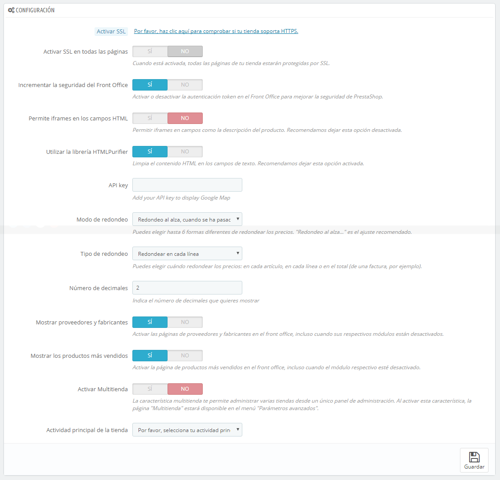

# Preferencias Generales

La página de preferencias "(Configuración)" cuenta con un puñado de opciones específicas que no tienen cabida en los otros menús. Sin embargo, son esenciales:

* **Habilitar / Activar SSL**. SSL significa "Secure Sockets Layer" (en español «capa de conexión segura»), e incluye TSL de "Transport Layer Security" (en español «seguridad de la capa de transporte»). Ambos son protocolos criptográficos que proporcionan seguridad a las comunicaciones Web. Puedes obtener más información sobre estos protocolos en la siguiente página de la Wikipedia: [http://es.wikipedia.org/wiki/Transport\_Layer\_Security](http://es.wikipedia.org/wiki/Transport\_Layer\_Security).\
  &#x20;Proporcionar una conexión SSL a tu tienda no solamente es esencial para realizar transacciones a través de Internet, sino también una forma de tranquilizar a tus clientes sobre la seguridad de los datos (autenticación, tarjeta de crédito, etc.) que recoge tu tienda. Los navegadores modernos indican visualmente que la conexión es segura. Si tu proveedor de hosting es compatible con SSL, asegúrate de activar este protocolo, haciendo clic en el enlace. Esto revelará un selector, donde debes elegir la opción "Sí".
* **Incrementar la seguridad del Front Office**. Esta opción añade tokens de seguridad a la tienda con el fin de mejorar tu seguridad. De esta forma, cada URL es específica a la sesión de un cliente, y no puede ser utilizada desde otro navegador, protegiendo así toda la información que pueda ser almacenada durante esa sesión.
* **Permitir iframes en campos html**. Esta opción te permite establecer iframes en campos de texto, tales como la descripción del producto. Los iframes son elementos HTML que permiten cargar contenido externo dentro del propio contenido de la página. Te recomendamos que dejes esta opción desactivada a menos que sea necesario.
* **Usar la librería HTMLPurifier**. Los clientes pueden enviar información a tu tienda utilizando campos de texto (por ejemplo, descripciones de los productos o información de cliente), pero los hackers podrían tratar de utilizar estos campos para enviar código malicioso para hackear tu tienda. Esta opción garantiza que todos los datos enviados a tu tienda  lo hacen de forma segura. Tan sólo debes desactivar esta librería si sabes realmente  lo que estás haciendo.
*   **Modo de redondeo**. Una vez aplicados los impuestos y descuentos, es posible que el precio final tenga decimales, tales como 42.333333333 dólares. El tipo de redondeo es utilizado durante todo el tiempo por Prestashop, en el front-office para mostrar los precios de los productos, así como también en el proceso de cálculo de precios (impuestos, descuentos, etc.). En sí misma, la regla de redondeo cambia poco la manera en que las cosas son calculadas, pero el impacto es mucho más grande cuando el cálculo del redondeo se realiza sobre el total de la factura y debes tener en cuenta todos los  productos que se han añadido al carrito, los impuestos y las promociones.\
    Hay seis modos disponibles :\

    * **Redondeo al alza, cuando se ha pasado la mitad (recomendado):** Este es el modo recomendado. 42.55555555 se convierte en 42.56.
    * **Redondeo a la baja, cuando se ha pasado la mitad:** 42.55555555 se convierte en 42.56.
    * **Redondeo hasta el siguiente valor par:** 42.55555555 se convierte en 42.56.
    * **Redondeo hasta el siguiente valor impar:** 42.55555555 se convierte en 42.56.
    * **Redondeo al alza al valor más próximo:** 42.55555555 se convierte en 42.56.
    * **Redondeo a la baja al valor más próximo:** 42.55555555 se convierte en 42.55.

    Para versiones inferiores a la 1.6.0.11

    La opción de redondeo ha sido en gran medida reelaborada para la versión 1.6.0.11. Antes de esta versión, sólo había una opción disponible:

    **Modo de Redondeo**. Una vez que los impuestos y los descuentos son aplicados, un precio puede tener demasiados decimales, como por ejemplo $42.333333333. El modo de redondeo es utilizado durante el proceso de cálculo de los precios (impuestos, descuentos, etc.). Hay tres modos:

    * **Superior**. Redondeo hacia arriba: 42.333333333 se convierte en 42.34.
    * **Inferior**. Redondeo hacia abajo: 42.333333333 se convierte en 42.33.
    * **Clásico**. Redondea el valor hacia arriba o hacia abajo, dependiendo del valor : hacía arriba cuando es superior a .5, hacía abajo cuando es inferior a .5.
* **Tipo de redondeo**. Esta opción te permite elegir el tipo de redondeo, lo que puede afectar en gran medida el cálculo del total. Existen tres tipos disponibles, en orden progresivo:\

  * **Redondeo en cada artículo**. El precio de cada artículo será redondeado antes del cálculo total. Si hay varios ejemplares del mismo artículo , cada uno de ellos será redondeado  por separado antes del cálculo.
  * **Redondeo en cada línea**. Cada línea de artículos será redondeada antes del cálculo del total. Si hay varios ejemplares del mismo artículo, el redondeo se realizará sobre el valor total.de estos ejemplares.
  * **Redondeo en el total**. El redondeo se realizará sólo en el cálculo final, después de que los valores de todos los artículos se hayan sumado.
* **Número de decimales**. Puedes elegir el número de decimales que desas mostrar en el redondeo de precios . Por ejemplo, si eliges "3", la cifra 42.333333333 se convertirá en 42.334.
* **Mostrar proveedores y fabricantes**. Muestra los proveedores y fabricantes en las páginas  front-office de tu tienda, incluso cuando sus respectivos módulos han sido desactivados.
* **Mostrar más vendidos**. Activa la página de más vendidos en el Front Office de tu tienda, incluso cuando el módulo "Bloque Más vendidos" está desactivado.\

* **Habilitar multitienda**. Esta pequeña opción tiene implicaciones importantes: te ofrece la posibilidad de convertir tu tienda PrestaShop en varias tiendas. Al activar esta función, la página "Multitienda" estará disponible en el menú "Parámetros avanzados", y cada página de administración será contextualizada permitiendo aplicar los ajustes a todas las tiendas, a un grupo específico de tiendas, o a una sola tienda.\
  &#x20;Puedes obtener más detalles sobre la característica multitienda de PrestaShop leyendo el capítulo "Gestionar múltiples tiendas" de esta guía.
* **Actividad principal de la tienda**. Es posible que hayas establecido una actividad equivocada al instalar PrestaShop. Desde aquí, puedes elegir la actividad principal de tu tienda.

