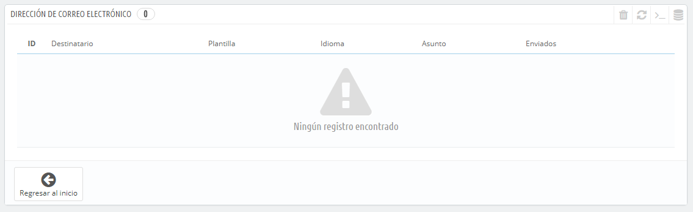

# Parámetros de Correo electrónico

Tu tienda envía muchos mensajes de correo electrónico, comenzando por el proceso de registro en la tienda hasta la realización de un pedido. Desde aquí puedes configurar cómo se enviarán los mensajes, y cuáles son los mensajes que ya han sido enviados.

## Correo electrónico 

La primera sección de la página se presenta con una lista de todos los correos electrónicos que fueron enviados desde PrestaShop, con el destinatario, la plantilla utilizada, el idioma del mensaje, el asunto del correo electrónico y el estado de la acción.

## Correo electrónico 

Aquí es donde se decide cómo se envían y reciben tus mensajes de correo electrónico .

El formulario tiene tres grupos de opciones:

* &#x20;**Enviar e-mail a**. Este es un ajuste de front-end. Al final del proceso de compra, un cliente puede dejar un mensaje a tu equipo de trabajo. Puedes optar por establecer quién recibirá estos mensajes enviados por tus clientes seleccionando una de las opciones disponibles en la lista desplegable.
* Parámetros de correo electrónico: cómo son enviados técnicamente los correos electrónicos. Selecciona una de las tres opciones disponibles. Véase más abajo para obtener más información.
* Formato de correo electrónico: cómo son enviados visualmente los correos electrónicos. Selecciona una de las tres opciones disponibles. Véase más abajo para obtener más información.

### Configuración técnica 

Configura PrestaShop para enviar correos electrónicos a tus clientes. Te aconsejamos que consultes a tu proveedor de alojamiento, para determinar qué ajustes de configuración utilizar para esta funcionalidad. Las opciones disponibles son:

* **No enviar correos electrónicos (útil para hacer pruebas)**. Utiliza esta configuración para realizar pruebas. Una vez que tu tienda sea pública, nunca debes utilizar esta configuración.
* **Utilizar la función mail() de PHP. Recomendado en la mayoría de los casos**. Esta es la opción recomendada por defecto. En el caso de que ésta no funcione, entonces utiliza la opción SMTP.
* **Establecer mis propios parámetros SMTP. Sólo para usuarios AVANZADOS**. En este caso, aparece una nueva sección, con más campos para rellenar. La información para completar estos campos debe ser proporcionada por tu proveedor de alojamiento: nombre del dominio mail, servidor SMTP, usuario SMTP, etc. Asegúrate de transcribir exactamente la información que tu proveedor de alojamiento te indique.

La información de configuración SMTP debe ser proporcionada por una de estas entidades:

* Tu administrador del sistema,
* Tu host,
* Tu ISP,
* Tu proveedor de correo electrónico.

Tu proveedor de alojamiento, puede indicarte si tu nombre de usuario es obligatorio o no, así como proporcionarte información sobre tu contraseña y el cifrado a utilizar.

Por ejemplo, en el caso de Gmail (el servicio de correo electrónico ofrecido por Google), debes introducir una información similar a la siguiente:

* Servidor SMTP: [smtp.gmail.com](http://smtp.gmail.com)
* Usuario SMTP: [mi.nombre.de.usuario@gmail.com](mailto:mi.nombre.de.usuario@gmail.com) (ejemplo)
* Contraseña SMTP: RT22UE87 (ejemplo)
* Cifrado: SSL
* Puerto: 465

### Configuración visual 

Hay dos formatos disponibles para los correos electrónicos: HTML es el más agradable visualmente, pero puede que no funcione en todas partes; el formato texto es visualmente monótono, pero funciona en todas partes.

Puedes optar por utilizar sólo uno de los dos, o ambos. Se recomienda que utlices ambos formatos.

## Comprobar la configuración de correo electrónico 

Una vez que has configurado tu dirección de correo electrónico utilizando uno de los dos métodos disponibles, introduce tu propia dirección de correo electrónico en esta sección, a continuación, haz clic en el botón "Enviar un email de prueba a".\
&#x20;Ahora comprueba la bandeja de entrada de la dirección especificada, para verificar que has recibido el mensaje de correo electrónico de prueba. Si no lo has recibido, modifica la configuración con los datos correctos.

