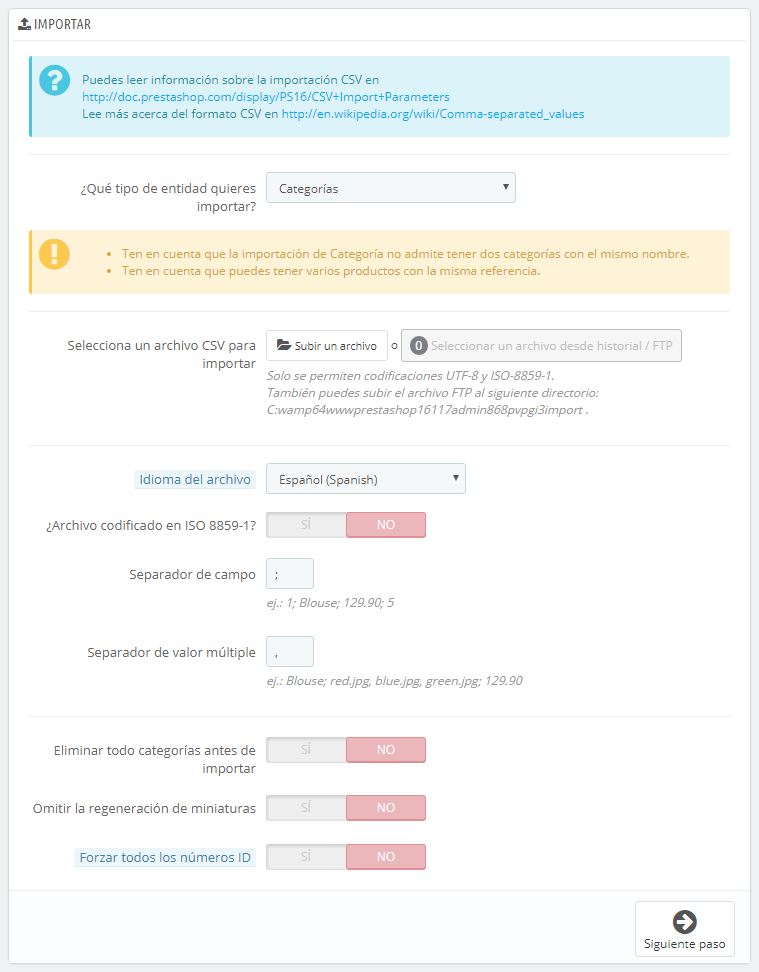
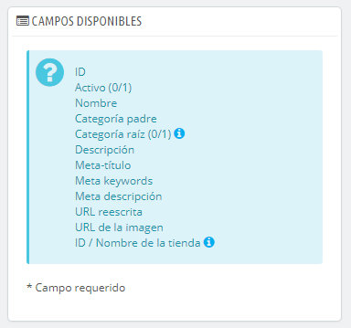
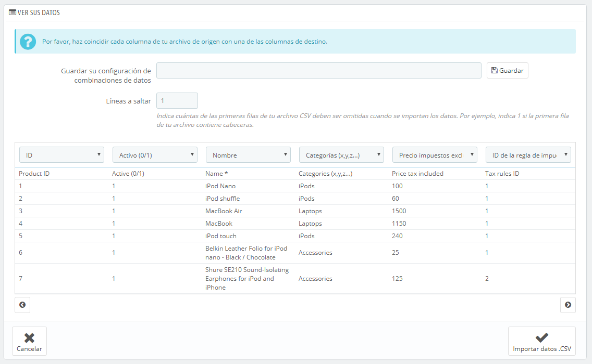
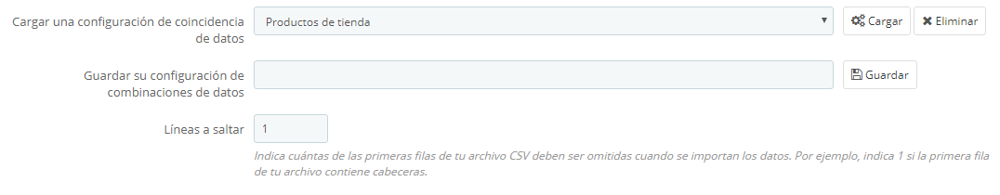

# Parámetros de Importación de archivos CSV

La página de importación CSV te permite introducir fácilmente una gran cantidad de productos a tu catálogo, o importar datos que exportaste y convirtiste desde otra herramienta de comercio electrónico.

CSV es un acrónimo de "valores separados por comas". Es un archivo de texto plano que se utiliza cuanto hay una necesidad de importar, exportar o simplemente almacenar datos en un formato no propietario. Puedes obtener mayor información sobre el formato CSV en el siguiente enlace de la Wikipedia: [http://es.wikipedia.org/wiki/CSV](http://es.wikipedia.org/wiki/CSV).



&#x20;El proceso de importación requiere de la preparación del archivo CSV, y cumplimentar el formulario que presenta la configuración principal:\


* **¿Qué tipo de entidad quieres importar?**. Las entidades son los tipos de datos que se pueden importar. Los "Campos disponibles" a la derecha son actualizados cuando se elige una entidad, así que debes conocer previamente la clase de datos que el archivo CSV debe contener.\
  PrestaShop te permite importar estos tipos de datos:\

  * Categorías,
  * Productos,
  * Combinaciones,
  * Clientes,
  * Direcciones,
  * Fabricantes,
  * Proveedores,
  * Alias,
  * Pedidos a proveedores (si la Gestión avanzada de stock está activada),
  * Detalles de pedidos a proveedores (si la Gestión avanzada de stock está activada).
*   **Selecciona un archivo CSV para importar**. Puedes importar más de un archivo a la vez, pero asegúrate de que todos ellos contienen el mismo tipo de datos.

    Puedes descargar archivos de ejemplo para cada tipo de datos desde la sección de la derecha "Descargue ejemplos de archivos CSV". Esto te ayuda a comparar estos archivos de ejemplo con tus propios archivos creados, de esta manera puedes asegurarte de que los archivos que vas a importar están realmente preparados para ser importados a PrestaShop. Estos archivos se almacenan realmente en la carpeta `/docs/csv_import`de tu instalación de PrestaShop.
* **Idioma del archivo**. Los datos solamente pueden ser importados para un sólo idioma al mismo tiempo. Si tus datos utilizan más de un idioma, debes dividirlos en tantos archivos como idiomas tengas.
* **¿Archivo codificado en ISO-8859-1?**. De manera predeterminada, los archivos de importación deben utilizar la codificación UTF-8. Pero si tus archivos utilizan la norma ISO-8859-1, y prefieres no convertirlos, puedes marcar esta casilla.
* **Separador de campos**. No todos los archivos CSV utilizan comas para separar sus valores: algunos utilizan tabulaciones, otros punto y coma, etc. Puedes indicar qué separador se utiliza en el archivo CSV en este campo.
* **Separador de valor múltiple**. Cuando un atributo puede soportar más de un valor, estos valores deben ser separados con un separador específico. Después de revisar tus archivos, indica el separador utilizado aquí.
* **¿Eliminar todos/as \_\_\_ antes de la importación?**. Esta opción eliminará todas las entradas previamente existentes del tipo de datos que estás importando. Esto te ayuda a partir de cero.
* **¿Utilizar la referencia del producto como clave?**. Sólo para la importación de productos. Puedes optar por dejar que PrestaShop determine la clave del producto, o que la clave del producto sea el ID del producto. En este caso, asegúrate de que el archivo contiene la ID en todos los productos que quieras importar.
* **Omitir la regeneración de miniaturas**. Solamente para la importación de Categorías y Productos. Puedes optar porque PrestaShop regenere las miniaturas que están vinculadas desde tu archivo CSV (en los campos "URL de imagen" o "URLs de imágenes").
* **Forzar todos los números ID**. Puedes mantener los IDs importados, o dejar que el importador los autoincremente.



Cuando cambias el ajuste Entidad, la sección de la derecha, titulada "Campos disponible", presenta los campos de datos que se esperan. Aunque la herramienta de importación está diseñada para ayudar a PrestaShop a encontrar los campos en el archivo, debes esforzarte para que la importación de datos sea lo más amigable posible, siguiendo el esquema de nombres y el orden de los campos presentados. En caso de que esto no se cumpla, la importación de datos será más tediosa, pero no imposible.\
Algunos de estos campos tienen un pequeño icono de información (representados por un icono "i"), que muestran una ventana emergente si sitúas el cursor del ratón encima de ellos. La mayoría de ellos hacen referencia a la funcionalidad multitienda o al gestor avanzado de stock de PrestaShop. Asegúrate de leer todas estas informaciones para crear / editar los archivos de datos de forma correcta.

## Formato de datos <a href="#parametrosdeimportaciondearchivoscsv-formatodedatos" id="parametrosdeimportaciondearchivoscsv-formatodedatos"></a>

Los datos importados deben estar en un archivo de texto con extensión `.csv`, con los distintos valores de campos debidamente separados. Te recomendamos que utilices un carácter punto y coma ";" como separador de campos. Si tus datos textuales (tales como descripción del producto) contienen caracteres punto y coma, deberás eliminarlos o elegir otro separador en la opción "Separador de campos".

Puedes crear un archivo de este tipo con cualquier editor de texto (como por ejemplo Notepad++: [http://notepad-plus-plus.org/](http://notepad-plus-plus.org/)), pero te aconsejamos que utilices un programa que te permita trabajar con hojas de cálculo, y posteriormente guardes tu trabajo en formato .CSV. En una hoja de cálculo puedes trabajar visualmente más rápido, en comparación con un archivo de texto plano. Puedes utilizar un programa de pago como Microsoft Excel: [http://office.microsoft.com/es-es/excel/](http://office.microsoft.com/es-es/excel/), o bien una alternativa libre y gratuita como OpenOffice Calc: [http://www.openoffice.org/](http://www.openoffice.org/).

Este es un ejemplo de cómo sería el resultado final de un archivo preparado para importar una lista de productos:

```
"Enabled";"Name";"Categories";"Price";"Tax rule ID";"Buying price";"On sale";"Reference";"Weight";"Quantity";"Short desc.";"Long desc";"Images URL"
1;"Test";"1,2,3";130;1;75;0;"PROD-TEST";"0.500";10;"'Tis a short desc.";"This is a long description.";"http://www.myprestashop/images/product1.gif"
0;"Test 02";"1,5";110;1;65;0;"PROD-TEST2";"0.500";10;"'Tis also a short desc.";"This is a long description too.";"http://www.myprestashop/images/product2.gif"
1;"Test 03";"4,5";150;1;85;0;"PROD-TEST3";"0.500";10;"'Tis a short desc. again";"This is also a long description.";"http://www.myprestashop/images/product3.gif"
```

Ten en cuenta que este es un ejemplo de muestra; que no ha sido optimizado para su importación en PrestaShop. Si necesitas un archivo de ejemplo que te sirva como referencia, utiliza los que puedes descargar desde el botón del formulario "Descargue ejemplos de archivos CSV".

La primera línea debe ser un nombre descriptivo para la columna de datos (que posiblemente no se tome en cuenta durante el proceso de importación). Debe haber el mismo número de columnas en cada línea.

Debes recordar que:

* La columna de precios utilizará la moneda predeterminada de tu tienda.
* Las categorías son indicadas utilizando su identificador existente (por lo que es necesario importarlas primero), y separadas por comas (de manera predeterminada).
* La dirección URL de las imágenes deben especificarse completamente. En otras palabras, el enlace que se utilice debe ser el que utiliza en el navegador para mostrar la imagen. Por ejemplo: [http://www.miprestashop/imagenes/productoXXX.gif](http://www.myprestashop/images/productXXX.gif).
* La Codificación de caracteres del archivo debe ser UTF-8, o ISO-8859-1 en el peor de los casos.
* Las fechas utilizan el formato ISO 8601, sin un designador de zona horaria (la zona horaria es la que utiliza tu tienda): `2013-06-21 15:07:27`.

## Cargar el archivo <a href="#parametrosdeimportaciondearchivoscsv-cargarelarchivo" id="parametrosdeimportaciondearchivoscsv-cargarelarchivo"></a>

Una vez que tengas todos los datos en formato CSV, puedes subirlos a la base de datos de tu tienda utilizando el formulario de esta página.

Tienes dos maneras de cargar los archivos a importar:

* Utilizando tu navegador: Haz clic en el botón "Subir archivo", encuentra tu archivo y a continuación, valida tu selección. Haz esto tantas veces como sea necesario para listar todos los archivos de importación.
* Utilizando tu cliente FTP: carga el archivo en la carpeta `/admin-dev/import` de tu instalación de PrestaShop. Recarga la página de importación: el botón "Seleccione desde historial/FTP", debe ahora indicar un número. Haz clic en el botón para mostrar la lista de archivos disponibles (incluyendo los que previamente habrás cargado utilizando el navegador), a continuación, haz clic en el botón "Utilizar" para importar el archivo deseado.

Una vez que tengas todos los archivos listados en la sección "Sus archivos CSV", puedes continuar rellenando los datos del formulario:

1. **Selecciona el tipo de datos contenidos en el archivo**, utilizando la lista desplegable denominada "¿Qué tipo de entidad deseas importar?". Una vez seleccionado el tipo de datos, la lista de los campos disponibles aparecerá a la derecha, lo que te ayudará a refinar aún más tu archivo CSV – al menos en lo que respecta al orden de las columnas, lo que te será de utilidad próximamente.
2. **Selecciona el idioma del contenido importado**. Si el idioma de destino no está disponible, debes instalarlo primero, desde la página "Idiomas" bajo el menú "Localización".
3. **Selecciona la codificación del archivo**. Simplemente indica si el archivo utiliza o no la codificación ISO-8859-1. Si no la utilizas, entonces se asume que los archivos utilizan la codificación UTF-8.
4. **Selecciona los separadores de campos**. Te sugerimos que dejes los valores predeterminados establecidos ("separador de campo" con un punto y coma ";", "separador de múltiples valores" con una coma ","). Pero, obviamente, si tu archivo CSV fue creado de manera diferente, debes cambiar estos valores en consecuencia.
5. Si deseas eliminar todos los productos de tu catálogo antes de importarlos, selecciona la opción adecuada.
6. Una vez hayas realizado todas tus selecciones, haz clic en el botón "Próximo paso".

Todos los archivos de importación son enviados directamente a la subcarpeta `/import` que se encuentra dentro de la carpeta de administración. Si el menú de archivos CSV contiene demasiadas entradas, puedes eliminar las importaciones más antiguas utilizando un cliente FTP.

Al hacer clic en el botón "Próximo paso", la página será recargada mostrando la herramienta correspondiente. Esta interfaz te ayuda en el proceso de hacer coincidir las columnas utilizadas en el archivo importado, con los datos requeridos por PrestaShop.



Los datos presentados en esta tabla son las columnas de tu archivo CSV, colocados de manera arbitraria bajo las columnas que la base de datos de PrestaShop necesita. Deberás asegurarte de que todas las columnas de tu archivo CSV, pertenecen realmente a la  columna que les corresponde, utilizando el menú desplegable de cada cabecera, para importar el contenido correctamente.

Por ejemplo, en nuestro archivo de ejemplo:

* **Primera columna**. Marcada como "Activo", PrestaShop presenta "ID" como cabecera. Haz clic en el menú desplegable de la cabecera y selecciona "Activo (0/1)".
* **Segunda columna**. Marcada como "Nombre", su cabecera indica "Activo (0/1)". Vamos a cambiar el encabezado por el de "Nombre \*".
* **Tercera columna**. Continúa el proceso sucesivamente, teniendo en cuenta el procedimiento seguido en las columnas anteriores.

La pantalla no puede mostrar todas las columnas de tus datos, por lo que deberás hacer clic en los botones ">>" y "<<" para moverte a través de todas las columnas, y hacer coincidir todos los datos correctamente.

En nuestro ejemplo, se utilizó la primera fila para los nombres de columnas. Dado que no queremos que estos nombres sean importados, introduce "1" en el campo de texto "Líneas a saltar".

Una vez que los datos de tu archivo estén establecidos en sus columnas correspondientes, haz clic en el botón "Importar datos CSV" (situado en la esquina inferior derecha de la pantalla), y PrestaShop iniciará el proceso de importación. Cuando el proceso se haya completado, serás redirigido a la pantalla principal, que deberá confirmarte que todos los datos han sido importados correctamente, o bien mostrarte una notificación de los problemas que se han encontrado durante la importación. En este segundo caso, deberás revisar de nuevo tu archivo CSV y asegurarte de corregir todos los errores notificados.

### Configuraciones coincidentes <a href="#parametrosdeimportaciondearchivoscsv-configuracionescoincidentes" id="parametrosdeimportaciondearchivoscsv-configuracionescoincidentes"></a>

El proceso de configuración puede ser una tarea tediosa si tienes una y otra vez que seleccionar el orden de las columnas del archivo CSV para que coincidan con la utilizada por la herramienta de importación de PrestaShop. Es por eso que PrestaShop incluye una pequeña herramienta para guardar el orden actual de la configuración que hayas establecido en las cabeceras utilizando las listas desplegables.



Esta herramienta es un campo sencillo situado en la parte superior de esta página de importación de archivos. Puedes realizar tres acciones básicas (solamente si no hay ninguna configuración de coincidencias guardada todavía):

* **Guardar**. Introduce un nombre descriptivo en el campo, y haz clic en "Guardar". La interfaz se actualiza mostrando las configuraciones almacenadas en la lista desplegable.
* **Cargar**. Selecciona una configuración coincidente en la lista desplegable y haz clic en "Cargar".
* **Eliminar**. Selecciona una configuración coincidente en la lista desplegable y haz clic en "Eliminar".
