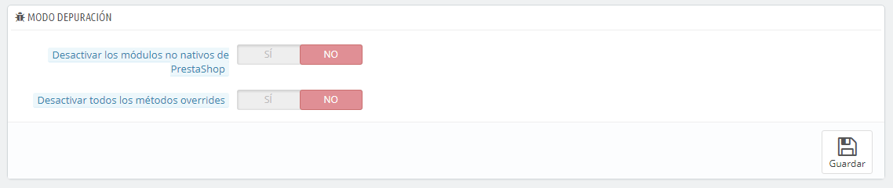

# Parámetros de Rendimiento

Esta página combina muchas herramientas y consejos que pueden ayudarte a mejorar el rendimiento de tu tienda en el servidor – sin fines comerciales, aunque un servidor que tenga un mayor rendimiento  será capaz de atender a las consultas y peticiones de un mayor número de usuarios, y por lo tanto, esto podría dar como resultado obtener un mayor número de ventas.

## Smarty <a href="#parametrosderendimiento-smarty" id="parametrosderendimiento-smarty"></a>

Smarty es el nombre del motor de plantillas utilizado por los temas de PrestaShop. Puedes aprender más sobre este motor consultando el siguiente enlace: [http://www.smarty.net/](http://www.smarty.net/).

\
Hay dos opciones:

* **Compilación de plantillas**. Para mejorar el rendimiento front-end, PrestaShop almacena en caché las páginas HTML.\

  * **Nunca recompilar los archivos de las plantillas**. El comportamiento normal: La páginas HTML son compiladas y almacenadas en la memoria _caché_ del navegador y se muestran tal y como son, incluso si el tema ha cambiado desde entonces.
  * **Recompilar las plantillas cuando los archivos sean modificados**. PrestaShop es capaz de saber si un tema ha sido modificado.
  * **Forzar compilación**. Sólo debes habilitar esta opción si estás editando un tema, y quieres ver los cambios realizados cada vez que se recargue la página.
* **Caché**. Esta opción hace posible que puedas desactivar la caché de todos los archivos, y no tan sólo los que pertenecen a los archivos de la plantilla. Desactiva esta opción tan sólo para la depuración de módulos y/o plantillas. En cualquier otro caso, debes dejar esta opción activa.\
  La opción "Borrar caché Smarty" hace posible borrar la memoria caché con un solo clic de ratón, en lugar de tener que eliminar los archivos desde el servidor FTP.
* **Tipo de cache:** De manera predeterminada, Smarty utiliza un mecanismo de almacenamiento en caché basado en archivos. Puedes optar porque éste utilice MySQL como recurso de almacenamiento de memoria caché de salida de Smarty.
* **Borrar la caché:** Dependiendo de la frecuencia con la que se produzcan las modificaciones de tu tienda, es posible que desees o bien nunca eliminar los archivos de la caché, o bien vaciarla cada vez que tu tienda es modificada (ya sean productos o diseño).

## Modo Depuración <a href="#parametrosderendimiento-mododepuracion" id="parametrosderendimiento-mododepuracion"></a>

**Novedad en Prestashop 1.6.**

Desde el modo de depuración, puedes optar por reducir el impacto que tienen ciertas funcionalidades en PrestaShop, y así poder evaluar con precisión de donde proviene un error:



* **Inhabilitar los módulos no nativos**. Los módulos nativos de Prestashop son testeados con exhaustividad por lo que no deberían de presentar ningún tipo de problema. S activas esta opción, podrás determinar si el problema proviene del propio código de PrestaShop (núcleo o módulo), o de un módulo de terceros.
* **Inhabilitar las sobre-cargas**. Muchas de las características de PrestaShop pueden ser sobrecargadas. Si habilitas esta configuración, todas las sobrecargas del código serán deshabilitadas, y podrás determinar si el problema proviene de propio código de PrestaShop, o de un módulo de terceros.

## Características opcionales <a href="#parametrosderendimiento-caracteristicasopcionales" id="parametrosderendimiento-caracteristicasopcionales"></a>

Algunas características de PrestaShop pueden ser desactivadas si no las utilizas, ya que pueden provocar problemas de relantización en tu tienda.

Si tu catálogo tiene actualmente productos que hacen uso de estas características, no podrás desactivarlas. Tendrás que eliminar esos productos para poder desactivar estas opciones.

Puedes desactivar las siguientes características del catálogo:


* **Combinaciones**. Las combinaciones de productos te permiten tener una completa línea de productos en un sólo producto: diferentes tamaños, colores, capacidades, etc.
* **Características**. Las características del producto te permiten indicar la información del producto específico: el peso, el material, el país de origen, etc.
* **Grupos de clientes**. Los grupos de clientes te permiten agrupar clientes d entro de un mismo grupo con el fin de darles ciertos privilegios y restricciones: descuentos, restricciones de módulos, etc.

## Combinación, Compresión y Caché (CCC) <a href="#parametrosderendimiento-combinacion-compresionycache-ccc" id="parametrosderendimiento-combinacion-compresionycache-ccc"></a>

CCC es un conjunto de herramientas destinadas a minimizar la carga del servidor y el tiempo de carga del tema de la tienda.

Esta opción hace lo que especifica su nombre: combina archivos textuales del mismo tipo en un archivo más grande, lo que reducen el número de archivos para descargar; comprime el archivo utilizando el algoritmo Zip, lo que hace que se descargue más rápidamente; finalmente, se almacena en caché el archivo comprimido, por lo que el servidor no tiene que hacer este proceso cada vez que se carga una página, lo que alivia la carga sobre el procesador del servidor.

El tema de tu tienda debe ser completamente compatible con al menos PrestaShop 1.4, de lo contrario CCC no funcionará correctamente. Esta es la razón por la mayoría de las opciones están desactivadas de manera predeterminada.


* **"Smart cache" para las hojas de estilo (CSS)**. Los archivos CSS son archivos de texto, que pueden ser combinados y comprimidos de forma segura.
* **"Smart cache" para el código de JavaScript**. Los archivos JavaScript son archivos de texto, pero su combinación a veces puede resultar problemática. Asegúrate de probar todo antes de dejar activada esta opción.
* **Reducción del código HTML**. El código HTML generado por Smarty puede ser reducido, lo que significa que PrestaShop eliminará todos los espacios en blanco con el fin de ahorrar unos cuantos bytes. Este es un proceso seguro.
* **Compresión de JavaScript dentro del código HTML**. Algunos temas tienen el código JavaScript directamente dentro del código HTML. Puedes dejarlo establecido tal como está, o comprimirlo. Asegúrate de probar todo antes de dejar activada esta opción.
* **Mover JavaScript al final**. Colocar el código JavaScript de tu tema en la parte final del archivo HTML es la forma recomendada para acelerar 'above the fold' la presentación de la página.\
  El término anglosajón 'Above the fold', hace referencia a la parte de la página web visible cuando se accede a ella sin necesidad de hacer _scroll down_.
* **Optimización de Apache**. Este ajuste de configuración, modificará el archivo de configuración del servidor web con el fin de hacerlo más eficiente para CCC.

## Servidores de medios (válido únicamente cuando CCC está activado) <a href="#parametrosderendimiento-servidoresdemedios-validounicamentecuandocccestaactivado" id="parametrosderendimiento-servidoresdemedios-validounicamentecuandocccestaactivado"></a>

Esta sección te permite redirigir parte de tu tráfico (imágenes y archivos de vídeo, por ejemplo) a otros servidores bajo tu control, a través de otros dominios o subdominios – generalmente, los archivos están alojados en un CDN (Content Delivery Network). De manera predeterminada, PrestaShop soporta hasta 3 servidores de medios.


Establecer el nombre de dominio de tu tienda en estos campos no es la forma apropiada para conseguir un pleno rendimiento. Dicho esto, es fácil implementar un servidor de medios, y obtener sus beneficios reales de manera casi inmediata. He aquí cómo conseguirlo:

1. Abre una cuenta con una empresa de hosting, preferiblemente que esté especializada en el contenido distribuido. Las más populares son Akamai ([http://www.akamai.com/](http://www.akamai.com/)), Amazon (con sus servicios AWS, entre los que se incluye CloudFront: [http://aws.amazon.com/](http://aws.amazon.com/)) o CloudFlare ([http://www.cloudflare.com/](http://www.cloudflare.com/)). También debes preguntar a tu proveedor de hosting, sobre la posibilidad de suscribirte a una red de entrega de contenidos CDN.
2. Copia tus archivos multimedia en el servidor de ese host. Esto significa que el servidor CDN debe contener una copia exacta de las siguientes carpetas del servidor principal de tu tienda: `/img`, `/themes` y `/modules`.\
   Advertencia: Asegúrate que estos archivos estén siempre sincronizados: incluso si añades nuevos productos o cambias de tema, el servidor CDN debe contener la última versión de estos archivos.
3. Una vez que el servidor CDN ha sido establecido correctamente, añade la dirección web (proporcionada por tu proveedor de hosting CDN) en el primer campo, "Servidor de medios n°1". Si ese host permite más direcciones web, añádelas.

En caso de que quieras que tus archivos se carguen siempre visualmente a partir de tu nombre de dominio y no de un dominio desconocido, sigue el siguiente proceso:

1. Crea un subdominio para el nombre de dominio de tu tienda, por ejemplo [`http://cdn1.example.com`](http://cdn1.example.com) (la forma de crearlo dependerá de tu proveedor de hosting, ponte en contacto con el soporte técnico para que te expliquen cómo hacerlo).
2.  Añade un archivo `.htaccess` en la raíz del subdominio. Este archivo debe contener una sola línea:

    ```
    Redirect Permanent / http://cdn-adress.com
    ```

    \
    Reemplaza la dirección [`http://cdn-adress.com`](http://cdn-adress.com) por la de tu servidor CDN. De esta manera, estás creando una redirección automática de tu subdominio en el servidor CDN.
3. Una vez que el subdominio ha sido establecido, añádelo en el primer campo, "Servidor de medios nº1". Si ese host permite crear más direcciones web, puedes añadir tantos subdominios como requieras para tu dominio principal.

Incluso si nos dispones de un servidor CDN, puedes utilizar la funcionalidad del servidor de medios para hacer que el navegador del cliente descargue varios archivos a la vez, con lo que todo el proceso de carga de páginas será mucho más rápido:

1. Configura tu servidor web para tener subdominios virtuales, tales como [`imagenes1.ejemplo.com`](http://imagenes1.ejemplo.com), [`imagenes2.ejemplo.com`](http://imagenes2.ejemplo.com), e [`imagenes3.ejemplo.com`](http://imagenes3.ejemplo.com), apuntando a la carpeta principal de PrestaShop.
2. En la página Rendimiento del back-office de tu tienda, establece cada campo "Servidor de medios" a estos subdominios virtuales.

Una vez que tengas todo correctamente configurado, PrestaShop cargará tus imágenes en cualquiera de estos subdominios. En efecto, las imágenes provendrán de la misma carpeta (la principal), pero el navegador abrirá varios hilos de conexión más a tu servidor web de lo que lo haría de manera predeterminada, con lo que todo el proceso de carga de páginas será mucho más rápido:

## Cifrado <a href="#parametrosderendimiento-cifrado" id="parametrosderendimiento-cifrado"></a>

Cifrar significa codificar una información, de manera que esta sea ilegible para las personas que no deban tener acceso a ésta. Los datos de las cuentas de tus clientes, así como los tuyos, están protegidos mediante cifrado.


Desde aquí puedes elegir el algoritmo que quieras utilizar:

* **Utilizar Rijndael con la librería mcrypt**. La opción predeterminada. Rápida y segura, pero que requiere tener instalada la extensión Mcrypt en PHP.
* **Utilizar la clase personalizada BlowFish de PrestaShop**. Ofrece mayor seguridad, a costa de sacrificar el rendimiento, ya que este toma más tiempo para validar la autenticación, cada vez que se carga una página. Tus clientes agradecerán que añadas mayor seguridad a tu tienda, pero no les gustará que tu tienda sea tan lenta al cargar las páginas – aunque la diferencia no es muy notable.

Haz pruebas, y elige una de estas opciones. Si cambias esta configuración, todas las cookies serán reinicializadas.

## Caché <a href="#parametrosderendimiento-cache" id="parametrosderendimiento-cache"></a>

La caché de tus servidores almacenan versiones estáticas de tu página web dinámica, con el fin de servirlas a tus clientes, reduciendo la carga del servidor y los tiempos de compilación.

En la mayoría de los casos, debes verificar si tu proveedor de hosting permite utilizar esta opción, ya que requiere de una configuración especial en el servidor.

Esta sección, te permite activar el almacenamiento en caché, y elegir el método de almacenamiento en caché:


* **Sistema de archivos**. Los archivos estáticos se almacenan simplemente como cualquier otro archivo, en tu servidor. Tras marcar esta opción, se muestra un campo establecido con valor "1" de manera predeterminada. Esta es la profundidad que tendrán los directorios del sistema de archivos. Cambia este valor tan sólo si sabes lo que estás haciendo.
* **Memcached**. Un sistema de almacenamiento en caché distribuido. Muy eficaz, especialmente si utilizas múltiples servidores, pero necesitas asegurarte que tu servidor/host lo soporta – lo que es probable, si tu configuración de PHP soporta o cuenta con la extensión Memcached PECL (la cual puedes descargar desde el siguiente enlace: [http://pecl.php.net/package/memcache](http://pecl.php.net/package/memcache)). Puedes añadir más servidores Memcached haciendo clic en el botón "Añadir servidor".
* **APC**. Alternativa PHP Caché gratuita, abierta y robusta, pero que sólo funciona con un servidor – que es el caso más habitual al iniciar un negocio en línea. Comprueba la disponibilidad de la extensión APC PECL en tu servidor: [http://pecl.php.net/package/APC](http://pecl.php.net/package/APC).
* **Xcache**. Es un nuevo sistema de caché, que es específica para el servidor Lighttpd – por lo tanto, no funciona con el popular servidor Apache. Puedes obtener más información sobre este sistema, en el siguiente enlace: [http://xcache.lighttpd.net/](http://xcache.lighttpd.net/).
