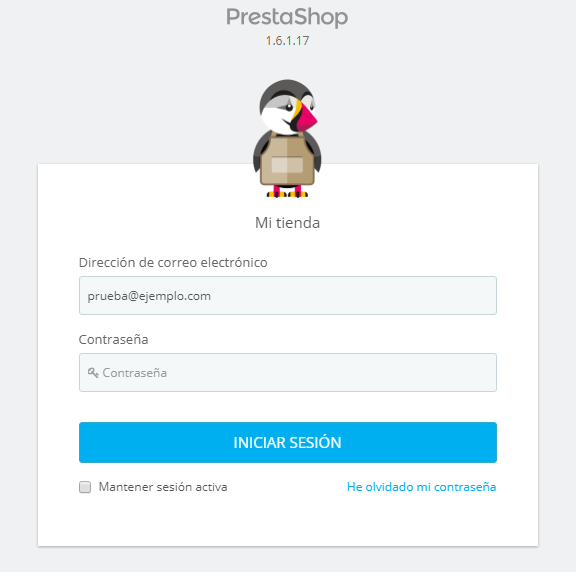
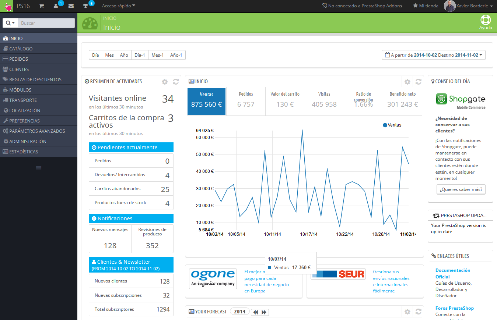

# Conexión al back-office de PrestaShop

En esta guía de usuario, el back-office de PrestaShop es el nombre utilizado para describir el panel de administración de tu tienda. Pasarás la mayor parte de tu tiempo en este panel, ya que todas las actividades que necesitas realizar se controlan directamente a través del back-office: añadir/editar/eliminar productos, gestionar transportistas, crear paquetes, crear cupones de descuento, mantener el contacto con tus clientes, realizar mejoras en tu tienda, etc.

Durante el proceso de instalación por razones de seguridad, la carpeta `/admin` es renombrada a un nombre identificativo único para tu tienda (por poner un ejemplo, `/admin7890`). Utiliza ese nuevo nombre de carpeta para acceder a tu tienda (por ejemplo: [http://miprestashop.com/admin7890](http://miprestashop.com/admin7890)[).](http://myprestashop.com/admin7890)

El cambio de nombre es realizado automáticamente por PrestaShop. ¡Ten la precaución de anotar o memorizar ese nombre de carpeta la primera vez que accedas al panel de administración tras realizar la instalación!

Tras realizar el proceso anterior, visualizarás la página para iniciar sesión en el panel de control de tu tienda.

Introduce la dirección de correo electrónico y la contraseña que registraste en el proceso de instalación de PrestaShop. Haz clic en el botón "Iniciar sesión", y comprobarás como automáticamente el navegador será redireccionado al cuadro de mandos del panel de control. Esta es la página de inicio predeterminada del back-office de PrestaShop.

\
A partir de este momento, puedes comenzar a gestionar y configurar tu tienda para vender productos a tus clientes.

Lee el capítulo de esta guía del usuario, denominado "Primeros pasos con PrestaShop 1.6", para conocer todas las secciones que forman parte del back-office.
